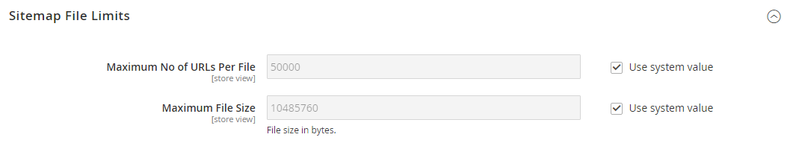
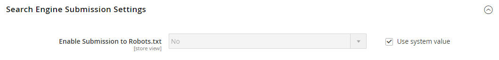

# [!UICONTROL Catalog] > [!UICONTROL XML Sitemap]

{{config}}

## [!UICONTROL Categories Options]

<!-- zoom -->

<!-- [Categories Options](https://experienceleague.adobe.com/de/docs/commerce-admin/marketing/seo/sitemap-xml) -->

| Feld | [Umfang](../../getting-started/websites-stores-views.md#scope-settings) | Beschreibung |
|--- |--- |--- |
| [!UICONTROL Frequency] | Shop-Ansicht | Legt fest, wie oft Sitemap-Kategorien aktualisiert werden. Optionen: `Always` / `Hourly` / `Daily` / `Weekly` / `Monthly` / `Yearly` / `Never` |
| [!UICONTROL Priority] | Shop-Ansicht | Ein Wert zwischen `0.0` und `1.0`, der die Priorität von Kategorie-Sitemap-Aktualisierungen im Verhältnis zu anderen Inhalten bestimmt. Null (`0.0`) hat die niedrigste Priorität. |

{style="table-layout:auto"}

## [!UICONTROL Products Options]

<!-- zoom -->

<!-- [Products Options](https://experienceleague.adobe.com/de/docs/commerce-admin/marketing/seo/sitemap-xml) -->

| Feld | [Umfang](../../getting-started/websites-stores-views.md#scope-settings) | Beschreibung |
|--- |--- |--- |
| [!UICONTROL Frequency] | Shop-Ansicht | Legt fest, wie oft Sitemap-Produkte aktualisiert werden. Optionen: `Always` / `Hourly` / `Daily` / `Weekly` / `Monthly` / `Yearly` / `Never` |
| [!UICONTROL Priority] | Shop-Ansicht | Ein Wert zwischen `0.0` und `1.0`, der die Priorität von Produkt-Sitemap-Aktualisierungen im Verhältnis zu anderen Inhalten bestimmt. Null (`0.0`) hat die niedrigste Priorität. |
| [!UICONTROL Add Images into Sitemap] | Shop-Ansicht | Bestimmt das Ausmaß, in dem Bilder in die Sitemap aufgenommen werden. Optionen: `None` / `Base Only` / `All` |

{style="table-layout:auto"}

## [!UICONTROL CMS Pages Options]

<!-- zoom -->

<!-- [CMS Pages Options](https://experienceleague.adobe.com/de/docs/commerce-admin/marketing/seo/sitemap-xml) -->

| Feld | [Umfang](../../getting-started/websites-stores-views.md#scope-settings) | Beschreibung |
|--- |--- |--- |
| [!UICONTROL Frequency] | Shop-Ansicht | Legt fest, wie oft Sitemap-CMS-Seiten aktualisiert werden. Optionen: `Always` / `Hourly` / `Daily` / `Weekly` / `Monthly` / `Yearly` / `Never` |
| [!UICONTROL Priority] | Shop-Ansicht | Ein Wert zwischen `0.0` und `1.0`, der die Priorität von Sitemap-Aktualisierungen der CMS-Seite in Bezug auf andere Inhalte bestimmt. Null (`0.0`) hat die niedrigste Priorität. |

{style="table-layout:auto"}

## [!UICONTROL Store Url Options]

| Feld | [Umfang](../../getting-started/websites-stores-views.md#scope-settings) | Beschreibung |
|--- |--- |--- |
| [!UICONTROL Frequency] | Shop-Ansicht | Bestimmt, wie oft die Speicher-URLs aktualisiert werden. Optionen: `Always` / `Hourly` / `Daily` / `Weekly` / `Monthly` / `Yearly` / `Never` |
| [!UICONTROL Priority] | Shop-Ansicht | Ein Wert zwischen `0.0` und `1.0`, der die Priorität von Aktualisierungen der Store-URL im Verhältnis zu anderen Inhalten bestimmt. Null (`0.0`) hat die niedrigste Priorität. |

{style="table-layout:auto"}

## [!UICONTROL Generation Settings]

<!-- zoom -->

<!-- [Generation Settings](https://experienceleague.adobe.com/de/docs/commerce-admin/marketing/seo/sitemap-xml) -->

| Feld | [Umfang](../../getting-started/websites-stores-views.md#scope-settings) | Beschreibung |
|--- |--- |--- |
| [!UICONTROL Enabled] | Shop-Ansicht | Legt fest, ob eine XML-Sitemap für den Store verfügbar ist. Optionen: `Yes` / `No` |
| [!UICONTROL Generation Method] | Shop-Ansicht | Bestimmt, wie die XML-Sitemap generiert wird. `Standard` verwendet den herkömmlichen synchronen Generierungsprozess und verarbeitet alle Daten im Speicher, während `Batch` einen asynchronen, speicheroptimierten Batch-Modus für mehr Flexibilität und Skalierbarkeit verwendet. Diese Option ist ab Version 2.4.9 verfügbar. Optionen: `Standard` / `Batch` |
| [!UICONTROL Start Time] | Shop-Ansicht | Gibt die Stunde, Minute und Sekunde des Tages an, an dem die Sitemap aktualisiert wird. |
| [!UICONTROL Frequency] | Shop-Ansicht | Bestimmt, wie oft die Sitemap aktualisiert wird. Optionen: `Daily` / `Weekly` / `Monthly` |
| [!UICONTROL Error Email Recipient] | Shop-Ansicht | Die E-Mail-Adresse der Person, die eine Benachrichtigung erhält, wenn während des Sitemap-Aktualisierungsprozesses ein Fehler auftritt. Trennen Sie die einzelnen Adressen bei mehreren Adressen durch ein Komma. |
| [!UICONTROL Error Email Sender] | Website | Identifiziert den Store-Kontakt, der als Absender der Fehlerbenachrichtigung angezeigt wird. Optionen: `General Contact` / `Sales Representative` / `Customer Support` / `Custom Email 1` / `Custom Email 2` |
| [!UICONTROL Error Email Template] | Website | Identifiziert die E-Mail-Vorlage, die für die Fehlerbenachrichtigung verwendet wird. Standardvorlage: `Sitemap generate Warnings` |

{style="table-layout:auto"}

## [!UICONTROL Sitemap File Limits]

<!-- zoom -->

<!-- [Sitemap File Limits](https://experienceleague.adobe.com/de/docs/commerce-admin/marketing/seo/sitemap-xml) -->

| Feld | [Umfang](../../getting-started/websites-stores-views.md#scope-settings) | Beschreibung |
|--- |--- |--- |
| [!UICONTROL Maximum No of URLs Per File] | Shop-Ansicht | Bestimmt die maximale Anzahl von URLs, die in eine einzelne Sitemap aufgenommen werden können. |
| [!UICONTROL Maximum File Size] | Shop-Ansicht | Bestimmt die maximale Größe der generierten Sitemap in Byte. |

{style="table-layout:auto"}

## [!UICONTROL Search Engine Submission Settings]

<!-- zoom -->

<!-- [Search Engine Submission Settings](https://experienceleague.adobe.com/de/docs/commerce-admin/marketing/seo/sitemap-xml) -->

| Feld | [Umfang](../../getting-started/websites-stores-views.md#scope-settings) | Beschreibung |
|--- |--- |--- |
| [!UICONTROL Enable Submission to Robots.txt] | Shop-Ansicht | Ermöglicht die Übermittlung von Anweisungen für die Datei robots.txt. Optionen: `Yes` / `No` |

{style="table-layout:auto"}
