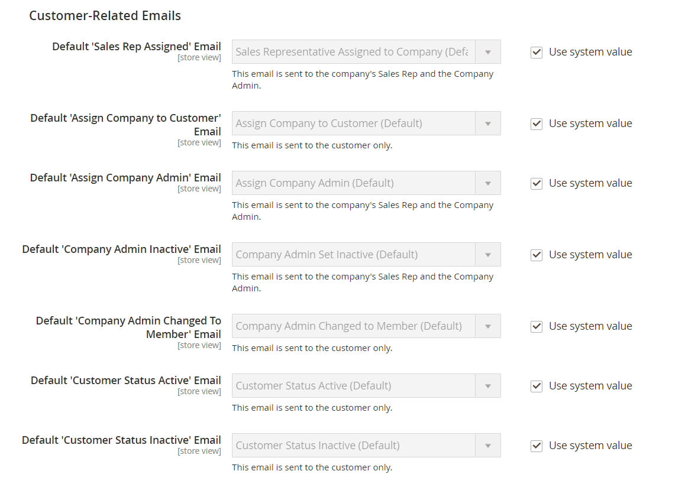

# [!UICONTROL Customers] > [!UICONTROL Company Configuration]

{{b2b-feature}}

{{config}}

>[!TIP]
>
>Mit der Installation und Aktivierung von Adobe Commerce B2B kann das Kauferlebnis mit unternehmensspezifischen Funktionen personalisiert werden. Adobe Commerce B2B ist eine integrierte Lösung, die sowohl B2B- als auch B2C-Modelle unterstützt. Weitere Informationen zu den B2B-Funktionen finden Sie im [Adobe Commerce B2B-Benutzerhandbuch](https://experienceleague.adobe.com/docs/commerce-admin/b2b/introduction.html?lang=de).

>[!NOTE]
>
>Der Zugriff auf diese Konfigurationsoptionen für B2B-Funktionen wird durch die [Rollenressourcen](../../systems/permissions-user-roles.md#role-resources) gesteuert. Diese Rollenressourcen müssen für die Benutzerrolle festgelegt werden, die dem Admin-Benutzer zugewiesen ist.

Weitere Informationen zum Konfigurieren dieser Einstellungen finden Sie unter [Grundlegende B2B-Funktionen aktivieren](../../b2b/enable-basic-features.md) im _Adobe Commerce B2B-Benutzerhandbuch_.

## [!UICONTROL General]

<!-- zoom -->

| Feld | [Umfang](../../getting-started/websites-stores-views.md#scope-settings) | Beschreibung |
|--- |--- |--- |
| [!UICONTROL Allow Company Registration from the Storefront] | Website | Legt fest, ob Besucher in Ihrem Geschäft die Wahl haben[&#x200B; sich für &#x200B;](../../customers/customer-sign-in.md) Unternehmenskonto oder ein einzelnes Konto zu registrieren. Optionen: `Yes` / `No` |

{style="table-layout:auto"}

## [!UICONTROL Email Options - Company Registration]

<!-- zoom -->

| Feld | [Umfang](../../getting-started/websites-stores-views.md#scope-settings) | Beschreibung |
|--- |--- |--- |
| [!UICONTROL Company Registration Email Recipient] | Shop-Ansicht | Der Store-Kontakt, der benachrichtigt wird, wenn eine Unternehmensregistrierungsanfrage von der Storefront gesendet wird. Optionen: `General Contact` / `Sales Representative` / `Customer Support` / `Custom Email 1` / `Custom Email 2` |
| [!UICONTROL Send Company Registration Email Copy To] | Shop-Ansicht | Die E-Mail-Adresse jeder Person, die eine Kopie der Registrierungsbenachrichtigung erhalten soll. Trennen Sie mehrere E-Mail-Adressen durch ein Komma. |
| [!UICONTROL Send Email Copy Method] | Shop-Ansicht | Die E-Mail-Methode, die zum Senden der Kopie der Registrierungs-E-Mail verwendet wird. Optionen: `Bcc` / `Separate Email` |
| [!UICONTROL Default Company Registration Email] | Shop-Ansicht | Die E-Mail-Vorlage, die standardmäßig für die Benachrichtigung zur Unternehmensregistrierung verwendet wird. Standardvorlage: `Company Registration Request` |

{style="table-layout:auto"}

## [!UICONTROL Customer-Related Emails]

<!-- zoom -->

| Feld | [Umfang](../../getting-started/websites-stores-views.md#scope-settings) | Beschreibung |
|--- |--- |--- |
| [!UICONTROL Default 'Sales Rep Assigned' Email] | Shop-Ansicht | Die E-Mail-Vorlage, die standardmäßig verwendet wird, wenn ein Vertriebsmitarbeiter einem Unternehmenskonto zugewiesen wird. Diese E-Mail wird an den Vertriebsmitarbeiter und den Unternehmensadministrator gesendet. Standardvorlage: `Sales Representative Assigned to Company` |
| [!UICONTROL Default 'Assign Company to Customer' Email] | Shop-Ansicht | Die E-Mail-Vorlage, die standardmäßig verwendet wird, wenn ein einzelnes Kundenkonto einem Unternehmenskonto zugewiesen wird. Diese E-Mail wird nur an den Kunden gesendet. Standardvorlage: `Assign Company to Customer` |
| [!UICONTROL Default 'Assign Company Admin' Email] | Shop-Ansicht | Die E-Mail-Vorlage, die verwendet wird, wenn ein Unternehmensadministrator einem Unternehmen zugewiesen wird. Diese E-Mail wird an den Vertriebsmitarbeiter und den Unternehmensadministrator gesendet. Standardvorlage: `Assign Company Admin` |
| [!UICONTROL Default 'Company Admin Inactive' Email] | Shop-Ansicht | Die E-Mail-Vorlage, die standardmäßig verwendet wird, wenn der Status der Person, die als Unternehmensadministrator fungiert, in „Inaktiv“ geändert wird. Das System sendet eine E-Mail-Benachrichtigung über die Änderung an die neuen und früheren Unternehmensadministratoren. Standardvorlage: `Company Admin Set Inactive` |
| [!UICONTROL Default 'Company Admin Changed to Member' Email] | Shop-Ansicht | Die E-Mail-Vorlage, die standardmäßig verwendet wird, wenn der frühere Unternehmensadministrator Mitglied wird. Die E-Mail wird nur an das Firmenmitglied gesendet. Standardvorlage: `Company Admin Changed to Member` |
| [!UICONTROL Default 'Customer Status Active' Email] | Shop-Ansicht | Die E-Mail-Vorlage, die standardmäßig verwendet wird, wenn der Status einer Kundin oder eines Kunden aktiv wird. Diese E-Mail wird nur an den Kunden gesendet. Standardvorlage: `Customer Status Active` |
| [!UICONTROL Default 'Customer Status Inactive' Email] | Shop-Ansicht | Die E-Mail-Vorlage, die standardmäßig verwendet wird, wenn der Status eines Kunden inaktiv wird. Diese E-Mail wird nur an den Kunden gesendet. Standardvorlage: `Customer Status Inactive` |

{style="table-layout:auto"}

## [!UICONTROL Company Status Change]

<!-- zoom -->

| Feld | [Umfang](../../getting-started/websites-stores-views.md#scope-settings) | Beschreibung |
|--- |--- |--- |
| [!UICONTROL Company Status Change Email Recipient] | Shop-Ansicht | Der Store-Kontakt, der benachrichtigt wird, wenn sich der Status eines Unternehmens ändert. Optionen: `General Contact` / `Sales Representative` / `Customer Support` / `Custom Email 1` / `Custom Email 2` |
| [!UICONTROL Send Company Status Change Email Copy To] | Shop-Ansicht | Die E-Mail-Adresse jeder Person, die eine Kopie der Benachrichtigung zur Änderung des Unternehmensstatus erhalten soll. Trennen Sie mehrere E-Mail-Adressen durch ein Komma. |
| [!UICONTROL Send Email Copy Method] | Shop-Ansicht | Die E-Mail-Methode, die zum Senden der Kopie der Statusänderungsbenachrichtigung verwendet wird. Optionen: `Bcc` / `Separate Email` |
| [!UICONTROL Default "Company Status Change to Active 1' Email] | Shop-Ansicht | Die E-Mail-Vorlage, die verwendet wird, wenn sich der Status eines Unternehmens von &quot;_Genehmigung“_ &quot;_&quot;_. Standardvorlage: `Company Status Active 1` |
| [!UICONTROL Default 'Company Status Change to Active 2' Email] | Shop-Ansicht | Die E-Mail-Vorlage, die standardmäßig verwendet wird, wenn sich der Status eines Unternehmens von _Abgelehnt_ oder _Blockiert_ in _Aktiv_ ändert. Standardvorlage: `Company Status Active 2` |
| [!UICONTROL Default 'Company Status Change to Rejected' Email] | Shop-Ansicht | Die E-Mail-Vorlage, die standardmäßig verwendet wird, wenn sich der Status eines Unternehmens in &quot;_&quot;_. Standardvorlage: `Company Status Rejected` |
| [!UICONTROL Default 'Company Status Change to Blocked' Email] | Shop-Ansicht | Die E-Mail-Vorlage, die standardmäßig verwendet wird, wenn sich der Status eines Unternehmens in &quot;_&quot;_. Standardvorlage: `Company Status Blocked` |
| [!UICONTROL Default 'Company Status Change to Pending Approval' Email] | Shop-Ansicht | Die E-Mail-Vorlage, die standardmäßig verwendet wird, wenn sich der Status eines Unternehmens in &quot;_Genehmigung“_. Standardvorlage: `Company Status Pending Approval` |

{style="table-layout:auto"}

## [!UICONTROL Company Credit]

<!-- zoom -->

| Feld | [Umfang](../../getting-started/websites-stores-views.md#scope-settings) | Beschreibung |
|--- |--- |--- |
| [!UICONTROL Company Credit Change Email Sender] | Shop-Ansicht | Der Store-Kontakt, der benachrichtigt wird, wenn sich die Gutschrift einer Firma ändert. Optionen: `General Contact` / `Sales Representative` / `Customer Support` / `Custom Email 1` / `Custom Email 2` |
| [!UICONTROL Send Company Credit Change Email Copy To] | Shop-Ansicht | Die E-Mail-Adresse jeder Person, die eine Kopie der Benachrichtigung über eine Firmenkreditänderung erhalten soll. Trennen Sie mehrere E-Mail-Adressen durch ein Komma. |
| [!UICONTROL Send Email Copy Method] | Shop-Ansicht | Die E-Mail-Methode, die zum Senden der Kopie der Gutschriftsänderungsbenachrichtigung verwendet wird. Optionen: `Bcc` / `Separate Email` |
| [!UICONTROL Allocated Email Template] | Shop-Ansicht | Die E-Mail-Vorlage, die bei der Zuordnung des Firmenguthabens standardmäßig verwendet wird. Diese E-Mail wird an den Unternehmensadministrator gesendet. Standardvorlage: `Credit Limit Allocated` |
| [!UICONTROL Updated Email Template] | Shop-Ansicht | Die E-Mail-Vorlage, die standardmäßig verwendet wird, wenn das Kreditlimit eines Unternehmens aktualisiert wird. Diese E-Mail wird an den Unternehmensadministrator gesendet. Standardvorlage: `Credit Limit Updated` |
| [!UICONTROL Reimbursed Email Template] | Shop-Ansicht | Die E-Mail-Vorlage, die standardmäßig verwendet wird[&#x200B; wenn eine &#x200B;](../../b2b/credit-company.md#apply-a-payment-to-a-company-account) (Rückerstattung) auf das Guthaben des Unternehmens gutgeschrieben wird. Diese E-Mail wird an den Unternehmensadministrator gesendet. Standardvorlage: `Credit Reimbursed` |
| [!UICONTROL Refunded Email Template] | Shop-Ansicht | Die E-Mail-Vorlage, die standardmäßig verwendet wird, wenn ein Betrag aus einer Bestellung auf das Firmenguthaben zurückerstattet wird. Diese E-Mail wird an den Unternehmensadministrator gesendet. Standardvorlage: `Order Refunded to Company Credit` |
| [!UICONTROL Reverted Email Template] | Shop-Ansicht | Die E-Mail-Vorlage, die standardmäßig verwendet wird, wenn eine Bestellung auf einen Firmenkredit zurückgesetzt wird. Diese E-Mail wird an den Unternehmensadministrator gesendet. Standardvorlage: `Order Reverted to Company Credit` |

{style="table-layout:auto"}
