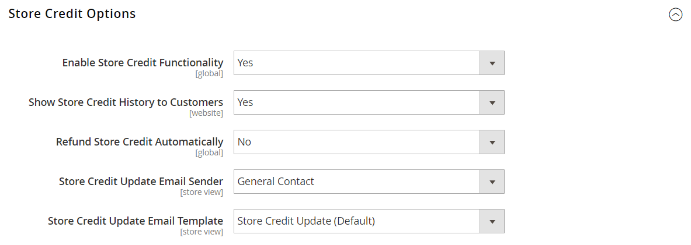

# [!UICONTROL Customers]  > [!UICONTROL Customer Configuration]

{{config}}

## [!UICONTROL Account Sharing Options]

<!-- zoom -->

<!-- [Account Sharing Options](https://docs.magento.com/user-guide/customers/account-scope.html) -->

| Feld | [Scope](../../getting-started/websites-stores-views.md#scope-settings) | Beschreibung |
|--- |--- |--- |
| [!UICONTROL Share Customer Accounts] | Global | Bestimmt den Umfang von Kundenkonten in der Store-Hierarchie. Optionen:  **`Global`**- Kundenkontoinformationen werden für jede Website freigegeben und in der Commerce-Installation gespeichert. **`Per Website`** - Kundenkontoinformationen sind auf die Website beschränkt, auf der das Konto erstellt wurde. |

{style="table-layout:auto"}

## [!UICONTROL Online Customers Options]

<!-- zoom -->

<!-- [Online Customers Options](https://docs.magento.com/user-guide/customers/now-online.html) -->

| Feld | [Scope](../../getting-started/websites-stores-views.md#scope-settings) | Beschreibung |
|--- |--- |--- |
| [!UICONTROL Online Minutes Interval] | Global | Legt fest, wie lange der Admin auf die Online-Aktivität eines Kunden zugreifen kann. Für ein Standardintervall von 15 Minuten leer lassen. |
| [!UICONTROL Customer Data Lifetime] | Global | Bestimmt die Anzahl der Minuten vor Ablauf nicht gespeicherter Daten, die vom Kunden eingegeben werden. Standardmäßig laufen nicht gespeicherte Daten nach 60 Minuten ab. |

{style="table-layout:auto"}

## [!UICONTROL Create New Account Options]

<!-- zoom -->

<!-- zoom -->

<!-- [Create New Account Options (VAT Fields)](https://docs.magento.com/user-guide/customers/customer-account-configuration.html) -->

| Feld | [Scope](../../getting-started/websites-stores-views.md#scope-settings) | Beschreibung |
|--- |--- |--- |
| [!UICONTROL Enable Automatic Assignment to Customer Group] | Shop-Ansicht | Bestimmt, ob Kunden automatisch der Standardkundengruppe zugewiesen werden. Um die MwSt.-Nummer im Store anzuzeigen, legen Sie MwSt.-Nummer in der Storefront anzeigen fest und wählen Sie `Yes`. Optionen:  **`Yes`**- Das System validiert nicht automatisch die Umsatzsteuer-Identifikatoren des Kunden und ändert auch nicht die Kundengruppen. **`No`** - Das Systemverhalten ist wie gewohnt und die Standardkundengruppe kann im Feld Standardgruppe festgelegt werden. |
| [!UICONTROL Default Group] | Shop-Ansicht | Identifiziert die anfängliche Kundengruppe, die beim Erstellen eines Kontos zugewiesen wurde. |
| [!UICONTROL Default Value for Disable Automatic Group Changes Based on VAT ID] | Global | (Nur verfügbar, wenn der aktuelle Konfigurationsumfang auf festgelegt ist.) `Default Group`.) Wählen Sie aus, ob die automatische Änderung der Kundengruppe basierend auf der MwSt.-ID standardmäßig aktiviert oder deaktiviert ist. Die Einstellung kann auf Produktebene überschrieben werden. Die Einstellung beeinflusst das Systemverhalten in den folgenden Situationen:   - Die Umsatzsteuer-ID der Standardadresse des Kunden oder die gesamte Standardadresse ändert sich.   - Die Änderung der Kundengruppe wurde beim Checkout für einen registrierten Kunden emuliert, der zuvor keine gespeicherte Adresse hatte, oder für einen Kunden, der sich während des Checkouts registriert hat.  Wenn die automatische Gruppenänderung aktiviert ist, ändert sich im ersten Fall die Kundengruppe automatisch, und im zweiten Fall wird die vorübergehend emulierte Kundengruppe dem Kunden zugewiesen. Wenn die automatische Gruppenänderung deaktiviert ist, ändert sich die zugewiesene Kundengruppe nie, es sei denn, ein Administrator ändert sie manuell. |
| [!UICONTROL Show VAT Number on Storefront] | Website | Bestimmt, ob die Umsatzsteuer-Identifikationsnummer für Kunden im Geschäft sichtbar ist. Optionen: `Yes` / `No`   Betrifft nur reguläre Nicht-B2B-Kundenkonten. Unternehmenskonten verfügen über ein eigenes Feld für die MwSt.-Nummer. |
| [!UICONTROL Default Email Domain] | Shop-Ansicht | Identifiziert die Standard-E-Mail-Domain für den Store. Beispiel: `mystore.com` |
| [!UICONTROL Default Welcome Email] | Shop-Ansicht | Identifiziert die E-Mail-Vorlage, die für den Standard verwendet wird _Willkommen_ E-Mail |
| [!UICONTROL Default Welcome Email Without Password] | Shop-Ansicht | Eine alternative Willkommens-E-Mail-Vorlage, die für neue, vom Administrator erstellte Kundenkonten verwendet wird, denen noch kein Kennwort zugewiesen wurde. |
| [!UICONTROL Email Sender] | Shop-Ansicht | Identifiziert den Store-Kontakt, der als Absender der Begrüßungs-E-Mail angezeigt wird. |
| [!UICONTROL Require Emails Confirmation] | Website | Legt fest, ob eine Anforderung zum Erstellen eines Kontos eine Bestätigung vom Kunden erfordert. Optionen: `Yes` / `No`.    _**Hinweis:**_ Ab Version 2.4.7 müssen Kundinnen und Kunden unabhängig vom Browser ihre E-Mail-Adresse und ihr Passwort erneut eingeben, um sich nach der E-Mail-Bestätigung bei ihrem Konto anzumelden. |
| [!UICONTROL Confirmation Link Email] | Shop-Ansicht | Identifiziert die E-Mail-Vorlage, die für die Bestätigungs-E-Mail verwendet wird. Standardvorlage: `New account confirmation key` |
| [!UICONTROL Welcome Email] | Shop-Ansicht | Identifiziert die E-Mail-Vorlage, die für die Begrüßungsnachricht verwendet wird, die nach der Bestätigung des Kontos gesendet wird. |
| [!UICONTROL Generate Human-Friendly Customer ID] | Global | Bestimmt, ob das Feld, das zur Eingabe und Speicherung der MwSt.-ID-Nummer verwendet wird, in der Storefront sichtbar ist. Optionen: `Yes` / `No` |

{style="table-layout:auto"}

## [!UICONTROL Password Options]

<!-- zoom -->

<!-- [Password Options](https://docs.magento.com/user-guide/customers/password-options.html) -->

| Feld | [Scope](../../getting-started/websites-stores-views.md#scope-settings) | Beschreibung |
|--- |--- |--- |
| [!UICONTROL Password Reset Protection Type] | Shop-Ansicht | Bestimmt die Methode zum Zurücksetzen eines Kundenkonto-Kennworts. Optionen:  **`By IP and Email`**- Das Kennwort kann online zurückgesetzt werden, nachdem eine Antwort von einer Benachrichtigung zum Zurücksetzen empfangen wurde, die an die mit dem Admin-Konto verknüpfte E-Mail-Adresse gesendet wird. **`By IP`** - Das Passwort kann online zurückgesetzt werden.  **`By Email`**- Das Kennwort kann zurückgesetzt werden, indem auf eine E-Mail-Benachrichtigung reagiert wird, die an die mit dem Admin-Konto verknüpfte E-Mail-Adresse gesendet wird. **`None`** - Das Kennwort kann nur vom Store-Administrator zurückgesetzt werden. |
| [!UICONTROL Max Number of Password Reset Requests] | Shop-Ansicht | Beschränkt die Anzahl der Anfragen zum Zurücksetzen des Kennworts pro Stunde. Geben Sie für unbegrenzte Anfragen null (0) ein. |
| [!UICONTROL Min Time Between Password Reset Requests] | Shop-Ansicht | Bestimmt die Anzahl der Minuten zwischen den Anforderungen zum Zurücksetzen des Kennworts. Geben Sie für keine Verzögerung zwischen den Anforderungen null (0) ein. |
| [!UICONTROL Forgot Email Template] | Shop-Ansicht | Identifiziert die E-Mail-Vorlage, die verwendet wird, wenn Kunden ihre Passwörter vergessen. Standardvorlage: `Forgot Password` |
| [!UICONTROL Remind Email Template] | Shop-Ansicht | Identifiziert die E-Mail-Vorlage, die verwendet wird, wenn Kundinnen und Kunden eine Kennworterinnerung oder einen Hinweis erhalten. Standardvorlage: `Remind Password` |
| [!UICONTROL Reset Password Template] | Shop-Ansicht | Bestimmt die E-Mail-Vorlage, die verwendet wird, wenn Kunden ihre Kennwörter zurücksetzen. |
| [!UICONTROL Password Template Email Sender] | Shop-Ansicht | Bestimmt den Store-Kontakt, der als Absender kennwortbezogener E-Mails angezeigt wird. |
| [!UICONTROL Recovery Link Expiration Period (hours)] | Global | Gibt die Anzahl der Stunden an, nach denen ein Link zur Passwortwiederherstellung abläuft. |
| [!UICONTROL Enable Autocomplete on login/forgot password forms] | Website | Bestimmt, ob die automatische Vervollständigung in Anmelde-/Kennwortformularen aktiviert ist. Optionen: `Yes` / `No` |
| [!UICONTROL Number of Required Character Classes] | Global | Bestimmt die Anzahl der verschiedenen Zeichenklassen (Kleinbuchstaben, Großbuchstaben, numerische Zeichen und Sonderzeichen), die in einem Kennwort enthalten sein müssen. |
| [!UICONTROL Maximum Login Failures to Lockout Account] | Global | Bestimmt die Anzahl fehlgeschlagener Anmeldeversuche, bis das Kundenkonto gesperrt ist. Geben Sie für unbegrenzte Versuche null ein (`0`). |
| [!UICONTROL Minimum Password Length] | Global | Bestimmt die zulässige Mindestanzahl von Zeichen, die in einem Kennwort zulässig sind. Die Zahl muss größer als null sein (`0`). |
| [!UICONTROL Lockout Time (minutes)] | Global | Bestimmt die Anzahl der Minuten, die ein Kundenkonto nach zu vielen fehlgeschlagenen Anmeldeversuchen gesperrt ist. |

{style="table-layout:auto"}

## [!UICONTROL Account Information Options]

<!-- zoom -->

| Feld | [Scope](../../getting-started/websites-stores-views.md#scope-settings) | Beschreibung |
|--- |--- |--- |
| [!UICONTROL Change Email Template] | Shop-Ansicht | Identifiziert die standardmäßige E-Mail-Vorlage, die verwendet wird, wenn ein Kunde seine E-Mail-Adresse ändert. |
| [!UICONTROL Change Email and Password Template] | Shop-Ansicht | Identifiziert die Standard-E-Mail-Vorlage, die verwendet wird, wenn ein Kunde seine E-Mail-Adresse und sein Passwort ändert. |

{style="table-layout:auto"}

## [!UICONTROL Name and Address Options]

### Magento Open Source-Optionen

{{ce-feature}}

<!-- zoom -->

<!-- [Name and Address Options - Open Source](https://docs.magento.com/user-guide/customers/name-address-options.html) -->

| Feld | [Scope](../../getting-started/websites-stores-views.md#scope-settings) | Beschreibung |
|--- |--- |--- |
| [!UICONTROL Number of Lines in a Street Address] | Website | Bestimmt die Anzahl der Zeilen in der Straßenadresse. Die Straßenadresse besteht aus `1` bis `4` Zeilen. Wenn das Feld leer ist, lautet die standardmäßige Straßenadresse drei (`3`) Zeilen verwendet wird. |
| [!UICONTROL Show Prefix] | Website | Bestimmt, ob der Kundenname am Anfang ein Präfix enthält, z. B. Mr. und Ms. Options: `No` / `Optional` / `Required` |
| [!UICONTROL Prefix Dropdown Options] | Website | Definiert die Liste der Präfixoptionen. Trennen Sie Werte mit einem Semikolon. Setzen Sie ein Semikolon vor den ersten Wert, um einen leeren Wert am Anfang der Liste anzuzeigen. |
| [!UICONTROL Show Middle Name (initial)] | Website | Bestimmt, ob der mittlere Anfangsbuchstabe als Teil des Kundennamens enthalten ist. Bei Verwendung ist das mittlere Anfangszeichen ein optionales Feld. Optionen: `Yes` / `No` |
| [!UICONTROL Show Suffix] | Website | Bestimmt, ob der Kundenname am Ende ein Suffix enthält, z. B. Jr., Sr. und III. Optionen: `No` / `Optional` / `Required` |
| [!UICONTROL Suffix Dropdown Options] | Website | Definiert die Liste der Suffix-Optionen. Trennen Sie Werte mit einem Semikolon. Setzen Sie ein Semikolon vor den ersten Wert, um einen leeren Wert am Anfang der Liste anzuzeigen. |
| [!UICONTROL Show Date of Birth] | Website | Bestimmt, ob das Geburtsdatum des Kunden im Namen- und Adressformular enthalten ist. Optionen: `No` / `Optional` / `Required`    **_Wichtig:_**Halten Sie sich gemäß den aktuellen Best Practices für Sicherheit und Datenschutz über alle potenziellen Rechts- und Sicherheitsrisiken im Klaren, die mit der Speicherung des vollständigen Geburtsdatums der Kunden (Monat, Tag, Jahr) mit anderen persönlichen Kennungen verbunden sind. Es wird empfohlen, die Speicherung der vollständigen Geburtsdaten von Kundinnen und Kunden zu begrenzen und als Alternative die Verwendung des Geburtsjahres von Kundinnen und Kunden vorzuschlagen. |
| [!UICONTROL Show Tax/VAT Number] | Website | Legt fest, ob die Steuer oder [Umsatzsteuer-Identifikationsnummer](../../stores-purchase/vat.md) ist im Namen- und Adressformular enthalten. Optionen: `No` / `Optional` / `Required` |
| [!UICONTROL Show Gender] | Website | Bestimmt, ob das Geschlecht im Namen- und Adressformular enthalten ist. Optionen: `No` / `Optional` / `Required` |
| [!UICONTROL Show Telephone] | Website | Bestimmt, ob die Telefonnummer des Kunden im Namen- und Adressformular enthalten ist. Optionen: `No` / `Optional` / `Required` |
| [!UICONTROL Show Company] | Website | Bestimmt, ob das Unternehmen des Kunden im Namen- und Adressformular enthalten ist. Optionen: `No` / `Optional` / `Required` |
| [!UICONTROL Show Fax] | Website | Bestimmt, ob die Faxnummer des Kunden im Namen- und Adressformular enthalten ist. Optionen: `No` / `Optional` / `Required` |

{style="table-layout:auto"}

### Adobe Commerce-Optionen

{{ee-feature}}

<!-- zoom -->

<!-- [Name and Address Options - Commerce](https://docs.magento.com/user-guide/customers/name-address-options.html) -->

| Feld | [Scope](../../getting-started/websites-stores-views.md#scope-settings) | Beschreibung |
|--- |--- |--- |
| [!UICONTROL Prefix Dropdown Options] | Website | Definiert die Liste der Präfixoptionen. Trennen Sie Werte mit einem Semikolon. Setzen Sie ein Semikolon vor den ersten Wert, um einen leeren Wert am Anfang der Liste anzuzeigen. |
| [!UICONTROL Suffix Dropdown Options] | Website | Definiert die Liste der Suffix-Optionen. Trennen Sie Werte mit einem Semikolon. Setzen Sie ein Semikolon vor den ersten Wert, um einen leeren Wert am Anfang der Liste anzuzeigen. |
| [!UICONTROL Show Telephone] | Website | Bestimmt, ob die Telefonnummer des Kunden im Namen- und Adressformular enthalten ist. Optionen: `No` / `Optional` / `Required` |
| [!UICONTROL Show Company] | Website | Bestimmt, ob das Unternehmen des Kunden im Namen- und Adressformular enthalten ist. Optionen: `No` / `Optional` / `Required` |
| [!UICONTROL Show Fax] | Website | Bestimmt, ob die Faxnummer des Kunden im Namen- und Adressformular enthalten ist. Optionen: `No` / `Optional` / `Required` |

{style="table-layout:auto"}

## [!UICONTROL Store Credit Options]

{{ee-feature}}

<!-- zoom -->

<!-- [Store Credit Options](https://docs.magento.com/user-guide/customers/credit-configure.html) -->

| Feld | [Scope](../../getting-started/websites-stores-views.md#scope-settings) | Beschreibung |
|--- |--- |--- |
| [!UICONTROL Enable Store Credit Functionality] | Global | Bestimmt, ob „Gutschrift speichern“ aktiviert ist Durch die Deaktivierung wird „Gutschrift speichern“ aus den Kundenkonten und von der Admin-Seite „Kunden verwalten“ entfernt. Optionen: `Yes` / `No`. |
| [!UICONTROL Show Store Credit History to Customers] | Website | Legt fest, ob der Saldenverlauf in Kundenkonten sichtbar ist. Optionen: `Yes` / `No`. |
| [!UICONTROL Refund Store Credit Automatically] | Global | Bestimmt, ob die Storerstattung automatisch ausgestellt wird. Optionen: `Yes` / `No` |
| [!UICONTROL Store Credit Update Email Sender] | Shop-Ansicht | Bestimmt die Store-Identität, die als Absender von an Kunden gesendeten Credit-Update-Benachrichtigungen angezeigt wird. |
| [!UICONTROL Store Credit Update Email Template] | Shop-Ansicht | Bestimmt die E-Mail-Vorlage, die für Bonitätsaktualisierungen verwendet wird. |

{style="table-layout:auto"}

## [!UICONTROL Login Options]

<!-- zoom -->

<!-- [Login Options](https://docs.magento.com/user-guide/customers/login-landing-page.html) -->

| Feld | [Scope](../../getting-started/websites-stores-views.md#scope-settings) | Beschreibung |
|--- |--- |--- |
| [!UICONTROL Redirect Customer to Account Dashboard after Logging in] | Website | Legt fest, was passiert, nachdem sich Kunden bei ihren Konten angemeldet haben. Um Kunden zu ihrem Konto-Dashboard umzuleiten, wählen Sie `Yes`. Optionen:  **`Yes`**- Das Konto-Dashboard wird angezeigt, wenn sich Kundinnen und Kunden bei ihren Konten anmelden. **`No`** - Kunden können nach der Anmeldung bei ihren Konten weiter einkaufen. |

{style="table-layout:auto"}

## [!UICONTROL Address Templates]

<!-- zoom -->

<!-- [Address Templates](https://docs.magento.com/user-guide/customers/address-templates.html) -->

| Vorlage | [Scope](../../getting-started/websites-stores-views.md#scope-settings) | Beschreibung |
|--- |--- |--- |
| [!UICONTROL Text] | Shop-Ansicht | Die Vorlage wird für alle gedruckten Adressen verwendet. |
| [!UICONTROL Text One Line] | Shop-Ansicht | Diese Vorlage definiert die Reihenfolge der Adressentitäten in der Adressbuchliste des Warenkorbs des Kunden. Fortschritt während des Checkouts. |
| [!UICONTROL HTML] | Shop-Ansicht | Diese Vorlage definiert die Reihenfolge der Adressfelder unter _Kundenadressen_ Bereich im Admin-Bedienfeld ([!UICONTROL Customers] > [!UICONTROL Manage Customers]). Dies betrifft auch die auf der _Neue Adresse hinzufügen_ Seite, wenn ein Kunde auf seiner Kontoseite eine Rechnungs- oder Lieferadresse erstellt. |
| [!UICONTROL PDF] | Shop-Ansicht | Die Vorlage definiert die Anzeige von Rechnungs- und Lieferadressen in den gedruckten Rechnungen, Lieferungen und Gutschriften. |

{style="table-layout:auto"}

## [!UICONTROL Customer Segments]

{{ee-feature}}

<!-- zoom -->

<!-- [Customer Segments](https://docs.magento.com/user-guide/marketing/customer-segments.html) -->

| Vorlage | [Scope](../../getting-started/websites-stores-views.md#scope-settings) | Beschreibung |
|--- |--- |--- |
| [!UICONTROL Enable Customer Segment Functionality] | Global | Legt fest, ob Kundensegmente zum Erstellen zielgerichteter Promotions verwendet werden können. Optionen: `Yes` / `No` |
| [!UICONTROL Real-time Check if Customer is Matched by Segment] | Global | Bestimmt, ob Kundensegmente in Echtzeit validiert werden. Optionen:  **[!UICONTROL Yes]**- Kundensegmente werden in Echtzeit validiert (Standardwert). **[!UICONTROL No]** - Kundensegmente werden durch eine einzige kombinierte SQL-Abfrage mit Bedingungen validiert. Dadurch wird die Leistung der Segmentvalidierung verbessert, wenn im System viele Kundensegmente vorhanden sind. Die Validierung funktioniert jedoch nicht mit einer geteilten Datenbank oder wenn keine registrierten Kunden vorhanden sind. |

{style="table-layout:auto"}

## [!UICONTROL CAPTCHA]

<!-- zoom -->

<!-- [CAPTCHA](https://docs.magento.com/user-guide/stores/security-captcha.html) -->

| Feld | [Scope](../../getting-started/websites-stores-views.md#scope-settings) | Beschreibung |
|--- |--- |--- |
| [!UICONTROL Enable CAPTCHA on Storefront] | Website | Aktiviert CAPTCHA in den Stores, die mit der Commerce-Website verknüpft sind. Optionen: `Yes` / `No` |
| [!UICONTROL Font] | Website | Bestimmt die Schriftart, die für die Anzeige von CAPTCHA verwendet wird. Um Ihre eigene Schriftart hinzuzufügen, legen Sie die Schriftartdatei im selben Verzeichnis wie Ihre Commerce-Installation ab und fügen Sie die Deklaration zum hinzu. `config.xml` Datei in `app/code/Magento/Captcha/etc`. |
| [!UICONTROL Forms] | Website | Bestimmt die Formulare, in denen CAPTCHA verwendet wird. Optionen:  `Applying Coupon Code`  `Checkout/Placing Order` `Create user`  `Login`  `Forgot password`  `Contact Us`  `Change password`  `Share Wishlist Form`  `Send to Friend Form`  `Payflow Pro` (siehe [Sicherheitspatch](https://experienceleague.adobe.com/docs/commerce-knowledge-base/kb/troubleshooting/payments/paypal-payflow-pro-active-carding-activity.html))  `Add Gift Card Code`    `Create company`     _**Hinweis:**_ Die Formulare „Benutzer erstellen„, „Kennwort vergessen“ und „Payflow Pro“ sind immer aktiviert, wenn sie ausgewählt sind. |
| [!UICONTROL Displaying Mode] | Website | Bestimmt, wann das CAPTCHA angezeigt wird. Optionen:  **`Always`**- CAPTCHA ist immer für die Anmeldung erforderlich. **`After number of attempts to login`** - Diese Option gilt nur für das Admin-Anmeldeformular. Wenn ausgewählt, gilt Folgendes: _[!UICONTROL Number of Unsuccessful Attempts to Login]_Das Feld wird angezeigt. Geben Sie die Anzahl der Anmeldeversuche ein, die Sie zulassen möchten. Ein Wert von `0` (Null) ist ähnlich der Einstellung [!UICONTROL Displaying Mode] bis `Always`. _**Hinweis:**_Um die Anzahl der erfolglosen Anmeldeversuche zu verfolgen, wird jeder Anmeldeversuch unter einer E-Mail-Adresse und von einer IP-Adresse gezählt. Die maximal zulässige Anzahl von Anmeldeversuchen von derselben IP-Adresse ist 1.000. Diese Einschränkung gilt nur, wenn CAPTCHA aktiviert ist. |
| [!UICONTROL Number of Unsuccessful Attempts to Login] | Website | Gibt an, wie oft sich ein Kunde anmelden kann, bevor das Konto gesperrt wird. |
| [!UICONTROL CAPTCHA Timeout (minutes)] | Website | Bestimmt die Lebensdauer des aktuellen CAPTCHA. Wenn das CAPTCHA abläuft, muss der Benutzer die Seite neu laden. |
| [!UICONTROL Number of Symbols] | Website | Bestimmt die Anzahl der Symbole, die im CAPTCHA angezeigt werden, maximal jedoch 8. Sie können auch einen Bereich angeben, z. B. 5-8. |
| [!UICONTROL Symbols Used in CAPTCHA] | Website | Bestimmt die Buchstaben (a-z und A-Z) und Zahlen (0-9), die im CAPTCHA angezeigt werden. Symbole, die nur schwer von anderen Symbolen zu unterscheiden sind, z. B. `i`, `l`, oder `1`, sind nicht im Standardsatz von CAPTCHA-Symbolen enthalten. |
| [!UICONTROL Case Sensitive] | Website | Legt fest, ob bei CAPTCHA-Zeichen zwischen Groß- und Kleinschreibung unterschieden wird. Optionen: `Yes` / `No` |

{style="table-layout:auto"}
