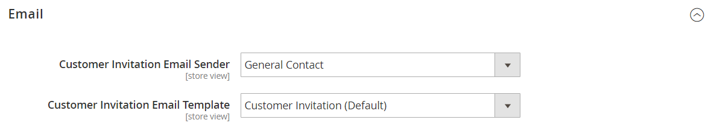

# [!UICONTROL Customers] > [!UICONTROL Invitations]

{{ee-feature}}

{{config}}

## [!UICONTROL General]

<!-- zoom -->

<!-- [General](https://docs.magento.com/user-guide/marketing/invitations-configure.html) -->

| Feld | [Anwendungsbereich](../../getting-started/websites-stores-views.md#scope-settings) | Beschreibung |
|--- |--- |--- |
| [!UICONTROL Enable Invitations Functionality] | Global | Bestimmt, ob das Modul Einladungen aktiviert ist. Optionen: `Yes` / `No` |
| [!UICONTROL Enable Invitations on Frontend] | Webseite | Bestimmt, ob Einladungen über die Storefront verwaltet werden können. Optionen: `Yes` / `No` |
| [!UICONTROL Referred Customer Group] | Store-Ansicht | Bestimmt die Kundengruppe der Einladung. Optionen:  **`Same as Inviter`**- Einladungen werden automatisch derselben Kundengruppe zugewiesen wie die Kunden, die sie eingeladen haben. **`Default Customer Group from Configuration`** - Einladungen haben automatisch die Standardeinstellung [Kundengruppe](../../customers/customer-groups.md). |
| [!UICONTROL New Accounts Registration] | Store-Ansicht | Legt fest, wie Einladungen ein Konto erstellen können. Optionen:  **`By Invitation Only`**- Die eingeladenen Benutzer müssen dem Link in der Einladungs-E-Mail folgen, um ein Konto zu erstellen. **`Available to All`** - Einladende Benutzer können das Anmeldeformular für Konten verwenden, das im Store verfügbar ist. |
| [!UICONTROL Allow Customers to Add Custom Message to Invitation Email] | Store-Ansicht | Bestimmt, ob im Einladungsformular ein Feld vorhanden ist, in dem der Einladende eine benutzerdefinierte Nachricht hinzufügen kann, die per E-Mail an die Einladung gesendet wird. Dies wirkt sich nicht auf die Fähigkeit des Administrators aus, einer Einladung eine Nachricht hinzuzufügen. Optionen: `Yes` / `No`. |
| [!UICONTROL Max Invitations Allowed to be Sent at One Time] | Store-Ansicht | Bestimmt die maximale Anzahl von Einladungen, die der Einladende gleichzeitig senden kann. Jede E-Mail-Adresse, die der Einladende in das Formular einbezieht, erhält eine andere Einladung. Dadurch werden Serverressourcen geschützt, da verhindert wird, dass eine große Anzahl von Einladungen gleichzeitig gesendet wird, und es ist weniger wahrscheinlich, dass Einladungen als Spam gesendet werden. |

{style="table-layout:auto"}

## [!UICONTROL Email]

<!-- zoom -->

<!-- [Email](https://docs.magento.com/user-guide/marketing/invitations-configure.html) -->

| Feld | [Anwendungsbereich](../../getting-started/websites-stores-views.md#scope-settings) | Beschreibung |
|--- |--- |--- |
| [!UICONTROL Customer Invitation Email Sender] | Store-Ansicht | Legt den Absender der E-Mail fest, die eingeladene Personen erhalten, wenn eine Einladungs-E-Mail gesendet wird. Standardwert: `General Contact` |
| [!UICONTROL Customer Invitation Email Template] | Store-Ansicht | Bestimmt die Vorlage der E-Mail, die eingeladene Personen erhalten, wenn eine Einladungs-E-Mail gesendet wird. Standardvorlage: `Customer Invitation` |

{style="table-layout:auto"}
