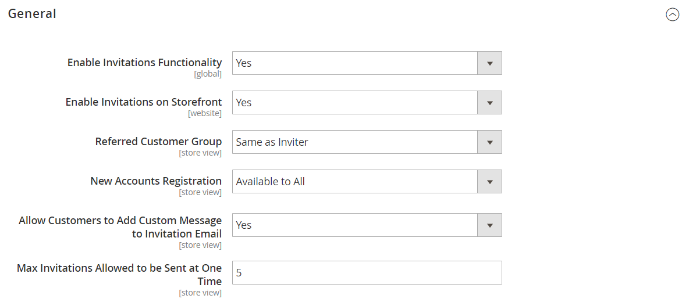
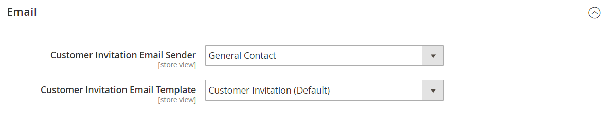

# [!UICONTROL Customers] > [!UICONTROL Invitations]

{{ee-feature}}

{{config}}

## [!UICONTROL General]

<!-- zoom -->

<!-- [General](https://experienceleague.adobe.com/en/docs/commerce-admin/marketing/promotions/events/invitations#enable-invitations-for-your-store) -->

| Feld | [Umfang](../../getting-started/websites-stores-views.md#scope-settings) | Beschreibung |
|--- |--- |--- |
| [!UICONTROL Enable Invitations Functionality] | Global | Legt fest, ob das Einladungsmodul aktiviert ist. Optionen: `Yes` / `No` |
| [!UICONTROL Enable Invitations on Frontend] | Website | Legt fest, ob Einladungen von der Storefront aus verwaltet werden können. Optionen: `Yes` / `No` |
| [!UICONTROL Referred Customer Group] | Shop-Ansicht | Bestimmt die Kundengruppe des Einladenden. Optionen:  **`Same as Inviter`**- Einladende werden automatisch derselben Kundengruppe zugewiesen wie die Kunden, die sie eingeladen haben. **`Default Customer Group from Configuration`** - Einladende haben automatisch die Standardeinstellung [Kundengruppe](../../customers/customer-groups.md). |
| [!UICONTROL New Accounts Registration] | Shop-Ansicht | Legt fest, wie Einladende ein Konto erstellen können. Optionen:  **`By Invitation Only`**- Einladende müssen dem Link in der Einladungs-E-Mail folgen, um ein Konto zu erstellen. **`Available to All`** - Einladende können das Formular zur Kontoregistrierung verwenden, das im Store verfügbar ist. |
| [!UICONTROL Allow Customers to Add Custom Message to Invitation Email] | Shop-Ansicht | Bestimmt, ob im Einladungsformular ein Feld vorhanden ist, in dem der Einladende eine benutzerdefinierte Nachricht hinzufügen kann, die per E-Mail an den Einladenden gesendet wird. Dies wirkt sich nicht auf die Fähigkeit des Administrators aus, eine Nachricht zu einer Einladung hinzuzufügen. Optionen: `Yes` / `No`. |
| [!UICONTROL Max Invitations Allowed to be Sent at One Time] | Shop-Ansicht | Bestimmt die maximale Anzahl von Einladungen, die der Einladende gleichzeitig senden kann. An jede E-Mail-Adresse, die der Einladende in das Formular einfügt, wird eine andere Einladung gesendet. Dadurch werden Server-Ressourcen geschützt, da eine große Anzahl von Einladungen nicht gleichzeitig versendet wird, und die Wahrscheinlichkeit, dass Einladungen als Spam versendet werden, sinkt. |

{style="table-layout:auto"}

## [!UICONTROL Email]

<!-- zoom -->

<!-- [Email](https://experienceleague.adobe.com/en/docs/commerce-admin/marketing/promotions/events/invitations#enable-invitations-for-your-store) -->

| Feld | [Umfang](../../getting-started/websites-stores-views.md#scope-settings) | Beschreibung |
|--- |--- |--- |
| [!UICONTROL Customer Invitation Email Sender] | Shop-Ansicht | Bestimmt den Absender der E-Mail, die Einladungen erhalten, wenn eine Einladungs-E-Mail gesendet wird. Standardwert: `General Contact` |
| [!UICONTROL Customer Invitation Email Template] | Shop-Ansicht | Bestimmt die Vorlage der E-Mail, die Einladungen beim Senden einer Einladungs-E-Mail erhalten. Standardvorlage: `Customer Invitation` |

{style="table-layout:auto"}
