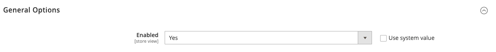

# [!UICONTROL Customers] > [!UICONTROL Newsletter]

{{config}}

>[!NOTE]
>
>Der Newsletter ist Teil von Marketing-Instrumenten, die den Versand von Nachrichten, Rabatten und anderen Marketing-E-Mails an Kunden ermöglichen. Registrierte Kunden können ihr Abonnement über ihr [Account-Dashboard](../../customers/account-dashboard-my-account.md) verwalten.

## [!UICONTROL General Options]

<!-- zoom -->

| Feld | [Umfang](../../getting-started/websites-stores-views.md#scope-settings) | Beschreibung |
|--- |--- |--- |
| [!UICONTROL Enabled] | Shop-Ansicht | Legt fest, ob Newsletter für den Store-Ansichtsbereich aktiviert sind. Optionen: `Yes` / `No` |

{style="table-layout:auto"}

## [!UICONTROL Subscription Options]

<!-- zoom -->

<!-- [Subscription Options](https://experienceleague.adobe.com/en/docs/commerce-admin/marketing/communications/newsletters/newsletters) -->

| Feld | [Umfang](../../getting-started/websites-stores-views.md#scope-settings) | Beschreibung |
|--- |--- |--- |
| [!UICONTROL Allow Guest Subscription] | Shop-Ansicht | Legt fest, ob nicht registrierte Gäste einen Newsletter abonnieren können. Optionen: `Yes` / `No` |
| [!UICONTROL Need to Confirm] | Shop-Ansicht | Bestimmt, ob Abonnementanfragen bestätigt werden müssen. Diese Double-Opt-in-Methode ist eine Validierungsmaßnahme, die verhindert, dass Personen sich ohne ihre Zustimmung anmelden. Optionen: `Yes` / `No` |
| [!UICONTROL Confirmation Email Sender] | Shop-Ansicht | Identifiziert den Store-Kontakt, der als Absender einer zur Bestätigung einer Abonnementanfrage gesendeten E-Mail angezeigt wird. |
| [!UICONTROL Confirmation Email Template] | Shop-Ansicht | Bestimmt die E-Mail-Vorlage, die für die Benachrichtigung zum Bestätigen einer Anforderung zum Abonnieren eines Newsletters verwendet wird. Standardvorlage: `Newsletter subscription confirmation` |
| E-Mail-Absender erfolgreich | Shop-Ansicht | Identifiziert den Store-Kontakt, der als Absender der E-Mail angezeigt wird, die an Personen gesendet wurde, die einen Newsletter erfolgreich abonniert haben. |
| [!UICONTROL Success Email Template] | Shop-Ansicht | Bestimmt die E-Mail-Vorlage, die für die Benachrichtigung der Personen verwendet wird, die erfolgreich einen Newsletter abonniert haben. Standardvorlage: `Newsletter subscription success` |
| [!UICONTROL Unsubscription Email Sender] | Shop-Ansicht | Identifiziert den Store-Kontakt, der als Absender der E-Mail angezeigt wird, die an diejenigen gesendet wurde, die ihr Newsletter-Abonnement beenden möchten. |
| [!UICONTROL Unsubscription Email Template] | Shop-Ansicht | Legt die E-Mail-Vorlage fest, die für die Benachrichtigung verwendet wird, die an diejenigen gesendet wird, die ihr Newsletter-Abonnement beenden möchten. Standardvorlage: `Newsletter unsubscription success` |

{style="table-layout:auto"}
