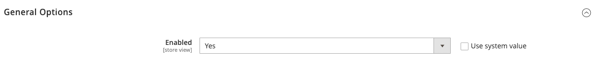

# [!UICONTROL Customers] > [!UICONTROL Newsletter]

{{config}}

>[!NOTE]
>
>Der Newsletter ist Teil von Marketinginstrumenten, mit denen Nachrichten, Rabatte und andere Marketing-E-Mails an Kunden gesendet werden können. Registrierte Kunden können ihr Abonnement über ihre [Konto-Dashboard](../../customers/account-dashboard-my-account.md).

## [!UICONTROL General Options]

<!-- zoom -->

| Feld | [Anwendungsbereich](../../getting-started/websites-stores-views.md#scope-settings) | Beschreibung |
|--- |--- |--- |
| [!UICONTROL Enabled] | Store-Ansicht | Bestimmt, ob Newsletter für den Umfang der Store-Ansicht aktiviert sind. Optionen: `Yes` / `No` |

{style="table-layout:auto"}

## [!UICONTROL Subscription Options]

<!-- zoom -->

<!-- [Subscription Options](https://docs.magento.com/user-guide/marketing/newsletter-configuration.html) -->

| Feld | [Anwendungsbereich](../../getting-started/websites-stores-views.md#scope-settings) | Beschreibung |
|--- |--- |--- |
| [!UICONTROL Allow Guest Subscription] | Store-Ansicht | Bestimmt, ob abgemeldete Gäste einen Newsletter abonnieren können. Optionen: `Yes` / `No` |
| [!UICONTROL Need to Confirm] | Store-Ansicht | Bestimmt, ob Abonnementanforderungen bestätigt werden müssen. Diese Methode der Anmeldung mit zweifacher Bestätigung ist eine Validierung, die verhindert, dass Personen ohne ihre Einwilligung ein Abonnement erhalten. Optionen: `Yes` / `No` |
| [!UICONTROL Confirmation Email Sender] | Store-Ansicht | Identifiziert den Store-Kontakt, der als Absender der zur Bestätigung einer Abonnementanforderung gesendeten E-Mail angezeigt wird. |
| [!UICONTROL Confirmation Email Template] | Store-Ansicht | Bestimmt die E-Mail-Vorlage, die für die gesendete Benachrichtigung verwendet wird, um die Anmeldung für einen Newsletter zu bestätigen. Standardvorlage: `Newsletter subscription confirmation` |
| Success Email Sender | Store-Ansicht | Identifiziert den Store-Kontakt, der als Absender von E-Mails erscheint, die an Abonnenten eines Newsletters gesendet werden. |
| [!UICONTROL Success Email Template] | Store-Ansicht | Bestimmt die E-Mail-Vorlage, die für die Benachrichtigung verwendet wird, die an diejenigen gesendet wird, die sich erfolgreich für einen Newsletter angemeldet haben. Standardvorlage: `Newsletter subscription success` |
| [!UICONTROL Unsubscription Email Sender] | Store-Ansicht | Identifiziert den Store-Kontakt, der als Absender von E-Mails angezeigt wird, die an diejenigen gesendet werden, die die Beendigung ihres Newsletter-Abonnements anfordern. |
| [!UICONTROL Unsubscription Email Template] | Store-Ansicht | Bestimmt die E-Mail-Vorlage, die für die Benachrichtigung verwendet wird, die an diejenigen gesendet wird, die ihre Newsletter-Anmeldung beenden möchten. Standardvorlage: `Newsletter unsubscription success` |

{style="table-layout:auto"}
