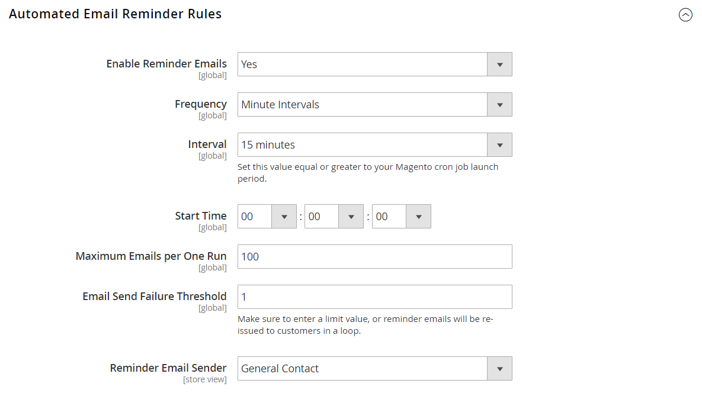

# [!UICONTROL Customers] > [!UICONTROL Promotions]

{{config}}

## [!UICONTROL Automated Email Reminder Rules]

{{ee-feature}}

<!-- zoom -->

<!-- [Automated Email Reminder Rules](https://experienceleague.adobe.com/en/docs/commerce-admin/marketing/communications/email-reminders/email-reminder-rules#configure-email-reminders) -->

| Feld | [Umfang](../../getting-started/websites-stores-views.md#scope-settings) | Beschreibung |
|--- |--- |--- |
| [!UICONTROL Enable Reminder Emails] | Global | Aktiviert die automatische Erinnerung. Ist hierfür Nein festgelegt, werden die übrigen Einstellungen ignoriert. Optionen: `Yes` / `No` |
| [!UICONTROL Frequency] | Global | Gibt die Häufigkeit an, mit der Commerce nach neuen Kundinnen und Kunden suchen soll, die für die automatischen E-Mail-Erinnerungen qualifiziert sind. Optionen:  **`Minute Intervals`**- Sendet die E-Mail entsprechend dem ausgewählten Intervall. (5 Minuten, 10 Minuten, 15 Minuten, 20 Minuten oder 30 Minuten) **`Hourly`** - Sendet E-Mails stündlich, eine Minute nach der angegebenen Stunde. Geben Sie einen Wert zwischen 0 und 59 ein.  **`Daily`**- Sendet E-Mails täglich ab der Startzeit. |
| [!UICONTROL Interval] | Global | Das Intervall sollte gleich oder größer als die Launch-Periode Ihrer cron.php sein. Optionen: `5 minutes` / `10 minutes` / `15 minutes` / `20 minutes` / `30 minutes` |
| [!UICONTROL Start Time] | Global | Legt den Tag, die Minute und die Sekunde fest, an der die E-Mail gesendet wird. Wird im 24-Stunden-Format angegeben, basierend auf der Systemzeit auf Ihrem Server. |
| [!UICONTROL Maximum Emails per One Run] | Global | Beschränkt die Anzahl der in einem geplanten Block gesendeten E-Mails. |
| [!UICONTROL Email Send Failure Threshold] | Global | Die Häufigkeit, mit der die Erinnerung versucht, Benachrichtigungen an eine bestimmte E-Mail-Adresse zu senden, und fehlschlägt. Wenn der Wert auf 0 gesetzt ist, gibt es keinen Schwellenwert und es werden trotz aller Fehler weiterhin Benachrichtigungen gesendet. |
| [!UICONTROL Reminder Email Sender] | Shop-Ansicht | Die Store-Identität, die als Absender der E-Mail angezeigt wird. |

{style="table-layout:auto"}

## [!UICONTROL Auto Generated Specific Coupon Codes]

<!-- zoom -->

<!-- [Auto Generated Specific Coupon Codes](https://experienceleague.adobe.com/en/docs/commerce-admin/marketing/promotions/cart-rules/price-rules-cart-coupon#configure-coupon-codes)  -->

| Feld | [Umfang](../../getting-started/websites-stores-views.md#scope-settings) | Beschreibung |
|--- |--- |--- |
| [!UICONTROL Code Length] | Global | Definiert die Länge des Couponcodes, mit Ausnahme des Präfixes, des Suffix und der Trennzeichen. |
| [!UICONTROL Code Format] | Global | Definiert das Couponcode-Format. Die Optionen umfassen:  **`Alphanumeric`**- Jede Kombination aus Buchstaben und Zahlen. **`Alphabetical`** - nur Buchstaben.  **`Numeric`**- Nur Zahlen. |
| [!UICONTROL Code Prefix] | Global | Ein Wert, der an den Anfang aller Couponcodes angehängt wird. Wenn Sie kein Präfix verwenden möchten, lassen Sie das Feld leer. |
| [!UICONTROL Code Suffix] | Global | Ein Wert, der am Ende aller Codes angehängt wird. Wenn Sie kein Suffix verwenden möchten, lassen Sie das Feld leer. |
| [!UICONTROL Dash Every X Characters] | Global | Das Intervall für das Einfügen eines Bindestrichs (-) in alle Couponcodes. Wenn Sie keinen Bindestrich verwenden möchten, lassen Sie das Feld leer.  _&#x200B;**Hinweis:**&#x200B;_ Couponcodes, die sich nur um einen Bindestrich unterscheiden, gelten als unterschiedliche Codes. |

{style="table-layout:auto"}
