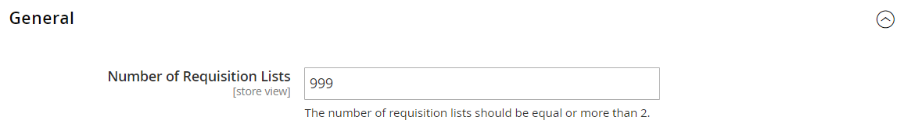

# [!UICONTROL Customers] > [!UICONTROL Requisition Lists]

{{b2b-feature}}

{{config}}

>[!TIP]
>
>Mit der Installation und Aktivierung von Adobe Commerce B2B kann das Kauferlebnis mit unternehmensspezifischen Funktionen personalisiert werden. Adobe Commerce B2B ist eine integrierte Lösung, die sowohl B2B- als auch B2C-Modelle unterstützt. Weitere Informationen zu den B2B-Funktionen finden Sie im [_Adobe Commerce B2B-Benutzerhandbuch_](https://experienceleague.adobe.com/docs/commerce-admin/b2b/introduction.html).

>[!NOTE]
>
>Der Zugriff auf diese Konfigurationsoptionen für B2B-Funktionen wird durch die [Rollenressourcen](../../systems/permissions-user-roles.md#role-resources) gesteuert. Diese Rollenressourcen müssen für die Benutzerrolle festgelegt werden, die dem Admin-Benutzer zugewiesen ist.

## [!UICONTROL General]

<!-- zoom -->

<!-- [General](https://experienceleague.adobe.com/en/docs/commerce-admin/b2b/requisition-lists/configure-requisition-lists) -->

| Feld | [Umfang](../../getting-started/websites-stores-views.md#scope-settings) | Beschreibung |
|--- |--- |--- |
| [!UICONTROL Number of Requisition Lists] | Shop-Ansicht | Bestimmt die maximale Anzahl von Anforderungslisten, die pro Kundenkonto gepflegt werden können. Die Mindestzahl ist `2`, die Höchstzahl `999`. |

{style="table-layout:auto"}
