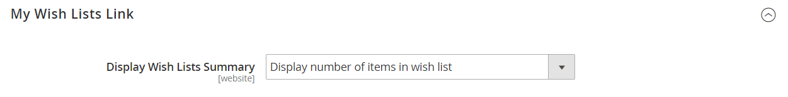

# [!UICONTROL Customers] > [!UICONTROL Wish List]

{{config}}

>[!NOTE]
>
>Eine Wunschliste ermöglicht registrierten Kunden, eigene Kollektionen von Produkten zu erstellen, die sie in Zukunft kaufen möchten. Wunschlisten können von Kunden gemeinsam genutzt werden.

## [!UICONTROL General Options]

<!-- zoom -->

<!--[General Options](https://experienceleague.adobe.com/de/docs/commerce-admin/stores-sales/shopper-tools/wish-lists/wishlist-configuration) -->

| Feld | [Umfang](../../getting-started/websites-stores-views.md#scope-settings) | Beschreibung |
|--- |--- |--- |
| [!UICONTROL Enabled] | Shop-Ansicht | Aktiviert das Wunschzettelmodul für Ihren Shop. Optionen: `Yes` / `No` |
| [!UICONTROL Show in Sidebar] | Shop-Ansicht | Gibt die Sichtbarkeit der Wunschlisten in der Seitenleiste an.  Optionen: `Yes` / `No` |
| [!UICONTROL Enable Multiple Wish Lists] | Shop-Ansicht |  (nur Adobe Commerce) Bei der Einstellung auf `Yes` können Kundinnen und Kunden mehrere Wunschlisten erstellen und verwalten. Optionen: `Yes` / `No` |
| [!UICONTROL Number of Multiple Wish Lists] | Shop-Ansicht |  (nur Adobe Commerce) Wenn mehrere Wunschlisten aktiviert sind, bestimmt die maximale Anzahl von Wunschlisten, die Kundinnen und Kunden mit ihrem Konto verknüpfen können. |

{style="table-layout:auto"}

## [!UICONTROL Share Options]

<!-- zoom -->

<!-- [Share Options](https://experienceleague.adobe.com/de/docs/commerce-admin/stores-sales/shopper-tools/wish-lists/wishlist-configuration) -->

| Feld | [Umfang](../../getting-started/websites-stores-views.md#scope-settings) | Beschreibung |
|--- |--- |--- |
| [!UICONTROL Email Sender] | Shop-Ansicht | Bestimmt den Store-Kontakt, der als Absender der Nachricht angezeigt wird, die bei der Freigabe einer Wunschliste gesendet wird. Standardkontakt: `General Contact` |
| [!UICONTROL Email Template] | Shop-Ansicht | Bestimmt die E-Mail-Vorlage, die für die Nachricht verwendet wird, die gesendet wird, wenn eine Wunschliste freigegeben wird. Standardvorlage: `Share Wishlist` |
| [!UICONTROL Max Emails Allowed to be Sent] | Shop-Ansicht | Bestimmt die maximale Anzahl von E-Mails, die in einem Batch gesendet werden können. Das Festlegen einer Höchstgrenze kann die Last auf dem Server reduzieren. Die maximal zulässige Anzahl ist 10.000. Standardwert: `10` |
| [!UICONTROL Email Text Length Limit] | Shop-Ansicht | Bestimmt die maximale Anzahl von Zeichen, die in der Nachricht enthalten sein können. Die maximal zulässige Anzahl ist 10.000. Standardwert: `255` |

{style="table-layout:auto"}

## [!UICONTROL My Wish List Link]

<!-- zoom -->

<!--[My Wish List Link](https://experienceleague.adobe.com/de/docs/commerce-admin/stores-sales/shopper-tools/wish-lists/wishlist-configuration) -->

| Feld | [Umfang](../../getting-started/websites-stores-views.md#scope-settings) | Beschreibung |
|--- |--- |--- |
| [!UICONTROL Display Wish List Summary] | Website | Konfiguriert die Anzeige der Wunschzettelzusammenfassung im Kundenkonto-Dashboard. Optionen: `Display number of items in wish list` / `Display item quantities` |

{style="table-layout:auto"}
