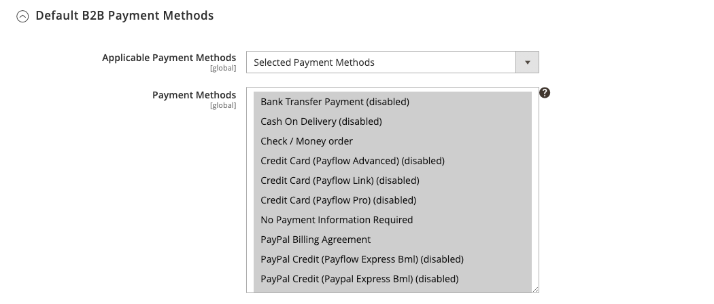

# [!UICONTROL General] > [!UICONTROL B2B Features]

{{b2b-feature}}

{{config}}

>[!TIP]
>
>Mit der Installation und Aktivierung von Adobe Commerce B2B kann das Kauferlebnis mit unternehmensspezifischen Funktionen personalisiert werden. Adobe Commerce B2B ist eine integrierte Lösung, die sowohl B2B- als auch B2C-Modelle unterstützt. Weitere Informationen zu den B2B-Funktionen finden Sie im [_Adobe Commerce B2B-Benutzerhandbuch_](https://experienceleague.adobe.com/docs/commerce-admin/b2b/introduction.html).

## [!UICONTROL B2B Features]

<!-- zoom -->

| Feld | [Umfang](../../getting-started/websites-stores-views.md#scope-settings) | Beschreibung |
|------- |----------------------------------------------------------------------- |------------ |
| [[!UICONTROL Enable Company]](../../b2b/account-companies.md) | Website | Wenn diese Option aktiviert ist, können Kundinnen und Kunden ihre Unternehmenszuweisung über ihr Konto-Dashboard verwalten. Außerdem sind standardmäßig die Funktionen „Freigegebener Katalog“ und „B2B-Angebot“ aktiviert. Optionen: `Yes` / `No` |
| [[!UICONTROL Enable Quick Order]](../../b2b/quick-order.md) | Website | Wenn diese Option aktiviert ist, können Kunden und Gäste schnell Bestellungen aufgeben, die auf der SKU oder dem Produktnamen basieren. Optionen: `Yes` / `No` |
| [[!UICONTROL Enable Requisition List]](../../b2b/configure-requisition-lists.md) | Website | Wenn diese Option aktiviert ist, können Kunden Anforderungslisten über ihr Konto-Dashboard erstellen und verwalten. |

{style="table-layout:auto"}

<!-- zoom -->

Wenn die Funktion „Unternehmen“ aktiviert ist, stehen zusätzliche Felder für den freigegebenen Katalog und die B2B-Quote zur Verfügung.

| Feld | [Umfang](../../getting-started/websites-stores-views.md#scope-settings) | Beschreibung |
|------- |----------------------------------------------------------------------- |------------ |
| [[!UICONTROL Enable Shared Catalog]](../../b2b/catalog-shared.md) | Website | Wenn diese Option aktiviert ist, können kuratierte Kataloge mit benutzerdefinierten Preisen erstellt werden, die entweder global verfügbar oder auf bestimmte Unternehmen beschränkt sind. Optionen: `Yes` / `No` |
| [!UICONTROL Enable Shared Catalog direct products price assigning] | Website | Wenn das _[!UICONTROL Enable Shared Catalog]_&#x200B;Feld auf `Yes` gesetzt ist, ist diese Option verfügbar. Wenn diese Option aktiviert ist, werden nur Produkte, die einem freigegebenen Katalog zugewiesen sind, im Preisindex gespeichert. Produkte, die nicht dem freigegebenen Katalog zugewiesen sind, werden nicht in der Storefront angezeigt. Optionen: `Yes` / `No` |
| [[!UICONTROL Enable B2B Quote]](../../b2b/configure-quotes.md) | Website | Wenn diese Option aktiviert ist, können Unternehmenskäufer eine Angebotsanfrage aus dem Warenkorb senden. Optionen: `Yes` / `No` |

{style="table-layout:auto"}

### [!UICONTROL Default B2B Payment Methods]

<!-- zoom -->

| Feld | [Umfang](../../getting-started/websites-stores-views.md#scope-settings) | Beschreibung |
|------- |----------------------------------------------------------------------- |------------ |
| [!UICONTROL Applicable Payment Methods] | Global | Bestimmt die Auswahl der Zahlungsmethoden, die B2B-Käufern zur Verfügung stehen. Optionen: `All Payment Methods` / `Specific Payment Methods` |
| [!UICONTROL Payment Methods] | Global | Gibt jede Zahlungsmethode an, die B2B-Käufern zur Verfügung steht. |

{style="table-layout:auto"}

### [!UICONTROL Default B2B Shipping Methods]

<!-- zoom -->

| Feld | [Umfang](../../getting-started/websites-stores-views.md#scope-settings) | Beschreibung |
|------- |----------------------------------------------------------------------- |------------ |
| [!UICONTROL Applicable Shipping Methods] | Global | Bestimmt die Auswahl der Versandmethoden, die B2B-Käufern standardmäßig zur Verfügung stehen. Optionen: `All Shipping Methods` / `Specific Shipping Methods` |
| [!UICONTROL Shipping Methods] | Global | Gibt jede Versandmethode an, die B2B-Käufern standardmäßig zur Verfügung steht.  **_Hinweis:_**&#x200B;Sie können auch die Versandmethoden für ein bestimmtes [Firmenkonto“ ](../../b2b/account-companies.md). |

{style="table-layout:auto"}

## [!UICONTROL Order Approval Configuration]

<!-- zoom -->

| Feld | [Umfang](../../getting-started/websites-stores-views.md#scope-settings) | Beschreibung |
|------- |----------------------------------------------------------------------- |------------ |
| [[!UICONTROL Enable Purchase Orders]](../../stores-purchase/purchase-order.md) | Website | Wenn diese Option aktiviert ist, können Unternehmen Bestellungen erstellen. Optionen: `Yes` / `No` |

{style="table-layout:auto"}

