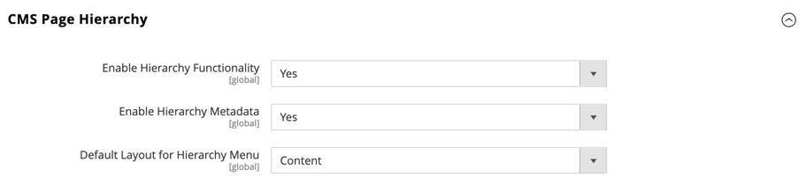

# [!UICONTROL General] > [!UICONTROL Content Management]

{{config}}

## [!UICONTROL WYSIWYG Options]

<!-- zoom -->

<!-- [WYSIWYG Options](https://experienceleague.adobe.com/en/docs/commerce-admin/content-design/wysiwyg/editor) -->

| Feld | [Umfang](../../getting-started/websites-stores-views.md#scope-settings) | Beschreibung |
|--- |--- |--- |
| [!UICONTROL Enable WYSIWYG Editor] | Store-Ansicht | Bestimmt, ob der Editor für den Store aktiviert ist. Optionen: standardmäßig aktiviert/standardmäßig deaktiviert/vollständig deaktiviert |
| [!UICONTROL WYSIWYG Editor] | Webseite | Bestimmt die Version des TinyMCE-Editors, der für den WYSIWYG-Editor verwendet wird. Optionen:  **`TinyMCE 5`**- (Standard) Verwendet die TinyMCE-Version 5 als standardmäßigen WYSIWYG-Editor.  _** Hinweis:**_Durch ein Update der TinyMCE 5.10-Bibliothek in Adobe Commerce und Magento Open Source 2.4.5 wird eine Sicherheitslücke behoben, die eine beliebige Ausführung von JavaScript beim Aktualisieren eines Bildes oder Links mithilfe einiger URL-Typen ermöglichte. TinyMCE 3 wurde in Version 2.4.0 eingestellt und in Version 2.4.3 entfernt. TinyMCE 4 wurde in Version 2.4.4 entfernt. |
| [!UICONTROL Use Static URLs for Media Content in WYSIWYG] | Global | Bestimmt, ob [statische URLs](../../content-design/catalog-urls-dynamic-media.md) für Medieninhalte verwendet werden, auf die im WYSIWYG-Editor verwiesen wird. Die Einstellung gilt für alle Stellen, an denen der WYSIWYG-Editor verfügbar ist, einschließlich Produkten, Kategorien, Seiten und Bausteinen. Optionen:  **`Yes`**- Verwendet statische URLs für Medieninhalte, die mit dem WYSIWYG-Editor eingefügt werden. Statische URLs sind absolut und umbrechen, wenn sich die [Basis-URL](../../stores-purchase/store-urls.md) des Stores ändert. **`No`** (Standard) - Verwendet dynamische URLs für Medieninhalte, die mit dem WYSIWYG-Editor basierend auf der Anweisung `{{media url="..."}}` eingefügt werden. Dynamische URLs sind relativ und beschädigen nicht, wenn sich die Basis-URL des Stores ändert. |

{style="table-layout:auto"}

## [!UICONTROL CMS Page Hierarchy]

{{ee-feature}}

<!-- zoom -->

<!--[CMS Page Hierarchy](https://experienceleague.adobe.com/en/docs/commerce-admin/content-design/elements/pages/page-hierarchy) -->

| Feld | [Umfang](../../getting-started/websites-stores-views.md#scope-settings) | Beschreibung |
|--- |--- |--- |
| [!UICONTROL Enable Hierarchy Functionality] | Global | Aktiviert die Verwendung der Seitenhierarchie für Ihre Inhaltsseiten. Optionen: `Yes` / `No` |
| [!UICONTROL Enable Hierarchy Metadata] | Global | Ermöglicht die Zuordnung von Metadaten zu Seiten in der Hierarchie. Optionen: `Yes` / `No` |
| [!UICONTROL Default Layout for Hierarchy Menu] | Global | Legt den Standardmenüstil fest. Optionen: `Content` / `Left Column` / `Right Column` |

{style="table-layout:auto"}

## [!UICONTROL Advanced Content Tools]

<!-- zoom -->

<!-- [Advanced Content Tools](https://experienceleague.adobe.com/en/docs/commerce-admin/page-builder/walkthrough/3-catalog-content) -->

| Feld | [Umfang](../../getting-started/websites-stores-views.md#scope-settings) | Beschreibung |
|--- |--- |--- |
| [!UICONTROL Enable Page Builder] | Global | Bestimmt, ob die erweiterten Inhaltstools für [!DNL Page Builder] verfügbar sind. Optionen:  **`Yes`**- Der Arbeitsbereich [!DNL Page Builder] wird im Abschnitt &quot;Inhalt&quot;von Seiten, Bausteinen, Produkten und Kategorien angezeigt. **`No`** - Die standardmäßigen CMS-Bearbeitungswerkzeuge werden im Abschnitt _[!UICONTROL Content]_von Seiten, Bausteinen, Produkten und Kategorien angezeigt. |
| [!UICONTROL Enable Page Builder Content Preview] | Global | Bestimmt, ob die Vorschau des [!DNL Page Builder]-Inhalts für Produkte und Kategorien aktiviert ist. Optionen: `Yes` / `No`  **_Hinweis:_**Standardmäßig ist dieser Wert auf `Yes` festgelegt. Beim Deaktivieren der Vorschau können jedoch Leistungsprobleme verhindert werden, die durch das Laden der Vorschau in einem Produkt- oder Kategorieformular verursacht werden. |
| [!UICONTROL Google Maps API Key] | Global | Der API-Schlüssel [!DNL Google Maps] aus Ihrem Google-Konto. |
| [!UICONTROL Test Key] |  | Validiert den [!DNL Google Maps] -API-Schlüssel. |
| [!UICONTROL Google Maps Style] | Global | Fügen Sie den JSON-Code im Stil [!DNL Google Maps] hier ein, um das Erscheinungsbild des Inhaltstyps &quot;Map&quot;zu ändern. |
| [!UICONTROL Default Column Grid Size] | Global | Legt die Standardanzahl der Spalten im Raster [!DNL Page Builder] fest. |
| [!UICONTROL Maximum Column Grid Size] | Global | Bestimmt die maximale Anzahl von Spalten im Raster [!DNL Page Builder]. |

{style="table-layout:auto"}

>[!TIP]
>
>Mit Page Builder können Sie inhaltsreiche Seiten mit benutzerdefinierten Layouts erstellen, die Ihr visuelles Geschichtenerzählen verbessern und die Kundeninteraktion und -loyalität fördern. Diese Funktionen sollen die Qualität verbessern und die Zeit und Kosten für die Erstellung benutzerdefinierter Seiten reduzieren. Weitere Informationen zu diesen Funktionen und wie Sie sie verwenden können, um ansprechende Inhalte für Ihren Adobe Commerce- oder Magento Open Source-Store zu erstellen, finden Sie im [_Benutzerhandbuch für den Seitenaufbau_](../../page-builder/guide-overview.md).
