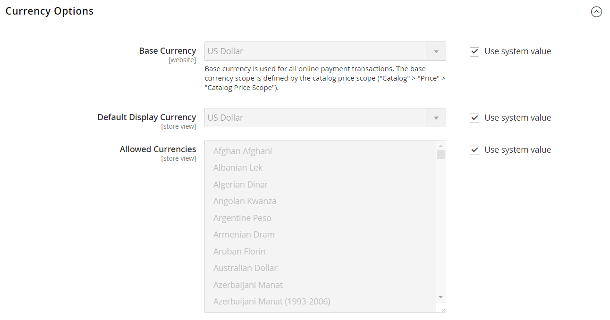
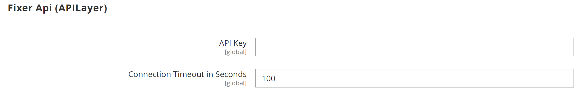
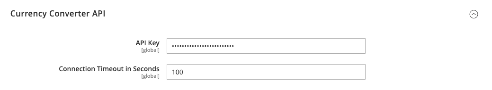
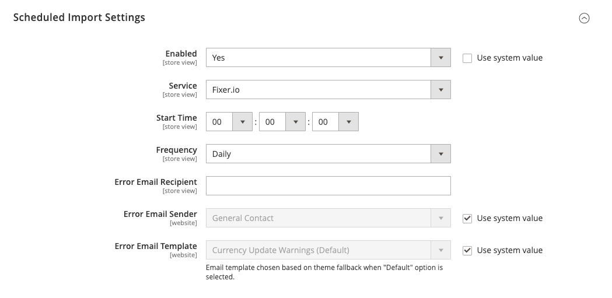

# [!UICONTROL General] > [!UICONTROL Currency Setup]

{{config}}

>[!NOTE]
>
>Weitere Informationen [&#x200B; diesen Konfigurationen finden &#x200B;](../../stores-purchase/currency-configuration.md) unter „Währungskonfiguration“.

## [!UICONTROL Currency Options]

<!-- zoom -->

| Feld | [Umfang](../../getting-started/websites-stores-views.md#scope-settings) | Beschreibung |
|--- |--- |--- |
| [!UICONTROL Base Currency] | Website | Die primäre Währung, die für alle Online-Zahlungsvorgänge verwendet wird. Für mehrere Store-Ansichten muss der Umfang des Preises in der Konfiguration [Katalog](../catalog/catalog.md) festgelegt werden. |
| [!UICONTROL Default Display Currency] | Shop-Ansicht | Die primäre Währung zur Anzeige von Preisen. |
| [!UICONTROL Allowed Currencies] | Shop-Ansicht | Die Währungen, die von Ihrem Geschäft zur Zahlung akzeptiert werden. |

{style="table-layout:auto"}

## [!UICONTROL Fixer.io (legacy)]

>[!IMPORTANT]
>
>Ab Version 2.4.6 wird der [[!DNL Fixer.io]](https://fixer.io/)-Service nicht mehr unterstützt und durch den Service [[!DNL Fixer API] (APILayer)](https://apilayer.com/marketplace/fixer-api) ersetzt. Es wird dringend empfohlen, ein APILayer-Konto anstelle eines veralteten [!DNL Fixer.io]-Kontos zu verwenden.

<!-- zoom -->

| Feld | [Umfang](../../getting-started/websites-stores-views.md#scope-settings) | Beschreibung |
|--- |--- |--- |
| [!UICONTROL API key] | Global | Der Schlüssel, der für den Zugriff auf den Konvertierungsdienst über Ihr [!DNL fixer.io] verwendet wird. Weitere Informationen finden Sie unter [[!DNL fixer.io]](https://fixer.io/). |
| [!UICONTROL Connection Timeout in Seconds] | Global | Bestimmt die Anzahl der Sekunden, in denen es zu Inaktivität kommt, bevor bei einer Fixer.io-Sitzung eine Zeitüberschreitung auftritt. Standardwert: `100` |

{style="table-layout:auto"}

## [!UICONTROL Fixer Api (APILayer)]

<!-- zoom -->

| Feld | [Umfang](../../getting-started/websites-stores-views.md#scope-settings) | Beschreibung |
|--- |--- |--- |
| [!UICONTROL API key] | Global | Der Schlüssel, der für den Zugriff auf den Konvertierungsdienst über Ihr [!DNL APILayer] verwendet wird. Weitere Informationen finden Sie unter [[!DNL APILayer]](https://apilayer.com/). |
| [!UICONTROL Connection Timeout in Seconds] | Global | Bestimmt die Anzahl der Sekunden, in denen es zu Inaktivität kommt, bevor bei einer [!DNL APILayer] Sitzung eine Zeitüberschreitung auftritt. Der Standardwert ist `100`. |

{style="table-layout:auto"}

## [!UICONTROL Currency Converter API]

<!-- zoom -->

| Feld | [Umfang](../../getting-started/websites-stores-views.md#scope-settings) | Beschreibung |
|--- |--- |--- |
| [!UICONTROL API key] | Global | Der Schlüssel, der für den Zugriff auf den Konvertierungsdienst verwendet wird. Weitere Informationen finden Sie unter [[!DNL Currency Convertor] API](https://free.currencyconverterapi.com/). |
| [!UICONTROL Connection Timeout in Seconds] | Global | Bestimmt die Anzahl der Sekunden, in denen es zu Inaktivität kommt, bevor bei einer [!DNL Currency Converter] Sitzung eine Zeitüberschreitung auftritt. Standardwert: `100` |

{style="table-layout:auto"}

## [!UICONTROL Scheduled Import Settings]

<!-- zoom -->

| Feld | [Umfang](../../getting-started/websites-stores-views.md#scope-settings) | Beschreibung |
|--- |--- |--- |
| [!UICONTROL Enabled] | Shop-Ansicht | Legt fest, ob der geplante Import für Währungskurse aktiviert ist. Optionen: `Yes` / `No` |
| [!UICONTROL Service] | Shop-Ansicht | Gibt den Service an, der die Daten für den geplanten Import bereitstellt. Der Standardwert ist `fixer.io` |
| [!UICONTROL Start Time] | Shop-Ansicht | Gibt die Startzeit nach Stunde, Minute und Sekunde an, basierend auf einer 24-Stunden-Zeit. |
| [!UICONTROL Frequency] | Shop-Ansicht | Bestimmt, wie oft der geplante Import stattfindet. Optionen: `Daily` / `Weekly` / `Monthly` |
| [!UICONTROL Error Email Recipient] | Shop-Ansicht | Identifiziert die E-Mail-Adresse jeder Person, die per E-Mail über geplante Importfehler benachrichtigt wird. Trennen Sie bei mehreren Empfängern jeden Eintrag durch ein Komma. |
| [!UICONTROL Error Email Sender] | Website | Identifiziert den Store-Kontakt, der als Absender der Fehler-E-Mail-Benachrichtigung angezeigt wird. Standardabsender: `General Contact` |
| [!UICONTROL Error Email Template] | Website | Gibt die Vorlage an, die als Grundlage für die Fehler-E-Mail-Benachrichtigung verwendet wird. Standardvorlage: `Currency Update Warnings` |

{style="table-layout:auto"}
