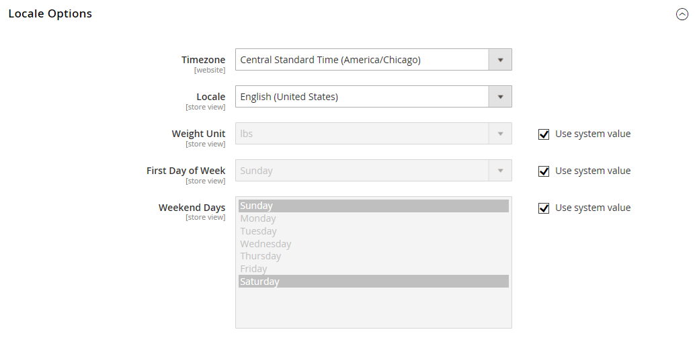

# [!UICONTROL General] > [!UICONTROL General]

{{config}}

## [!UICONTROL Country Options]

Siehe [Länderoptionen](../../getting-started/store-details.md#country-options) für weitere Informationen zu diesen Konfigurationsfeldern und Optionen.

<!-- zoom -->

| Feld | [Umfang](../../getting-started/websites-stores-views.md#scope-settings) | Beschreibung |
|--- |--- |--- |
| [!UICONTROL Default Country] | Shop-Ansicht | Das Land, in dem sich Ihr Geschäft befindet. |
| [!UICONTROL Allow Countries] | Website | Die Länder, in denen Sie Bestellungen annehmen. |
| [!UICONTROL Zip/Postal Code is Optional for] | Global | Länder, die keine Postleitzahl in der Lieferadresse benötigen. |
| [!UICONTROL European Union Countries] | Global | Länder, die Mitglieder der Europäischen Union sind. |
| [!UICONTROL Top Destinations] | Shop-Ansicht | Die primären Länder, in denen der Umsatz erzielt wird. |

{style="table-layout:auto"}

## [!UICONTROL State Options]

Siehe [Statusoptionen](../../getting-started/store-details.md#state-options) für weitere Informationen zu diesen Konfigurationsfeldern und Optionen.

<!-- zoom -->

| Feld | [Umfang](../../getting-started/websites-stores-views.md#scope-settings) | Beschreibung |
|--- |--- |--- |
| [!UICONTROL State is required for] | Global | Die Länder (in denen Sie Geschäfte tätigen), in denen die Postadresse eine Region oder ein Bundesland enthalten muss. |
| [!UICONTROL Allow to Choose State if It is Optional for Country] | Global | Bestimmt für Länder, in denen dies nicht erforderlich ist, ob _Feld „Region/_&quot; in der Postanschrift des Kunden enthalten ist.   **`Yes`**- Enthält das Feld _Region/Bundesland_ in der Kundenadresse, auch wenn dies vom Land nicht verlangt wird. **`No`** - Lässt das Feld Region/Bundesland bei der Kundenadresse weg, wenn dies nicht vom Land benötigt wird. |

{style="table-layout:auto"}

## [!UICONTROL Locale Options]

Siehe [Gebietsschema-Optionen](../../getting-started/store-details.md#locale-options) für weitere Informationen zu diesen Konfigurationsfeldern und Optionen.

<!-- zoom -->

| Feld | [Umfang](../../getting-started/websites-stores-views.md#scope-settings) | Beschreibung |
|--- |--- |--- |
| [!UICONTROL Timezone] | Website | Die Zeitzone des Primärmarkts, für den die Website bereitgestellt wird. Normalerweise ist die Zeitzone die gleiche wie die, die am physischen Standort Ihres Unternehmens verwendet wird. |
| [!UICONTROL Locale] | Shop-Ansicht | Die Sprache, Währung und das Maßsystem, die auf dem Markt verwendet werden, der von der Store-Ansicht bedient wird. |
| [!UICONTROL Weight Unit] | Shop-Ansicht | Die Maßeinheit, die normalerweise für Sendungen aus dem Gebietsschema verwendet wird. Optionen: `lbs` / `kgs` |
| [!UICONTROL First Day of Week] | Shop-Ansicht | Der Tag, der als erster Wochentag auf dem Markt gilt, der von der Store-Ansicht bedient wird. |
| [!UICONTROL Weekend Days] | Shop-Ansicht | Die Tage, die auf das Wochenende in den Markt fallen, der von der Store-Ansicht bedient wird. |

{style="table-layout:auto"}

## [!UICONTROL Website Restrictions]

{{ee-feature}}

<!-- zoom -->

Weitere Informationen zum Ändern dieser Einstellungen finden Sie unter [Zugriffsbeschränkungen](../../merchandising-promotions/event-configure.md#access-restrictions) im _Merchandising und Promotions-Handbuch_.

| Feld | [Umfang](../../getting-started/websites-stores-views.md#scope-settings) | Beschreibung |
|--- |--- |--- |
| [!UICONTROL Access Restriction] | Website | Bestimmt, ob die Website im eingeschränkten Modus ausgeführt wird.   **`Yes`**- Der Zugriff auf die Website ist auf die in den folgenden Feldern festgelegte Weise beschränkt. **`No`** - Einschränkungen sind deaktiviert und die folgenden Einstellungen haben keine Auswirkungen. |
| [!UICONTROL Restriction Mode] | Website | Bestimmt die Art der Zugriffsbeschränkung, die für die Website gilt.   **`Website Closed`**- Sämtlicher Zugriff auf die Storefront ist eingeschränkt und Storefront-URLs werden vorübergehend zur Landingpage weitergeleitet. Diese Einstellung kann während der Site-Wartung oder vor dem Start nützlich sein. **`Private Sales: Login Only`** - Nur registrierte Kunden können sich anmelden, um auf die Storefront zuzugreifen. Alle Storefront-URLs werden vorübergehend entweder zur angegebenen Landingpage oder zum Anmeldeformular umgeleitet. Benutzende können in diesem Modus kein Konto erstellen. **`Private Sales: Login and Register`**- Benutzer müssen sich anmelden, um auf die Storefront zugreifen zu können. Alle Storefront-URLs werden vorübergehend zum Anmeldeformular umgeleitet, bis sich der Benutzer anmeldet. Benutzer können sich für ein Konto registrieren, während sich die Website in diesem Modus befindet. |
| [!UICONTROL Startup Page] | Shop-Ansicht | Wenn sich die Website im privaten Verkaufsmodus befindet, bestimmt diese Einstellung die Seite, die angezeigt wird, bis sich der Kunde anmeldet.    **`To login form`**- Benutzer werden zum Anmeldeformular weitergeleitet, bis sie sich anmelden. **`To landing page`** - Benutzer werden zur unten angegebenen statischen Seite weitergeleitet, bis sie sich anmelden.   **_Wichtig!_**Schließen Sie von der angegebenen Landingpage aus einen Link zur Anmeldeseite ein, damit sich Kunden anmelden können, um auf die vollständige Site zuzugreifen. |
| [!UICONTROL Landing Page] | Shop-Ansicht | Bestimmt die erste Seite, die angezeigt wird, wenn sich die Website im privaten Verkaufsmodus befindet. |
| [!UICONTROL HTTP Response] | Website | Bestimmt die HTTP-Antwort, die gesendet wird, wenn die Website geschlossen wird und ein Bot, Crawler oder Spider versucht, eine Verbindung herzustellen.   **`503 Service unavailable`**- Die Seite ist nicht verfügbar, aber die Spinne sollte den Index nicht aktualisieren. **`200 OK`** - Die Landingpage ist korrekt und sollte von der Spinne als einzige Seite auf der Website behandelt werden. |
| [!UICONTROL Enable Autocomplete on login/forgot password forms] | Website | Bestimmt, ob die Felder in den _Anmelden_ und _Kennwort vergessen_ Formularen automatisch aus vorherigen Einträgen ausgefüllt werden. Optionen: `Yes` / `No` |

{style="table-layout:auto"}

## [!UICONTROL Store Information]

<!-- zoom -->

Weitere Informationen zum Ändern dieser Einstellungen finden Sie unter [Informationen speichern](../../getting-started/store-details.md) im _Erste Schritte_.

| Feld | [Umfang](../../getting-started/websites-stores-views.md#scope-settings) | Beschreibung |
|--- |--- |--- |
| [!UICONTROL Store Name] | Shop-Ansicht | Der Name des Stores, der der Store-Ansicht zugeordnet ist. |
| [!UICONTROL Store Phone Number] | Shop-Ansicht | Die primäre Telefonnummer des Stores (die mit der Store-Ansicht verknüpft ist) ist für Unternehmen offen. Beispiel: Mo - Fr, 9-5, Sa 9-12 Uhr PST |
| Land | Website | Das Land des Unternehmens, das die Website betreibt. |
| [!UICONTROL Region/State] | Website | Die Region oder der Status des Unternehmens, das die Website betreibt. |
| [!UICONTROL ZIP/Postal Code] | Website | Die Postleitzahl des Unternehmens, das die Website betreibt. |
| [!UICONTROL City] | Website | Der Ort des Unternehmens, das die Website betreibt. |
| [!UICONTROL Street Address] | Website | Die Straße oder Anschrift des Unternehmens, das die Website betreibt. |
| [!UICONTROL Street Address Line 2|]Website | Die zweite Zeile der Geschäftsstraßenadresse, falls erforderlich. |
| [!UICONTROL VAT Number] | Website | Die Mehrwertsteuernummer des Unternehmens, dem die Commerce-Installation gehört, falls zutreffend. |
| [!UICONTROL Validate VAT Number] |  | Prüft die Umsatzsteuer-Identifikationsnummer. |

{style="table-layout:auto"}

## [!UICONTROL Single-Store Mode]

<!-- zoom -->

Weitere Informationen zum Ändern dieser Einstellungen finden Sie unter [Einzelspeichermodus](../../getting-started/websites-stores-views.md#single-store-mode) im _Erste Schritte_.

| Feld | [Umfang](../../getting-started/websites-stores-views.md#scope-settings) | Beschreibung |
|--- |--- |--- |
| [!UICONTROL Enable Single-Store Mode] | Global | Blendet bei Aktivierung für Einzelspeicherinstallationen das Feld „Konfigurationsbereich“ und die zugehörigen Feldbezeichnungen aus Optionen: `Yes` / `No`  **_Hinweis:_**Der Einzelspeichermodus wird für Stores mit mehr als einer Ansicht ignoriert.  Aktivieren des Einzelspeichermodus kopiert alle katalog- und produktspeicherspezifischen Daten aus der standardmäßigen Store-Ansicht in den Bereich für alle Store-Ansichten. Es werden nur dann Katalog- und Produktdaten kopiert, wenn der Store nur über eine Storevorschau verfügt. Wenn ein Store eine deaktivierte und eine aktivierte Storeview hat, werden keine Katalog- und Produktdaten kopiert.  Aktivieren des Einzelspeichermodus ignoriert storeview-spezifische Konfigurationseinstellungen für inhaltsspezifische Daten. Stattdessen werden Konfigurationseinstellungen verwendet, die auf globaler Ebene definiert sind, um Konsistenz zwischen der Admin-Benutzeroberfläche und der Storefront sicherzustellen. |

{style="table-layout:auto"}

## [!UICONTROL Data Services]

<!-- zoom -->

| Feld | [Umfang](../../getting-started/websites-stores-views.md#scope-settings) | Beschreibung |
|--- |--- |--- |
| [!UICONTROL Commerce Events Enabled] | Global | Diese Konfiguration ist standardmäßig deaktiviert, wenn Sie im Gesundheitswesen tätig sind und die [Data Services HIPAA](https://experienceleague.adobe.com/en/docs/commerce/data-connection/hipaa-readiness)-Erweiterung installiert haben. Daher werden Storefront-Ereignisdaten, die von der Live-Suche und von Produktempfehlungen verwendet werden, nicht mehr erfasst. Dies liegt daran, dass Storefront-Ereignisdaten Client-seitig generiert werden. Um weiterhin Ereignisdaten für die Storefront zu erfassen und zu senden, die von den Services [Live Search](https://experienceleague.adobe.com/en/docs/commerce-merchant-services/live-search/overview) und [Product Recommendations](https://experienceleague.adobe.com/en/docs/commerce-merchant-services/product-recommendations/guide-overview) verwendet werden können, setzen Sie **Commerce Events Enabled** auf `Yes`. |

{style="table-layout:auto"}
