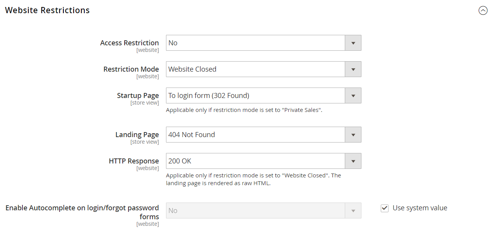

# [!UICONTROL General] > [!UICONTROL General]

{{config}}

## [!UICONTROL Country Options]

Siehe [Länderoptionen](../../getting-started/store-details.md#country-options) Weitere Informationen zu diesen Konfigurationsfeldern und Optionen finden Sie.

<!-- zoom -->

| Feld | [Scope](../../getting-started/websites-stores-views.md#scope-settings) | Beschreibung |
|--- |--- |--- |
| [!UICONTROL Default Country] | Shop-Ansicht | Das Land, in dem sich Ihr Geschäft befindet. |
| [!UICONTROL Allow Countries] | Website | Die Länder, in denen Sie Bestellungen annehmen. |
| [!UICONTROL Zip/Postal Code is Optional for] | Global | Länder, die keine Postleitzahl in der Lieferadresse benötigen. |
| [!UICONTROL European Union Countries] | Global | Länder, die Mitglieder der Europäischen Union sind. |
| [!UICONTROL Top Destinations] | Shop-Ansicht | Die primären Länder, in denen der Umsatz erzielt wird. |

{style="table-layout:auto"}

## [!UICONTROL State Options]

Siehe [Statusoptionen](../../getting-started/store-details.md#state-options) Weitere Informationen zu diesen Konfigurationsfeldern und Optionen finden Sie.

<!-- zoom -->

| Feld | [Scope](../../getting-started/websites-stores-views.md#scope-settings) | Beschreibung |
|--- |--- |--- |
| [!UICONTROL State is required for] | Global | Die Länder (in denen Sie Geschäfte tätigen), in denen eine Region oder ein Bundesland in der Anschrift angegeben sein muss. |
| [!UICONTROL Allow to Choose State if It is Optional for Country] | Global | Legt bei Ländern, in denen dies nicht erforderlich ist, fest, ob _Region/Staat_ Das Feld ist in der Postanschrift des Kunden enthalten.   **`Yes`**- Umfasst _Region/Staat_ in der Kundenadresse, auch wenn dies vom Land nicht verlangt wird. **`No`** - Lässt das Feld Region/Bundesland bei der Kundenadresse weg, wenn dies vom Land nicht benötigt wird. |

{style="table-layout:auto"}

## [!UICONTROL Locale Options]

Siehe [Gebietsschema-Optionen](../../getting-started/store-details.md#locale-options) Weitere Informationen zu diesen Konfigurationsfeldern und Optionen finden Sie.

<!-- zoom -->

| Feld | [Scope](../../getting-started/websites-stores-views.md#scope-settings) | Beschreibung |
|--- |--- |--- |
| [!UICONTROL Timezone] | Website | Die Zeitzone des Primärmarkts, für den die Website bereitgestellt wird. Normalerweise ist die Zeitzone die gleiche wie die, die am physischen Standort Ihres Unternehmens verwendet wird. |
| [!UICONTROL Locale] | Shop-Ansicht | Die Sprache, Währung und das System der Messung, die auf dem Markt verwendet werden, der von der Store-Ansicht bedient wird. |
| [!UICONTROL Weight Unit] | Shop-Ansicht | Die Maßeinheit, die normalerweise für Sendungen aus dem Gebietsschema verwendet wird. Optionen: `lbs` / `kgs` |
| [!UICONTROL First Day of Week] | Shop-Ansicht | Der Tag, der als erster Wochentag auf dem Markt gilt, der von der Shop-Ansicht bedient wird. |
| [!UICONTROL Weekend Days] | Shop-Ansicht | Die Tage, die auf das Wochenende in den Markt fallen, der von der Store-Ansicht bedient wird. |

{style="table-layout:auto"}

## [!UICONTROL Website Restrictions]

{{ee-feature}}

<!-- zoom -->

Weitere Informationen zum Ändern dieser Einstellungen finden Sie unter [Zugriffsbeschränkungen](../../merchandising-promotions/event-configure.md#access-restrictions) in der _Handbuch zu Merchandising und Promotions_.

| Feld | [Scope](../../getting-started/websites-stores-views.md#scope-settings) | Beschreibung |
|--- |--- |--- |
| [!UICONTROL Access Restriction] | Website | Bestimmt, ob die Website im eingeschränkten Modus ausgeführt wird.   **`Yes`**- Der Zugriff auf die Website ist in der in den folgenden Feldern festgelegten Weise eingeschränkt. **`No`** - Einschränkungen sind deaktiviert und die folgenden Einstellungen haben keine Auswirkungen. |
| [!UICONTROL Restriction Mode] | Website | Bestimmt die Art der Zugriffsbeschränkung, die für die Website gilt.   **`Website Closed`**- Der gesamte Zugriff auf die Storefront ist eingeschränkt und Storefront-URLs werden vorübergehend zur Landingpage weitergeleitet. Diese Einstellung kann während der Site-Wartung oder vor dem Start nützlich sein. **`Private Sales: Login Only`** - Nur registrierte Kunden können sich anmelden und auf die Storefront zugreifen. Alle Storefront-URLs werden vorübergehend entweder zur angegebenen Landingpage oder zum Anmeldeformular umgeleitet. Benutzende können in diesem Modus kein Konto erstellen. **`Private Sales: Login and Register`**- Benutzer müssen sich anmelden, um auf die Storefront zugreifen zu können. Alle Storefront-URLs werden vorübergehend an das Anmeldeformular umgeleitet, bis sich der Benutzer anmeldet. Benutzer können sich für ein Konto registrieren, während sich die Website in diesem Modus befindet. |
| [!UICONTROL Startup Page] | Shop-Ansicht | Wenn sich die Website im privaten Verkaufsmodus befindet, bestimmt diese Einstellung die Seite, die angezeigt wird, bis sich der Kunde anmeldet.    **`To login form`**- Benutzer werden zum Anmeldeformular weitergeleitet, bis sie sich anmelden. **`To landing page`** - Benutzer werden zur unten angegebenen statischen Seite weitergeleitet, bis sie sich anmelden.   **_Wichtig!_**Stellen Sie sicher, dass Sie von der angegebenen Landingpage aus einen Link zur Anmeldeseite einfügen, damit sich Kunden anmelden können, um auf die vollständige Site zuzugreifen. |
| [!UICONTROL Landing Page] | Shop-Ansicht | Legt die erste Seite fest, die angezeigt wird, wenn sich die Website im privaten Verkaufsmodus befindet. |
| [!UICONTROL HTTP Response] | Website | Bestimmt die HTTP-Antwort, die gesendet wird, wenn die Website geschlossen ist und ein Bot, Crawler oder Spider versucht, eine Verbindung herzustellen.   **`503 Service unavailable`**- Die Seite ist nicht verfügbar, aber die Spinne sollte den Index nicht aktualisieren. **`200 OK`** - Die Landingpage ist korrekt und sollte von der Spinne als einzige Seite auf der Website behandelt werden. |
| [!UICONTROL Enable Autocomplete on login/forgot password forms] | Website | Legt fest, ob die Felder im _Login_ und _Kennwort vergessen_ Formulare werden automatisch aus vorherigen Einträgen ausgefüllt. Optionen: `Yes` / `No` |

{style="table-layout:auto"}

## [!UICONTROL Store Information]

<!-- zoom -->

Weitere Informationen zum Ändern dieser Einstellungen finden Sie unter [Informationen speichern](../../getting-started/store-details.md) in der _Erste Schritte_.

| Feld | [Scope](../../getting-started/websites-stores-views.md#scope-settings) | Beschreibung |
|--- |--- |--- |
| [!UICONTROL Store Name] | Shop-Ansicht | Der Name des Stores, der der Store-Ansicht zugeordnet ist. |
| [!UICONTROL Store Phone Number] | Shop-Ansicht | Die primäre Telefonnummer des Stores (die mit der Store-Ansicht verknüpft ist) ist für Unternehmen offen. Beispiel: Mo - Fr, 9-5, Sa 9-12 Uhr PST |
| Land | Website | Das Land des Unternehmens, das die Website betreibt. |
| [!UICONTROL Region/State] | Website | Die Region oder der Status des Unternehmens, das die Website betreibt. |
| [!UICONTROL ZIP/Postal Code] | Website | Die Postleitzahl des Unternehmens, das die Website betreibt. |
| [!UICONTROL City] | Website | Der Ort des Unternehmens, das die Website betreibt. |
| [!UICONTROL Street Address] | Website | Die Straße oder Anschrift des Unternehmens, das die Website betreibt. |
| [!UICONTROL Street Address Line 2|]Website | Die zweite Zeile der Geschäftsstraßenadresse, falls erforderlich. |
| [!UICONTROL VAT Number] | Website | Die Mehrwertsteuernummer des Unternehmens, dem die Commerce-Installation gehört, falls zutreffend. |
| [!UICONTROL Validate VAT Number] |  | Prüft die Umsatzsteuer-Identifikationsnummer. |

{style="table-layout:auto"}

## [!UICONTROL Single-Store Mode]

<!-- zoom -->

Weitere Informationen zum Ändern dieser Einstellungen finden Sie unter [Einzelspeichermodus](../../getting-started/websites-stores-views.md#single-store-mode) in der _Erste Schritte_.

| Feld | [Scope](../../getting-started/websites-stores-views.md#scope-settings) | Beschreibung |
|--- |--- |--- |
| [!UICONTROL Enable Single-Store Mode] | Global | Blendet bei Aktivierung für Einzelspeicher-Installationen das Feld „Konfigurationsbereich“ und die zugehörigen Feldbeschriftungen aus Optionen: `Yes` / `No`  **_Hinweis:_**Der Einzelspeichermodus wird bei Stores mit mehr als einer Ansicht ignoriert.  Durch die Aktivierung des Einzelspeichermodus werden alle katalog- und produktspeicherspezifischen Daten aus der Standardspeicheransicht in den Bereich für alle Speicheransichten kopiert. Es werden nur dann Katalog- und Produktdaten kopiert, wenn der Store nur über eine Storevorschau verfügt. Wenn ein Store eine deaktivierte und eine aktivierte Storeview hat, werden keine Katalog- und Produktdaten kopiert.  Bei der Aktivierung des Einzelspeichermodus werden Storereview-spezifische Konfigurationseinstellungen für inhaltsspezifische Daten ignoriert. Stattdessen werden Konfigurationseinstellungen verwendet, die auf globaler Ebene definiert sind, um Konsistenz zwischen der Admin-Benutzeroberfläche und der Storefront sicherzustellen. |

{style="table-layout:auto"}
