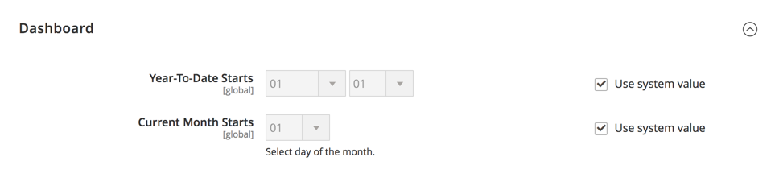

# [!UICONTROL General] > [!UICONTROL Reports]

{{config}}

## [!UICONTROL Dashboard]

<!-- zoom -->

<!-- [Dashboard](https://experienceleague.adobe.com/en/docs/commerce-admin/start/admin/tools/admin-dashboard) -->

| Feld | [Umfang](../../getting-started/websites-stores-views.md#scope-settings) | Beschreibung |
|--- |--- |--- |
| [!UICONTROL Year-to-Date Starts] | Global | Gibt den Monat und Tag an, auf dem die Berechnungen für das aktuelle Jahr basieren. |
| [!UICONTROL Current Month Starts] | Global | Gibt den Tag des Monats an, der bei Berechnungen zum Markieren des Anfangs des aktuellen Monats verwendet wird. |

{style="table-layout:auto"}

## [!UICONTROL General Options]

<!-- zoom -->

>[!NOTE]
>
>Wenn für Ihre Unternehmensfunktionen keine Berichte erforderlich sind, empfehlen wir, die Berichtsfunktion zu deaktivieren, um die Leistung der Stores zu verbessern. Einige Funktionen, wie dynamische Kundensegmente, sind jedoch auf Berichtsdaten angewiesen, um ordnungsgemäß zu funktionieren.

| Feld | [Umfang](../../getting-started/websites-stores-views.md#scope-settings) | Beschreibung |
|--- |--- |--- |
| [!UICONTROL Enable Reports] | Global | Aktiviert oder deaktiviert Berichtsereignisse. |
| [!UICONTROL Enable "Product View" Report] | Global | Aktiviert oder deaktiviert die Erfassung von Statistiken zu angezeigten Produktseiten. |
| [!UICONTROL Enable "Send Product Link To Friend" Report] | Global | Aktiviert oder deaktiviert die Erfassung von Statistiken zu Produkt-Links, die an Freunde gesendet werden. |
| [!UICONTROL Enable "Add Product To Compare List" Report] | Global | Aktiviert oder deaktiviert die Erfassung von Statistiken zu Produkten, die zur Vergleichsliste hinzugefügt wurden. |
| [!UICONTROL Enable "Product Added To Cart" Report] | Global | Aktiviert oder deaktiviert die Erfassung von Statistiken zu Produkten, die zum Warenkorb hinzugefügt wurden. |
| [!UICONTROL Enable "Product Added To Wishlist" Report] | Global | Aktiviert oder deaktiviert die Erfassung von Statistiken zu Produkten, die zur Wunschliste hinzugefügt wurden. |
| [!UICONTROL Enable "Share WishList" Report] | Global | Aktiviert oder deaktiviert die Erfassung von Statistiken freigegebener Wunschlisten. |

{style="table-layout:auto"}
