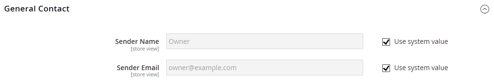

# [!UICONTROL General] > [!UICONTROL Store Email Addresses]

{{config}}

Siehe [Speichern von E-Mail](../../getting-started/store-details.md#store-email-addresses)Adressen) für detaillierte Informationen zu diesen Konfigurationsfeldern und Optionen.

## [!UICONTROL General Contact]

<!-- zoom -->

| Feld | [Umfang](../../getting-started/websites-stores-views.md#scope-settings) | Beschreibung |
|--- |--- |--- |
| [!UICONTROL Sender Name] | Shop-Ansicht | Der Name, der als Absender der von der `General Contact` Identität gesendeten E-Mail angezeigt wird. |
| [!UICONTROL Sender Email] | Shop-Ansicht | Die E-Mail-Adresse, die mit der `General Contact`-Identität verknüpft ist. |

{style="table-layout:auto"}

## [!UICONTROL Sales Representative]

<!-- zoom -->

| Feld | [Umfang](../../getting-started/websites-stores-views.md#scope-settings) | Beschreibung |
|--- |--- |--- |
| [!UICONTROL Sender Name] | Shop-Ansicht | Der Name, der als Absender der von der `Sales Representative` Identität gesendeten E-Mail angezeigt wird. |
| [!UICONTROL Sender Email] | Shop-Ansicht | Die E-Mail-Adresse, die mit der `Sales Representative`-Identität verknüpft ist. |

{style="table-layout:auto"}

## [!UICONTROL Customer Support]

<!-- zoom -->

| Feld | [Umfang](../../getting-started/websites-stores-views.md#scope-settings) | Beschreibung |
|--- |--- |--- |
| [!UICONTROL Sender Name] | Shop-Ansicht | Der Name, der als Absender der von der `Customer Support` Identität gesendeten E-Mail angezeigt wird. |
| [!UICONTROL Sender Email] | Shop-Ansicht | Die E-Mail-Adresse, die mit der `Customer Support`-Identität verknüpft ist. |

{style="table-layout:auto"}

## Benutzerdefinierte E-Mail 1

<!-- zoom -->

| Feld | [Umfang](../../getting-started/websites-stores-views.md#scope-settings) | Beschreibung |
|--- |--- |--- |
| [!UICONTROL Sender Name] | Shop-Ansicht | Der Name, der als Absender der von der `Custom 1` Identität gesendeten E-Mail angezeigt wird. |
| [!UICONTROL Sender Email] | Shop-Ansicht | Die E-Mail-Adresse, die mit der `Custom 1`-Identität verknüpft ist. |

{style="table-layout:auto"}

## Benutzerdefinierte E-Mail 2

<!-- zoom -->

| Feld | [Umfang](../../getting-started/websites-stores-views.md#scope-settings) | Beschreibung |
|--- |--- |--- |
| [!UICONTROL Sender Name] | Shop-Ansicht | Der Name, der als Absender der von der `Custom 2` Identität gesendeten E-Mail angezeigt wird. |
| [!UICONTROL Sender Email] | Shop-Ansicht | Die E-Mail-Adresse, die mit der `Custom 2`-Identität verknüpft ist. |

{style="table-layout:auto"}
