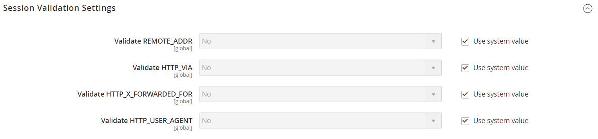

# [!UICONTROL General] > [!UICONTROL Web]

{{config}}

## [!UICONTROL URL Options]

<!-- zoom -->

<!-- [URL Options configuration settings](https://experienceleague.adobe.com/en/docs/commerce-admin/stores-sales/site-store/store-urls) -->

| Feld | Umfang | Beschreibung |
|  ---  |  ---  |  ---  |
| [!UICONTROL Add Store Code to URLs] | Global | Wenn Webserver-Neuschreibungen aktiviert sind, fügt den Store-Code der aktuellen Ansicht in die URL ein. Optionen: `Yes` / `No`.  Wenn dieses Feld auf `Yes` gesetzt ist, müssen Sie Store-Codes in Ihre Browser-URLs aufnehmen, um sicherzustellen, dass URL-Neuschreibungen korrekt zugeordnet und alle Seiten erfolgreich geöffnet werden. Dadurch werden Fehler vom Typ _404 Seite nicht gefunden_ vermieden. |
| [!UICONTROL Auto-redirect to Base URL] | Store-Ansicht | (Bei Einzelspeicher-Setups) Wenn auf Ihrer Site ein defekter Link vorhanden ist, leitet den Traffic zur Basis-URL weiter und nicht zu einer Seite mit der Meldung &quot;404 Seite nicht gefunden&quot;. Optionen:` No` / `Yes (302 Found)` / `Yes (301 Moved Permanently)`  **_Wichtig:_**Verwenden Sie die automatische Weiterleitung nicht zur Basis-URL für Multi-Store-Setups. |
| [!UICONTROL Catalog media URL format] | Global | Definiert das [URL-Format](../../catalog/catalog-urls.md), das Produkten und Kategorien zugewiesen ist. Optionen: Eindeutiger Hash pro Bildvariante (Legacy-Modus) definiert den konvertierten Dateinamen als einen eindeutigen Hash-Wert. Bildoptimierung basierend auf Abfrageparametern definiert den Prozess [Bildoptimierung](../../content-design/media-gallery-image-optimization.md) je nach Abfrageparametern. |

{style="table-layout:auto"}

## [!UICONTROL Search Engine Optimization]

<!-- zoom -->

<!-- [Search Engine Optimization configuration settings](https://experienceleague.adobe.com/en/docs/commerce-admin/marketing/seo/url-rewrites/url-rewrite) -->

| Feld | [Umfang](../../getting-started/websites-stores-views.md#scope-settings) | Beschreibung |
|--- |--- |--- |
| [!UICONTROL Use Web Server Rewrites] | Store-Ansicht | PHP-basierte Systeme enthalten normalerweise eine Datei mit dem Namen `index.php` im Stammordner. Standardmäßig wird der Dateiname in der URL direkt nach dem Namen des Stammordners angezeigt. Wenn dies aktiviert ist, lässt das System `index.php` aus der URL weg. Diese Best Practice für die Benutzerfreundlichkeit macht jede URL präziser und hat keine Auswirkungen auf die Leistung oder den Site-Rang. Optionen: `Yes` / `No` |

{style="table-layout:auto"}

## [!UICONTROL Base URLs]

<!-- zoom -->

<!-- [Base URLS configuration settings](https://experienceleague.adobe.com/en/docs/commerce-admin/stores-sales/site-store/store-urls) -->

| Feld | [Umfang](../../getting-started/websites-stores-views.md#scope-settings) | Beschreibung |
|--- |--- |--- |
| [!UICONTROL Base URL] | Store-Ansicht | Die vollständige Adresse des Commerce-Stammordners, der nicht über einen verschlüsselten (SSL-)Kanal ausgeführt wird. Die URL muss mit einem Schrägstrich enden. |
| [!UICONTROL Base Link URL] | Store-Ansicht | Ein Markup-Tag, das als Platzhalter für die Basis-URL verwendet wird. |
| [!UICONTROL Base URL for Static View Files] | Store-Ansicht | Ein Pfad, der auf den Speicherort der vom Design verwendeten statischen Dateien verweist, z. B. CSS, Schriftarten, Bilder und JavaScript. Ein Platzhalter wird zur Darstellung der Basis-URL verwendet. Wenn Ihre Commerce-Installation über mehrere Sites mit derselben Ordnerstruktur verfügt, können Sie für jede Site einen anderen Ordner haben. Legen Sie den Konfigurationsbereich auf die richtige Site fest, bevor Sie die Basis-URL für statische Ansichtsdateien eingeben. Sie können auch einen Ordner außerhalb Ihrer Commerce-Installation angeben. |
| [!UICONTROL Base URL for User Media Files] | Store-Ansicht | Ein Pfad, der auf den Speicherort von Katalogbildern und anderen Mediendateien verweist. Ein Platzhalter wird zur Darstellung der Basis-URL verwendet. Wenn Ihre Commerce-Installation über mehrere Sites mit derselben Ordnerstruktur verfügt, können Sie für jeden Ordner einen anderen Medienordner verwenden. Dadurch können Sie jeden Medienordner separat sichern und wiederherstellen. Sie können auch einen Medienordner außerhalb Ihrer Commerce-Installation angeben. |

{style="table-layout:auto"}

## [!UICONTROL Base URLs (Secure)]

<!-- zoom -->

<!-- [Base URLs (Secure) configuration settings](https://experienceleague.adobe.com/en/docs/commerce-admin/stores-sales/site-store/store-urls) -->

| Feld | [Umfang](../../getting-started/websites-stores-views.md#scope-settings) | Beschreibung |
|--- |--- |--- |
| [!UICONTROL Secure Base URL] | Store-Ansicht | Die vollständige Adresse des Commerce-Stammordners, der mit dem verschlüsselten sicheren (SSL/TLS)-Protokoll bereitgestellt wird. Die URL muss mit einem Schrägstrich enden. |
| [!UICONTROL Secure Base Link URL] | Store-Ansicht | Ein Markup-Tag, das als Platzhalter für die Basis-URL verwendet wird, die über einen sicheren Kanal ausgeführt wird. |
| [!UICONTROL Secure Base URL for Static View Files] | Store-Ansicht | Ein Markup-Tag, das auf den Speicherort statischer Dateien wie CSS, Schriftarten, Bilder und JavaScript verweist, die vom Design verwendet werden. Die Dateien können sich auf einem unsicheren oder sicheren Kanal befinden. Wenn Ihre Commerce-Installation über mehrere Sites mit derselben Ordnerstruktur verfügt, können Sie für jede Site einen anderen Ordner haben. Legen Sie den Konfigurationsbereich auf die richtige Site fest, bevor Sie die Basis-URL für statische Ansichtsdateien eingeben. Sie können auch einen Ordner außerhalb Ihrer Commerce-Installation angeben. |
| [!UICONTROL Secure Base URL for User Media Files] | Store-Ansicht | Ein Pfad, der auf den Speicherort von Katalogbildern und anderen Mediendateien verweist. Die Dateien können sich auf einem unsicheren oder sicheren Kanal befinden. Ein Platzhalter wird zur Darstellung der Basis-URL verwendet. Wenn Ihre Commerce-Installation über mehrere Sites mit derselben Ordnerstruktur verfügt, können Sie für jeden Ordner einen anderen Medienordner verwenden. Dadurch können Sie jeden Medienordner separat sichern und wiederherstellen. Sie können auch einen Medienordner außerhalb Ihrer Commerce-Installation angeben. |
| [!UICONTROL Use Secure URLs on Storefront] | Store-Ansicht | Wenn Ihre Domäne über ein Sicherheitszertifikat verfügt, können Sie die Storefront mit oder ohne SSL-Verschlüsselung ausführen. Optionen: **`Yes`**- Store-URLs beginnen mit `https` , um anzugeben, dass die Seite mit dem verschlüsselten, sicheren Protokoll bereitgestellt wird. **`No`** - Store-URLs beginnen mit `http` , um anzugeben, dass die Seite ohne sicheres Protokoll bereitgestellt wird. |
| [!UICONTROL Use Secure URLs in Admin] | Global | Wenn Ihre Domäne über ein Sicherheitszertifikat verfügt, können Sie den Store-Administrator mit oder ohne SSL-Verschlüsselung ausführen. Optionen:  **`Yes`**- Admin-URLs beginnen mit `https`, um anzugeben, dass die Seite mit dem verschlüsselten, sicheren Protokoll bereitgestellt wird. **`No`** - Admin-URLs beginnen mit `http`, um anzugeben, dass die Seite ohne sicheres Protokoll bereitgestellt wird.  Wenn sichere URLs sowohl für den Speicher als auch für den Administrator aktiviert sind, werden zwei zusätzliche Felder angezeigt, um `HSTS` zu aktivieren und zu konfigurieren. |
| [!UICONTROL Enable HTTP Strict Transport Security (HSTS)] | Store-Ansicht | Wenn diese Option aktiviert ist, bietet [`HSTS`][1] eine Sicherheitsmaßnahme gegen Angriffe vom Typ &quot;man in der Mitte&quot;und verhindert, dass Benutzer die Meldung &quot;ungültiges Zertifikat&quot;überschreiben. Optionen: `Yes` / `No` |
| [!UICONTROL Upgrade Insecure Requests] | Store-Ansicht | Wenn diese Option aktiviert ist, wandelt unsichere (`HTTP`) Anforderungen, die vom Browser empfangen wurden, in das sichere (`HTTPS`) Protokoll um. Optionen: `Yes` / `No` |
| [!UICONTROL Offloader Header] | Global | Gibt den `offloader_header` -Wert in Ihrer Serverkonfiguration an, um das Protokoll zwischen dem Client und dem Lastenausgleich zu identifizieren. Die meisten Commerce-Installationen verwenden den Standardwert `X-Forwarded-Proto` (XFP), um das Protokoll entweder als `HTTP` oder als `HTTPS` zu kennzeichnen. |

{style="table-layout:auto"}

## [!UICONTROL Default Pages]

<!-- zoom -->

<!-- [Default Pages configuration settings](https://experienceleague.adobe.com/en/docs/commerce-admin/content-design/elements/pages/pages#configure-default-pages) -->

| Feld | [Umfang](../../getting-started/websites-stores-views.md#scope-settings) | Beschreibung |
|--- |--- |--- |
| [!UICONTROL Default Web URL] | Store-Ansicht | Gibt die Landingpage an, die mit der Basis-URL verknüpft ist. Standardmäßig ist dies auf &quot;cms&quot;gesetzt, um eine Seite aus dem Commerce Content Management System (CMS) anzugeben. Sie können auch einen anderen Landingpage-Typ verwenden, z. B. einen Blog. Wenn beispielsweise ein Blog unter `magento/blog` auf dem Server installiert ist, können Sie den Namen des Ordners &quot;Blog&quot;als relativen Pfad zur Seitenauswahl eingeben. |
| [!UICONTROL CMS Home Page] | Store-Ansicht | Um die Startseite für den Store auszuwählen, wählen Sie einfach die CMS-Seite aus der Liste aus. Die CMS-Startseite listet standardmäßig die gesamte Auswahl an CMS-Seiten auf, die für Ihren Store verfügbar sind. |
| [!UICONTROL Default No-route URL] | Store-Ansicht | Enthält die URL der Standardseite, die angezeigt werden soll, wenn ein `404 Page not Found` -Fehler auftritt. Der Standardwert ist `cms/noroute/index`. |
| [!UICONTROL CMS No Route Page] | Store-Ansicht | Identifiziert eine bestimmte CMS-Seite, die angezeigt werden soll, wenn der Fehler &quot;404 Seite nicht gefunden&quot;auftritt. Die Standardseite ist 404 Not Found. |
| [!UICONTROL CMS No Cookies Page] | Store-Ansicht | Identifiziert eine bestimmte CMS-Seite, die angezeigt wird, wenn Cookies für den Browser nicht aktiviert sind. Auf dieser Seite wird erläutert, warum Cookies verwendet werden und wie sie für jeden Browser aktiviert werden. Die Standardseite ist Cookies aktivieren . |
| [!UICONTROL Show Breadcrumbs for CMS Pages] | Store-Ansicht | Bestimmt, ob eine Breadcrumb-Leiste auf allen CMS-Seiten im Katalog angezeigt wird. Optionen: `Yes` / `No` |

{style="table-layout:auto"}

## [!UICONTROL Default Layouts]

<!-- zoom -->

<!--[Default Layouts](https://experienceleague.adobe.com/en/docs/commerce-admin/content-design/design/layout/page-layout) -->

| Feld | [Umfang](../../getting-started/websites-stores-views.md#scope-settings) | Beschreibung |
|--- |--- |--- |
| [!UICONTROL Default Product Layout] | Global | Bestimmt das standardmäßig für Produktseiten verwendete [layout](../../content-design/page-layout.md). Optionen:  **`No layout updates`**- Standardmäßig sind keine Layoutaktualisierungen für Produktseiten verfügbar. **`Empty`** - Standardmäßig wird ein leeres Layout für Produktseiten verwendet.  **`1 column`**- Standardmäßig wird ein einspaltiges Layout für Produktseiten verwendet. **`2 columns with left bar`** - Standardmäßig wird ein zweispaltiges Layout mit der Seitenleiste auf der linken Seite für Produktseiten verwendet.  **`2 columns with right bar`**- Standardmäßig wird ein zweispaltiges Layout mit der Seitenleiste auf der rechten Seite für Produktseiten verwendet. **`3 columns`** - Standardmäßig wird ein dreiseitiges Layout mit Seitenleisten auf der linken und rechten Seite für Produktseiten verwendet. **`Page -- Full Width`**- (Erfordert [!DNL Page Builder]) Standardmäßig wird das Layout Seite - Vollständige Breite für Produktseiten verwendet. **`Category - Full Width`** - (Erfordert [!DNL Page Builder]) Standardmäßig wird das Layout Kategorie - Vollständige Breite für Produktseiten verwendet.  **`Product - Full Width`**- (Erfordert [!DNL Page Builder]) Standardmäßig wird das Layout Produkt - Vollständige Breite für Produktseiten verwendet. |
| [!UICONTROL Default Category Layout] | Global | Bestimmt das [layout](../../content-design/page-layout.md) , das standardmäßig für Kategorieseiten verwendet wird. Optionen:  **`No layout updates`**- Standardmäßig sind keine Layoutaktualisierungen für Kategorieseiten verfügbar. **`Empty`** - Standardmäßig wird ein leeres Layout für Kategorieseiten verwendet.  **`1 column`**- Standardmäßig wird ein einzelnes Spaltenlayout für Kategorieseiten verwendet. **`2 columns with left bar`** - Standardmäßig wird ein zweispaltiges Layout mit der Seitenleiste links für Kategorieseiten verwendet.  **`2 columns with right bar`**- Standardmäßig wird für Kategorieseiten ein zweispaltiges Layout mit der Seitenleiste rechts verwendet. **`3 columns`** - Standardmäßig wird für Kategorieseiten ein dreiseitiges Layout mit Seitenleisten links und rechts verwendet. **`Page - Full Width`**- (Erfordert [!DNL Page Builder]) Standardmäßig wird das Layout Seite - Vollständige Breite für Kategorieseiten verwendet. **`Category - Full Width`** - (Erfordert [!DNL Page Builder]) Standardmäßig wird das Layout Kategorie - Vollständige Breite für Kategorieseiten verwendet.  **`Product - Full Width`**- (Erfordert [!DNL Page Builder]) Standardmäßig wird das Layout Produkt - Vollständige Breite für Kategorieseiten verwendet. |
| Standardseitenlayout | Global | Legt das standardmäßig für CMS-Seiten verwendete [Layout](../../content-design/page-layout.md) fest. Optionen:  **`No layout updates`**- Standardmäßig sind keine Layoutaktualisierungen für CMS-Seiten verfügbar. **`Empty`** - Standardmäßig wird ein leeres Layout für CMS-Seiten verwendet.  **`1 column`**- Standardmäßig wird ein einspaltiges Layout für CMS-Seiten verwendet. **`2 columns with left bar`** - Standardmäßig wird für CMS-Seiten ein zweispaltiges Layout mit der Seitenleiste auf der linken Seite verwendet. **`2 columns with right bar`**- Standardmäßig wird für CMS-Seiten ein zweispaltiges Layout mit der Seitenleiste rechts verwendet. **`3 columns`** - Standardmäßig wird für CMS-Seiten ein dreiseitiges Layout mit Seitenleisten auf der linken und rechten Seite verwendet. **`Page - Full Width`**- (Erfordert [!UICONTROL Page Builder]) Standardmäßig wird das Layout Seite - Vollbreite für CMS-Seiten verwendet. **`Category - Full Width`** - (Erfordert [!UICONTROL Page Builder]) Standardmäßig wird das Layout &quot;Kategorie - Vollständige Breite&quot;für CMS-Seiten verwendet.  **`Product - Full Width`**- (Erfordert [!DNL Page Builder]) Standardmäßig wird das Layout Produkt - Vollständige Breite für CMS-Seiten verwendet. |

{style="table-layout:auto"}

## [!UICONTROL Default Cookie Settings]

<!-- zoom -->

<!-- [Default Cookie configuration settings](https://experienceleague.adobe.com/en/docs/commerce-admin/start/compliance/privacy/compliance-cookie-law) -->

| Feld | [Umfang](../../getting-started/websites-stores-views.md#scope-settings) | Beschreibung |
|--- |--- |--- |
| [!UICONTROL Cookie Lifetime] | Store-Ansicht | Bestimmt, wie lange ein Cookie vorhanden sein kann, bevor es automatisch gelöscht wird. Der Standardwert ist 3600 Sekunden (1 Stunde). |
| [!UICONTROL Cookie Path] | Store-Ansicht | Gibt die Ordner auf dem Server an, in denen Commerce-Cookies verwendet werden können. Um Commerce-Cookies überall in der Installation verfügbar zu machen, setzen Sie den Cookie-Pfad auf einen einzigen Schrägstrich: `/`. Dieser Wert kann nur den Cookie-Pfad enthalten und **_kann_** keine anderen Cookie-Parameter enthalten. |
| [!UICONTROL Cookie Domain] | Store-Ansicht | Bestimmt, ob Commerce-Cookies für Subdomains verfügbar sind. Um beispielsweise `mysubdomain`.domain.com zu unterstützen, geben Sie den Namen Ihrer Domäne mit einem Punkt am Anfang ein, z. B. `.domain.com`. Dieser Wert kann nur die Cookie-Domäne enthalten und **_kann_** keine anderen Cookie-Parameter enthalten. |
| [!UICONTROL Use HTTP Only] | Store-Ansicht | Bestimmt, ob Commerce-Cookies nur über einen unsicheren Kanal (http) oder auch über einen verschlüsselten Kanal (https) verwendet werden können. Optionen: `Yes` / `No` |
| [!UICONTROL Cookie Restriction Mode] | Webseite | Bestimmt, ob der Cookie-Einschränkungsmodus aktiviert ist. Optionen: `Yes` / `No` |

{style="table-layout:auto"}

## [!UICONTROL Session Validation Settings]

<!-- zoom -->

<!-- [Session Validation configuration settings](https://experienceleague.adobe.com/en/docs/commerce-admin/systems/security/security-session-management#session-validation) -->

| Feld | [Umfang](../../getting-started/websites-stores-views.md#scope-settings) | Beschreibung |
|--- |--- |--- |
| [!UICONTROL Validate REMOTE_ADDR] | Global | Überprüft, ob die IP-Adresse einer Anforderung mit den `$_SESSION` -Daten übereinstimmt. Die Sitzung wird beendet, wenn eine andere IP-Adresse erkannt wird. Optionen: `Yes` / `No` |
| [!UICONTROL Validate HTTP_VIA] | Global | Überprüft eingehende Proxy-Daten und prüft, ob die Proxy-Adresse einer Anforderung mit `$_SESSION` -Daten übereinstimmt. Die Sitzung wird beendet, wenn eine andere Proxy-Adresse erkannt wird. Optionen: `Yes` / `No` |
| [!UICONTROL Validate HTTP_x_FORWARDED_FOR] | Global | Überprüft ausgehende Proxy-Daten und prüft, ob die weitergeleitete für die Adresse einer Anfrage `$_SESSION` -Daten entspricht. Die Sitzung wird beendet, wenn eine andere weitergeleitete Adresse erkannt wird. Optionen: `Yes` / `No` |
| [!UICONTROL Validate HTTP_USER_AGENT] | Global | `USER_AGENT` bezieht sich auf den Browser oder das Gerät, mit dem auf die Website zugegriffen wird. Es wird überprüft, ob der Name und die Version des Browsers und des Betriebssystems mit den `$_SESSION` -Daten übereinstimmen. Die Sitzung wird beendet, wenn ein anderer Benutzeragent in derselben Sitzung von einer Anfrage zu einer anderen erkannt wird. Optionen: `Yes` / `No` |

{style="table-layout:auto"}

## [!UICONTROL Browser Capabilities Detection]

<!-- zoom -->

<!-- [Browser Capabilities Detection configuration settings](https://experienceleague.adobe.com/en/docs/commerce-admin/systems/security/security-browser-capabilities-detection) -->

| Feld | [Umfang](../../getting-started/websites-stores-views.md#scope-settings) | Beschreibung |
|--- |--- |--- |
| [!UICONTROL Redirect to CMS-page if Cookies are Disabled] | Store-Ansicht | Wenn Cookies vom Browser deaktiviert werden, wird automatisch die Seite &quot;Keine Cookies&quot;in CMS umgeleitet. Optionen: `Yes` / `No` |
| [!UICONTROL Show Notice if JavaScript is Disabled] | Store-Ansicht | Wenn JavaScript vom Browser deaktiviert wird, wird ein Hinweis angezeigt, in dem der Benutzer aufgefordert wird, die JavaScript-Optionen zu aktivieren: `Yes` / `No` (deaktiviert) |
| [!UICONTROL Show Notice if Local Storage is Disabled] | Store-Ansicht | Zeigt eine Meldung an, wenn der lokale Cache deaktiviert ist. Optionen: `Yes` / `No` |

{style="table-layout:auto"}

[1]: https://cheatsheetseries.owasp.org/cheatsheets/HTTP_Strict_Transport_Security_Cheat_Sheet.html
