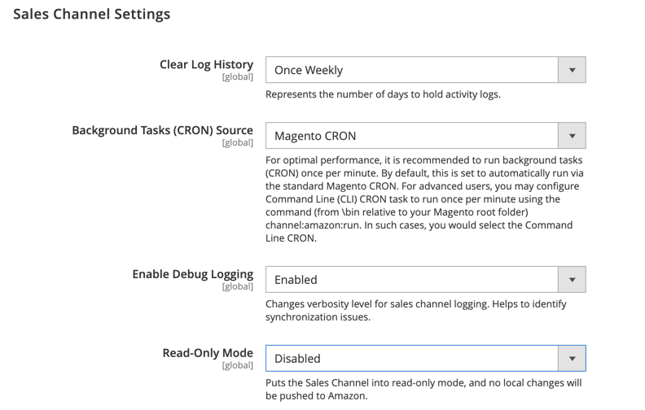

# [!UICONTROL Sales Channels] > [!UICONTROL Global Settings]

{{config}}

Diese Einstellungen sind verfügbar, wenn [[!DNL Amazon Sales Channel]](https://experienceleague.adobe.com/docs/commerce-channels/amazon/getting-started/install.html) installiert ist.

<!-- zoom -->

| Feld | [Anwendungsbereich](../getting-started/websites-stores-views.md#scope-settings) | Beschreibung |
|-----|---------|------|
| [!UICONTROL Clear Log History] | Global | Optionen:  **`Once Daily`**: Wählen Sie diese Option aus, um den Aktivitätsverlauf Ihres Stores einmal täglich zu löschen.  **`Once Weekly`**: Wählen Sie diese Option aus, um den Aktivitätsverlauf Ihres Stores einmal wöchentlich zu löschen.  **`Once Monthly`**: (Standard) Wählen Sie diese Option aus, um den Aktivitätsverlauf Ihres Stores einmal monatlich zu löschen. |
| [!UICONTROL Background Tasks (CRON) Source] | Global | Auswählen `Magento CRON` um anzugeben, dass [!DNL Amazon Sales Channel] verwendet Ihre Commerce-Cron-Einstellungen, um Kommunikations- und Datensynchronisierungsintervalle mit Amazon Seller Central zu bestimmen. |
| [!UICONTROL Enable Debug Logging] | Global | Auswählen `Enabled` um zusätzliche Synchronisierungsdaten zu erfassen, wenn eine Fehlerbehebung erforderlich ist.  Diese Option ist standardmäßig deaktiviert und sollte nur bei Bedarf zur Fehlerbehebung aktiviert werden, da sich die kontinuierliche Protokollierung negativ auf die Leistung auswirkt. Wenn diese Option für die Fehlerbehebung aktiviert ist, sollte sie nach Abschluss des Vorgangs deaktiviert werden.  **_Hinweis _**: Die Amazon-Sales Channel-Protokollierung wird in die Datei `/var/log/channel_amazon.log` Datei und kann in [Entwicklermodus](../systems/developer-tools.md#operation-modes). |
| [!UICONTROL Read-Only Mode] | Global | Auswählen `Enabled` , um alle ausgehenden, sich ändernden API-Anfragen zu blockieren. Potenzielle Änderungen werden gespeichert, aber erst gesendet, wenn der schreibgeschützte Modus deaktiviert ist. Um die Datenübertragung erneut zu starten, wählen Sie `Disabled`.  Wenn eine Datenbank auf eine neue Kopie der Instanz migriert wird (erkannt, wenn sich die URL eines Stores in der Konfiguration ändert), wird der schreibgeschützte Modus automatisch aktiviert.  Dies wurde für die Verwendung auf Kopien der Produktionsinstanz entwickelt, z. B. _Staging_ oder _QA_ und sollten nicht in der Produktionsinstanz verwendet werden.  **_Hinweis _**: Der Konfigurationscache muss für geleert werden. [!UICONTROL Read-Only Mode] aktivieren. |

{:style=&quot;table-layout:auto&quot;}
