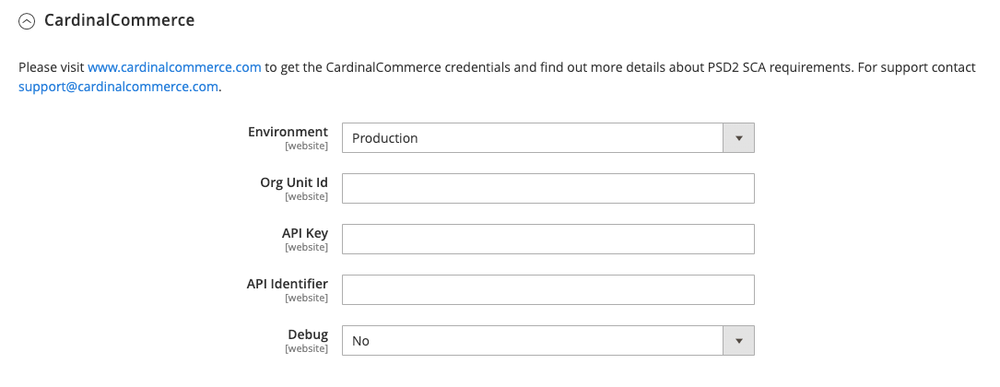

# [!UICONTROL Sales] > [!UICONTROL 3D Secure]

[!DNL 3-D Secure] wurde von [!DNL Visa] entwickelt, um sichere Online-Transaktionen zu fördern. Beispiele für [!DNL 3-D Secure] von Kartennetzwerken erstellten Lösungen werden von [!DNL Visa], [!DNL Mastercard SecureCode], [!DNL American Express SafeKey] und [!DNL CardinalCommerce Consumer Authentication] verifiziert. [!DNL CardinalCommerce] ist ein weltweit führender Anbieter von Authentifizierung digitaler Transaktionen und eine hundertprozentige Tochtergesellschaft von [!DNL Visa].

[!DNL 3-D Secure] Version 2.0 unterstützt zahlreiche Verbesserungen, einschließlich erweiterter Authentifizierungsmethoden und des Authentifizierungsflusses sowie verbesserter Datenfreigabe zwischen Händler und Aussteller.

>[!NOTE]
>
>Das Zahlungs-Gateway [Braintree](../../stores-purchase/braintree.md) unterstützt auch die [!DNL 3-D Secure].

{{config}}

## [!UICONTROL CardinalCommerce]

<!-- zoom -->

| Feld | [Umfang](../../getting-started/websites-stores-views.md#scope-settings) | Beschreibung |
|--- |--- |--- |
| [!UICONTROL Environment] | Website | Gibt den Betriebsmodus Ihres [!DNL CardinalCommerce] Kontos an. Wenn Sie in einer Testumgebung ausführen, wählen Sie „Sandbox“ aus. Optionen: Sandbox / Produktion (Standard) |
| [!UICONTROL Org Unit ID] | Website | Die Organisationseinheitenkennung Ihres [!DNL CardinalCommerce] Händlerkontos. |
| [!UICONTROL API Key] | Website | Der API-Schlüssel aus Ihrem [!DNL CardinalCommerce] Händlerkonto. |
| [!UICONTROL API Identifier] | Website | Die API-Kennung aus Ihrem [!DNL CardinalCommerce]-Händlerkonto. |
| [!UICONTROL Debug] | Website | Optionen: `Yes` / `No` |

{style="table-layout:auto"}
