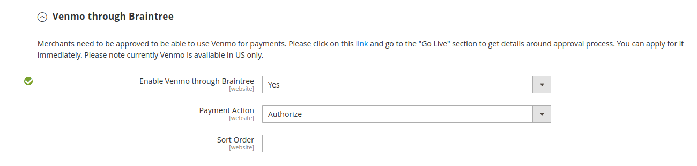

# [!UICONTROL Sales] > [!UICONTROL Payment Methods] > [!UICONTROL Braintree]

>[!IMPORTANT]
>
>**Commerce 2.4-Migration:** 
>Für Versionen vor 2.4.0 von Adobe Commerce und Magento Open Source wurde empfohlen, dass Händler die offizielle Braintree-Zahlungsintegrationserweiterung von der [Commerce Marketplace](https://marketplace.magento.com/catalogsearch/result/?q=braintree) installieren und konfigurieren, um die Kernintegration zu ersetzen. Ab Version 2.4.0 ist die Erweiterung jetzt in der Hauptversion enthalten.
>  
>Bei der Migration auf Commerce 2.4 müssen Händler die auf dem Marketplace verteilte Erweiterung (`paypal/module-braintree` oder `gene/module-braintree`) deinstallieren und alle Code-Anpassungen aktualisieren, um den `PayPal_Braintree`-Namespace anstelle von `Magento_Braintree` zu verwenden. Konfigurationseinstellungen aus der gebündelten Erweiterung für Commerce und die auf der Commerce Marketplace verteilte Erweiterung werden beibehalten. Zahlungen, die mit diesen Versionen der Erweiterung getätigt werden, werden wie gewohnt erfasst, annulliert oder erstattet.
>  
>Wenn Sie ein Upgrade auf Commerce 2.4.0 durchführen und nicht die empfohlene Commerce Marketplace-Erweiterung in Ihrer vorherigen Version 2.3.x verwenden, funktioniert die Funktion für mehrere Adressen nicht mit Version 2.4.0 von Braintree. Wenn ein Käufer _An mehrere Adressen senden_ auswählt, wird die Braintree-Zahlungsmethode nicht angezeigt. Dieses Problem betrifft mehrere Adressen in der zuvor für 2.3.x empfohlenen Commerce Marketplace-Erweiterung.

{{config}}

>[!IMPORTANT]
>
>Wenn Sie Hilfe bei unerwarteten Gebühren auf Ihrer Karte benötigen, besuchen Sie die Seite [Abonnement kündigen](https://helpx.adobe.com/de/manage-account/using/cancel-subscription.html), um Hilfe zu erhalten.

## [!UICONTROL Basic Braintree Settings]

<!-- zoom -->

| Feld | [Umfang](../../getting-started/websites-stores-views.md#scope-settings) | Beschreibung |
|--- |--- |--- |
| [!UICONTROL Title] | Shop-Ansicht | Standardwert: `Credit Card` (Braintree) |
| [!UICONTROL Environment] | Shop-Ansicht | Optionen: `Sandbox` / `Production` |
| [!UICONTROL Payment Action] | Shop-Ansicht | Bestimmt, welche Aktion Braintree bei der Zahlungsabwicklung durchführt. Optionen:  **`Authorize`**- Das Geld auf der Kreditkarte des Kunden wird autorisiert, aber nicht vom Konto übertragen. Eine Bestellung wird in Ihrem Store-Admin erstellt. Sie können den Verkauf später erfassen und eine Rechnung erstellen. **`Intent Sale`** (zuvor in früheren Versionen `Authorize and Capture`): Die auf der Kreditkarte des Kunden angegebenen Beträge werden von Braintree autorisiert und erfasst, und eine Bestellung und eine Rechnung werden in Ihrem Store-Administrator erstellt. |
| [!UICONTROL Sandbox Merchant ID] | Shop-Ansicht | Dies ist die eindeutige Kennung für Ihr gesamtes Sandbox-Gateway-Konto. Ihre Händler _ID wird auch als „öffentliche_&quot; oder _Produktions-ID_ bezeichnet und unterscheidet sich für Ihre Produktions- und Sandbox-Gateways. Dieses Feld wird angezeigt, wenn das _[!UICONTROL Environment]_&#x200B;Feld auf `Sandbox` gesetzt ist. |
| [!UICONTROL Sandbox Public Key] | Shop-Ansicht | Dies ist Ihre benutzerspezifische, öffentliche Kennung, die den Zugriff auf verschlüsselte Daten einschränkt. Jeder Benutzer, der mit Ihrem Sandbox Braintree-Gateway verknüpft ist, hat seinen eigenen öffentlichen Sandbox-Schlüssel. Dieses Feld wird angezeigt, wenn das _[!UICONTROL Environment]_&#x200B;Feld auf `Sandbox` gesetzt ist. |
| [!UICONTROL Sandbox Private Key] | Shop-Ansicht | Dies ist Ihre benutzerspezifische, private Kennung, die den Zugriff auf verschlüsselte Daten einschränkt. Jeder Benutzer, der mit Ihrem Sandbox Braintree-Gateway verknüpft ist, hat seinen eigenen privaten Schlüssel für die Sandbox. Dieses Feld wird angezeigt, wenn das _[!UICONTROL Environment]_&#x200B;Feld auf `Sandbox` gesetzt ist. |
| [!UICONTROL Merchant ID] | Shop-Ansicht | Dies ist die eindeutige Kennung für Ihr gesamtes Gateway-Konto, einschließlich der mehreren Händler-Konten, die sich möglicherweise in Ihrem Gateway befinden. Ihre Händler _ID wird auch als „öffentliche_&quot; oder _Produktions-ID_ bezeichnet und unterscheidet sich für Ihre Produktions- und Sandbox-Gateways. Dieses Feld wird angezeigt, wenn das _[!UICONTROL Environment]_&#x200B;Feld auf `Production` gesetzt ist. |
| [!UICONTROL Public Key] | Shop-Ansicht | Dies ist Ihre benutzerspezifische, öffentliche Kennung, die den Zugriff auf verschlüsselte Daten einschränkt. Jeder mit Ihrem Braintree-Gateway verknüpfte Benutzer verfügt über einen eigenen öffentlichen Schlüssel. Dieses Feld wird angezeigt, wenn das _[!UICONTROL Environment]_&#x200B;Feld auf `Production` gesetzt ist. |
| [!UICONTROL Private Key] | Shop-Ansicht | Dies ist Ihre benutzerspezifische, private Kennung, die den Zugriff auf verschlüsselte Daten einschränkt. Jeder mit Ihrem Braintree-Gateway verknüpfte Benutzer verfügt über einen eigenen privaten Schlüssel. Dieses Feld wird angezeigt, wenn das _[!UICONTROL Environment]_&#x200B;Feld auf `Production` gesetzt ist. |
| [!UICONTROL Enable Card Payments] | Website | Legt fest, ob die Kreditkartenzahlungsmethode von Braintree Ihren Kunden als Zahlungsmethode zur Verfügung steht. Optionen: `Yes` / `No` |
| [!UICONTROL Enable Vault for Card Payments] | Website | Wenn diese Option aktiviert ist, bietet einen sicheren Speicher für Kundenzahlungsinformationen, sodass Kunden ihre Kreditkarteninformationen nicht bei jedem Kauf erneut eingeben müssen. Optionen: `Yes` / `No` |
| [!UICONTROL Enable Vault CVV Re-verification] | Website | Wenn diese Option aktiviert ist, erfolgt die Validierung für die Einrichtung der CVV-Regeln in Ihrem Braintree-Konto. Optionen: `Yes` / `No` |

{style="table-layout:auto"}

## [!UICONTROL Advanced Braintree Settings]

{width="550" zoomable="yes"}

| Feld | [Umfang](../../getting-started/websites-stores-views.md#scope-settings) | Beschreibung |
|--- |--- |--- |
| [!UICONTROL Vault Title] | Website | Ein beschreibender Titel für Ihre Referenz, der den Tresor angibt, in dem Ihre Kundenkarteninformationen gespeichert sind. |
| [!UICONTROL Merchant Account ID] | Website | Die ID des Händlerkontos, das mit Braintree-Transaktionen von dieser Website verknüpft werden soll. Wenn dies leer gelassen wird, wird das standardmäßige Händlerkonto aus Ihrem Braintree-Konto verwendet. |
| [!UICONTROL Enable Checkout Express Payments] | Website | Bietet ein schnelleres Checkout-Erlebnis mit Express-Zahlungsoptionen zu Beginn des Checkout-Prozesses, einschließlich PayPal, PayLater, Apple Pay und Google Pay. Optionen: `Yes` / `No` |
| [!UICONTROL Skip Fraud Checks on Admin Orders] | Website | Prevents the transaction from being sent for evaluation as part of [!DNL Advanced Fraud Tools] checks, on orders placed through the admin only when it set to `Yes`. Optionen: `Yes` / `No` |
| [!UICONTROL Bypass Fraud Protection Threshold] | Website | `Advanced Fraud Protection` Prüfungen werden umgangen, wenn der Schwellenwert erreicht oder überschritten wird. Wenn Sie dieses Feld leer lassen, wird diese Option deaktiviert. |
| [!UICONTROL Debug] | Website | Bestimmt, ob die Kommunikation zwischen dem Braintree-System und Ihrem Store in einer Protokolldatei aufgezeichnet wird. Optionen: `Yes` / `No` |
| [!UICONTROL CVV Verification] | Website | Legt fest, ob Kunden den dreistelligen Sicherheitscode auf der Rückseite einer Kreditkarte bereitstellen müssen. Optionen: `Yes` / `No` |
| [!UICONTROL Send Card Line Items] | Website | Senden Sie die Artikel in den Warenkorbpositionen für alle Zahlungsmethoden. Optionen: `Yes` / `No` |
| [!UICONTROL Credit Card Types] | Website | Gibt jede Kreditkarte an, die Sie als Zahlung über Braintree akzeptieren. Drücken und halten Sie `Ctrl` (oder `Command` auf Mac), um eine Kartenkombination auszuwählen. Optionen: `American Express` / `Visa` / `MasterCard` / `Discover` / `JCB` / `Diners` / `Maestro International` |
| [!UICONTROL Sort Order] | Website | Bestimmt die Reihenfolge, in der Braintree beim Checkout mit anderen Zahlungsmethoden aufgelistet wird. |

## [!UICONTROL Braintree Webhooks Settings]

<!-- zoom -->

| Feld | [Umfang](../../getting-started/websites-stores-views.md#scope-settings) | Beschreibung |
|--- |--- |--- |
| [!UICONTROL Enable Webhook] | Website | Um die Webhook-Funktionalität für den Schutz vor Betrug, ACH-Zahlungen, lokale Zahlungsmethoden und Streitigkeiten zu aktivieren. Optionen: `Yes` / `No` |
| [!UICONTROL Fraud Protection URL] | Website | Fügen Sie diese URL Ihrem Braintree-Konto als [!UICONTROL Webhook Destination URL] hinzu. **Diese URL muss sicher und öffentlich zugänglich sein.** |
| [!UICONTROL Fraud Protection Approve Order Status] | Website | Wenn der Betrugsschutz von Braintree genehmigt wird, wird der ausgewählte Bestellstatus der Commerce-Bestellung zugewiesen. Dieser Status wird verwendet, um den Status des Auftrags zu aktualisieren, bei dem die ACH-Zahlungsmethode verwendet wird, und wenn sie in Braintree zu `SETTLED` wechselt. |
| [!UICONTROL Fraud Protection Reject Order Status] | Website | Wenn der Betrugsschutz von Braintree abgelehnt wird, wird der ausgewählte Bestellstatus der Commerce-Bestellung zugewiesen. Dieser Status wird verwendet, um den Status der Bestellung zu aktualisieren, bei der die ACH-Zahlungsmethode verwendet wird, und wenn `SETTLEMENT` in Braintree `DECLINED` wird. |

{style="table-layout:auto"}

## [!UICONTROL Country Specific Settings]

<!-- zoom -->

| Feld | [Umfang](../../getting-started/websites-stores-views.md#scope-settings) | Beschreibung |
|--- |--- |--- |
| [!UICONTROL Payment from Applicable Countries] | Website | Bestimmt, ob Sie von Braintree verarbeitete Zahlungen aus allen Ländern oder nur aus bestimmten Ländern akzeptieren. Optionen: `All Allowed Countries` / `Specific Countries` |
| [!UICONTROL Payment from Specific Countries] | Website | Gibt ggf. die Länder an, aus denen Sie von Braintree verarbeitete Zahlungen akzeptieren. |
| [!UICONTROL Country Specific Credit Card Types] | Website | Gibt die Kreditkarten an, die pro Land für Zahlungen akzeptiert werden, die von Braintree verarbeitet werden. Für jedes Land wird ein Datensatz gespeichert. Optionen:  **`Country`**- Wählen Sie das Land. **`Allowed Card Types`** - Wählen Sie jede Kreditkarte aus, die aus dem Land als Zahlung über Braintree akzeptiert wird.  **`Add`**- Fügen Sie eine Zeile hinzu, um Kreditkarten für ein anderes Land zuzulassen. **`Action`** - Löscht den Eintrag der zulässigen Kreditkarten für das Land. |

{style="table-layout:auto"}

## [!UICONTROL ACH through Braintree]

<!-- zoom -->

| Feld | [Umfang](../../getting-started/websites-stores-views.md#scope-settings) | Beschreibung |
|--- |--- |--- |
| [!UICONTROL Enabled ACH Direct Debit] | Website | Bestimmt, ob [!DNL ACH Direct Debit] als Zahlungsmethode über Braintree enthalten ist. Optionen: `Yes` / `No` |
| [!UICONTROL Enable Vault for ACH Direct Debit] | Website | Kunden können ihre Einmalzahlung per ACH-Lastschrift für die zukünftige Verwendung absichern. Sobald die Zahlungsdetails gesichtet sind, kann der Kunde die Zahlungsmethode „ACH Direct Debit“ verwenden, ohne die Daten erneut einzugeben oder seine Zahlungsinformationen erneut zu authentifizieren. Optionen: `Yes` / `No` |
| [!UICONTROL Sort Order] | Website | Bestimmt die Reihenfolge, in der [!DNL ACH Direct Debit] beim Checkout mit anderen Zahlungsmethoden aufgelistet wird. |

{style="table-layout:auto"}

## [!UICONTROL Apple Pay through Braintree]

<!-- zoom -->

| Feld | [Umfang](../../getting-started/websites-stores-views.md#scope-settings) | Beschreibung |
|--- |--- |--- |
| [!UICONTROL Enable ApplePay through Braintree] | Website | Bestimmt, ob Apple Pay über Braintree als Zahlungsmethode einbezogen wird. Options: `Yes` / `No`    The domain must be [verified in Braintree Account first](https://developer.paypal.com/braintree/docs/guides/apple-pay/configuration/javascript/v3). |
| [!UICONTROL Enable Vault for ApplePay] | Website | Customers can vault/store their Apple Pay payment method for future use. Sobald die Zahlungsdetails ausgewertet sind, kann der Kunde Apple Pay verwenden, ohne seine Zahlungsinformationen erneut einzugeben oder zu authentifizieren. Optionen: `Yes` / `No` |
| [!UICONTROL Payment Action] | Website | Bestimmt, welche Aktion Braintree bei der Zahlungsabwicklung durchführt. Optionen:  **`Authorize`**- Das Geld auf der Karte des Kunden wird autorisiert, aber nicht vom Konto des Kunden übertragen. Eine Bestellung wird in Ihrem Store-Admin erstellt. Sie können den Verkauf später erfassen und eine Rechnung erstellen. **`Intent Sale`** - Das Geld auf der Kundenkarte wird von Braintree autorisiert und erfasst, und eine Bestellung und eine Rechnung werden in Ihrem Shop-Administrator erstellt. **_Hinweis:_** Dies wurde in 2.3.x und früheren Versionen `Authorize and Capture`. |
| [!UICONTROL Merchant Name] | Shop-Ansicht | Den Kunden im ApplePay-Popup angezeigter Titel. |
| [!UICONTROL Sort Order] | Website | Bestimmt die Reihenfolge, in der Apple Pay beim Checkout mit anderen Zahlungsmethoden aufgelistet wird. |

{style="table-layout:auto"}

## [!UICONTROL Local Payment Methods]

<!-- zoom -->

| Feld | [Umfang](../../getting-started/websites-stores-views.md#scope-settings) | Beschreibung |
|--- |--- |--- |
| [!UICONTROL Enabled Local Payment Methods] | Website | Legt fest, ob die lokale Zahlungsmethode über Braintree als Zahlungsmethode einbezogen wird. Optionen: `Yes` / `No` |
| [!UICONTROL Title] | Website | Titel, der im Abschnitt „Checkout-Zahlungsmethode“ angezeigt wird. Standardwert: `Local Payments` |
| [!UICONTROL Fallback Button Text] | Website | Geben Sie den Text ein, der für die Schaltfläche verwendet werden soll, die auf der Fallback-Braintree-Seite angezeigt wird und Kunden zurück zur Website bringt. Standardwert: `Complete Checkout` |
| [!UICONTROL Redirect on Fail] | Website | Gibt die URL an, zu der Kunden umgeleitet werden sollen, wenn Transaktionen der lokalen Zahlungsmethode storniert werden, fehlschlagen oder auf Fehler stoßen. Es sollte die Checkout-Zahlungsseite sein (z. B. `https://www.domain.com/checkout#payment`). |
| [!UICONTROL Allowed Payment Method] | Website | Wählen Sie die zu aktivierende lokale Zahlungsmethode aus. Optionen: `Bancontact` / `EPS` / `iDeal` / `MyBank` / `P24` / `SEPA/ELV Direct Debit` |
| [!UICONTROL Sort Order] | Website | Bestimmt die Reihenfolge, in der die lokale Zahlungsmethode beim Checkout mit anderen Zahlungsmethoden aufgelistet wird. |

{style="table-layout:auto"}

>[!NOTE]
>
>Die gebündelte Braintree-Erweiterung unterstützt nicht alle in der Entwicklerdokumentation zu [Braintree aufgeführten lokalen &#x200B;](https://developer.paypal.com/braintree/docs/guides/local-payment-methods/overview). Weitere lokale Zahlungsmethoden werden derzeit entwickelt, um in zukünftigen Versionen unterstützt zu werden.

## [!UICONTROL GooglePay through Braintree]

<!-- zoom -->

| Feld | [Umfang](../../getting-started/websites-stores-views.md#scope-settings) | Beschreibung |
|--- |--- |--- |
| [!UICONTROL Enabled GooglePay through Braintree] | Website | Bestimmt, ob [!DNL Google Pay] Zahlung über Braintree als Zahlungsmethode einbezogen wird. Optionen: `Yes` / `No` |
| [!UICONTROL Enable Vault for GooglePay] | Website | Kunden können ihre Google-Zahlungsmethode für die zukünftige Verwendung tresoren/speichern. Sobald die Zahlungsdetails ausgewertet sind, kann der Kunde Google Pay verwenden, ohne seine Zahlungsinformationen erneut einzugeben oder zu authentifizieren. Optionen: `Yes` / `No` |
| [!UICONTROL Payment Action] | Website | Bestimmt, welche Aktion Braintree bei der Zahlungsabwicklung durchführt. Optionen:  **`Authorize`**- Das Geld auf der Karte des Kunden wird autorisiert, aber nicht vom Konto des Kunden übertragen. Eine Bestellung wird in Ihrem Store-Admin erstellt. Sie können den Verkauf später erfassen und eine Rechnung erstellen. **`Intent Sale`** - Das Geld auf der Kundenkarte wird von Braintree autorisiert und erfasst, und eine Bestellung und eine Rechnung werden in Ihrem Shop-Administrator erstellt. **_Hinweis:_** Dies wurde in 2.3.x und früheren Versionen `Authorize and Capture`. |
| [!UICONTROL Button Color] | Website | Bestimmt die Farbe der [!DNL Google Pay]. Optionen: `White` / `Black` |
| [!UICONTROL Merchant ID] | Shop-Ansicht | Die von Google bereitgestellte ID muss hier eingegeben werden. |
| [!UICONTROL Accepted Cards] | Website | Wählen Sie den Kartentyp aus, den ein Kunde verwenden kann, um mithilfe von [!DNL Google Pay] zu bestellen. |
| [!UICONTROL Sort Order] | Website | Bestimmt die Reihenfolge, in der Google Pay beim Checkout mit anderen Zahlungsmethoden aufgelistet wird. |

{style="table-layout:auto"}

## [!UICONTROL Venmo through Braintree]

<!-- zoom -->

| Feld | [Umfang](../../getting-started/websites-stores-views.md#scope-settings) | Beschreibung |
|--- |--- |--- |
| [!UICONTROL Enable Venmo through Braintree] | Website | Bestimmt, ob [!DNL Venmo] als Zahlungsmethode über Braintree enthalten ist. Optionen: `Yes` / `No` |
| [!UICONTROL Enable Vault for Venmo] | Website | Customers can vault/store their Venmo payment method for future use. Sobald die Zahlungsdetails geVault sind, kann der Kunde die Venmo-Zahlungsmethode verwenden, ohne die Daten erneut einzugeben oder seine Zahlungsinformationen erneut zu authentifizieren. Optionen: `Yes` / `No` |
| [!UICONTROL Payment Action] | Website | Bestimmt, welche Aktion Braintree bei der Zahlungsabwicklung durchführt. Optionen:  **`Authorize`**- Das Geld auf der Karte des Kunden wird autorisiert, aber nicht vom Konto des Kunden übertragen. Eine Bestellung wird in Ihrem Store-Admin erstellt. Sie können den Verkauf später erfassen und eine Rechnung erstellen. **`Intent Sale`** - Das Geld auf der Kundenkarte wird von Braintree autorisiert und erfasst, und eine Bestellung und eine Rechnung werden in Ihrem Shop-Administrator erstellt. **_Hinweis:_** Dies war _Authorize and Capture_ in 2.3.x und früheren Versionen. |
| [!UICONTROL Sort Order] | Website | Bestimmt die Bestellung, dass Venmo während des Checkouts mit anderen Zahlungsmethoden aufgelistet wird. |

{style="table-layout:auto"}

## [!UICONTROL PayPal through Braintree]

{width="550" zoomable="yes"}
{width="550" zoomable="yes"}

| Feld | [Umfang](../../getting-started/websites-stores-views.md#scope-settings) | Beschreibung |
|--- |--- |--- |
| [!UICONTROL Enable PayPal through Braintree] | Website | Bestimmt, ob PayPal über Braintree als Zahlungsmethode enthalten ist. Optionen: `Yes` / `No` |
| [!UICONTROL Enable PayPal Credit through Braintree] | Website | Legt fest, ob PayPal-Guthaben über Braintree als Zahlungsmethode einbezogen wird. Optionen: `Yes` / `No`. Dieses Feld wird angezeigt, wenn `Enable PayPal through Braintree` auf `Yes` gesetzt ist |
| [!UICONTROL Enable PayPal PayLater through Braintree] | Website | Legt fest, ob PayPal PayLater über Braintree als Zahlungsmethode einbezogen wird. Optionen: `Yes` / `No`. Dieses Feld wird angezeigt, wenn `Enable PayPal through Braintree` auf `Yes` gesetzt ist |
| [!UICONTROL Title] | Shop-Ansicht | Die Kennzeichnung, die PayPal über Braintree an Kunden während des Checkouts identifiziert. Standardwert: `PayPal` |
| [!UICONTROL Vault Enabled] | Website | Wenn diese Option aktiviert ist, bietet eine sichere Speicherung von Kundenzahlungsinformationen, sodass Kunden ihre PayPal-Informationen nicht bei jedem Kauf erneut eingeben müssen. Optionen: `Yes` / `No` |
| [!UICONTROL Send Cart Line Items for PayPal] | Website | Senden Sie die Einzelposten (Bestellpositionen) zusammen mit Geschenkgutscheinen, Geschenkverpackungen für Artikel, Geschenkverpackungen für Bestellung, Warenkorbgutschrift, Versand und Steuer als Einzelposten an PayPal. Optionen: `Yes` / `No` |
| [!UICONTROL Sort Order] | Website | Eine Zahl, die die Reihenfolge bestimmt, in der PayPal über Braintree mit anderen Zahlungsmethoden beim Checkout aufgelistet wird. |
| [!UICONTROL Override Merchant Name] | Shop-Ansicht | Ein alternativer Name, mit dem der Händler für jede Shop-Ansicht identifiziert werden kann. |
| [!UICONTROL Payment Action] | Website | Bestimmt die von PayPal über Braintree durchgeführte Aktion, wenn eine Zahlung verarbeitet wird. Optionen:  **`Authorize`**- Das Geld auf der Karte des Kunden wird autorisiert, aber nicht vom Konto des Kunden übertragen. Eine Bestellung wird in Ihrem Store-Admin erstellt. Sie können den Verkauf später erfassen und eine Rechnung erstellen. **`Authorize and Capture`** - Das Geld auf der Kundenkarte wird von PayPal über Braintree autorisiert und erfasst und eine Bestellung und Rechnung werden in Ihrem Shop-Administrator erstellt. |
| [!UICONTROL Payment from Applicable Countries] | Website | Bestimmt, ob Sie Zahlungen akzeptieren, die von PayPal über Braintree aus allen Ländern oder nur bestimmten Ländern verarbeitet werden. Optionen: `All Allowed Countries` / `Specific Countries` |
| [!UICONTROL Payment from Specific Countries] | Website | Gibt ggf. die Länder an, aus denen Sie von Braintree verarbeitete Zahlungen akzeptieren. |
| [!UICONTROL Require Customer's Billing Address] | Website | Legt fest, ob die Rechnungsadresse des Kunden für die Bestellung erforderlich ist. Optionen: `Yes` / `No` |
| [!UICONTROL Skip Order Review Step] | Website | Legt fest, ob Kunden vor Abschluss der Zahlung zur Überprüfungsseite weitergeleitet werden. Optionen: `Yes` / `No` |
| [!UICONTROL Debug] | Website | Bestimmt, ob die Kommunikation zwischen dem PayPal über das Braintree-System und Ihrem Geschäft in einer Protokolldatei aufgezeichnet wird. Optionen: `Yes` / `No` |
| [!UICONTROL Display on Shopping Cart] | Website | Bestimmt, ob die PayPal-Schaltfläche im [Mini-Warenkorb](../../stores-purchase/cart-configuration.md#mini-cart) und auf der Seite [Warenkorb](../../stores-purchase/cart.md) angezeigt wird. Optionen: `Yes` / `No` |
| [!UICONTROL Send Package Tracking] | Website | Paketverfolgungsinformationen werden nur für PayPal-Transaktionen/Bestellungen an PayPal gesendet. Sie müssen das Feld [!UICONTROL Send Cart Line Items for PayPal] aktivieren, damit die [!UICONTROL Package Tracking] Funktion ordnungsgemäß funktioniert. Optionen: `Yes` / `No` |
| [!UICONTROL Use PayPal's "Notify Payer" functionality] | Website | Sobald dies auf „Ja“ gesetzt ist, wird der Käufer oder Zahler von PayPal über Aktualisierungen der Paketverfolgung benachrichtigt. Optionen: `Yes` / `No` |

{style="table-layout:auto"}

>[!NOTE]
>
>**[!DNL PayPal Credit]** oder **[!DNL PayPal PayLater]** können aktiviert werden. Beide Methoden können nicht gleichzeitig aktiviert werden.

### [!UICONTROL Styling]

<!-- zoom -->

| Feld | [Umfang](../../getting-started/websites-stores-views.md#scope-settings) | Beschreibung |
|--- |--- |--- |
| [!UICONTROL Location] | Website | Bestimmt, wo PayPal-Schaltflächen und -Nachrichten in der Storefront gerendert werden. Optionen: `Mini-Cart and Cart Page` / `Checkout Page` / `Product Page` |

{style="table-layout:auto"}

**[!UICONTROL Mini-Cart and Cart Page]**

Die Optionen und Einstellungen in diesem Abschnitt variieren je nach der Einstellung im Feld _[!UICONTROL Location]_.

| Feld | [Umfang](../../getting-started/websites-stores-views.md#scope-settings) | Beschreibung |
|--- |--- |--- |
| [!UICONTROL PayPal Button Type] | Website | Legt eine der drei Schaltflächentypen für die Schaltfläche fest: `PayPal Button` / `PayPal Pay Later Button` / `PayPal Credit Button` |

**[!UICONTROL PayPal Button]**

Die Optionen und Einstellungen in diesem Abschnitt variieren je nach dem im Feld _[!UICONTROL PayPal Button Type]_&#x200B;ausgewählten Schaltflächentyp.

| Feld | [Umfang](../../getting-started/websites-stores-views.md#scope-settings) | Beschreibung |
|--- |--- |--- |
| [!UICONTROL Show PayPal Button] | Website | Bestimmt die Position der PayPal-Schaltfläche am ausgewählten Standort. Optionen: `Yes` / `No` |
| [!UICONTROL Button Label] | Website | Bestimmt den Titel für die PayPal-Schaltfläche. Optionen: `Paypal` / `Checkout` / `Buy Now` / `Pay` |
| [!UICONTROL Color] | Website | Bestimmt die Farbe der PayPal-Schaltfläche. Optionen: `Blue` / `Black` / `Gold` / `Silver` |
| [!UICONTROL Shape] | Website | Bestimmt die Form der PayPal-Schaltfläche. Optionen: `Pill` / `Rectangle` |
| [!UICONTROL Size(Deprecated)] | Website | Bestimmt die Größe der PayPal-Schaltfläche. Optionen: `Medium` / `Large` / `Responsive` |

{style="table-layout:auto"}

>[!NOTE]
>
>Das **[!DNL Size(Deprecated)]** Konfigurationsfeld ist veraltet und wird nicht zur Gestaltung der PayPal-Schaltflächen verwendet.

Wenn diese Optionen festgelegt sind, können Sie die Vorschau der PayPal-Schaltflächen und PayLater-Nachrichten sehen. Es gibt Steuerelemente, mit denen Sie die Einstellungen anwenden oder die Werte zurücksetzen können:

| Feld | [Umfang](../../getting-started/websites-stores-views.md#scope-settings) | Beschreibung |
|--- |--- |--- |
| [!UICONTROL Apply] | Website | Speichert die ausgewählten Stileinstellungen für Schaltflächen und PayLater-Messaging und wendet sie auf die aktuelle Position und den aktuellen Schaltflächentyp an. |
| [!UICONTROL Apply to All Buttons] | Website | Speichert die ausgewählten Stileinstellungen für Schaltflächen und PayLater-Messaging-Werte und wendet sie auf alle Schaltflächentypen und Positionen an. |
| [!UICONTROL Reset to Recommended Defaults] | Website | Gibt die Stileinstellungen auf die empfohlenen Standardwerte für Schaltflächen und PayLater-Messaging zurück und wendet sie auf alle Schaltflächentypen und -speicherorte an. |

{style="table-layout:auto"}

## [!UICONTROL Pay Later Messaging]

**[!UICONTROL Product Page]**

<!-- zoom -->

| Feld | [Umfang](../../getting-started/websites-stores-views.md#scope-settings) | Beschreibung |
|--- |--- |------------------------------------------------------------------------------------------------------------------------------------------------------------------------------------------------------------------------------------------|
| [!UICONTROL Show PayLater Messaging] | Website | Aktiviert das PayLater-Messaging am ausgewählten Speicherort. Optionen: `Yes` / `No`. Zeigt Nachrichten zu „Später bezahlen“ für verfügbare Angebote an. Es gelten Einschränkungen. [Hier erfahren Sie mehr darüber.](https://developer.paypal.com/studio/checkout/pay-later/us) |
| [!UICONTROL Message Layout] | Website | Bestimmt das Layout der PayLater-Nachricht. Optionen: `Text` / `Flex` |
| [!UICONTROL Logo] | Website | Bestimmt den Logotyp, der für die Nachricht „Später bezahlen“ verwendet wird. Optionen: `Inline` / `Primary` / `Alternative` / `None` |
| [!UICONTROL Logo Position] | Website | Bestimmt die Logo-Position für die Pay Later-Nachricht. Optionen: `Left` / `Right` / `Top` |
| [!UICONTROL Text Color] | Website | Bestimmt die Textfarbe der Pay Later-Nachricht. Optionen: `Black` / `White` / `Monochrome` / `Grayscale` |

{style="table-layout:auto"}

**[!UICONTROL Cart]**

<!-- zoom -->

| Feld | [Umfang](../../getting-started/websites-stores-views.md#scope-settings) | Beschreibung |
|--- |--- |------------------------------------------------------------------------------------------------------------------------------------------------------------------------------------------------------------------------------------------|
| [!UICONTROL Show PayLater Messaging] | Website | Aktiviert das PayLater-Messaging am ausgewählten Speicherort. Optionen: `Yes` / `No`. Zeigt Nachrichten zu „Später bezahlen“ für verfügbare Angebote an. Es gelten Einschränkungen. [Hier erfahren Sie mehr darüber.](https://developer.paypal.com/studio/checkout/pay-later/us) |
| [!UICONTROL Message Layout] | Website | Bestimmt das Layout der PayLater-Nachricht. Optionen: `Text` / `Flex` |
| [!UICONTROL Logo] | Website | Bestimmt den Logotyp, der für die Nachricht „Später bezahlen“ verwendet wird. Optionen: `Inline` / `Primary` / `Alternative` / `None` |
| [!UICONTROL Logo Position] | Website | Bestimmt die Logo-Position für die Pay Later-Nachricht. Optionen: `Left` / `Right` / `Top` |
| [!UICONTROL Text Color] | Website | Bestimmt die Textfarbe der Pay Later-Nachricht. Optionen: `Black` / `White` / `Monochrome` / `Grayscale` |

{style="table-layout:auto"}

**[!UICONTROL Checkout]**

<!-- zoom -->

| Feld | [Umfang](../../getting-started/websites-stores-views.md#scope-settings) | Beschreibung |
|--------------------------------------|--- |-------------------------------------------------------------------------------------------------------------------------------------------------------------------------------------------------------------------------------------------|
| [!UICONTROL Show PayLater Messaging] | Website | Aktiviert das PayLater-Messaging am ausgewählten Speicherort. Optionen: `Yes` / `No`. Zeigt Nachrichten zu „Später bezahlen“ für verfügbare Angebote an. Es gelten Einschränkungen. [Hier erfahren Sie mehr darüber.](https://developer.paypal.com/studio/checkout/pay-later/us) |
| [!UICONTROL Text Align] | Website | Bestimmt das Layout der PayLater-Nachricht. Optionen: `Left` / `Center` / `Right` |
| [!UICONTROL Text Color] | Website | Bestimmt die Textfarbe der Pay Later-Nachricht. Optionen: `Black` / `White` |

{style="table-layout:auto"}

## Einstellungen für die sichere 3D-Überprüfung

<!-- zoom -->

| Feld | [Umfang](../../getting-started/websites-stores-views.md#scope-settings) | Beschreibung |
|--- |--- |--- |
| [!UICONTROL 3D Secure Verification] | Website | Legt fest, ob eine Transaktion einen zusätzlichen Verifizierungsprozess bestehen muss, wenn der Kunde in einem Programm wie „Verified by _&quot;_ ist. Optionen: `Yes` / `No` |
| [!UICONTROL Always request 3DS] | Website | Fordern Sie die 3D Secure-Anfrage immer für alle Transaktionen heraus. Optionen: `Yes` / `No` |
| [!UICONTROL Threshold Amount] | Website | Bestimmt den maximalen Bestellbetrag, der für die Verarbeitung eines einzelnen Auftrags autorisiert ist. Braintree lehnt die Autorisierung ab, wenn der Bestellbetrag diesen Schwellenwert überschreitet. |
| [!UICONTROL Verify for Applicable Countries] | Website | Bestimmt die Länder, in denen die Zahlung überprüft werden muss. Optionen: `All Allowed Countries` / `Specific Countries` |
| [!UICONTROL Verify for Specific Countries] | Website | Gibt ggf. die Länder an, aus denen die Zahlung durch Braintree überprüft werden muss. |

{style="table-layout:auto"}

## [!UICONTROL Dynamic Descriptors]

<!-- zoom -->

| Feld | [Umfang](../../getting-started/websites-stores-views.md#scope-settings) | Beschreibung |
|--- |--- |--- |
| [!UICONTROL Name] | Shop-Ansicht | Der Namensdeskriptor besteht aus zwei Teilen, die durch ein Sternchen (*) getrennt sind. Der erste Teil des Deskriptors identifiziert das Unternehmen oder die DBA und der zweite Teil identifiziert das Produkt. Beispiel: `company*myproduct`   Die Länge des Unternehmens und der Produktteile des Deskriptors kann wie folgt zugeordnet werden, für eine kombinierte Länge von bis zu 22 Zeichen:  **`Option 1`**- Unternehmen muss drei Zeichen lang sein / Produkt kann bis zu 18 Zeichen lang sein **`Option 2`** - Unternehmen muss sieben Zeichen lang sein / Produkt kann bis zu 14 Zeichen lang sein  **`Option 3`**- Unternehmen muss 12 Zeichen lang sein / Produkt kann bis zu neun Zeichen lang sein |
| [!UICONTROL Phone] | Shop-Ansicht | Der Telefondeskriptor muss 10 bis 14 Zeichen lang sein und darf nur Ziffern, Bindestriche, Klammern und Punkte enthalten. Beispiel: `9999999999` `(999) 999-9999` `999.999.9999` |
| [!UICONTROL URL] | Shop-Ansicht | Der URL-Deskriptor stellt Ihren Domain-Namen dar und kann bis zu 13 Zeichen lang sein. Beispiel: `company.com` |

{style="table-layout:auto"}
