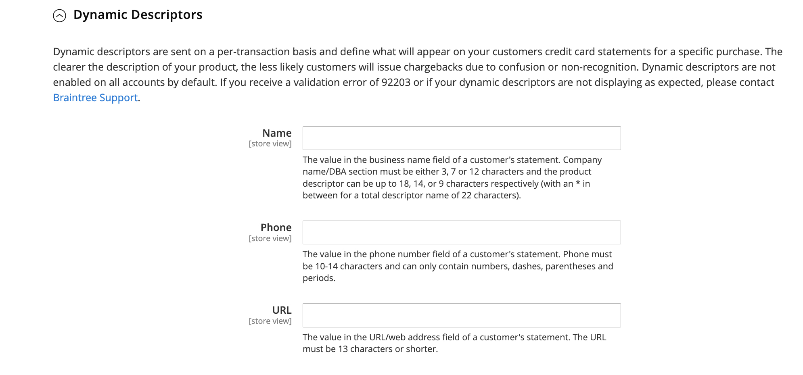

# [!UICONTROL Sales] > [!UICONTROL Payment Methods] > [!UICONTROL Braintree]

>[!IMPORTANT]
>
>**Commerce 2.4-Migration:** 
>Für Versionen von Adobe Commerce und Magento Open Source vor 2.4.0 wurde empfohlen, dass Händler die offizielle Braintree-Zahlungsintegrationserweiterung über die installieren und konfigurieren. [Commerce Marketplace](https://marketplace.magento.com/catalogsearch/result/?q=braintree) , um die Kernintegration zu ersetzen. Ab Version 2.4.0 ist die Erweiterung jetzt in der Hauptversion enthalten.
>  
>Bei der Migration auf Commerce 2.4 müssen Händler die auf dem Marketplace verteilte Erweiterung deinstallieren (`paypal/module-braintree` oder `gene/module-braintree`) und alle Code-Anpassungen aktualisieren, um die `PayPal_Braintree` Namespace statt `Magento_Braintree`. Konfigurationseinstellungen aus der gebündelten Erweiterung für Commerce und der auf der Commerce Marketplace verteilten Erweiterung werden beibehalten. Zahlungen, die mit diesen Versionen der Erweiterung getätigt werden, werden wie gewohnt erfasst, annulliert oder erstattet.
>  
>Wenn Sie ein Upgrade auf Commerce 2.4.0 durchführen und nicht die empfohlene Commerce Marketplace-Erweiterung in Ihrer vorherigen Version 2.3.x verwenden, funktioniert die Funktion für mehrere Adressen nicht mit der Version 2.4.0 von Braintree. Wenn ein Käufer Folgendes auswählt _An mehrere Adressen senden_ , die Braintree-Zahlungsmethode wird nicht angezeigt. Das Problem mit mehreren Adressen tritt bei der zuvor für 2.3.x empfohlenen Commerce Marketplace-Erweiterung auf.

{{config}}

## [!UICONTROL Basic Braintree Settings]

<!-- zoom -->

| Feld | [Scope](../../getting-started/websites-stores-views.md#scope-settings) | Beschreibung |
|--- |--- |--- |
| [!UICONTROL Title] | Shop-Ansicht | Standardwert: `Credit Card` (Braintree) |
| [!UICONTROL Environment] | Shop-Ansicht | Optionen: `Sandbox` / `Production` |
| [!UICONTROL Payment Action] | Shop-Ansicht | Bestimmt die Aktion, die beim Braintree einer Zahlung ausgeführt wird. Optionen:  **`Authorize`**- Guthaben auf der Kreditkarte des Kunden werden autorisiert, aber nicht vom Konto übertragen. Eine Bestellung wird in Ihrem Shop-Admin erstellt. Sie können den Verkauf später erfassen und eine Rechnung erstellen. **`Intent Sale`** (früher `Authorize and Capture` in früheren Versionen) - Die Guthaben auf der Kreditkarte des Kunden werden autorisiert und von Braintree erfasst, und eine Bestellung und eine Rechnung werden in Ihrem Shop-Administrator erstellt. |
| [!UICONTROL Sandbox Merchant ID] | Shop-Ansicht | Dies ist die eindeutige Kennung für Ihr gesamtes Sandbox-Gateway-Konto. Auch bekannt als _Öffentliche ID_ oder _Produktions-ID_ Ihre Händler-ID unterscheidet sich jedoch von Ihren Produktions- und Sandbox-Gateways. Dieses Feld wird angezeigt, wenn _[!UICONTROL Environment]_Feld ist festgelegt auf `Sandbox`. |
| [!UICONTROL Sandbox Public Key] | Shop-Ansicht | Dies ist Ihre benutzerspezifische, öffentliche Kennung, die den Zugriff auf verschlüsselte Daten einschränkt. Jeder Benutzer, der mit Ihrem Sandbox Braintree-Gateway verknüpft ist, hat seinen eigenen öffentlichen Sandbox-Schlüssel. Dieses Feld wird angezeigt, wenn _[!UICONTROL Environment]_Feld ist festgelegt auf `Sandbox`. |
| [!UICONTROL Sandbox Private Key] | Shop-Ansicht | Dies ist Ihre benutzerspezifische, private Kennung, die den Zugriff auf verschlüsselte Daten einschränkt. Jeder Benutzer, der mit Ihrem Sandbox-Braintree-Gateway verknüpft ist, hat seinen eigenen privaten Schlüssel für die Sandbox. Dieses Feld wird angezeigt, wenn _[!UICONTROL Environment]_Feld ist festgelegt auf `Sandbox`. |
| [!UICONTROL Merchant ID] | Shop-Ansicht | Dies ist die eindeutige Kennung für Ihr gesamtes Gateway-Konto, einschließlich der mehreren Händlerkonten, die sich möglicherweise in Ihrem Gateway befinden. Auch bekannt als _Öffentliche ID_ oder _Produktions-ID_ Ihre Händler-ID unterscheidet sich jedoch von Ihren Produktions- und Sandbox-Gateways. Dieses Feld wird angezeigt, wenn _[!UICONTROL Environment]_Feld ist festgelegt auf `Production`. |
| [!UICONTROL Public Key] | Shop-Ansicht | Dies ist Ihre benutzerspezifische, öffentliche Kennung, die den Zugriff auf verschlüsselte Daten einschränkt. Jeder mit Ihrem Braintree-Gateway verknüpfte Benutzer verfügt über einen eigenen öffentlichen Schlüssel. Dieses Feld wird angezeigt, wenn _[!UICONTROL Environment]_Feld ist festgelegt auf `Production`. |
| [!UICONTROL Private Key] | Shop-Ansicht | Dies ist Ihre benutzerspezifische, private Kennung, die den Zugriff auf verschlüsselte Daten einschränkt. Jeder mit Ihrem Braintree-Gateway verknüpfte Benutzer verfügt über einen eigenen privaten Schlüssel. Dieses Feld wird angezeigt, wenn _[!UICONTROL Environment]_Feld ist festgelegt auf `Production`. |
| [!UICONTROL Enable Card Payments] | Website | Legt fest, ob die Braintree-Kreditkartenzahlungsmethode Ihren Kunden als Zahlungsmethode zur Verfügung steht. Optionen: `Yes` / `No` |
| [!UICONTROL Enable Vault for Card Payments] | Website | Wenn diese Option aktiviert ist, bietet eine sichere Speicherung von Kundenzahlungsinformationen, sodass Kunden ihre Kreditkarteninformationen nicht bei jedem Kauf erneut eingeben müssen. Optionen: `Yes` / `No` |
| [!UICONTROL Enable Vault CVV Reverification] | Website | Wenn diese Option aktiviert ist, erfolgt die Validierung für die Einrichtung der CVV-Regeln in Ihrem Braintree-Konto. Optionen: `Yes` / `No` |

{style="table-layout:auto"}

## [!UICONTROL Advanced Braintree Settings]

{width="550" zoomable="yes"}

| Feld | [Scope](../../getting-started/websites-stores-views.md#scope-settings) | Beschreibung |
|--- |--- |--- |
| [!UICONTROL Vault Title] | Website | Ein beschreibender Titel für Ihre Referenz, der den Tresor identifiziert, in dem Ihre Kundenkarteninformationen gespeichert sind. |
| [!UICONTROL Merchant Account ID] | Website | Die ID des Händlerkontos, das mit Braintree-Transaktionen von dieser Website verknüpft werden soll. Wenn Sie das Feld leer lassen, wird das standardmäßige Händlerkonto aus Ihrem Braintree-Konto verwendet. |
| [!UICONTROL Enable Checkout Express Payments] | Website | Bietet ein schnelleres Checkout-Erlebnis mit Express-Zahlungsoptionen zu Beginn des Checkout-Prozesses, einschließlich PayPal, PayLater, Apple Pay und Google Pay. Optionen: `Yes` / `No` |
| [!UICONTROL Skip Fraud Checks on Admin Orders] | Website | Verhindert, dass die Transaktion zur Auswertung als Teil von gesendet wird [!DNL Advanced Fraud Tools] Prüfungen, bei Bestellungen, die nur über den Administrator aufgegeben werden, wenn sie auf gesetzt sind `Yes`. Optionen: `Yes` / `No` |
| [!UICONTROL Bypass Fraud Protection Threshold] | Website | `Advanced Fraud Protection` Prüfungen werden umgangen, wenn der Schwellenwert erreicht oder überschritten wird. Wenn Sie dieses Feld leer lassen, wird diese Option deaktiviert. |
| [!UICONTROL Debug] | Website | Legt fest, ob die Kommunikation zwischen dem Braintree-System und Ihrem Speicher in einer Protokolldatei aufgezeichnet wird. Optionen: `Yes` / `No` |
| [!UICONTROL CVV Verification] | Website | Legt fest, ob Kunden den dreistelligen Sicherheitscode von der Rückseite einer Kreditkarte bereitstellen müssen. Optionen: `Yes` / `No` |
| [!UICONTROL Send Card Line Items] | Website | Senden Sie die Artikel in den Warenkorb für alle Zahlungsmethoden. Optionen: `Yes` / `No` |
| [!UICONTROL Credit Card Types] | Website | Gibt jede Kreditkarte an, die Sie als Zahlung per Braintree akzeptieren. Drücken und halten `Ctrl` (oder `Command` auf Mac), um eine Kartenkombination auszuwählen. Optionen: `American Express` / `Visa` / `MasterCard` / `Discover` / `JCB` / `Diners` / `Maestro International` |
| [!UICONTROL Sort Order] | Website | Bestimmt die Reihenfolge, in der Braintree beim Checkout mit anderen Zahlungsmethoden aufgelistet wird. |

## [!UICONTROL Braintree Webhooks Settings]

<!-- zoom -->

| Feld | [Scope](../../getting-started/websites-stores-views.md#scope-settings) | Beschreibung |
|--- |--- |--- |
| [!UICONTROL Enable Webhook] | Website | Um die Webhook-Funktionalität für den Schutz vor Betrug, ACH-Zahlungen, lokale Zahlungsmethoden und Streitigkeiten zu aktivieren. Optionen: `Yes` / `No` |
| [!UICONTROL Fraud Protection URL] | Website | Fügen Sie diese URL Ihrem Braintree-Konto als [!UICONTROL Webhook Destination URL]. **Diese URL muss sicher und öffentlich zugänglich sein.** |
| [!UICONTROL Fraud Protection Approve Order Status] | Website | Wenn der Betrugsschutz durch Braintree genehmigt wird, wird der ausgewählte Bestellstatus dem E-Commerce-Auftrag zugewiesen. Dieser Status wird verwendet, um den Status des Auftrags zu aktualisieren, bei dem die ACH-Zahlungsmethode verwendet wird, und wenn sie in `SETTLED` in Braintree. |
| [!UICONTROL Fraud Protection Reject Order Status] | Website | Wenn der Betrugsschutz durch das Braintree abgelehnt wird, wird der ausgewählte Bestellstatus dem E-Commerce-Auftrag zugewiesen. Dieser Status wird verwendet, um den Status des Auftrags zu aktualisieren, bei dem die ACH-Zahlungsmethode verwendet wird, und wenn `SETTLEMENT` ist `DECLINED` in Braintree. |

{style="table-layout:auto"}

## [!UICONTROL Country Specific Settings]

<!-- zoom -->

| Feld | [Scope](../../getting-started/websites-stores-views.md#scope-settings) | Beschreibung |
|--- |--- |--- |
| [!UICONTROL Payment from Applicable Countries] | Website | Legt fest, ob Sie Zahlungen akzeptieren, die per Braintree aus allen Ländern oder nur aus bestimmten Ländern bearbeitet werden. Optionen: `All Allowed Countries` / `Specific Countries` |
| [!UICONTROL Payment from Specific Countries] | Website | Gibt ggf. die Länder an, aus denen Sie per Braintree abgewickelte Zahlungen akzeptieren. |
| [!UICONTROL Country Specific Credit Card Types] | Website | Gibt die Kreditkarten an, die pro Land für per Braintree abgewickelte Zahlungen akzeptiert werden. Für jedes Land wird ein Datensatz gespeichert. Optionen:  **`Country`**- Wählen Sie das Land. **`Allowed Card Types`** - Wählen Sie jede Kreditkarte, die aus dem Land als Zahlung durch Braintree akzeptiert wird.  **`Add`**- Fügen Sie eine Zeile hinzu, um Kreditkarten für ein anderes Land zuzulassen. **`Action`** - Löscht den Eintrag der zulässigen Kreditkarten für das Land. |

{style="table-layout:auto"}

## [!UICONTROL ACH through Braintree]

<!-- zoom -->

| Feld | [Scope](../../getting-started/websites-stores-views.md#scope-settings) | Beschreibung |
|--- |--- |--- |
| [!UICONTROL Enabled ACH Direct Debit] | Website | Bestimmt, ob [!DNL ACH Direct Debit] ist als Zahlungsmethode durch Braintree enthalten. Optionen: `Yes` / `No` |
| [!UICONTROL Enable Vault for ACH Direct Debit] | Website | Kunden können ihre Single-Use-Zahlungsmethode „ACH Direct Debit“ für die zukünftige Verwendung tresoren/speichern. Sobald die Zahlungsdetails eingezogen sind, kann der Kunde die Zahlungsmethode „ACH Direct Debit“ verwenden, ohne die Daten erneut einzugeben oder seine Zahlungsinformationen erneut zu authentifizieren. Optionen: `Yes` / `No` |
| [!UICONTROL Sort Order] | Website | Bestimmt die Reihenfolge, in der [!DNL ACH Direct Debit] wird mit anderen Zahlungsmethoden beim Checkout aufgelistet. |

{style="table-layout:auto"}

## [!UICONTROL Apple Pay through Braintree]

<!-- zoom -->

| Feld | [Scope](../../getting-started/websites-stores-views.md#scope-settings) | Beschreibung |
|--- |--- |--- |
| [!UICONTROL Enable ApplePay through Braintree] | Website | Legt fest, ob Apple Pay als Zahlungsmethode über Braintree enthalten ist. Optionen: `Yes` / `No`    Die Domain muss sein [zuerst im Braintree-Konto verifiziert](https://developer.paypal.com/braintree/docs/guides/apple-pay/configuration/javascript/v3). |
| [!UICONTROL Enable Vault for ApplePay] | Website | Kunden können ihre Apple Pay-Zahlungsmethode für die zukünftige Verwendung absichern. Sobald die Zahlungsdetails ausgewertet sind, kann der Kunde Apple Pay verwenden, ohne seine Zahlungsinformationen erneut einzugeben oder zu authentifizieren. Optionen: `Yes` / `No` |
| [!UICONTROL Payment Action] | Website | Bestimmt die Aktion, die beim Braintree einer Zahlung ausgeführt wird. Optionen:  **`Authorize`**- Die auf der Kundenkarte ausgewiesenen Mittel werden autorisiert, jedoch nicht vom Konto des Kunden übertragen. Eine Bestellung wird in Ihrem Shop-Admin erstellt. Sie können den Verkauf später erfassen und eine Rechnung erstellen. **`Intent Sale`** - Die Guthaben auf der Kundenkarte werden autorisiert und von Braintree erfasst, und eine Bestellung und Rechnung werden in Ihrem Shop-Administrator erstellt. **_Hinweis:_** Das war `Authorize and Capture` in 2.3.x und früheren Versionen. |
| [!UICONTROL Merchant Name] | Shop-Ansicht | Den Kunden im ApplePay-Popup angezeigter Titel. |
| [!UICONTROL Sort Order] | Website | Bestimmt die Reihenfolge, in der Apple Pay beim Checkout mit anderen Zahlungsmethoden aufgelistet wird. |

{style="table-layout:auto"}

## [!UICONTROL Local Payment Methods]

<!-- zoom -->

| Feld | [Scope](../../getting-started/websites-stores-views.md#scope-settings) | Beschreibung |
|--- |--- |--- |
| [!UICONTROL Enabled Local Payment Methods] | Website | Bestimmt, ob die lokale Zahlungsmethode als Zahlungsmethode über Braintree enthalten ist. Optionen: `Yes` / `No` |
| [!UICONTROL Title] | Website | Titel, der im Abschnitt „Checkout-Zahlungsmethode“ angezeigt wird. Standardwert: `Local Payments` |
| [!UICONTROL Fallback Button Text] | Website | Geben Sie den Text ein, der für die Schaltfläche verwendet werden soll, die auf der Fallback-Braintree-Seite angezeigt wird und Kunden zurück zur Website bringt. Standardwert: `Complete Checkout` |
| [!UICONTROL Redirect on Fail] | Website | Gibt die URL an, zu der Kunden umgeleitet werden sollen, wenn Transaktionen der lokalen Zahlungsmethode storniert werden, fehlschlagen oder auf Fehler stoßen. Dies sollte die Checkout-Zahlungsseite sein (z. B. `https://www.domain.com/checkout#payment`). |
| [!UICONTROL Allowed Payment Method] | Website | Wählen Sie die zu aktivierende lokale Zahlungsmethode aus. Optionen: `Bancontact` / `EPS` / `giropay` / `iDeal` / `Klarna Pay Now` / `SOFORT` / `MyBank` / `P24` / `SEPA/ELV Direct Debit` (noch nicht unterstützt) |
| [!UICONTROL Sort Order] | Website | Bestimmt die Reihenfolge, in der die lokale Zahlungsmethode beim Checkout mit anderen Zahlungsmethoden aufgelistet wird. |

{style="table-layout:auto"}

>[!NOTE]
>
>Die gebündelte Braintree-Erweiterung unterstützt nicht alle in der aufgeführten lokalen Zahlungsmethoden. [Braintree-Entwicklerdokumentation](https://developer.paypal.com/braintree/docs/guides/local-payment-methods/overview). Weitere lokale Zahlungsmethoden werden derzeit entwickelt, um in zukünftigen Versionen unterstützt zu werden.

## [!UICONTROL GooglePay through Braintree]

<!-- zoom -->

| Feld | [Scope](../../getting-started/websites-stores-views.md#scope-settings) | Beschreibung |
|--- |--- |--- |
| [!UICONTROL Enabled GooglePay through Braintree] | Website | Bestimmt, ob [!DNL Google Pay] Die Zahlung ist als Zahlungsmethode durch Braintree enthalten. Optionen: `Yes` / `No` |
| [!UICONTROL Enable Vault for GooglePay] | Website | Kunden können ihre Google Pay-Zahlungsmethode für die zukünftige Verwendung absichern. Sobald die Zahlungsdetails ausgewertet sind, kann der Kunde Google Pay verwenden, ohne seine Zahlungsinformationen erneut einzugeben oder zu authentifizieren. Optionen: `Yes` / `No` |
| [!UICONTROL Payment Action] | Website | Bestimmt die Aktion, die beim Braintree einer Zahlung ausgeführt wird. Optionen:  **`Authorize`**- Die auf der Kundenkarte ausgewiesenen Mittel werden autorisiert, jedoch nicht vom Konto des Kunden übertragen. Eine Bestellung wird in Ihrem Shop-Admin erstellt. Sie können den Verkauf später erfassen und eine Rechnung erstellen. **`Intent Sale`** - Die Guthaben auf der Kundenkarte werden autorisiert und von Braintree erfasst, und eine Bestellung und Rechnung werden in Ihrem Shop-Administrator erstellt. **_Hinweis:_** Das war `Authorize and Capture` in 2.3.x und früheren Versionen. |
| [!UICONTROL Button Color] | Website | Bestimmt die Farbe der [!DNL Google Pay] Schaltfläche. Optionen: `White` / `Black` |
| [!UICONTROL Merchant ID] | Shop-Ansicht | Die von Google bereitgestellte ID muss hier eingegeben werden. |
| [!UICONTROL Accepted Cards] | Website | Art der Karten auswählen, mit denen ein Kunde eine Bestellung aufgeben kann [!DNL Google Pay]. |
| [!UICONTROL Sort Order] | Website | Bestimmt die Reihenfolge, in der Google Pay beim Checkout mit anderen Zahlungsmethoden aufgelistet wird. |

{style="table-layout:auto"}

## [!UICONTROL Venmo through Braintree]

<!-- zoom -->

| Feld | [Scope](../../getting-started/websites-stores-views.md#scope-settings) | Beschreibung |
|--- |--- |--- |
| [!UICONTROL Enable Venmo through Braintree] | Website | Bestimmt, ob [!DNL Venmo] ist als Zahlungsmethode durch Braintree enthalten. Optionen: `Yes` / `No` |
| [!UICONTROL Enable Vault for Venmo] | Website | Kunden können ihre Venmo-Zahlungsmethode für die zukünftige Verwendung tresoren/speichern. Sobald die Zahlungsdetails gesichtet sind, kann der Kunde die Venmo-Zahlungsmethode verwenden, ohne die Daten erneut einzugeben oder seine Zahlungsinformationen erneut zu authentifizieren. Optionen: `Yes` / `No` |
| [!UICONTROL Payment Action] | Website | Bestimmt die Aktion, die beim Braintree einer Zahlung ausgeführt wird. Optionen:  **`Authorize`**- Die auf der Kundenkarte ausgewiesenen Mittel werden autorisiert, jedoch nicht vom Konto des Kunden übertragen. Eine Bestellung wird in Ihrem Shop-Admin erstellt. Sie können den Verkauf später erfassen und eine Rechnung erstellen. **`Intent Sale`** - Die Guthaben auf der Kundenkarte werden autorisiert und von Braintree erfasst, und eine Bestellung und Rechnung werden in Ihrem Shop-Administrator erstellt. **_Hinweis:_** Das war  _Autorisieren und erfassen_ in 2.3.x und früheren Versionen. |
| [!UICONTROL Sort Order] | Website | Bestimmt die Reihenfolge, in der Venmo beim Checkout mit anderen Zahlungsmethoden aufgelistet wird. |

{style="table-layout:auto"}

## [!UICONTROL PayPal through Braintree]

{width="550" zoomable="yes"}

| Feld | [Scope](../../getting-started/websites-stores-views.md#scope-settings) | Beschreibung |
|--- |--- |--- |
| [!UICONTROL Enable PayPal through Braintree] | Website | Bestimmt, ob PayPal als Zahlungsmethode über Braintree enthalten ist. Optionen: `Yes` / `No` |
| [!UICONTROL Enable PayPal Credit through Braintree] | Website | Legt fest, ob PayPal-Guthaben als Zahlungsmethode über Braintree enthalten ist. Optionen: `Yes` / `No`. Dieses Feld wird sichtbar, wenn `Enable PayPal through Braintree` ist festgelegt auf `Yes` |
| [!UICONTROL Enable PayPal PayLater through Braintree] | Website | Bestimmt, ob PayPal PayLater als Zahlungsmethode über Braintree enthalten ist. Optionen: `Yes` / `No`. Dieses Feld wird sichtbar, wenn `Enable PayPal through Braintree` ist festgelegt auf `Yes` |
| [!UICONTROL Title] | Shop-Ansicht | Das Label, das PayPal während des Checkouts durch Braintree an Kunden identifiziert. Standardwert: `PayPal` |
| [!UICONTROL Vault Enabled] | Website | Wenn diese Option aktiviert ist, bietet eine sichere Speicherung von Kundenzahlungsinformationen, sodass Kunden ihre PayPal-Informationen nicht bei jedem Kauf erneut eingeben müssen. Optionen: `Yes` / `No` |
| [!UICONTROL Send Cart Line Items for PayPal] | Website | Senden Sie die Einzelposten (Bestellpositionen) zusammen mit Geschenkkarten, Geschenkverpackung für Artikel, Geschenkverpackung für Bestellung, Warenkredit, Versand und Steuer als Einzelposten an PayPal. Optionen: `Yes` / `No` |
| [!UICONTROL Sort Order] | Website | Eine Zahl, die die Reihenfolge bestimmt, in der PayPal über Braintree mit anderen Zahlungsmethoden beim Checkout aufgelistet wird. |
| [!UICONTROL Override Merchant Name] | Shop-Ansicht | Ein alternativer Name, mit dem der Händler für jede Shop-Ansicht identifiziert werden kann. |
| [!UICONTROL Payment Action] | Website | Bestimmt die von PayPal durch Braintree durchgeführte Aktion, wenn eine Zahlung verarbeitet wird. Optionen:  **`Authorize`**- Die auf der Kundenkarte ausgewiesenen Mittel werden autorisiert, jedoch nicht vom Konto des Kunden übertragen. Eine Bestellung wird in Ihrem Shop-Admin erstellt. Sie können den Verkauf später erfassen und eine Rechnung erstellen. **`Authorize and Capture`** - Die Guthaben auf der Kundenkarte werden von PayPal über Braintree autorisiert und erfasst und eine Bestellung und Rechnung werden in Ihrem Shop-Administrator erstellt. |
| [!UICONTROL Payment from Applicable Countries] | Website | Bestimmt, ob Sie Zahlungen akzeptieren, die von PayPal über Braintree aus allen Ländern oder nur bestimmten Ländern verarbeitet werden. Optionen: `All Allowed Countries` / `Specific Countries` |
| [!UICONTROL Payment from Specific Countries] | Website | Gibt ggf. die Länder an, aus denen Sie per Braintree abgewickelte Zahlungen akzeptieren. |
| [!UICONTROL Require Customer's Billing Address] | Website | Bestimmt, ob die Rechnungsadresse des Kunden für die Übermittlung einer Bestellung erforderlich ist. Optionen: `Yes` / `No` |
| [!UICONTROL Debug] | Website | Bestimmt, ob die Kommunikation zwischen dem PayPal-System über Braintree und Ihrem Speicher in einer Protokolldatei aufgezeichnet wird. Optionen: `Yes` / `No` |
| [!UICONTROL Display on Shopping Cart] | Website | Legt fest, ob die PayPal-Schaltfläche im [Mini-Wagen](../../stores-purchase/cart-configuration.md#mini-cart) und auf [Warenkorb](../../stores-purchase/cart.md) Seite. Optionen: `Yes` / `No` |

{style="table-layout:auto"}

>[!NOTE]
>
>Entweder **[!DNL PayPal Credit]** oder **[!DNL PayPal PayLater]** kann aktiviert werden. Beide Methoden können nicht gleichzeitig aktiviert werden.

### [!UICONTROL Styling]

<!-- zoom -->

| Feld | [Scope](../../getting-started/websites-stores-views.md#scope-settings) | Beschreibung |
|--- |--- |--- |
| [!UICONTROL Location] | Website | Bestimmt, wo PayPal-Schaltflächen und -Nachrichten in der Storefront gerendert werden. Optionen: `Mini-Cart and Cart Page` / `Checkout Page` / `Product Page` |

{style="table-layout:auto"}

**[!UICONTROL Mini-Cart and Cart Page]**

Die Optionen und Einstellungen in diesem Abschnitt variieren je nach der Einstellung in der _[!UICONTROL Location]_Feld.

| Feld | [Scope](../../getting-started/websites-stores-views.md#scope-settings) | Beschreibung |
|--- |--- |--- |
| [!UICONTROL PayPal Button Type] | Website | Legt eine der drei Schaltflächentypen für die Schaltfläche fest: `PayPal Button` / `PayPal Pay Later Button` / `PayPal Credit Button` |

**[!UICONTROL PayPal Button]**

Die Optionen und Einstellungen in diesem Abschnitt variieren je nach dem in der _[!UICONTROL PayPal Button Type]_Feld.

| Feld | [Scope](../../getting-started/websites-stores-views.md#scope-settings) | Beschreibung |
|--- |--- |--- |
| [!UICONTROL Show PayPal Button] | Website | Bestimmt die Position der PayPal-Schaltfläche am ausgewählten Standort. Optionen: `Yes` / `No` |
| [!UICONTROL Button Label] | Website | Bestimmt den Titel für die PayPal-Schaltfläche. Optionen: `Paypal` / `Checkout` / `Buy Now` / `Pay` |
| [!UICONTROL Color] | Website | Bestimmt die Farbe der PayPal-Schaltfläche. Optionen: `Blue` / `Black` / `Gold` / `Silver` |
| [!UICONTROL Shape] | Website | Bestimmt die Form der PayPal-Schaltfläche. Optionen: `Pill` / `Rectangle` |
| [!UICONTROL Size(Deprecated)] | Website | Bestimmt die Größe der PayPal-Schaltfläche. Optionen: `Medium` / `Large` / `Responsive` |

{style="table-layout:auto"}

>[!NOTE]
>
>Die **[!DNL Size(Deprecated)]** Das Konfigurationsfeld ist veraltet und wird nicht mehr zur Gestaltung der PayPal-Schaltflächen verwendet.

**[!UICONTROL PayLater Messaging]**

| Feld | [Scope](../../getting-started/websites-stores-views.md#scope-settings) | Beschreibung |
|--- |--- |--- |
| [!UICONTROL Show PayLater Messaging] | Website | Aktiviert das PayLater-Messaging am ausgewählten Speicherort. Optionen: `Yes` / `No`. Wenn diese Option aktiviert ist, werden PayLater-Nachrichten für verfügbare Angebote angezeigt ([Es gelten Einschränkungen](https://developer.paypal.com/docs/checkout/pay-later/us/)). |
| [!UICONTROL Message Layout] | Website | Bestimmt das Layout der PayLater-Nachricht. Optionen: `Text` / `Flex` |
| [!UICONTROL Logo] | Website | Bestimmt den Logotyp, der für die PayPal-Schaltfläche verwendet wird. Optionen: `Inline` / `Primary` / `Alternative` / `None` |
| [!UICONTROL Logo Position] | Website | Bestimmt die Position des Logos für die PayPal-Schaltfläche. Optionen: `Left` / `Right` / `Top` |
| [!UICONTROL Text Color] | Website | Bestimmt die Textfarbe der PayPal-Schaltfläche. Optionen: `Black` / `White` / `Monochrome` / `Grayscale` |

{style="table-layout:auto"}

Wenn diese Optionen festgelegt sind, können Sie die Vorschau der PayPal-Schaltflächen und PayLater-Nachrichten sehen. Es gibt Steuerelemente, mit denen Sie die Einstellungen anwenden oder die Werte zurücksetzen können:

| Feld | [Scope](../../getting-started/websites-stores-views.md#scope-settings) | Beschreibung |
|--- |--- |--- |
| [!UICONTROL Apply] | Website | Speichert die ausgewählten Stileinstellungen für Schaltflächen und PayLater-Messaging und wendet sie auf die aktuelle Position und den aktuellen Schaltflächentyp an. |
| [!UICONTROL Apply to All Buttons] | Website | Speichert die ausgewählten Stileinstellungen für Schaltflächen und PayLater-Messaging-Werte und wendet sie auf alle Schaltflächentypen und Positionen an. |
| [!UICONTROL Reset to Recommended Defaults] | Website | Gibt die Stileinstellungen auf die empfohlenen Standardwerte für Schaltflächen und PayLater-Messaging zurück und wendet sie auf alle Schaltflächentypen und -speicherorte an. |

{style="table-layout:auto"}

## Einstellungen für die sichere 3D-Überprüfung

<!-- zoom -->

| Feld | [Scope](../../getting-started/websites-stores-views.md#scope-settings) | Beschreibung |
|--- |--- |--- |
| [!UICONTROL 3D Secure Verification] | Website | Legt fest, ob eine Transaktion einen zusätzlichen Verifizierungsprozess bestehen muss, wenn der Kunde in einem Programm wie registriert ist. _Verifiziert durch VISA_. Optionen: `Yes` / `No` |
| [!UICONTROL Always request 3DS] | Website | Fordern Sie die 3D Secure-Anfrage immer für alle Transaktionen heraus. Optionen: `Yes` / `No` |
| [!UICONTROL Threshold Amount] | Website | Bestimmt den maximalen Bestellbetrag, der für die Verarbeitung einer einzelnen Bestellung zulässig ist. Braintree lehnt die Autorisierung ab, wenn der Bestellbetrag diesen Schwellenwert überschreitet. |
| [!UICONTROL Verify for Applicable Countries] | Website | Bestimmt die Länder, in denen die Zahlung überprüft werden muss. Optionen: `All Allowed Countries` / `Specific Countries` |
| [!UICONTROL Verify for Specific Countries] | Website | Gegebenenfalls Angabe der Länder, aus denen die Zahlung per Braintree überprüft werden muss. |

{style="table-layout:auto"}

## [!UICONTROL Dynamic Descriptors]

<!-- zoom -->

| Feld | [Scope](../../getting-started/websites-stores-views.md#scope-settings) | Beschreibung |
|--- |--- |--- |
| [!UICONTROL Name] | Shop-Ansicht | Der Name-Deskriptor besteht aus zwei Teilen, die durch ein Sternchen (*) getrennt sind. Der erste Teil des Deskriptors identifiziert das Unternehmen oder die DBA und der zweite Teil identifiziert das Produkt. Beispiel: `company*myproduct`    Die Länge der Unternehmens- und Produktteile des Deskriptors kann auf folgende Weise für eine kombinierte Länge von bis zu 22 Zeichen zugewiesen werden:  **`Option 1`**- Firma muss drei Zeichen lang sein / Produkt kann bis zu 18 Zeichen lang sein **`Option 2`** - Firma muss sieben Zeichen lang sein / Produkt kann bis zu 14 Zeichen lang sein  **`Option 3`**- Firma muss 12 Zeichen lang sein / Produkt kann bis zu neun Zeichen lang sein |
| [!UICONTROL Phone] | Shop-Ansicht | Der Telefondeskriptor muss 10 bis 14 Zeichen lang sein und darf nur Zahlen, Gedankenstriche, Klammern und Punkte enthalten. Beispiel: `9999999999` `(999) 999-9999` `999.999.9999` |
| [!UICONTROL URL] | Shop-Ansicht | Der URL-Deskriptor stellt Ihren Domain-Namen dar und kann bis zu 13 Zeichen lang sein. Beispiel: `company.com` |

{style="table-layout:auto"}
