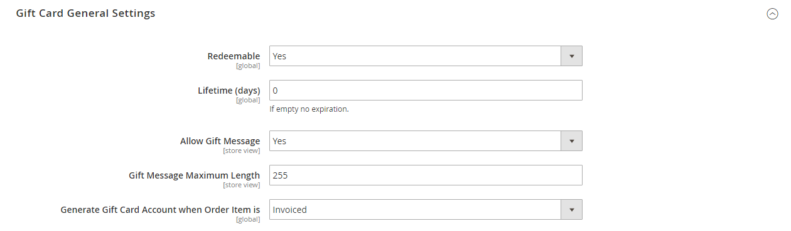

# [!UICONTROL Sales] > [!UICONTROL Gift Cards]

{{ee-feature}}

{{config}}

## [!UICONTROL Gift Card Email Settings]

<!-- zoom -->

<!-- [Gift Card Email Settings](https://experienceleague.adobe.com/en/docs/commerce-admin/stores-sales/point-of-purchase/gift-cards/product-gift-card-accounts#configure-gift-card-accounts) -->

| Feld | [Umfang](../../getting-started/websites-stores-views.md#scope-settings) | Beschreibung |
|--- |--- |--- |
| [!UICONTROL Gift Card Notification Email Sender] | Shop-Ansicht | Identifiziert den [Store-Kontakt](../../getting-started/store-details.md#store-email-addresses) der als Absender der E-Mail mit der Geschenkkarte angezeigt wird. Standardwert: `General Contact` |
| [!UICONTROL Gift Card Notification Email Template] | Shop-Ansicht | Bestimmt die [Vorlage](../../systems/email-templates.md), die für die E-Mail mit der Geschenkkarte verwendet wird. |

{style="table-layout:auto"}

## [!UICONTROL Gift Card General Settings]

<!-- zoom -->

<!-- [Gift Card General Settings](https://experienceleague.adobe.com/en/docs/commerce-admin/stores-sales/point-of-purchase/gift-cards/product-gift-card-accounts#configure-gift-card-accounts) -->

| Feld | [Umfang](../../getting-started/websites-stores-views.md#scope-settings) | Beschreibung |
|--- |--- |--- |
| [!UICONTROL Redeemable] | Global | Legt fest, ob der Besitzer der Geschenkkarte seinen Wert in bar einlösen kann. Optionen: `Yes` / `No`. |
| [!UICONTROL Lifetime (days)] | Global | Bestimmt die Anzahl der Tage, die die Karte gültig ist. Wenn Sie das Feld leer lassen, läuft die Karte nicht ab.   **_Wichtig:_**An einigen Stellen ist es illegal, auf Geschenkgutscheinen Ablaufdaten festzulegen. Überprüfen Sie Ihre lokalen Gesetze, bevor Sie eine Lebensdauer für Ihre Geschenkgutscheine festlegen. |
| [!UICONTROL Allow Gift Message] | Shop-Ansicht | Legt fest, ob Kunden, die eine Geschenkkarte erwerben, die Option zum Einschließen einer Geschenknachricht zur Verfügung steht. Optionen: `Yes` / `No`. |
| [!UICONTROL Gift Message Maximum Length] | Shop-Ansicht | Bestimmt die maximale Anzahl von Zeichen, die in einer Geschenkkartennachricht zulässig ist. Standardwert: 255 |
| [!UICONTROL Generate Gift Card Account when Order Item is] | Global | Bestimmt, ob ein Geschenkkartenkonto generiert wird, wenn ein Kunde eine Bestellung aufgibt oder wenn die Bestellung fakturiert wird. Optionen: `Ordered` / `Invoiced` |

{style="table-layout:auto"}

## [!UICONTROL Email Sent from Gift Card Account Management]

<!-- zoom -->

<!-- [Email Sent from Gift Card Account Management](https://experienceleague.adobe.com/en/docs/commerce-admin/stores-sales/point-of-purchase/gift-cards/product-gift-card-accounts#configure-gift-card-accounts) -->

| Feld | [Umfang](../../getting-started/websites-stores-views.md#scope-settings) | Beschreibung |
|--- |--- |--- |
| [!UICONTROL Gift Card Email Sender] | Shop-Ansicht | Identifiziert den [Store-Kontakt](../../getting-started/store-details.md#store-email-addresses) der als Absender der E-Mail mit der Geschenkkarte angezeigt wird. Standardwert: `General Contact` |
| [!UICONTROL Gift Card Template] | Shop-Ansicht | Bestimmt die [Vorlage](../../systems/email-templates.md), die für die E-Mail mit der Geschenkkarte verwendet wird. |

{style="table-layout:auto"}

## [!UICONTROL Gift Card Account General Settings]

<!-- zoom -->

<!-- [Gift Card Account General Settings](https://experienceleague.adobe.com/en/docs/commerce-admin/stores-sales/point-of-purchase/gift-cards/product-gift-card-accounts#configure-gift-card-accounts) -->

| Feld | [Umfang](../../getting-started/websites-stores-views.md#scope-settings) | Beschreibung |
|--- |--- |--- |
| [!UICONTROL Code Length] | Global | Bestimmt die Länge des Geschenkkartencodes. |
| [!UICONTROL Code Format] | Global | Bestimmt das Format des Geschenkkartencodes. Optionen: `Alphanumeric` / `Numeric` |
| [!UICONTROL Code Prefix] | Global | Definiert jedes Präfix, das am Anfang des Codes hinzugefügt wird. |
| [!UICONTROL Code Suffix] | Global | Definiert jedes Suffix, das am Ende des Codes hinzugefügt wird. |
| [!UICONTROL Dash Every X Characters] | Global | Wenn Sie Bindestriche in den Code aufnehmen möchten, bestimmt die Anzahl der Zeichen zwischen den einzelnen Bindestrichen. |
| [!UICONTROL New Pool Size] | Global | Bestimmt die Größe des neuen zu generierenden Code-Pools. |
| [!UICONTROL Low Code Pool Threshold] | Global | Bestimmt die Anzahl der Datensätze im Code-Pool, in denen ein Warnhinweis enthalten ist, dass der Trigger aufgefüllt werden muss. |
| [!UICONTROL Generate] | Global | Klicken, um die Liste der Geschenkkartencodes zu generieren. |

{style="table-layout:auto"}
