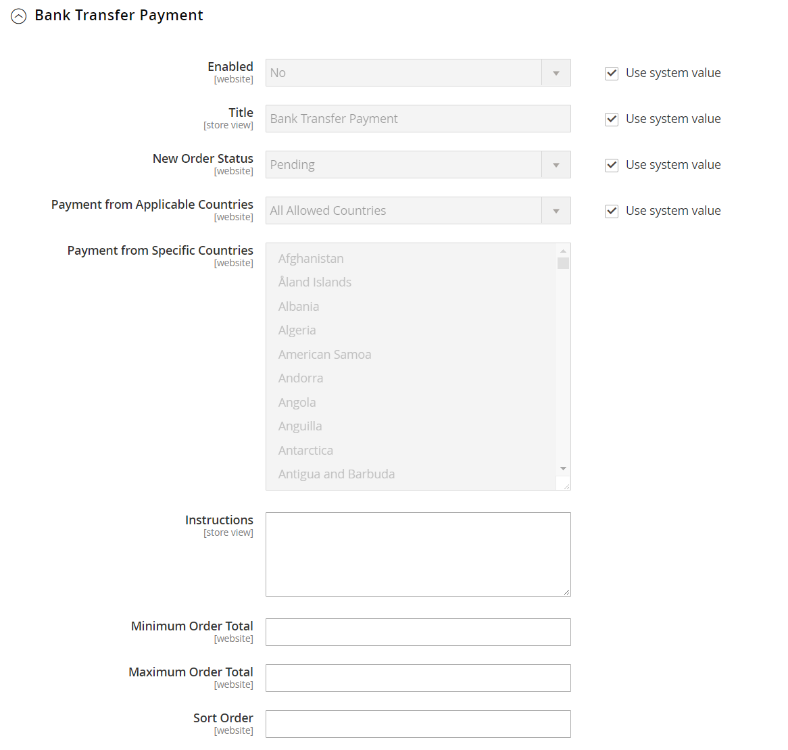

# [!UICONTROL Sales] > [!UICONTROL Payment Methods]

>[!TIP]
>
>Payment Services für Adobe Commerce und Magento Open Source bietet eine schlüsselfertige Self-Service-Lösung, einschließlich Sandbox-Tests und einer einfachen Einrichtung, für eine robuste und sichere Zahlungsabwicklung. Weitere Informationen zu diesem leistungsstarken Tool-Set und dazu, wie es Ihnen die insight und die Kontrolle gibt, die Sie benötigen, um das beste Erlebnis für Ihre Käufer zu schaffen, finden Sie im [_Benutzerhandbuch für Zahlungsdienste_](https://experienceleague.adobe.com/docs/commerce/payment-services/guide-overview.html).

{{config}}

## [!UICONTROL Merchant Location]

[!BADGE Nur PaaS]{type=Informative url="https://experienceleague.adobe.com/en/docs/commerce/user-guides/product-solutions" tooltip="Gilt nur für Adobe Commerce in Cloud-Projekten (von Adobe verwaltete PaaS-Infrastruktur) und lokale Projekte."}

<!-- zoom -->

<!-- [Merchant Location](https://experienceleague.adobe.com/en/docs/commerce-admin/start/setup/store-details#merchant-location) -->

| Feld | [Umfang](../../getting-started/websites-stores-views.md#scope-settings) | Beschreibung |
|--- |--- |--- |
| [!UICONTROL Merchant Country] | Website | Gibt das Land an, in dem der Händler registriert ist, um Geschäfte zu tätigen. |

{style="table-layout:auto"}

## Empfohlene Lösungen

Die folgenden Zahlungslösungen werden als einfache Möglichkeit für Händler empfohlen, die gerade erst anfangen, Online-Zahlungen per PayPal-Konto oder Kreditkarte zu akzeptieren. Wenn Ihr Unternehmen wächst, können Sie diese mit zusätzlichen PayPal-Zahlungslösungen kombinieren.

- [Zahlungsdienste](payment-services.md)
- [!BADGE Nur PaaS]{type=Informative url="https://experienceleague.adobe.com/en/docs/commerce/user-guides/product-solutions" tooltip="Gilt nur für Adobe Commerce in Cloud-Projekten (von Adobe verwaltete PaaS-Infrastruktur) und lokale Projekte."} [PayPal Express-Checkout](paypal-express-checkout.md)
- [!BADGE Nur PaaS]{type=Informative url="https://experienceleague.adobe.com/en/docs/commerce/user-guides/product-solutions" tooltip="Gilt nur für Adobe Commerce in Cloud-Projekten (von Adobe verwaltete PaaS-Infrastruktur) und lokale Projekte."} [Braintree](braintree.md)

>[!NOTE]
>
>Einige Zahlungsintegrationen und gebündelte Erweiterungen wurden in den Versionen 2.4.x entfernt und nach Commerce Marketplace verschoben. Die neuesten offiziellen Zahlungsintegrationserweiterungen finden Sie in [Commerce Marketplace](https://marketplace.magento.com/extensions/payments-security.html){:target="_blank"}.
> 
>**Amazon Pay** und **Klarna**: Adobe Commerce und Magento Open Source veröffentlichen die Versionen 2.4.0 bis 2.4.3 und beinhalten diese vom Anbieter entwickelten Erweiterungen. Ab Version 2.4.4 sind diese Erweiterungen nicht mehr mit der Hauptversion gebündelt und müssen von der Commerce Marketplace installiert und aktualisiert werden. Der Marketplace bietet außerdem Zugriff auf die aktuelle Dokumentation, die vom Erweiterungsentwickler bereitgestellt wird.
> 
>Wenn Sie eine dieser gebündelten Erweiterungen aktiviert und konfiguriert haben, müssen Sie Ihre `composer.json` im Rahmen des Upgrade-Prozesses auf 2.4.4 aktualisieren, um zukünftige Erweiterungs-Updates zu verwalten. Siehe [Upgrade-Module](https://experienceleague.adobe.com/docs/commerce-operations/upgrade-guide/modules/upgrade.html) im _Upgrade-Handbuch_ für weitere Informationen. 
> 
>**Worldpay**, **Eway**, **CyberSource** und **Authorize.Net**: Einzelheiten zum sicheren Übergang von diesen Zahlungsintegrationen finden Sie im [DevBlog](https://community.magento.com/t5/Magento-DevBlog/Deprecation-of-Magento-core-payment-integrations/ba-p/426445){:target="_blank"}.

## Andere PayPal-Methoden

[!BADGE Nur PaaS]{type=Informative url="https://experienceleague.adobe.com/en/docs/commerce/user-guides/product-solutions" tooltip="Gilt nur für Adobe Commerce in Cloud-Projekten (von Adobe verwaltete PaaS-Infrastruktur) und lokale Projekte."}

PayPal bietet verschiedene Zahlungslösungen an, die den Bedürfnissen von Unternehmen jeder Größe entsprechen und die auf der ganzen Welt tätig sind. PayPal bietet Ihnen die Möglichkeit, Zahlungen von allen gängigen Debit- und Kreditkarten zu akzeptieren. PayPal bietet zusätzlichen Komfort ohne zusätzlichen Aufwand, da auch Kunden, die kein PayPal-Konto haben, mit PayPal für ihre Einkäufe bezahlen können.

### PayPal-All-in-One-Methoden

[!BADGE Nur PaaS]{type=Informative url="https://experienceleague.adobe.com/en/docs/commerce/user-guides/product-solutions" tooltip="Gilt nur für Adobe Commerce in Cloud-Projekten (von Adobe verwaltete PaaS-Infrastruktur) und lokale Projekte."}

- [PayPal-Zahlung - Erweitert](paypal-payments-advanced.md)
- [PayPal Payments Pro](paypal-payments-pro.md)
- [PayPal-Zahlungsstandard](paypal-payments-standard.md)

### PayPal-Zahlungs-Gateways

[!BADGE Nur PaaS]{type=Informative url="https://experienceleague.adobe.com/en/docs/commerce/user-guides/product-solutions" tooltip="Gilt nur für Adobe Commerce in Cloud-Projekten (von Adobe verwaltete PaaS-Infrastruktur) und lokale Projekte."}

- [PayPal Payflow Pro](paypal-payflow-pro.md) (einschließlich Express-Checkout)
- [PayPal-Payflow-Link](paypal-payflow-link.md) (einschließlich Express-Checkout)

## Grundlegende Zahlungsmethoden

Die folgenden Zahlungsmethoden sind in Commerce integriert und verwenden keinen externen Zahlungsdienstleister zur Verarbeitung der Transaktion. Viele der grundlegenden Zahlungsmethoden wurden offline statt online verwaltet.

### [!UICONTROL Check / Money Order]

<!-- zoom -->

<!-- [Check / Money Order](https://experienceleague.adobe.com/en/docs/commerce-admin/stores-sales/payments/offline/check-money-order) -->

| Feld | [Umfang](../../getting-started/websites-stores-views.md#scope-settings) | Beschreibung |
|--- |--- |--- |
| [!UICONTROL Enabled] | Website | Legt fest, ob Kunden per Scheck oder Zahlungsanweisung zahlen können. Optionen: `Yes` / `No` |
| [!UICONTROL Title] | Shop-Ansicht | Der Name für diese Zahlungsmethode, der Kunden während des Checkouts angezeigt wird. |
| [!UICONTROL New Order Status] | Website | Bestimmt den ursprünglichen [Bestellstatus](../../stores-purchase/order-status.md) der Bestellungen, die per Scheck oder Zahlungsanweisung bezahlt wurden. Standardwert: `Pending` |
| [!UICONTROL Payment from Applicable Countries] | Website | Bestimmt die Länder, aus denen Sie die Zahlung per Scheck oder Zahlungsanweisung akzeptieren. Optionen: `All Allowed Countries` / `Specific Countries` |
| [!UICONTROL Payment from Specific Countries] | Website | Gibt die Länder an, aus denen Sie die Zahlung per Scheck oder per Zahlungsanweisung akzeptieren. |
| [!UICONTROL Make Check Payable to] | Shop-Ansicht | Name der Stelle, an die Schecks und Zahlungsanweisungen zu zahlen sind. |
| [!UICONTROL Send Check to] | Shop-Ansicht | Die Straße oder das Postfach, an die Schecks und Zahlungsanweisungen gesendet werden sollen. |
| [!UICONTROL Minimum Order Total] | Website | Der kleinste Bestellbetrag, der per Scheck oder Zahlungsanweisung bezahlt werden kann. |
| [!UICONTROL Maximum Order Total] | Website | Der größte Bestellbetrag, der per Scheck oder Zahlungsanweisung bezahlt werden kann.   **_Hinweis:_**&#x200B;Eine Bestellung ist qualifiziert, wenn die Gesamtsumme zwischen der Mindest- oder Höchstauftragssumme liegt oder mit dieser übereinstimmt. |
| [!UICONTROL Sort Order] | Website | Eine Nummer, die die Bestellung bestimmt, dass die Zahlung per Scheck oder Zahlungsanweisung angezeigt wird, wenn sie mit anderen Zahlungsmethoden beim Checkout aufgelistet wird. Geben Sie `0` ein, um sie an den Anfang der Liste zu setzen. |

{style="table-layout:auto"}

### [!UICONTROL Bank Transfer Payment]

<!-- zoom -->

<!-- [Bank Transfer Payment](https://experienceleague.adobe.com/en/docs/commerce-admin/stores-sales/payments/offline/bank-transfer) -->

| Feld | [Umfang](../../getting-started/websites-stores-views.md#scope-settings) | Beschreibung |
|--- |--- |--- |
| [!UICONTROL Enabled] | Website | Legt fest, ob Kunden bezahlen können, indem sie die Zahlung direkt von ihrer Bank auf Ihr Händlerkonto überweisen. Optionen: `Yes` / `No` |
| [!UICONTROL Title] | Shop-Ansicht | Der Name für diese Zahlungsmethode, der Kunden während des Checkouts angezeigt wird. |
| [!UICONTROL New Order Status] | Website | Bestimmt den ursprünglichen Bestellstatus, der Bestellungen zugewiesen wurde, die per Banküberweisung bezahlt wurden. Standardwert: `Pending` |
| [!UICONTROL Payment from Applicable Countries] | Website | Bestimmt die Länder, von denen Sie die Zahlung per Banküberweisung akzeptieren. Optionen: `All Allowed Countries` / `Specific Countries` |
| [!UICONTROL Payment from Specific Countries] | Website | Gibt die Länder an, aus denen Sie die Zahlung per Banküberweisung akzeptieren. |
| [!UICONTROL Minimum Order Total] | Website | Der kleinste Bestellbetrag, der per Banküberweisung bezahlt werden kann. |
| [!UICONTROL Maximum Order Total] | Website | Der größte Bestellbetrag, der per Banküberweisung bezahlt werden kann.   **_Hinweis:_**&#x200B;Eine Bestellung ist qualifiziert, wenn die Gesamtsumme zwischen der Mindest- oder Höchstauftragssumme liegt oder mit dieser übereinstimmt. |
| [!UICONTROL Sort Order] | Website | Eine Zahl, die die Reihenfolge bestimmt, in der die Zahlung per Banküberweisung angezeigt wird, wenn sie beim Checkout mit anderen Zahlungsmethoden aufgelistet wird. Geben Sie `0` ein, um sie an den Anfang der Liste zu setzen. |

{style="table-layout:auto"}

### [!UICONTROL Payment on Account]

{{b2b-feature}}

<!-- zoom -->

<!-- [Payment on Account](https://experienceleague.adobe.com/en/docs/commerce-admin/b2b/enable-basic-features#configure-payment-on-account) -->

| Feld | [Umfang](../../getting-started/websites-stores-views.md#scope-settings) | Beschreibung |
|--- |--- |--- |
| [!UICONTROL Enabled] | Website | Legt fest, ob Unternehmen Firmenkredite für Käufe verwenden können. Optionen: `Yes` / `No` |
| [!UICONTROL Title] | Shop-Ansicht | Der Name für diese Zahlungsmethode, der Kunden während des Checkouts angezeigt wird. |
| [!UICONTROL New Order Status] | Website | Bestimmt den Status von neuen Aufträgen, die einem Firmenkonto belastet werden. Optionen: `Pending (default)` / `Processing` / `Suspected Fraud` |
| [!UICONTROL Payment from Applicable Countries] | Website | Legt die Länder fest, in denen Unternehmen Einkäufe mit ihren Konten verrechnen dürfen. Optionen: `All Allowed Countries` / `Specific Countries` |
| [!UICONTROL Payment from Specific Countries] | Website | Gibt die spezifischen Länder an, in denen Unternehmen Käufe mit ihren Konten verbuchen können. |
| [!UICONTROL Minimum Order Total] | Website | Gibt den kleinsten Bestellbetrag an, der einem Firmenkonto belastet werden kann. |
| [!UICONTROL Maximum Order Total] | Website | Der größte Auftragsbetrag, der einem Firmenkonto belastet werden kann.   **_Hinweis:_**&#x200B;Eine Bestellung ist qualifiziert, wenn die Gesamtsumme zwischen der Mindest- oder Höchstauftragssumme liegt oder mit dieser übereinstimmt. |
| [!UICONTROL Sort Order] | Website | Eine Zahl, die die Reihenfolge bestimmt, in der die Zahlung auf Konto angezeigt wird, wenn sie beim Checkout mit anderen Zahlungsmethoden aufgelistet wird. Geben Sie `0` ein, um sie an den Anfang der Liste zu setzen. |

{style="table-layout:auto"}

>[!NOTE]
>
>Die Zahlung auf Konto wird bei Bestellungen mit [mehreren Versandadressen](../../stores-purchase/shipping-settings.md#multiple-addresses) nicht unterstützt und wird nicht unter den Zahlungsoptionen angezeigt.

### [!UICONTROL Cash On Delivery Payment]

<!-- zoom -->

<!-- [Cash On Delivery Payment](../../stores-purchase/cash-on-delivery.html) -->

| Feld | [Umfang](../../getting-started/websites-stores-views.md#scope-settings) | Beschreibung |
|--- |--- |--- |
| [!UICONTROL Enabled] | Website | Legt fest, ob Kunden bezahlen können, indem sie die Zahlung direkt von ihrer Bank auf Ihr Händlerkonto überweisen. Optionen: `Yes` / `No` |
| [!UICONTROL Title] | Shop-Ansicht | Der Name für diese Zahlungsmethode, der Kunden während des Checkouts angezeigt wird. |
| [!UICONTROL New Order Status] | Website | Bestimmt den ursprünglichen Bestellstatus, der Bestellungen zugewiesen wurde, die per Banküberweisung bezahlt wurden. Standardwert: `Pending` |
| [!UICONTROL Payment from Applicable Countries] | Website | Bestimmt die Länder, von denen Sie die Zahlung per Banküberweisung akzeptieren. Optionen: `All Allowed Countries` / `Specific Countries` |
| [!UICONTROL Payment from Specific Countries] | Website | Gibt die Länder an, aus denen Sie die Zahlung per Banküberweisung akzeptieren. |
| [!UICONTROL Minimum Order Total] | Website | Gibt den kleinsten Bestellbetrag an, der per Banküberweisung bezahlt werden kann. |
| [!UICONTROL Maximum Order Total] | Website | Der größte Bestellbetrag, der per Banküberweisung bezahlt werden kann.   **_Hinweis:_**&#x200B;Eine Bestellung ist qualifiziert, wenn die Gesamtsumme zwischen der Mindest- oder Höchstauftragssumme liegt oder mit dieser übereinstimmt. |
| [!UICONTROL Sort Order] | Website | Eine Zahl, die die Reihenfolge bestimmt, in der die Zahlung per Banküberweisung angezeigt wird, wenn sie beim Checkout mit anderen Zahlungsmethoden aufgelistet wird. Geben Sie `0` ein, um sie an den Anfang der Liste zu setzen. |

{style="table-layout:auto"}

### [!UICONTROL Zero Subtotal Checkout]

<!-- zoom -->

<!-- [Zero Subtotal Checkout](../../stores-purchase/zero-subtotal-checkout.html) -->

| Feld | [Umfang](../../getting-started/websites-stores-views.md#scope-settings) | Beschreibung |
|--- |--- |--- |
| [!UICONTROL Title] | Shop-Ansicht | Der Name, der während des Checkouts für diese Zahlungsmethode verwendet wird. Standardwert: Keine Zahlungsinformationen erforderlich |
| [!UICONTROL Enabled] | Website | Legt fest, ob der Store-Administrator einen Null-Zwischensummen-Checkout für die Verwaltung von Bestellungen mit einer Zwischensumme von null haben kann, z. B. eine Bestellung, die besteuert wurde, aber ein Rabatt hat den Betrag auf null reduziert. Optionen: `Yes` / `No` |
| [!UICONTROL New Order Status] | Website | Bestimmt den ursprünglichen Bestellstatus, der Bestellungen zugewiesen wurde, die als Zwischensumme Null Checkout verarbeitet wurden. Standardwert: `Pending` |
| [!UICONTROL Payment from Applicable Countries] | Website | Bestimmt die Länder, aus denen der Null-Zwischensumme-Checkout angewendet werden kann. Optionen: `All Allowed Countries` / `Specific Countries` |
| [!UICONTROL Payment from Specific Countries] | Website | Gibt die spezifischen Länder an, für die ein Null-Zwischensumme-Checkout angewendet werden kann. |
| [!UICONTROL Sort Order] | Website | Eine Zahl, die die Reihenfolge bestimmt, in der der Titel angezeigt wird, z. B. „Keine Zahlungsinformationen erforderlich“, wird angezeigt, wenn sie während des Checkouts mit anderen Zahlungsmethoden aufgelistet wird. Geben Sie `0` ein, um sie an den Anfang der Liste zu setzen. |

{style="table-layout:auto"}

## [!UICONTROL Payment actions]

[!BADGE Nur PaaS]{type=Informative url="https://experienceleague.adobe.com/en/docs/commerce/user-guides/product-solutions" tooltip="Gilt nur für Adobe Commerce in Cloud-Projekten (von Adobe verwaltete PaaS-Infrastruktur) und lokale Projekte."}

Zahlungsaktionen werden (_Zahlungsmethode)_. Die Zahlungsaktion bestimmt, wann die Mittel erfasst werden und wann Rechnungen für Ihre Aufträge erstellt werden.

Eine umfassende Liste der individuellen Konfigurationsoptionen finden Sie im Abschnitt Grundeinstellungen jedes einzelnen Artikels zur Zahlungsmethode .

| Zahlungsaktion | Beschreibung |
|--- |---|
| [!UICONTROL Authorization] | Genehmigt den Kauf, setzt jedoch die Mittel zurück. Der Betrag wird erst abgehoben, wenn er vom Händler eingezogen wurde. |
| [!UICONTROL Authorize] | Autorisiert das Konto des Käufers für die Bestellsumme, erfasst jedoch nicht die Zahlung. Zahlung durch Erstellen einer Rechnung erfassen. Autorisierte Bestellungen können annulliert oder storniert werden. |
| [!UICONTROL Authorize and Capture] | Autorisiert das Konto des Käufers für die Bestellsumme und erfasst die Zahlung. Eine Rechnung wird automatisch erstellt. Sie können eingezogene Beträge per Gutschrift zurückerstatten. Sie können eine Bestellung nicht mehr stornieren, nachdem die Zahlung erfasst wurde. |
| [!UICONTROL Charge on shipment] | Amazon erhält eine Erfassungsanfrage und belastet den Kunden, wenn in Commerce eine Rechnung erstellt wird. |
| [!UICONTROL Charge on order] | Amazon erstellt die Rechnung und belastet den Kunden bei der Bestellung. |
| [!UICONTROL Not Capture] | Wenn die Rechnung übermittelt wird, erfasst das System die Zahlung nicht. Es wird davon ausgegangen, dass Sie die Zahlung später über Commerce erfassen. Die fertige Rechnung enthält eine Schaltfläche „Erfassen“. Vor der Erfassung können Sie die Rechnung stornieren. Nach der Erfassung können Sie eine Gutschrift erstellen und die Rechnung stornieren. |
| [!UICONTROL Order] | Stellt eine Vereinbarung mit PayPal dar, die es dem Händler ermöglicht, einen oder mehrere Beträge bis zur Bestellsumme vom Käuferkonto des Kunden innerhalb eines bestimmten Zeitraums (bis zu 29 Tage) zu erfassen. |
| [!UICONTROL Sale] | Der Kaufbetrag wird autorisiert und sofort vom Konto des Kunden zurückgezogen. |

{style="table-layout:auto"}

>[!NOTE]
>
>Wählen Sie die Option _[!UICONTROL Not Capture]_&#x200B;nur aus, wenn Sie sicher sind, dass Sie die Zahlung später über Commerce erfassen werden. Sie können erst dann eine Gutschrift erstellen, wenn die Zahlung mit der Schaltfläche „Erfassen“ erfasst wurde.

## [!UICONTROL Purchase Order]

<!-- zoom -->

<!-- [Purchase Order](../../stores-purchase/purchase-order.html) -->

| Feld | [Umfang](../../getting-started/websites-stores-views.md#scope-settings) | Beschreibung |
|--- |--- |--- |
| [!UICONTROL Enabled] | Website | Legt fest, ob Kunden per Bestellung (PO) bezahlen können. Optionen: `Yes` / `No` |
| [!UICONTROL Title] | Shop-Ansicht | Der Name dieser Zahlungsmethode, die Kunden während des Checkouts angezeigt wird. |
| [!UICONTROL New Order Status] | Website | Bestimmt den anfänglichen [Auftragsstatus](../../stores-purchase/order-status.md) der Bestellungen zugewiesen wurde, die von der Bestellung bezahlt wurden. Standardwert: Ausstehend |
| [!UICONTROL Payment from Applicable Countries] | Website | Bestimmt die Länder, aus denen Sie die Zahlung per Bestellung akzeptieren. Optionen: `All Allowed Countries` / `Specific Countries` |
| [!UICONTROL Payment from Specific Countries] | Website | Gibt die Länder an, aus denen Sie die Zahlung per Bestellung akzeptieren. |
| [!UICONTROL Minimum Order Total] | Website | Der kleinste Bestellbetrag, der von der Bestellung bezahlt werden kann. |
| [!UICONTROL Maximum Order Total] | Website | Der größte Auftragsbetrag, der von der Bestellung bezahlt werden kann.   **_Hinweis:_**&#x200B;Eine Bestellung ist qualifiziert, wenn die Gesamtsumme zwischen der Mindest- oder Höchstauftragssumme liegt oder mit dieser übereinstimmt. |
| [!UICONTROL Sort Order] | Website | Eine Zahl, die die Reihenfolge bestimmt, in der die Zahlung per Bestellung angezeigt wird, wenn sie mit anderen Zahlungsmethoden beim Checkout aufgelistet wird. Geben Sie `0` ein, um sie an den Anfang der Liste zu setzen. |

{style="table-layout:auto"}
