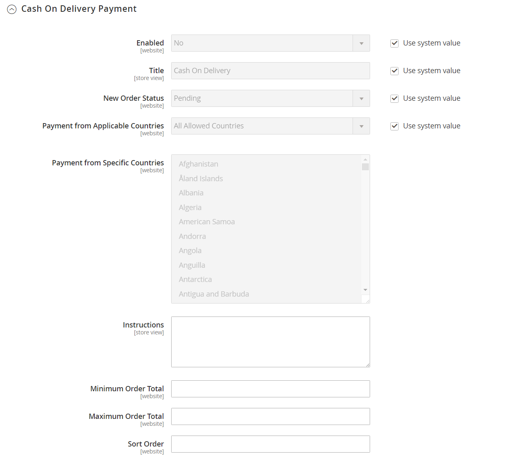

# [!UICONTROL Sales] > [!UICONTROL Payment Methods]

>[!TIP]
>
>Zahlungsdienste für Adobe Commerce und Magento Open Source bieten eine schlüsselfertige Self-Service-Lösung, einschließlich Sandbox-Tests und einer einfachen Einrichtung, die eine robuste und sichere Zahlungsverarbeitung ermöglicht. Weitere Informationen zu diesem leistungsstarken Tool-Set und dazu, wie Sie damit Einblicke und Kontrolle erhalten, die Sie benötigen, um das beste Erlebnis für Ihre Käufer zu erstellen, finden Sie im [_Benutzerhandbuch für Zahlungsdienste_](https://experienceleague.adobe.com/docs/commerce-merchant-services/payment-services/guide-overview.html).

{{config}}

## [!UICONTROL Merchant Location]

<!-- zoom -->

<!-- [Merchant Location](https://docs.magento.com/user-guide/payment/merchant-location.html) -->

| Feld | [Umfang](../../getting-started/websites-stores-views.md#scope-settings) | Beschreibung |
|--- |--- |--- |
| [!UICONTROL Merchant Country] | Webseite | Gibt das Land an, in dem der Händler zur Geschäftsausführung registriert ist. |

{style="table-layout:auto"}

## Empfohlene Lösungen

Die folgenden Zahlungslösungen sind als einfache Möglichkeit für Händler empfohlen, die gerade erst beginnen, Online-Bezahlung per PayPal-Konto oder Kreditkarte zu akzeptieren. Je mehr Ihr Unternehmen wächst, desto mehr können Sie diese mit zusätzlichen PayPal Zahlungslösungen kombinieren.

- [PayPal Express Checkout](paypal-express-checkout.md)
- [Braintree](braintree.md)
- [Zahlungsdienste](payment-services.md)

>[!NOTE]
>
>Einige Zahlungsintegrationen und gebündelte Erweiterungen wurden in Version 2.4.x entfernt und auf Commerce Marketplace verschoben. Sie finden die neuesten offiziellen Zahlungsintegrationserweiterungen in [Commerce Marketplace](https://marketplace.magento.com/extensions/payments-security.html){:target=&quot;_blank&quot;}.
> 
>**Amazon Pay** und **Klarna**: Adobe Commerce- und Magento Open Source-Versionen 2.4.0 bis 2.4.3 umfassten diese vom Anbieter entwickelten Erweiterungen. Ab Version 2.4.4 sind diese Erweiterungen nicht mehr im Paket mit der Kernversion enthalten und müssen über die Commerce Marketplace installiert und aktualisiert werden. Der Marketplace bietet außerdem Zugriff auf die aktuelle Dokumentation, die vom Erweiterungsentwickler bereitgestellt wird.
> 
>Wenn Sie eine dieser gebündelten Erweiterungen aktiviert und konfiguriert haben, müssen Sie Ihre `composer.json` -Datei im Rahmen des Aktualisierungsprozesses für 2.4.4 aktualisieren und die künftigen Erweiterungs-Updates verwalten. Weitere Informationen finden Sie unter [Aktualisierungsmodule](https://experienceleague.adobe.com/docs/commerce-operations/upgrade-guide/modules/upgrade.html) im _Aktualisierungshandbuch_. 
> 
>**Worldpay**, **Eway**, **CyberSource** und **Authorize.Net**: Weitere Informationen zum Herstellen einer sicheren Transition aus diesen Zahlungsintegrationen finden Sie im [DevBlog](https://community.magento.com/t5/Magento-DevBlog/Deprecation-of-Magento-core-payment-integrations/ba-p/426445){:target=&quot;_blank&quot;}.

## Andere PayPal-Methoden

PayPal bietet verschiedene Zahlungslösungen an, die den Bedürfnissen von Unternehmen jeder Größe gerecht werden und weltweit in der Wirtschaft tätig sind. PayPal bietet Ihnen die Möglichkeit, Zahlungen von allen wichtigen Debit- und Kreditkarten zu akzeptieren. PayPal bietet zusätzlichen Komfort ohne zusätzlichen Aufwand, da auch Kunden, die kein PayPal-Konto haben, für ihre Käufe mit PayPal bezahlen können.

### PayPal-All-in-One-Methoden

- [PayPal Payment Advanced](paypal-payments-advanced.md)
- [PayPal Payments Pro](paypal-payments-pro.md)
- [PayPal Payments Standard](paypal-payments-standard.md)

### PayPal-ZahlungsGateways

- [PayPal Payflow Pro](paypal-payflow-pro.md) (einschließlich Express-Checkout)
- [PayPal Payflow Link](paypal-payflow-link.md) (einschließlich Express-Checkout)

## Grundlegende Zahlungsmethoden

Die folgenden Zahlungsmethoden sind in Commerce integriert und verwenden keinen Zahlungsdienstleister eines Drittanbieters zur Verarbeitung der Transaktion. Viele der grundlegenden Zahlungsmethoden werden offline und nicht online verwaltet.

### [!UICONTROL Check / Money Order]

<!-- zoom -->

<!-- [Check / Money Order](https://docs.magento.com/user-guide/payment/check-money-order.html) -->

| Feld | [Umfang](../../getting-started/websites-stores-views.md#scope-settings) | Beschreibung |
|--- |--- |--- |
| [!UICONTROL Enabled] | Webseite | Bestimmt, ob Kunden per Scheck oder Geldbestellung zahlen können. Optionen: `Yes` / `No` |
| [!UICONTROL Title] | Store-Ansicht | Der Name für diese Zahlungsmethode, der Kunden beim Checkout angezeigt wird. |
| [!UICONTROL New Order Status] | Webseite | Bestimmt den anfänglichen [Bestellstatus](../../stores-purchase/order-status.md), der Bestellungen zugewiesen wird, die durch eine Scheck- oder Geldbestellung bestellt wurden. Standardwert: `Pending` |
| [!UICONTROL Payment from Applicable Countries] | Webseite | Bestimmt die Länder, aus denen Sie die Zahlung per Scheck oder Geldbestellung annehmen. Optionen: `All Allowed Countries` / `Specific Countries` |
| [!UICONTROL Payment from Specific Countries] | Webseite | Identifiziert die Länder, aus denen Sie die Zahlung per Scheck oder Überweisung annehmen. |
| [!UICONTROL Make Check Payable to] | Store-Ansicht | Name des Unternehmens, an das Schecks und Geldaufträge zu zahlen sind. |
| [!UICONTROL Send Check to] | Store-Ansicht | Die Straße oder das Postfach, an das Schecks und Geldbestellungen gesendet werden sollen. |
| [!UICONTROL Minimum Order Total] | Webseite | Der kleinste Bestellbetrag, der per Scheck oder Geldbestellung bezahlt werden kann. |
| [!UICONTROL Maximum Order Total] | Webseite | Der größte Bestellbetrag, der per Scheck oder Geldbestellung bezahlt werden kann.   **_Hinweis:_**Eine Bestellung qualifiziert sich, wenn die Gesamtsumme zwischen der minimalen oder der maximalen Bestellsumme liegt oder damit übereinstimmt. |
| [!UICONTROL Sort Order] | Webseite | Eine Zahl, die die Bestellung bestimmt, in der die Zahlung per Scheck oder Geldauftrag erscheint, wenn sie beim Checkout mit anderen Zahlungsmethoden aufgeführt wird. Geben Sie `0` ein, um es oben in der Liste zu platzieren. |

{style="table-layout:auto"}

### [!UICONTROL Bank Transfer Payment]

<!-- zoom -->

<!-- [Bank Transfer Payment](https://docs.magento.com/user-guide/payment/bank-transfer.html) -->

| Feld | [Umfang](../../getting-started/websites-stores-views.md#scope-settings) | Beschreibung |
|--- |--- |--- |
| [!UICONTROL Enabled] | Webseite | Stellt fest, ob Kunden zahlen können, indem sie Zahlungen direkt von ihrer Bank auf Ihr Händlerkonto übertragen. Optionen: `Yes` / `No` |
| [!UICONTROL Title] | Store-Ansicht | Der Name für diese Zahlungsmethode, der Kunden beim Checkout angezeigt wird. |
| [!UICONTROL New Order Status] | Webseite | Bestimmt den anfänglichen Bestellstatus, der Bestellungen zugewiesen wird, die per Banküberweisung bestellt wurden. Standardwert: `Pending` |
| [!UICONTROL Payment from Applicable Countries] | Webseite | Bestimmt die Länder, aus denen Sie die Zahlung per Banküberweisung annehmen. Optionen: `All Allowed Countries` / `Specific Countries` |
| [!UICONTROL Payment from Specific Countries] | Webseite | Identifiziert die Länder, aus denen Sie die Zahlung per Banküberweisung annehmen. |
| [!UICONTROL Minimum Order Total] | Webseite | Der kleinste Bestellbetrag, der per Banküberweisung bezahlt werden kann. |
| [!UICONTROL Maximum Order Total] | Webseite | Der größte Bestellbetrag, der per Banküberweisung bezahlt werden kann.   **_Hinweis:_**Eine Bestellung qualifiziert sich, wenn die Gesamtsumme zwischen der minimalen oder der maximalen Bestellsumme liegt oder damit übereinstimmt. |
| [!UICONTROL Sort Order] | Webseite | Eine Zahl, die bestimmt, in welcher Reihenfolge die Zahlung per Banküberweisung erscheint, wenn sie beim Checkout mit anderen Zahlungsmethoden aufgeführt wird. Geben Sie `0` ein, um es oben in der Liste zu platzieren. |

{style="table-layout:auto"}

### [!UICONTROL Payment on Account]

{{b2b-feature}}

<!-- zoom -->

<!-- [Payment on Account](https://docs.magento.com/user-guide/payment/payment-on-account.html) -->

| Feld | [Umfang](../../getting-started/websites-stores-views.md#scope-settings) | Beschreibung |
|--- |--- |--- |
| [!UICONTROL Enabled] | Webseite | Bestimmt, ob Unternehmen Firmenkredite für Käufe verwenden können. Optionen: `Yes` / `No` |
| [!UICONTROL Title] | Store-Ansicht | Der Name für diese Zahlungsmethode, der Kunden beim Checkout angezeigt wird. |
| [!UICONTROL New Order Status] | Webseite | Bestimmt den Status neuer Bestellungen, die einem Unternehmenskonto in Rechnung gestellt werden. Optionen: `Pending (default)` / `Processing` / `Suspected Fraud` |
| [!UICONTROL Payment from Applicable Countries] | Webseite | Bestimmt die Länder, in denen Unternehmen Käufe auf ihre Konten berechnen können. Optionen: `All Allowed Countries` / `Specific Countries` |
| [!UICONTROL Payment from Specific Countries] | Webseite | Gibt an, in welchen Ländern Unternehmen Einkäufe auf ihren Konten tätigen können. |
| [!UICONTROL Minimum Order Total] | Webseite | Gibt den kleinsten Bestellbetrag an, der einem Unternehmenskonto berechnet werden kann. |
| [!UICONTROL Maximum Order Total] | Webseite | Der größte Bestellbetrag, der einem Unternehmenskonto in Rechnung gestellt werden kann.   **_Hinweis:_**Eine Bestellung qualifiziert sich, wenn die Gesamtsumme zwischen der minimalen oder der maximalen Bestellsumme liegt oder damit übereinstimmt. |
| [!UICONTROL Sort Order] | Webseite | Eine Zahl, die bestimmt, in welcher Reihenfolge die Zahlung auf Konto erscheint, wenn sie beim Checkout mit anderen Zahlungsmethoden aufgeführt wird. Geben Sie `0` ein, um es oben in der Liste zu platzieren. |

{style="table-layout:auto"}

>[!NOTE]
>
>Die Zahlung auf Konto wird bei Bestellungen mit [mehreren Versandadressen](../../stores-purchase/shipping-settings.md#multiple-addresses) nicht unterstützt und erscheint nicht unter den Zahlungsoptionen.

### [!UICONTROL Cash On Delivery Payment]

<!-- zoom -->

<!-- [Cash On Delivery Payment](../../stores-purchase/cash-on-delivery.html) -->

| Feld | [Umfang](../../getting-started/websites-stores-views.md#scope-settings) | Beschreibung |
|--- |--- |--- |
| [!UICONTROL Enabled] | Webseite | Stellt fest, ob Kunden zahlen können, indem sie Zahlungen direkt von ihrer Bank auf Ihr Händlerkonto übertragen. Optionen: `Yes` / `No` |
| [!UICONTROL Title] | Store-Ansicht | Der Name für diese Zahlungsmethode, der Kunden beim Checkout angezeigt wird. |
| [!UICONTROL New Order Status] | Webseite | Bestimmt den anfänglichen Bestellstatus, der Bestellungen zugewiesen wird, die per Banküberweisung bestellt wurden. Standardwert: `Pending` |
| [!UICONTROL Payment from Applicable Countries] | Webseite | Bestimmt die Länder, aus denen Sie die Zahlung per Banküberweisung annehmen. Optionen: `All Allowed Countries` / `Specific Countries` |
| [!UICONTROL Payment from Specific Countries] | Webseite | Identifiziert die Länder, aus denen Sie die Zahlung per Banküberweisung annehmen. |
| [!UICONTROL Minimum Order Total] | Webseite | Gibt den kleinsten Bestellbetrag an, der per Überweisung gezahlt werden kann. |
| [!UICONTROL Maximum Order Total] | Webseite | Der größte Bestellbetrag, der per Banküberweisung bezahlt werden kann.   **_Hinweis:_**Eine Bestellung qualifiziert sich, wenn die Gesamtsumme zwischen der minimalen oder der maximalen Bestellsumme liegt oder damit übereinstimmt. |
| [!UICONTROL Sort Order] | Webseite | Eine Zahl, die bestimmt, in welcher Reihenfolge die Zahlung per Banküberweisung erscheint, wenn sie beim Checkout mit anderen Zahlungsmethoden aufgeführt wird. Geben Sie `0` ein, um es oben in der Liste zu platzieren. |

{style="table-layout:auto"}

### [!UICONTROL Zero Subtotal Checkout]

<!-- zoom -->

<!-- [Zero Subtotal Checkout](../../stores-purchase/zero-subtotal-checkout.html) -->

| Feld | [Umfang](../../getting-started/websites-stores-views.md#scope-settings) | Beschreibung |
|--- |--- |--- |
| [!UICONTROL Title] | Store-Ansicht | Der Name, der für diese Zahlungsmethode beim Checkout verwendet wird. Standardwert: Keine Zahlungsinformationen erforderlich |
| [!UICONTROL Enabled] | Webseite | Stellt fest, ob die Zwischensumme &quot;Null&quot;für den Store-Administrator verfügbar ist, um Bestellungen mit einer Zwischensumme von null zu verwalten, wie z. B. Bestellungen, die besteuert wurden, durch einen Rabatt jedoch den Betrag auf null reduziert wurde. Optionen: `Yes` / `No` |
| [!UICONTROL New Order Status] | Webseite | Bestimmt den anfänglichen Bestellstatus, der Bestellungen zugewiesen ist, die als &quot;Null Subtotal Checkout&quot;verarbeitet wurden. Standardwert: `Pending` |
| [!UICONTROL Payment from Applicable Countries] | Webseite | Bestimmt die Länder, aus denen die Zwischensumme für das Auschecken ohne Zwischensummen angewendet werden kann. Optionen: `All Allowed Countries` / `Specific Countries` |
| [!UICONTROL Payment from Specific Countries] | Webseite | Identifiziert die spezifischen Länder, für die die Checkout-Zwischensumme null angewendet werden kann. |
| [!UICONTROL Sort Order] | Webseite | Eine Zahl, die die Reihenfolge bestimmt, in der der Titel, z. B. &quot;Keine Zahlungsinformationen erforderlich&quot;, erscheint, wenn sie beim Checkout mit anderen Zahlungsmethoden aufgeführt wird. Geben Sie `0` ein, um es oben in der Liste zu platzieren. |

{style="table-layout:auto"}

## [!UICONTROL Payment actions]

Zahlungsaktionen werden _pro Zahlungsmethode_ konfiguriert. Die Zahlungsaktion bestimmt, wann die Mittel erfasst werden und wann Rechnungen für Ihre Verkaufsaufträge erstellt werden.

Eine umfassende Liste der einzelnen Konfigurationsoptionen finden Sie im Abschnitt Grundlegende Einstellungen der einzelnen Zahlungsmethoden .

| Zahlungsaktion | Beschreibung |
|--- |---|
| [!UICONTROL Authorization] | Genehmigt den Kauf, aber hält die Mittel fest. Der Betrag wird erst zurückgezogen, wenn er vom Händler eingezogen wird. |
| [!UICONTROL Authorize] | Ermächtigt das Konto des Käufers für die Bestellsumme, erfasst jedoch nicht die Zahlung. Erfassen Sie die Zahlung durch Erstellung einer Rechnung. Zugelassene Bestellungen können storniert oder widerrufen werden. |
| [!UICONTROL Authorize and Capture] | Ermächtigt das Konto des Käufers für die Auftragssumme und erfasst die Zahlung. Eine Rechnung wird automatisch erstellt. Sie können eingefangene Mittel über das Kreditmemo zurückerstatten. Sie können eine Bestellung nicht mehr stornieren, nachdem die Zahlung erfasst wurde. |
| [!UICONTROL Charge on shipment] | Amazon erhält eine Aufnahmeanfrage und berechnet dem Kunden bei der Erstellung einer Rechnung in Commerce eine Gebühr. |
| [!UICONTROL Charge on order] | Amazon erstellt die Rechnung und berechnet dem Kunden bei der Bestellung eine Gebühr. |
| [!UICONTROL Not Capture] | Wenn die Rechnung übermittelt wird, erfasst das System die Zahlung nicht. Es wird davon ausgegangen, dass Sie die Zahlung später über Commerce erfassen. Die ausgefüllte Rechnung enthält eine Capture-Schaltfläche. Vor der Erfassung können Sie die Rechnung stornieren. Nach der Erfassung können Sie ein Kreditmemo erstellen und die Rechnung annullieren. |
| [!UICONTROL Order] | Stellt eine Vereinbarung mit PayPal dar, die es dem Händler ermöglicht, innerhalb einer bestimmten Frist (bis zu 29 Tage) einen oder mehrere Beträge bis zur Bestellsumme aus dem Käuferkonto des Kunden zu erfassen. |
| [!UICONTROL Sale] | Der Kaufbetrag ist autorisiert und wird sofort vom Konto des Kunden zurückgezogen. |

{style="table-layout:auto"}

>[!NOTE]
>
>Wählen Sie die Option _[!UICONTROL Not Capture]_nur aus, wenn Sie sicher sind, dass Sie die Zahlung später über Commerce erfassen werden. Sie können ein Kreditmemo erst dann erstellen, wenn die Zahlung über die Schaltfläche Erfassen erfasst wurde.

## [!UICONTROL Purchase Order]

<!-- zoom -->

<!-- [Purchase Order](../../stores-purchase/purchase-order.html) -->

| Feld | [Umfang](../../getting-started/websites-stores-views.md#scope-settings) | Beschreibung |
|--- |--- |--- |
| [!UICONTROL Enabled] | Webseite | Stellt fest, ob Kunden nach Bestellung (Bestellformular) bezahlen können. Optionen: `Yes` / `No` |
| [!UICONTROL Title] | Store-Ansicht | Der Name dieser Zahlungsmethode, der Kunden beim Checkout angezeigt wird. |
| [!UICONTROL New Order Status] | Webseite | Bestimmt den anfänglichen [Bestellstatus](../../stores-purchase/order-status.md), der Bestellungen zugewiesen ist, die von der Bestellabteilung bestellt wurden. Standardwert: Ausstehend |
| [!UICONTROL Payment from Applicable Countries] | Webseite | Bestimmt die Länder, aus denen Sie die Zahlung durch den PO akzeptieren. Optionen: `All Allowed Countries` / `Specific Countries` |
| [!UICONTROL Payment from Specific Countries] | Webseite | Identifiziert die Länder, aus denen Sie die Zahlung durch den PO annehmen. |
| [!UICONTROL Minimum Order Total] | Webseite | Der kleinste Bestellbetrag, der von PO bezahlt werden kann. |
| [!UICONTROL Maximum Order Total] | Webseite | Der größte Bestellbetrag, der von PO bezahlt werden kann.   **_Hinweis:_**Eine Bestellung qualifiziert sich, wenn die Gesamtsumme zwischen der minimalen oder der maximalen Bestellsumme liegt oder damit übereinstimmt. |
| [!UICONTROL Sort Order] | Webseite | Eine Zahl, die bestimmt, in welcher Reihenfolge die Zahlung durch PO erscheint, wenn sie beim Checkout mit anderen Zahlungsmethoden aufgeführt wird. Geben Sie `0` ein, um es oben in der Liste zu platzieren. |

{style="table-layout:auto"}
