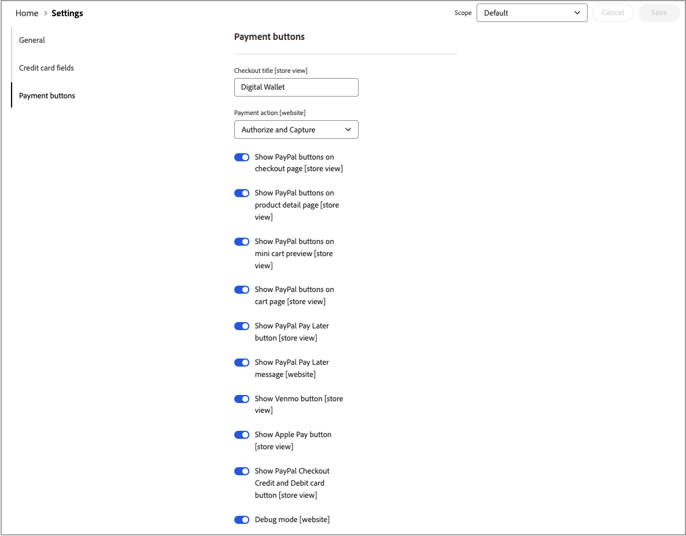

# [!UICONTROL Sales] > [!UICONTROL Payment Methods] > [!UICONTROL Payment Services]

Payment Services bietet eine schlüsselfertige Self-Service-Lösung, einschließlich Sandbox-Tests und einer einfachen Einrichtung, für eine robuste und sichere Zahlungsabwicklung. Weitere Informationen finden Sie im [_Benutzerhandbuch für Zahlungs-Services_](https://experienceleague.adobe.com/docs/commerce/payment-services/guide-overview.html?lang=de).

Um auf die Konfigurationseinstellungen für Payment Services zuzugreifen, gehen Sie in der Seitenleiste _Admin_ zu **[!UICONTROL Sales]** > **[!UICONTROL Payment Services]** und klicken Sie auf **[!UICONTROL Settings]**.

{width="400"}

>[!NOTE]
>
>Informationen zur Verwendung der Legacy-Konfiguration anstelle von [Einstellungen](https://experienceleague.adobe.com/docs/commerce/payment-services/configure/settings.html?lang=de) finden Sie unter [Legacy-Konfiguration](https://experienceleague.adobe.com/docs/commerce/payment-services/configure/configure-admin.html?lang=de).

## [!UICONTROL General]

{width="600" zoomable="yes"}

| Feld | [Umfang](../../getting-started/websites-stores-views.md#scope-settings) | Beschreibung |
|---|---|---|
| [!UICONTROL Enable] | Website | Aktivieren oder Deaktivieren von [!DNL Payment Services] für Ihre Website. Optionen: [!UICONTROL Yes] / [!UICONTROL No] |
| [!UICONTROL Payment mode] | Shop-Ansicht | Legen Sie die Methode oder Umgebung für Ihren Store fest. Optionen: [!UICONTROL Sandbox] / [!UICONTROL Production] |
| [!UICONTROL Sandbox Merchant ID] | Shop-Ansicht | Ihre Sandbox-Händler-ID, die beim Sandbox-Onboarding automatisch generiert wird. |
| [!UICONTROL Production Merchant ID] | Shop-Ansicht | Ihre Produktions-Händler-ID, die beim Sandbox-Onboarding automatisch generiert wird. |
| [!UICONTROL Soft Descriptor] | Website- oder Store-Ansicht | Fügen Sie Ihren Websites und Store-Ansichten einen Soft-Deskriptor hinzu, der Informationen für Kundentransaktionen bereitstellt und Marken, Stores oder Produktlinien abgrenzt. Der Umschalter [!UICONTROL Use website] wendet alle Soft-Deskriptoren an, die auf der Website-Ebene hinzugefügt werden. Der Umschalter [!UICONTROL Use default] wendet alle Soft-Deskriptoren an, die als Standard hinzugefügt werden. |

{style="table-layout:auto"}

## [!UICONTROL Credit card fields]

{width="600" zoomable="yes"}

| Feld | [Umfang](../../getting-started/websites-stores-views.md#scope-settings) | Beschreibung |
|---|---|---|
| [!UICONTROL Title] | Shop-Ansicht | Fügen Sie den Text hinzu, der während des Checkouts als Titel für diese Zahlungsoption in der Ansicht Zahlungsmethode angezeigt werden soll. |
| [!UICONTROL Payment Action] | Website | Die [Zahlungsaktion](payment-methods.md#payment-actions) für die angegebene Zahlungsmethode. Optionen: [!UICONTROL Authorize] / [!UICONTROL Authorize and Capture] |
| [!UICONTROL 3DS Secure authentication] | Website | Aktivieren oder deaktivieren Sie [3DS Secure Authentication](https://experienceleague.adobe.com/docs/commerce/payment-services/security-compliance/security.html?lang=de#3ds). Optionen: [!UICONTROL Always] / [!UICONTROL When Required] / [!UICONTROL Off] |
| [!UICONTROL Show on checkout page] | Website | Aktivieren oder deaktivieren Sie Kreditkartenfelder, die auf der Kasse angezeigt werden sollen. Optionen: [!UICONTROL Yes] / [!UICONTROL No] |
| [!UICONTROL Vault enabled] | Shop-Ansicht | Aktivieren oder Deaktivieren [Kreditkarten-Vaulting](https://experienceleague.adobe.com/docs/commerce/payment-services/payments-checkout/vaulting.html?lang=de). Optionen: [!UICONTROL Yes] / [!UICONTROL No] |
| [!UICONTROL Show vaulted payment methods in Admin] | Shop-Ansicht | Aktivieren oder deaktivieren Sie die Möglichkeit, Bestellungen für Kunden in der Admin [mit einer Tresorzahlmethode) &#x200B;](https://experienceleague.adobe.com/docs/commerce/payment-services/payments-checkout/vaulting.html?lang=de). Optionen: [!UICONTROL Yes] / [!UICONTROL No] |
| [!UICONTROL Debug Mode] | Website | Aktivieren oder Deaktivieren des Debugging-Modus. Optionen: [!UICONTROL Yes] / [!UICONTROL No] |

{style="table-layout:auto"}

## [!UICONTROL Payment buttons]

{width="600" zoomable="yes"}

| Feld | [Umfang](../../getting-started/websites-stores-views.md#scope-settings) | Beschreibung |
|---|---|---|
| [!UICONTROL Title] | Shop-Ansicht | Fügen Sie den Text hinzu, der während des Checkouts als Titel für diese Zahlungsoption in der Ansicht Zahlungsmethode angezeigt werden soll. |
| [!UICONTROL Payment Action] | Website | Die [Zahlungsaktion](payment-methods.md#payment-actions){target="_blank"} für die angegebene Zahlungsmethode. Optionen: [!UICONTROL Authorize] / [!UICONTROL Authorize and Capture] |
| [!UICONTROL Show PayPal buttons on checkout page] | Shop-Ansicht | Aktivieren oder Deaktivieren von [!DNL PayPal Smart Buttons] auf der Kaufbestätigungsseite. Optionen: [!UICONTROL &#x200B; Yes] / [!UICONTROL No] |
| [!UICONTROL Show PayPal buttons on product detail page] | Shop-Ansicht | Aktivieren oder Deaktivieren von [!DNL PayPal Smart Buttons] auf der Produktdetailseite. Optionen: [!UICONTROL &#x200B; Yes] / [!UICONTROL No] |
| [!UICONTROL Show PayPal buttons in mini-cart preview] | Shop-Ansicht | Aktivieren oder deaktivieren Sie [!DNL PayPal Smart Buttons] in der Vorschau des Mini-Warenkorbs. Optionen: [!UICONTROL Yes] / [!UICONTROL No] |
| [!UICONTROL Show PayPal buttons on cart page] | Shop-Ansicht | Aktivieren oder Deaktivieren von [!DNL PayPal Smart Buttons] auf der Warenkorbseite. Optionen: [!UICONTROL Yes] / [!UICONTROL No] |
| [!UICONTROL Show PayPal Pay Later button] | Shop-Ansicht | Aktivieren oder deaktivieren Sie die Option „Später bezahlen“, wenn die Zahlungsschaltflächen angezeigt werden. Optionen: [!UICONTROL Yes] / [!UICONTROL No] |
| [!UICONTROL Show PayPal Pay Later Message] | Website | Aktivieren oder deaktivieren Sie die Pay-Later-Nachricht im Warenkorb, auf der Produktseite, im Mini-Warenkorb und während des Kaufvorgangs. Optionen: [!UICONTROL Yes] / [!UICONTROL No] |
| [!UICONTROL Show Venmo button] | Shop-Ansicht | Aktivieren oder deaktivieren Sie die Zahlungsoption Venmo, in der die Zahlungsschaltflächen angezeigt werden. Optionen: [!UICONTROL Yes] / [!UICONTROL No] |
| [!UICONTROL Show Apple Pay button] | Shop-Ansicht | Aktivieren oder deaktivieren Sie die Option Apple Pay Payment , in der die Zahlungsschaltflächen angezeigt werden. Optionen: [!UICONTROL Yes] / [!UICONTROL No] |
| [!UICONTROL Show PayPal Credit and Debit card button] | Shop-Ansicht | Aktivieren oder deaktivieren Sie die Zahlungsoption „Kredit- und Debitkarte“, wenn die Zahlungsschaltflächen angezeigt werden. Optionen: [!UICONTROL Yes] / [!UICONTROL No] |
| [!UICONTROL Debug Mode] | Website | Aktivieren oder Deaktivieren des Debug-Modus. Optionen: [!UICONTROL Yes] / [!UICONTROL No] |

{style="table-layout:auto"}

## [!UICONTROL PayPal Smart Button Styling]

{width="600" zoomable="yes"}

| Feld | [Umfang](../../getting-started/websites-stores-views.md#scope-settings) | Beschreibung |
|--- |--- |--- |
| [!UICONTROL Layout] | Shop-Ansicht | Definieren Sie den Stil des Layouts für Zahlungsschaltflächen. Optionen: [!UICONTROL Vertical] / [!UICONTROL Horizontal] |
| [!UICONTROL Tagline] | Shop-Ansicht | Aktiviert/deaktiviert die Tag-Zeile. Optionen: [!UICONTROL Yes] / [!UICONTROL No] |
| [!UICONTROL Color] | Shop-Ansicht | Farbe der Zahlungs-Schaltflächen definieren. Optionen: [!UICONTROL Blue] / [!UICONTROL Gold] / [!UICONTROL Silver] / [!UICONTROL White] / [!UICONTROL Black] |
| [!UICONTROL Shape] | Shop-Ansicht | Form der Zahlungs-Schaltflächen definieren. Optionen: [!UICONTROL Rectangular] / [!UICONTROL Pill] |
| [!UICONTROL Responsive Button Height] | Shop-Ansicht | Definiert, ob für Zahlungsschaltflächen eine Standardhöhe verwendet wird. Optionen: [!UICONTROL Yes] / [!UICONTROL No] |
| [!UICONTROL Height] | Shop-Ansicht | Höhe der Zahlungs-Schaltflächen definieren. Standardwert: keiner |
| [!UICONTROL Label] | Shop-Ansicht | Definieren Sie den Titel, der in den Zahlungs-Schaltflächen angezeigt wird. Optionen: [!UICONTROL PayPal] / [!UICONTROL Checkout] / [!UICONTROL Buynow] / [!UICONTROL Pay] / [!UICONTROL Installment] |

{style="table-layout:auto"}
