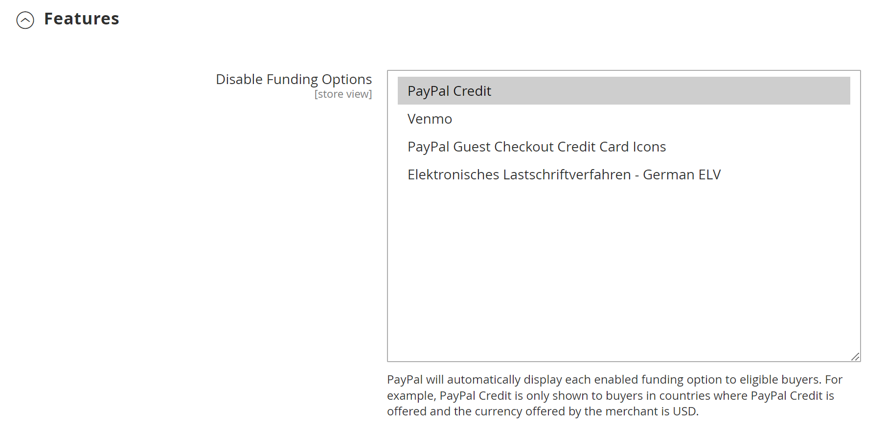

# [!UICONTROL Sales] > [!UICONTROL Payment Methods] > [!UICONTROL PayPal Express Checkout]

>[!IMPORTANT]
>
>**PSD2-Anforderungen:**  
>Ab dem 14. September 2019 können europäische Banken Zahlungen ablehnen, die [PSD2&rbrace;-](../../getting-started/compliance-payment-services-directive.md) nicht erfüllen. Für PayPal Express Checkout ist keine Maßnahme erforderlich, um PSD2 zu erfüllen, da alle Anforderungen von PayPal abgewickelt werden.

{{config}}

## [!UICONTROL Required PayPal Settings]

<!-- zoom -->

<!-- [PayPal Express Checkout Required Settings](../../stores-purchase/paypal-express-checkout.html) -->

| Feld | [Umfang](../../getting-started/websites-stores-views.md#scope-settings) | Beschreibung |
|--- |--- |--- |
| [!UICONTROL Enable this Solution] | Website | Aktiviert [!DNL PayPal Express Checkout] als Zahlungsmethode, die Ihren Kunden zur Verfügung steht. Optionen: `Yes` / `No` |
| [!UICONTROL Enable In-Context Checkout Experience] | Website | Aktiviert die optimierte kontextbezogene PayPal-Kasse als Zahlungsmethode für Ihre Kunden. Optionen: `Yes` / `No` |
| [!UICONTROL Enable PayPal Credit] | Website | Aktiviert PayPal-Guthaben, damit Kunden jetzt kaufen, aber später bezahlen können. Sie werden im Voraus bezahlt, aber die Kunden haben mehr Zeit zu zahlen. Optionen: `Yes` / `No` |

{style="table-layout:auto"}

### [!UICONTROL Express Checkout]

| Feld | [Umfang](../../getting-started/websites-stores-views.md#scope-settings) | Beschreibung |
|--- |--- |--- |
| [!UICONTROL Email Associated with PayPal Merchant Account] | Website | Gibt die E-Mail-Adresse an, die Sie bei der Einrichtung Ihres PayPal-Händlerkontos angegeben haben. Bei der E-Mail-Adresse wird zwischen Groß- und Kleinschreibung unterschieden und sie muss genau mit Ihrer E-Mail-Adresse im PayPal-System übereinstimmen. |
| [!UICONTROL API Authentication Methods] | Website | Bestimmt die für die API-Authentifizierung verwendete Methode. Optionen:  **`API Signature`**- Zeigt das _[!UICONTROL API Signature]_&#x200B;im Formular an. **`API Certificate`**- Zeigt das Feld&#x200B;_[!UICONTROL API Certificate]_ im Formular an. |
| [!UICONTROL API Username] | Website | Der API-Benutzername, der mit Ihrem PayPal-Händlerkonto verknüpft ist. |
| [!UICONTROL API Password] | Website | Das API-Passwort, das mit Ihrem PayPal-Händlerkonto verknüpft ist. |
| [!UICONTROL API Signature] | Website | Die API-Signatur, die mit Ihrem PayPal-Händlerkonto verknüpft ist. |
| [!UICONTROL API Certificate] | Website | Navigieren Sie zu , um Ihr API-Zertifikat hochzuladen. |
| [!UICONTROL Get Credentials from PayPal] |  | Ruft Ihre API-Anmeldedaten von PayPal ab. |
| [!UICONTROL Sandbox Credentials] |  | Ruft Ihre Sandbox-Anmeldedaten von PayPal ab. |
| [!UICONTROL Sandbox Mode] | Website | Um PayPal Express Checkout in einer Testumgebung auszuführen, geben Sie Ihre Sandbox-API-Anmeldeinformationen ein und setzen Sie diese auf `Yes`. Optionen: `Yes` / `No` |
| [!UICONTROL API Uses Proxy] | Website | Wenn Ihr System zur Herstellung der Verbindung zwischen Commerce und dem PayPal-System einen Proxyserver verwendet, setzen Sie dies auf `Yes`. Optionen: `Yes` / `No` |
| [!UICONTROL Proxy Host] | Website | Wenn die API den Proxy verwendet, gibt dies die IP-Adresse des Proxy-Hosts an. |
| [!UICONTROL Proxy Port] | Website | Wenn die API den Proxy verwendet, gibt dies den vom Proxy-Host verwendeten Port an. |

{style="table-layout:auto"}

### [!UICONTROL Advertise PayPal Credit]

<!-- zoom -->

| Feld | [Umfang](../../getting-started/websites-stores-views.md#scope-settings) | Beschreibung |
|--- |--- |--- |
| [!UICONTROL Publisher ID] | Website | Die mit Ihrem PayPal-Guthabenkonto verknüpfte Publisher-ID. |
| [!UICONTROL Get Publisher ID from PayPal] |  | Ruft Ihre Publisher-ID von PayPal ab. |
| [!UICONTROL Home Page] | Website | Bestimmt die Position und Größe des [!DNL PayPal Credit] auf der Startseite. Optionen:  **Anzeigen** - Zeigt [!DNL PayPal Credit] Banner auf der Startseite Ihres Stores an. Optionen: `Yes` / `No`  **Position** - Bestimmt die Position des [!DNL PayPal Credit] auf der Startseite. Optionen: Kopfzeile (Mitte) / Seitenleiste (rechts)  **Größe** - Bestimmt die Größe des [!DNL PayPal Credit] auf der Startseite. Optionen: `190 x 100` / `234 x 60` / `300 x 50` / `468 x 60` / `728 x 90` /` 800 x 66` |
| [!UICONTROL Catalog Category Page] | Website | Bestimmt die Position und Größe des [!DNL PayPal Credit] Banners auf Kategorieseiten. Optionen: (identisch mit [!UICONTROL Home Page]) |
| [!UICONTROL Catalog Product Page] | Website | Bestimmt die Position und Größe des [!DNL PayPal Credit] auf Produktseiten. Optionen: (identisch mit [!UICONTROL Home Page]) |
| [!UICONTROL Checkout Cart Page] | Website | Bestimmt die Position und Größe des [!DNL PayPal Credit] Banners auf der Warenkorbseite. Optionen: (identisch mit [!UICONTROL Home Page]) |

{style="table-layout:auto"}

## [!UICONTROL Basic Settings]

<!-- zoom -->

| Feld | [Umfang](../../getting-started/websites-stores-views.md#scope-settings) | Beschreibung |
|--- |--- |--- |
| [!UICONTROL Title] | Shop-Ansicht | Ein Name, der die Zahlungsmethode PayPal Express Checkout während des Checkouts identifiziert. |
| [!UICONTROL Sort Order] | Shop-Ansicht | Eine Nummer, die die Reihenfolge bestimmt, in der PayPal Express Checkout angezeigt wird, wenn sie mit anderen Zahlungsmethoden beim Checkout aufgelistet wird. Geben Sie `0` als Anfang der Liste ein. |
| [!UICONTROL Payment Action] | Website | Bestimmt die Aktion, die PayPal bei Erhalt einer Bestellung durchführt. Optionen:  **`Authorization`**- Genehmigt den Kauf, setzt jedoch die Mittel zurück. Der Betrag wird erst abgehoben, wenn er vom Händler „eingezogen“ wurde. **`Sale`** - Der Betrag des Kaufs wird autorisiert und sofort vom Konto des Kunden zurückgezogen.  **`Order`**- Stellt eine Vereinbarung mit PayPal dar, die es dem Händler ermöglicht, innerhalb eines bestimmten Zeitraums einen oder mehrere Beträge bis zur bestellten Summe vom Käuferkonto des Kunden zu erfassen. Dies kann bis zu 29 Tage dauern. Eine oder mehrere Rechnungen müssen vom Commerce-Administrator erstellt werden, um die Mittel zu erfassen. |
| [!UICONTROL Display on Product Details Page] | Shop-Ansicht | Bestimmt, ob die Schaltfläche „Checkout mit PayPal“ auf Produktseiten angezeigt wird. Zu den Optionen gehören: `Yes` / `No` |

{style="table-layout:auto"}

## [!UICONTROL Advanced Settings]

<!-- zoom -->

| Feld | [Umfang](../../getting-started/websites-stores-views.md#scope-settings) | Beschreibung |
|--- |--- |--- |
| [!UICONTROL Display on Shopping Cart] | Shop-Ansicht | Bestimmt, ob der PayPal Express-Checkout als Zahlungsoption im Warenkorb angezeigt wird. Optionen: `Yes` (PayPal empfohlen) / `No` |
| [!UICONTROL Payment Action Applicable From] | Website | Bestimmt den Bereich der entsprechenden Länderauswahl. Optionen: `All Allowed Countries` / `Specific Countries` |
| [!UICONTROL Countries Payment Applicable From] | Website | Gibt jedes Land an, aus dem die Zahlung akzeptiert wird. Nur Kunden mit einer Rechnungsadresse in einem ausgewählten Land können mit dieser Zahlungsmethode Einkäufe tätigen. |
| [!UICONTROL Debug Mode] | Website | Zeichnet Nachrichten, die zwischen Ihrem Geschäft und dem Zahlungssystem gesendet werden, in einer Protokolldatei auf. Optionen: `Yes` / `No`   **_Hinweis:_**&#x200B;Die Protokolldatei wird auf dem Server gespeichert und ist nur für Entwickler zugänglich. In Übereinstimmung mit den PCI Data Security Standards werden Kreditkarteninformationen nicht in der Protokolldatei aufgezeichnet. |
| [!UICONTROL Enable SSL Verification] | Website | Ermöglicht die Überprüfung des Host-Sicherheitszertifikats. Optionen: `Yes` / `No` |
| [!UICONTROL Transfer Cart Line Items] | Website | Zeigt eine vollständige Zusammenfassung der Zeileneinträge aus dem Warenkorb des Kunden auf der PayPal-Website an. Optionen: `Yes` / `No` |
| [!UICONTROL Transfer Shipping Options] | Website | Enthält bis zu zehn Versandoptionen auf der PayPal-Website. Optionen: `Yes` / `No` |
| [!UICONTROL Shortcut Buttons Flavor] | Shop-Ansicht | Bestimmt den Typ des Bildes, das für die PayPal-Akzeptanzschaltfläche verwendet wird. Optionen:  **`Dynamic`**- (Empfohlen) Zeigt ein Bild an, das dynamisch vom PayPal-Server geändert werden kann. **`Static`** - Zeigt ein statisches Bild an, das nicht dynamisch geändert werden kann. |
| [!UICONTROL Enable PayPal Guest Checkout] | Website | Ermöglicht Kunden, die keine PayPal-Konten haben, Käufe mit PayPal Express Checkout zu tätigen. Optionen: `Yes` / `No` |
| [!UICONTROL Require Customer's Billing Address] | Website | Bestimmt, ob die Rechnungsadresse des Kunden erforderlich ist. Optionen: `Yes` / `No` / `For Virtual Quotes Only` |
| [!UICONTROL Billing Agreement Signup] | Website | Legt fest, ob Kundinnen und Kunden mit Ihrem [ einen ](../../stores-purchase/paypal-billing-agreements.md) abschließen können. Optionen:  **`Auto`**- Der Kunde kann sich während des Express-Checkouts für einen Abrechnungsvertrag anmelden. **`Ask Customer`** - Kunden werden gefragt, ob sie sich für eine Abrechnungsvereinbarung anmelden möchten.  **`Never`**- Kunden wird nicht angeboten, sich für eine Abrechnungsvereinbarung zu registrieren. |
| [!UICONTROL Skip Order Review Step] | Website | Legt fest, ob Kundinnen und Kunden die Transaktion über die PayPal-Website abschließen können oder verpflichtet sind, zu Ihrem Geschäft zurückzukehren und den Schritt zur Bestellüberprüfung auszuführen, bevor sie die Bestellung übermitteln. Optionen: `Yes` / `No` |

{style="table-layout:auto"}

### [!UICONTROL Billing Agreement Settings]

<!-- zoom -->

| Feld | [Umfang](../../getting-started/websites-stores-views.md#scope-settings) | Beschreibung |
|--- |--- |--- |
| [!UICONTROL Enabled] | Website | Wenn diese Option aktiviert ist, werden Abrechnungsvereinbarungen Kunden während des Checkouts als Zahlungsoption angezeigt. Optionen: `Yes` / `No` |
| [!UICONTROL Title] | Shop-Ansicht | Der Titel für die Option PayPal-Abrechnungsvertrag , die während des Checkouts als Zahlungsoption angezeigt wird. |
| [!UICONTROL Sort Order] | Shop-Ansicht | Bestimmt die Reihenfolge, in der Abrechnungsvereinbarungen mit anderen Zahlungsmethoden beim Checkout aufgelistet werden. |
| [!UICONTROL Payment Action] | Website | Bestimmt, wie PayPal die Transaktion verwaltet: Optionen:  **Autorisierung** - Genehmigt den Kauf, setzt aber die Mittel zurück. Der Betrag wird erst abgehoben, wenn er vom Händler „eingezogen“ wurde.  **Verkauf** - Der Kaufbetrag wird autorisiert und sofort vom Konto des Kunden zurückgezogen. |
| [!UICONTROL Payment Applicable From] | Website | Bestimmt den Bereich der entsprechenden Länderauswahl. Optionen: Alle zulässigen Länder/bestimmte Länder |
| [!UICONTROL Countries Payment Applicable From] | Website | Gibt jedes Land an, aus dem die Zahlung akzeptiert wird. Nur Kunden mit einer Rechnungsadresse in einem ausgewählten Land können mit dieser Zahlungsmethode Einkäufe tätigen. |
| [!UICONTROL Debug Mode] | Website | Zeichnet die Kommunikation mit dem Zahlungssystem in einer Protokolldatei auf. Optionen: `Yes` / `No`   **_Hinweis:_**&#x200B;Die Protokolldatei wird auf dem Server gespeichert und ist nur für Entwickler zugänglich. In Übereinstimmung mit den PCI Data Security Standards werden Kreditkarteninformationen nicht in der Protokolldatei aufgezeichnet. |
| [!UICONTROL Enable SSL Verification] | Website | Ermöglicht einen Verifizierungsschritt, um sicherzustellen, dass die Transaktion über einen verschlüsselten SSL-Kanal stattfindet. Optionen: `Yes` / `No` |
| [!UICONTROL Transfer Cart Line Items] | Website | Wenn diese Option aktiviert ist, zeigt eine Zusammenfassung der Zeileneinträge aus dem Warenkorb auf Ihrer PayPal-Zahlungsseite an. Optionen: `Yes` / `No` |
| [!UICONTROL Allow in Billing Agreement Wizard] | Website | Wenn diese Option aktiviert ist, können Kundinnen und Kunden über das Dashboard ihres Kundenkontos eine Abrechnungsvereinbarung initiieren. |

{style="table-layout:auto"}

### [!UICONTROL Settlement Report Settings]

<!-- zoom -->

| Feld | [Umfang](../../getting-started/websites-stores-views.md#scope-settings) | Beschreibung |
|--- |--- |--- |
| **[!UICONTROL SFTP Credentials]** |  |  |
| [!UICONTROL Login] | Website | Ihr Benutzername, der zum Anmelden beim sicheren FTP-Server von PayPal erforderlich ist. |
| [!UICONTROL Password] | Website | Ihr Kennwort, das für die Anmeldung beim sicheren FTP-Server von PayPal erforderlich ist. |
| [!UICONTROL Sandbox Mode] | Website | Wenn diese Option aktiviert ist, führt Berichte in einer Testumgebung aus, bevor sie in der Produktionsumgebung „live“ geschaltet werden. Optionen: `Yes` / `No` |
| [!UICONTROL Custom Endpoint Hostname or IP-Address] | Website | Die URL, unter der Abwicklungsberichte verwaltet werden. Standardwert: `reports.paypal.com` |
| [!UICONTROL Custom Path] | Website | Der Pfad, unter dem Abrechnungsberichte auf Ihrem Server gespeichert werden. Standardwert: `/ppreports/outgoing` |
| **[!UICONTROL Scheduled Fetching]** |  |  |
| [!UICONTROL Enable Automatic Fetching] | Website | Wenn diese Option aktiviert ist, werden Abwicklungsberichte automatisch planmäßig abgerufen. Optionen: `Yes` / `No` |
| [!UICONTROL Schedule] | Website | Bestimmt, wie oft Abrechnungsberichte von PayPal generiert werden. Optionen: `Daily` / `Every 3 days` / `Every 7 days` / `Every 10 days` / `Every 14 days` / `Every 30 days` / `Every 40 days` |
| [!UICONTROL Time of Day] | Website | Bestimmt die Stunde, Minute und Sekunde, in der Abwicklungsberichte generiert werden. |

{style="table-layout:auto"}

### [!UICONTROL Frontend Experience Settings]

<!-- zoom -->

| Feld | [Umfang](../../getting-started/websites-stores-views.md#scope-settings) | Beschreibung |
|--- |--- |--- |
| [!UICONTROL PayPal Product Logo] | Shop-Ansicht | Bestimmt das PayPal-Logo, das in Ihrem Geschäft angezeigt wird. Es gibt vier grundlegende Stile in zwei Größen. Optionen: `No Logo` / `We prefer PayPal (150 x 60)` / `We prefer PayPal (150 x 40)` / `Now accepting PayPal (150 x 60)` / `Now accepting PayPal (150 x 40)` / `Payments by PayPal (150 x 60)` / `Payments by PayPal (150 x 40)` / `Shop now using (150 x 60)` / `Shop now using (150 x 40)` |
| **[!UICONTROL PayPal Merchant Pages Style]** |  |  |
| [!UICONTROL Page Style] | Shop-Ansicht | Bestimmt das Erscheinungsbild Ihrer PayPal-Händlerseite. Zulässige Werte: **`paypal`** - Verwendet den PayPal-Seitenstil.  **`primary`**- Verwendet den Seitenstil, den Sie in Ihrem Kontoprofil als „primären“ Stil identifiziert haben. **`your_custom_value`** - Verwendet einen benutzerdefinierten Zahlungsseitenstil, der in Ihrem Kontoprofil angegeben ist. |
| [!UICONTROL Header Image URL] | Shop-Ansicht | Die URL des Bildes, das oben links auf der Kaufbestätigungsseite angezeigt wird. Die maximale Größe beträgt 750 x 90 Pixel.   **_Hinweis:_**&#x200B;PayPal empfiehlt, dass das Bild auf einem sicheren (https)-Server gespeichert wird. Andernfalls kann der Browser des Kunden warnen, dass „die Seite sowohl sichere als auch nicht sichere Elemente enthält“. |
| [!UICONTROL Header Image Background Color] | Shop-Ansicht | Der aus sechs Zeichen [Hexadezimalfarbe) bestehende ](https://en.wikipedia.org/wiki/Web_colors) für die Hintergrundfarbe des Headers auf der Kaufbestätigungsseite. Sie können den Code entweder in Groß- oder Kleinbuchstaben eingeben. |
| [!UICONTROL Header Image Border Color] | Shop-Ansicht | Der sechsstellige [hexadezimale Farbe](https://en.wikipedia.org/wiki/Web_colors)-Code für den Zwei-Pixel-Rahmen um die Kopfzeile. |
| [!UICONTROL Page Background Color] | Shop-Ansicht | Der sechsstellige [hexadezimale Farbe](https://en.wikipedia.org/wiki/Web_colors)-Code für die Hintergrundfarbe der Checkout-Seite, die hinter der Kopfzeile und dem Zahlungsformular angezeigt wird. |

{style="table-layout:auto"}

#### [!UICONTROL Customize Smart Buttons (Basic)]

<!-- zoom -->

| Feld | [Umfang](../../getting-started/websites-stores-views.md#scope-settings) | Beschreibung |
|--- |--- |--- |
| [!UICONTROL Customize Button] | Shop-Ansicht | Legt fest, ob die PayPal Smart Buttons an das Layout und Design Ihres Stores angepasst werden können. Sie können diese Änderungen unabhängig auf der Kaufbestätigungsseite, auf Produktseiten, auf der Warenkorbseite und im Mini-Warenkorb anwenden. |
| [!UICONTROL Label] | Shop-Ansicht | Der Text, den PayPal auf der Schaltfläche „Smart Payment“ anzeigt. Optionen:  **`Checkout`**(wird als „PayPal Checkout“ angezeigt) **`Pay`** (wird als „PayPal“ angezeigt)  **`Buy Now`**(wird als „Buy Now with PayPal“ angezeigt) **`PayPal`** (wird als „PayPal“ angezeigt)  **`Installment`**(wird als „PayPal“ angezeigt) **`Credit`** (wird als „PayPal CREDIT“ angezeigt) |
| [!UICONTROL Layout] | Shop-Ansicht | Legt fest, ob PayPal Smart Buttons vertikal oder horizontal angezeigt werden. Optionen:  **`Vertical`**- Der Käufer muss sich entweder bei PayPal anmelden oder ein PayPal-Konto erstellen, unabhängig davon, ob „Gäste-Checkout aktivieren“ ausgewählt ist. **`Horizontal`** - Wenn „Gäste-Checkout aktivieren“ ausgewählt ist, zeigt die Schaltfläche **`Pay with Debit Card or Credit Card`** im PayPal-Popup-Fenster an. Andernfalls muss sich der Käufer entweder bei PayPal anmelden oder ein PayPal-Konto erstellen. |
| [!UICONTROL Size] | Shop-Ansicht | Legt die Größe der Schaltfläche für intelligente Zahlungen fest. Optionen:  **`Medium`**- 250 Pixel x 35 Pixel **`Large`** - 350 Pixel x 40 Pixel  **`Responsive`**- (Standard) Passt die Breite des Containers an. Die Mindestbreite beträgt 100 Pixel, die maximale Breite 500 Pixel. Die Höhe wird basierend auf der Breite dynamisch angepasst. |
| [!UICONTROL Shape] | Shop-Ansicht | Legt die Form der Schaltfläche für die intelligente Zahlung fest. Optionen: `Pill` (Standard) / `Rectangle` |
| [!UICONTROL Color] | Shop-Ansicht | Legen Sie die Farbe der Schaltfläche für intelligente Zahlungen fest. Optionen: `Gold` (Standard) / `Blue` / `Silver` / `Black` |

{style="table-layout:auto"}

#### [!UICONTROL Customize Smart Buttons (Features)]

<!-- zoom -->

| Feld | [Umfang](../../getting-started/websites-stores-views.md#scope-settings) | Beschreibung |
|--- |--- |--- |
| [!UICONTROL Disable Funding Options] | Shop-Ansicht | Legt fest, welche anderen PayPal-Finanzierungsoptionen auf der Checkout-Seite angezeigt werden. Die ausgewählten Optionen werden nie auf der Kaufbestätigungsseite angezeigt. Nicht ausgewählte Optionen werden nur angezeigt, wenn PayPal die Währung des Shops und den Standort des Käufers unterstützt. Optionen: `PayPal Credit` / `PayPal Guest Checkout` `Credit Card Icons` / `Elektronisches Lastschriftverfahren - German ELV` |

{style="table-layout:auto"}
