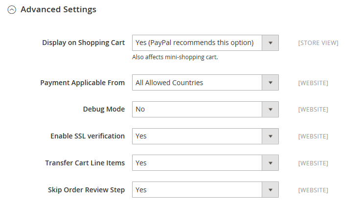

# [!UICONTROL Sales] > [!UICONTROL Payment Methods] > [!UICONTROL PayPal Payflow Link]

>[!IMPORTANT]
>
>**PSD2-Anforderungen:**  
>Ab dem 14. September 2019 könnten europäische Banken Zahlungen ablehnen, die nicht erfüllt sind [PSD2](../../getting-started/compliance-payment-services-directive.md) Anforderungen. Einhaltung von PSD 2, [!DNL PayPal Payflow Link] muss in [!DNL Cardinal Commerce]. Weitere Informationen finden Sie unter [3-D-Sicherheit für Payflow](https://developer.paypal.com/api/nvp-soap/payflow/3d-secure-overview/).

{{config}}

## [!UICONTROL Required Settings]

<!-- zoom -->

| Feld | [Anwendungsbereich](../../getting-started/websites-stores-views.md#scope-settings) | Beschreibung |
|--- |--- |--- |
| [!UICONTROL Email Associated with PayPal Merchant Account] | Webseite | (Optional) Alle E-Mail-Adressen, die mit Ihrem PayPal-Handelskonto verknüpft sind. Bei E-Mail-Adressen muss die Groß-/Kleinschreibung beachtet werden und die Adressen müssen exakt mit denen in Ihrem Konto übereinstimmen. |
| [!UICONTROL Partner] | Webseite | gegebenenfalls Ihre PayPal-Partner-ID. |
| [!UICONTROL Vendor] | Webseite | Ihr PayPal-Benutzername. |
| Benutzer | Webseite | Die ID eines zusätzlichen Benutzers in Ihrem PayPal-Konto. Wenn keine anderen Benutzer im Netzwerk vorhanden sind, geben Sie Ihre Anbieter- oder Händler-ID ein. |
| [!UICONTROL Password] | Webseite | Das Kennwort, das Ihrem PayPal-Kaufkonto zugeordnet ist. |
| [!UICONTROL Test Mode] | Webseite | Wenn diese Option aktiviert ist, führt PayPal Payflow Pro in einer Testumgebung aus. Deaktivieren Sie den Testmodus, wenn Sie bereit sind, im Produktionsmodus live zu gehen. Optionen: `Yes` / `No` |
| [!UICONTROL Use Proxy] | Webseite | Ein Proxy kann verwendet werden, um den Traffic umzuleiten, wenn die Server-Firewall den direkten Zugriff auf den PayPal-Server verhindert. Gibt ggf. den Proxy-Server an, der zum Herstellen einer Verbindung mit dem PayPal-Server verwendet wird. Optionen: `Yes` / `No`   Wenn diese Option aktiviert ist, legen Sie die Proxy-Optionen fest:  **`Proxy Host`**- Die IP-Adresse des Proxyhosts. **`Proxy Port`** - Die Nummer des Proxy-Ports. |
| [!UICONTROL Enable Payflow Link] | Webseite | Bestimmt, ob PayPal Payflow Link Ihren Kunden als Zahlungsmethode zur Verfügung steht. |
| [!UICONTROL Enable Express Checkout] | Webseite | Stellt fest, ob PayPal Express Checkout als Zahlungsmethode für Ihre Kunden verfügbar ist. |
| [!UICONTROL Enable PayPal Credit] | Webseite | Stellt fest, ob PayPal-Guthaben Ihren Kunden als Zahlungsoption zur Verfügung steht. |

{style="table-layout:auto"}

## [!UICONTROL Advertise PayPal Credit]

<!-- zoom -->

| Feld | [Anwendungsbereich](../../getting-started/websites-stores-views.md#scope-settings) | Beschreibung |
|--- |--- |--- |
| [!UICONTROL Publisher ID] | Webseite | Die Herausgeber-ID, die Ihrem PayPal-Konto zugeordnet ist. |
| [!UICONTROL Get Publisher ID from PayPal] |  | Ruft Ihre Herausgeber-ID von PayPal ab. |
| [!UICONTROL Home Page] | Webseite | Bestimmt die Position und Größe der [!DNL PayPal Credit] Banner auf der Startseite. Optionen:  **`Display`**- Bestimmt, ob eine[!DNL PayPal Credit] Banner wird auf der Startseite Ihres Stores angezeigt. Optionen: `Yes` / `No` **`Position`** - Bestimmt die Position der [!DNL PayPal Credit] Banner auf der Startseite. Optionen: Kopfzeile (zentriert)/Seitenleiste (rechts)  **`Size`**- Bestimmt die Größe der [!DNL PayPal Credit] Banner auf der Startseite. Optionen: `190 x 100` / `234 x 60` / `300 x 50` / `468 x 60` / `728 x 90` /` 800 x 66` |
| [!UICONTROL Catalog Category Page] | Webseite | Bestimmt die Position und Größe der [!DNL PayPal Credit] Banner auf Kategorieseiten. Optionen: (entspricht für [!UICONTROL Home Page]) |
| [!UICONTROL Catalog Product Page] | Webseite | Bestimmt die Position und Größe der [!DNL PayPal Credit] Banner auf Produktseiten. Optionen: (entspricht für [!UICONTROL Home Page]) |
| [!UICONTROL Checkout Cart Page] | Webseite | Bestimmt die Position und Größe der [!DNL PayPal Credit] Banner auf der Warenkorbseite. Optionen: (entspricht für [!UICONTROL Home Page]) |

{style="table-layout:auto"}

### [!UICONTROL Basic Settings]

<!-- zoom -->

| Feld | [Anwendungsbereich](../../getting-started/websites-stores-views.md#scope-settings) | Beschreibung |
|--- |--- |--- |
| [!UICONTROL Title] | Store-Ansicht | Ein Name, der PayPal Payflow Link als Zahlungsmethode beim Checkout angibt. |
| [!UICONTROL Sort Order] | Store-Ansicht | Eine Zahl, die bestimmt, in welcher Reihenfolge PayPal-Payflow-Link angezeigt wird, wenn sie beim Checkout mit anderen Zahlungsmethoden aufgeführt wird. |
| [!UICONTROL Payment Action] | Webseite | Legt fest, welche Aktion von PayPal bei der Absendung einer Bestellung durchgeführt wird. Optionen:  **`Authorization`**- Genehmigt den Kauf, aber hält die Mittel fest. Der Betrag wird erst dann zurückgezogen, wenn er vom Händler &quot;erfasst&quot;wurde. **`Sale`** - Der Kaufbetrag wird genehmigt und sofort vom Konto des Kunden zurückgezogen. |

{style="table-layout:auto"}

### [!UICONTROL Advanced Settings]

<!-- zoom -->

| Feld | [Anwendungsbereich](../../getting-started/websites-stores-views.md#scope-settings) | Beschreibung |
|--- |--- |--- |
| [!UICONTROL Payment Applicable From] | Webseite | Bestimmt den Bereich der entsprechenden Länderauswahl. Optionen: Alle zugelassenen Länder/spezifischen Länder |
| [!UICONTROL Countries Payment Applicable From] | Webseite | Identifiziert jedes Land, aus dem die Zahlung akzeptiert wird. Mit dieser Zahlungsmethode können nur Kunden mit einer Rechnungsadresse in einem ausgewählten Land Einkäufe tätigen. |
| [!UICONTROL Debug Mode] | Webseite | Zeichnet die zwischen Ihrem Geschäft und dem Zahlungssystem gesendeten Nachrichten in einer Protokolldatei auf. Optionen: `Yes` / `No`   **_Hinweis:_**Die Protokolldatei wird auf dem Server gespeichert und steht nur Entwicklern zur Verfügung. Gemäß PCI Data Security Standards werden Kreditkarteninformationen nicht in der Protokolldatei aufgezeichnet. |
| [!UICONTROL Enable SSL Verification] | Webseite | Bestimmt, ob der sichere Kanal auf dem Host vor einer Transaktion überprüft wird. Optionen: `Yes` / `No` |
| [!UICONTROL CVV Entry is Editable] | Webseite | Stellt fest, ob der Kunde das CVV bearbeiten kann, nachdem es eingegeben wurde. Optionen: `Yes` / `No` |
| [!UICONTROL Require CVV Entry] | Webseite | Bestimmt, ob Kunden den CVV-Code von der Rückseite ihrer Kreditkarte aus eingeben müssen. Optionen: `Yes` / `No` |
| [!UICONTROL Send Email Confirmation] | Webseite | Bestimmt, ob der Kunde eine E-Mail-Bestätigung der Zahlung erhält. Optionen: `Yes` / `No` |
| [!UICONTROL URL Method for Cancel  URL and Return URL] | Webseite | Bestimmt die Methode, die zum Austausch von Informationen mit dem PayPal-Server während einer Transaktion verwendet wird. Optionen:  **`GET`**- Ruft Informationen ab, die das Ergebnis eines Prozesses sind. (Dies ist die Standardmethode.) **`POST`** - Sendet einen Datenblock, z. B. die in ein Formular eingegebenen Daten, an den Datenverarbeitungsprozess. |

{style="table-layout:auto"}

## [!UICONTROL Settlement Report Settings]

<!-- zoom -->

| Feld | [Anwendungsbereich](../../getting-started/websites-stores-views.md#scope-settings) | Beschreibung |
|--- |--- |--- |
| **[!UICONTROL SFTP Credentials]** |  |  |
| [!UICONTROL Login] | Webseite | Ihr Benutzername, der zum Anmelden beim sicheren FTP-Server von PayPal erforderlich ist. |
| [!UICONTROL Password] | Webseite | Ihr Kennwort, das zum Anmelden beim sicheren FTP-Server von PayPal erforderlich ist. |
| [!UICONTROL Sandbox Mode] | Webseite | Wenn diese Option aktiviert ist, werden Berichte in einer Testumgebung ausgeführt, bevor sie in der Produktionsumgebung live geschaltet werden. Optionen: `Yes` / `No` |
| [!UICONTROL Custom Endpoint Hostname or IP-Address] | Webseite | Die URL, unter der Abwicklungsberichte verwaltet werden. Standardwert: `reports.paypal.com` |
| [!UICONTROL Custom Path] | Webseite | Der Pfad, unter dem die Abwicklungsberichte auf Ihrem Server gespeichert werden. Standardwert: `/ppreports/outgoing` |
| **[!UICONTROL Scheduled Fetching]** |  |  |
| [!UICONTROL Enable Automatic Fetching] | Webseite | Wenn diese Option aktiviert ist, werden die Vergleichsberichte automatisch nach Zeitplan abgerufen. Optionen: `Yes` / `No` |
| [!UICONTROL Schedule] | Global | Bestimmt, wie oft Vergleichsberichte von PayPal generiert werden. Optionen: `Daily` / `Every 3 days` / `Every 7 days` / `Every 10 days` / `Every 14 days` / `Every 30 days` / `Every 40 days` |
| [!UICONTROL Time of Day] | Global | Bestimmt die Stunde, Minute und Sekunde, in der die Vergleichsberichte generiert werden. |

{style="table-layout:auto"}

## [!UICONTROL Frontend Experience Settings]

<!-- zoom -->

| Feld | [Anwendungsbereich](../../getting-started/websites-stores-views.md#scope-settings) | Beschreibung |
|--- |--- |--- |
| [!UICONTROL PayPal Product Logo] | Store-Ansicht | Bestimmt das PayPal-Logo, das in Ihrem Store angezeigt wird. Es gibt vier grundlegende Stile in zwei Größen. Optionen: `No Logo` / `We prefer PayPal (150 x 60)` / `We prefer PayPal (150 x 40)` / `Now accepting PayPal (150 x 60)` / `Now accepting PayPal (150 x 40)` / `Payments by PayPal (150 x 60)` / `Payments by PayPal (150 x 40)` / `Shop now using (150 x 60)` / `Shop now using (150 x 40)` |
| PayPal Merchant Pages Style |  |  |
| [!UICONTROL Page Style] | Store-Ansicht | Bestimmt das Erscheinungsbild Ihrer PayPal-Kaufseite. Zulässige Werte:  **`paypal`**- Verwendet den PayPal-Seitenstil. **`primary`** - Verwendet den Seitenstil, den Sie in Ihrem Kontoprofil als &quot;primär&quot;identifiziert haben.  **`your_custom_value`**- Verwendet einen benutzerdefinierten Zahlungsseitenstil, der in Ihrem Kontoprofil angegeben ist. |
| [!UICONTROL Header Image URL] | Store-Ansicht | Die URL des Bildes, das in der oberen linken Ecke der Checkout-Seite angezeigt wird. Die maximale Größe beträgt 750 x 90 Pixel.   **_Hinweis:_**PayPal empfiehlt, dass das Bild auf einem sicheren (HTTPS-)Server gespeichert wird. Andernfalls kann der Browser des Kunden warnen, dass &quot;die Seite sowohl sichere als auch nicht sichere Elemente enthält&quot;. |
| [!UICONTROL Header Image Background Color] | Store-Ansicht | Die sechs Zeichen [hexadezimale Farbe](https://en.wikipedia.org/wiki/Web_colors) Code für die Hintergrundfarbe der Kopfzeile auf der Checkout-Seite. Sie können den Code in Groß- und Kleinbuchstaben eingeben. |
| [!UICONTROL Header Image Border Color] | Store-Ansicht | Der sechsstellige hexadezimale Farbcode für den zweiPixelrahmen um die Kopfzeile. |
| [!UICONTROL Page Background Color] | Store-Ansicht | Der sechsstellige hexadezimale Farbcode für die Hintergrundfarbe der Checkout-Seite, der hinter der Kopfzeile und dem Zahlungsformular angezeigt wird. |

{style="table-layout:auto"}

### [!UICONTROL Basic Settings - PayPal Express Checkout]

<!-- zoom -->

| Feld | [Anwendungsbereich](../../getting-started/websites-stores-views.md#scope-settings) | Beschreibung |
|--- |--- |--- |
| [!UICONTROL Title] | Store-Ansicht | Ein Name, der die Zahlungsmethode PayPal Express Checkout beim Checkout angibt. |
| [!UICONTROL Sort Order] | Store-Ansicht | Eine Zahl, die bestimmt, in welcher Reihenfolge PayPal Express Checkout angezeigt wird, wenn es beim Checkout mit anderen Zahlungsmethoden aufgeführt wird. Eingabe `0` für den Anfang der Liste. |
| [!UICONTROL Payment Action] | Webseite | Bestimmt die Aktion, die PayPal beim Erhalt einer Bestellung durchführt. Optionen:  **`Authorization`**- Genehmigt den Kauf, aber hält die Mittel fest. Der Betrag wird erst dann zurückgezogen, wenn er vom Händler &quot;erfasst&quot;wurde. **`Sale`** - Der Kaufbetrag wird genehmigt und sofort vom Konto des Kunden zurückgezogen.  **`Order`**- Stellt einen Vertrag mit PayPal dar, der es dem Händler ermöglicht, innerhalb eines bestimmten Zeitraums einen oder mehrere Beträge bis zum bestellten Gesamtbetrag aus dem Käuferkonto des Kunden zu erfassen. Dies kann bis zu 29 Tage dauern. Eine oder mehrere Rechnungen müssen vom Commerce Admin erstellt werden, um die Mittel zu erfassen. |
| [!UICONTROL URL Display on Product Details Page] | Store-Ansicht | Bestimmt, ob die Schaltfläche &quot;Checkout mit PayPal&quot;auf Produktseiten angezeigt wird. Optionen: `Yes` / `No` |

{style="table-layout:auto"}

### [!UICONTROL Advanced Settings - PayPal Express Checkout]

<!-- zoom -->

| Feld | [Anwendungsbereich](../../getting-started/websites-stores-views.md#scope-settings) | Beschreibung |
|--- |--- |--- |
| [!UICONTROL Display on Shopping Cart] | Store-Ansicht | Bestimmt, ob PayPal Express Checkout als Zahlungsoption im Warenkorb angezeigt wird. Optionen: Ja (empfohlen) / Nein |
| [!UICONTROL Payment Action Applicable From] | Webseite | Bestimmt den Bereich der entsprechenden Länderauswahl. Optionen: Alle zugelassenen Länder/spezifischen Länder |
| [!UICONTROL Countries Payment Applicable From] | Webseite | Identifiziert jedes Land, aus dem die Zahlung akzeptiert wird. Mit dieser Zahlungsmethode können nur Kunden mit einer Rechnungsadresse in einem ausgewählten Land Einkäufe tätigen. |
| [!UICONTROL Debug Mode] | Webseite | Zeichnet die zwischen Ihrem Store und dem PayPal Zahlungssystem gesendeten Nachrichten in einer Protokolldatei auf. Optionen: `Yes` / `No`   **_Hinweis:_**Die Protokolldatei wird auf dem Server gespeichert und steht nur Entwicklern zur Verfügung. Gemäß PCI Data Security Standards werden Kreditkarteninformationen nicht in der Protokolldatei aufgezeichnet. |
| [!UICONTROL Enable SSL Verification] | Webseite | Aktiviert die Überprüfung des Host-Sicherheitszertifikats. Optionen: `Yes` / `No` |
| [!UICONTROL Transfer Cart Line Items] | Webseite | Zeigt eine vollständige Zusammenfassung der Zeileneinträge aus dem Warenkorb des Kunden auf der PayPal-Site an. Optionen: `Yes` / `No` |
| [!UICONTROL Skip Order Review Step] | Webseite | Bestimmt, ob Kunden die Transaktion von der PayPal-Site aus abschließen können oder dazu verpflichtet sind, zu Ihrem Store zurückzukehren und den Schritt &quot;Bestellprüfung&quot;abzuschließen, bevor die Bestellung gesendet wird. Optionen: `Yes` / `No` |

{style="table-layout:auto"}
