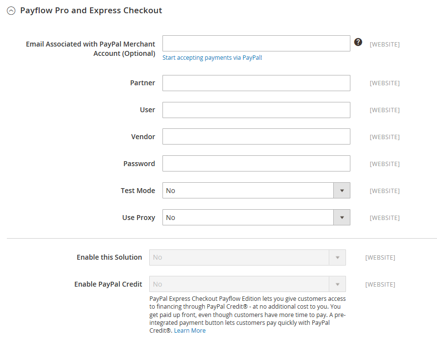

# [!UICONTROL Sales] > [!UICONTROL Payment Methods] >  [!UICONTROL PayPal Payflow Pro]

>[!IMPORTANT]
>
>**PSD2-Anforderungen:**  
>Ab dem 14. September 2019 können europäische Banken Zahlungen ablehnen, die [PSD2}-](../../getting-started/compliance-payment-services-directive.md) nicht erfüllen. Um PSD2 zu erfüllen, müssen [!DNL PayPal Payflow Pro] in [!DNL Cardinal Commerce] integriert sein. Weitere Informationen finden Sie unter [3-D Secure for Payflow](https://developer.paypal.com/api/nvp-soap/payflow/3d-secure-overview/).

{{config}}

## [!UICONTROL Required Settings]

<!-- zoom -->

| Feld | [Umfang](../../getting-started/websites-stores-views.md#scope-settings) | Beschreibung |
|--- |--- |--- |
| [!UICONTROL Email Associated with PayPal Merchant Account] | Website | (Optional) Alle E-Mail-Adressen, die mit Ihrem PayPal-Händlerkonto verknüpft sind. Bei E-Mail-Adressen wird zwischen Groß- und Kleinschreibung unterschieden und sie müssen genau mit den Adressen in Ihrem Konto übereinstimmen. |
| [!UICONTROL Partner] | Website | Ihre PayPal Partner ID, falls zutreffend. |
| [!UICONTROL Vendor] | Website | Ihr PayPal-Benutzername. |
| Benutzer | Website | Die ID eines anderen Benutzers auf Ihrem PayPal-Konto. |
| [!UICONTROL Password] | Website | Das Passwort, das Ihrem PayPal-Händlerkonto zugeordnet ist. |
| [!UICONTROL Test Mode] | Website | Nach der Aktivierung führt PayPal Payflow Pro in einer Testumgebung aus. Deaktivieren Sie den Testmodus, wenn Sie im Produktionsmodus bereit für die Live-Schaltung sind. Optionen: `Yes` / `No` |
| [!UICONTROL Use Proxy] | Website | Ein Proxy kann verwendet werden, um Traffic umzuleiten, wenn die Server-Firewall den direkten Zugriff auf den PayPal-Server verhindert. Gibt ggf. den Proxy-Server an, der zum Herstellen einer Verbindung mit dem PayPal-Server verwendet wird. Optionen: `Yes` / `No`   Wenn aktiviert, die Proxy-Optionen festlegen:  **`Proxy Host`**- Die IP-Adresse des Proxy-Hosts. **`Proxy Port`** - Die Nummer des Proxy-Ports. |
| [!UICONTROL Enable this Solution] | Website | Bestimmt, ob PayPal Payflow Pro für Ihre Kunden als Zahlungsmethode verfügbar ist. |
| [!UICONTROL Enable PayPal Credit] | Website | Legt fest, ob Ihren Kunden PayPal-Guthaben als Zahlungsoption zur Verfügung steht. |

{style="table-layout:auto"}

## [!UICONTROL Advertise PayPal Credit]

<!-- zoom -->

| Feld | [Umfang](../../getting-started/websites-stores-views.md#scope-settings) | Beschreibung |
|--- |--- |--- |
| [!UICONTROL Publisher ID] | Website | Die mit Ihrem PayPal-Guthabenkonto verknüpfte Publisher-ID. |
| [!UICONTROL Get Publisher ID from PayPal] |  | Ruft Ihre Publisher-ID von PayPal ab. |
| [!UICONTROL Home Page] | Website | Bestimmt die Position und Größe des [!DNL PayPal Credit] auf der Startseite. Optionen:  **`Display`**- Bestimmt, ob [!DNL PayPal Credit] Banner auf der Startseite Ihres Stores angezeigt wird. Optionen: `Yes` / `No` **`Position`** - Bestimmt die Position des [!DNL PayPal Credit] auf der Startseite. Optionen: Kopfzeile (Mitte) / Seitenleiste (rechts)  **`Size`**- Bestimmt die Größe des [!DNL PayPal Credit] auf der Startseite. Optionen: `190 x 100` / `234 x 60` / `300 x 50` / `468 x 60` / `728 x 90` /` 800 x 66` |
| [!UICONTROL Catalog Category Page] | Website | Bestimmt die Position und Größe des [!DNL PayPal Credit] Banners auf Kategorieseiten. Optionen: (identisch mit [!UICONTROL Home Page]) |
| [!UICONTROL Catalog Product Page] | Website | Bestimmt die Position und Größe des [!DNL PayPal Credit] auf Produktseiten. Optionen: (identisch mit [!UICONTROL Home Page]) |
| [!UICONTROL Checkout Cart Page] | Website | Bestimmt die Position und Größe des [!DNL PayPal Credit] Banners auf der Warenkorbseite. Optionen: (identisch mit [!UICONTROL Home Page]) |

{style="table-layout:auto"}

## [!UICONTROL Basic Settings - PayPal Payflow Pro]

<!-- zoom -->

| Feld | [Umfang](../../getting-started/websites-stores-views.md#scope-settings) | Beschreibung |
|--- |--- |--- |
| [!UICONTROL Title] | Shop-Ansicht | Ein Name, der PayPal Payflow Pro während des Checkouts als Zahlungsmethode identifiziert. |
| [!UICONTROL Sort Order] | Shop-Ansicht | Eine Zahl, die die Reihenfolge bestimmt, in der PayPal Payflow Pro angezeigt wird, wenn sie mit anderen Zahlungsmethoden beim Checkout aufgelistet wird. |
| [!UICONTROL Payment Action] | Website | Bestimmt die Aktion, die PayPal bei der Übermittlung einer Bestellung durchführt. Optionen:  **`Authorization`**- Genehmigt den Kauf, setzt jedoch die Mittel zurück. Der Betrag wird erst abgehoben, wenn er vom Händler „eingezogen“ wurde. **`Sale`** - Der Betrag des Kaufs wird autorisiert und sofort vom Konto des Kunden zurückgezogen. |
| **[!UICONTROL Credit Card Settings]** |  |  |
| [!UICONTROL Allowed Credit Cart Types] | Website | Legt fest, welche Kreditkarten Kunden beim Checkout zur Verfügung stehen. Wählen Sie jede unterstützte Karte aus. Optionen: `American Express` (erfordert eine zusätzliche Vereinbarung) / `Visa` / `MasterCard` / `Discover` / `JCB` |

{style="table-layout:auto"}

## [!UICONTROL Advanced Settings]

<!-- zoom -->

| Feld | [Umfang](../../getting-started/websites-stores-views.md#scope-settings) | Beschreibung |
|--- |--- |--- |
| In Warenkorb anzeigen | Shop-Ansicht | Bestimmt, ob der PayPal Express-Checkout als Zahlungsoption im Warenkorb angezeigt wird. Optionen: Ja (empfohlen) / Nein |
| [!UICONTROL Payment Action Applicable From] | Website | Bestimmt den Bereich der entsprechenden Länderauswahl. Optionen: Alle zulässigen Länder/bestimmte Länder |
| [!UICONTROL Countries Payment Applicable From] | Website | Gibt jedes Land an, aus dem die Zahlung akzeptiert wird. Nur Kunden mit einer Rechnungsadresse in einem ausgewählten Land können mit dieser Zahlungsmethode Einkäufe tätigen. |
| [!UICONTROL Debug Mode] | Website | Zeichnet Nachrichten, die zwischen Ihrem Geschäft und dem PayPal-Zahlungssystem gesendet werden, in einer Protokolldatei auf. Optionen: `Yes` / `No`   **_Hinweis:_**Die Protokolldatei wird auf dem Server gespeichert und ist nur für Entwickler zugänglich. In Übereinstimmung mit den PCI Data Security Standards werden Kreditkarteninformationen nicht in der Protokolldatei aufgezeichnet. |
| [!UICONTROL Enable SSL Verification] | Website | Ermöglicht die Überprüfung des Host-Sicherheitszertifikats. Optionen: `Yes` / `No` |
| [!UICONTROL Transfer Cart Line Items] | Website | Zeigt eine vollständige Zusammenfassung der Zeileneinträge aus dem Warenkorb des Kunden auf der PayPal-Website an. Optionen: `Yes` / `No` |
| [!UICONTROL Skip Order Review Step] | Website | Legt fest, ob Kundinnen und Kunden die Transaktion über die PayPal-Website abschließen können oder verpflichtet sind, zu Ihrem Geschäft zurückzukehren und den Schritt zur Bestellüberprüfung auszuführen, bevor sie die Bestellung übermitteln. Optionen: `Yes` / `No` |

{style="table-layout:auto"}
