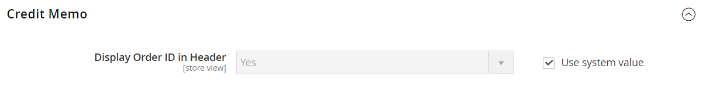

# [!UICONTROL Sales] > [!UICONTROL PDF Print-outs]

{{config}}

<!-- [Invoice](https://docs.magento.com/user-guide/marketing/sales-documents-ref-id.html) -->

## [!UICONTROL Invoice]

<!-- zoom -->

| Feld | [Umfang](../../getting-started/websites-stores-views.md#scope-settings) | Beschreibung |
|--- |--- |--- |
| [!UICONTROL Display Order ID in Header] | Store-Ansicht | Enthält die Bestell-ID in der Kopfzeile der Rechnungen als Referenz. Optionen: `Yes` / `No` |

{style="table-layout:auto"}

## [!UICONTROL Shipment]

<!-- zoom -->

| Feld | [Umfang](../../getting-started/websites-stores-views.md#scope-settings) | Beschreibung |
|--- |--- |--- |
| [!UICONTROL Display Order ID in Header] | Store-Ansicht | Enthält die Bestellkennung in der Kopfzeile der Lieferscheine zur Referenz. Optionen: `Yes` / `No` |

{style="table-layout:auto"}

## [!UICONTROL Credit Memo]

<!-- zoom -->

| Feld | [Umfang](../../getting-started/websites-stores-views.md#scope-settings) | Beschreibung |
|--- |--- |--- |
| [!UICONTROL Display Order ID in Header] | Store-Ansicht | Beinhaltet die Bestell-ID in der Kopfzeile der Kreditkarten als Referenz. Optionen: `Yes` / `No` |

{style="table-layout:auto"}
