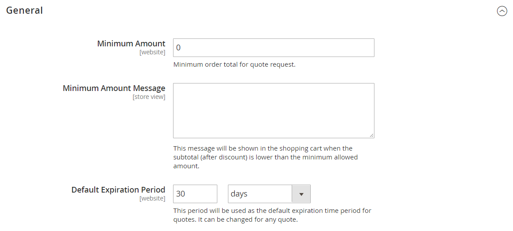

# [!UICONTROL Sales] > [!UICONTROL Quotes]

{{b2b-feature}}

>[!TIP]
>
>Mit der Installation und Aktivierung von Adobe Commerce B2B kann das Kauferlebnis mit unternehmensspezifischen Funktionen personalisiert werden. Adobe Commerce B2B ist eine integrierte Lösung, die sowohl B2B- als auch B2C-Modelle unterstützt. Weitere Informationen zu den B2B-Funktionen finden Sie im [Adobe Commerce B2B-Benutzerhandbuch](https://experienceleague.adobe.com/docs/commerce-admin/b2b/introduction.html).

{{config}}

<!-- [Quotes](https://experienceleague.adobe.com/en/docs/commerce-admin/b2b/quotes/quotes) -->

## [!UICONTROL General]

<!-- zoom -->

| Feld | [Umfang](../../getting-started/websites-stores-views.md#scope-settings) | Beschreibung |
|--- |--- |--- |
| [!UICONTROL Minimum Amount] | Website | Der Mindestbetrag der Zwischensumme des Warenkorbs nach allen Rabatten, der erforderlich ist, bevor ein Kunde eine Angebotsanfrage einreichen kann. Standardwert: `0` |
| [!UICONTROL Minimum Amount Message] | Shop-Ansicht | Die Nachricht, die im Warenkorb angezeigt wird, wenn ein Kunde versucht, eine Angebotsanfrage einzureichen, aber der erforderliche Mindestbetrag nicht erreicht wurde. |
| [!UICONTROL Default Expiration Period] | Website | Bestimmt die standardmäßige Lebensdauer eines [Angebots](../../b2b/quote-price-negotiation.md) als Zeitraum ab dem Datum, an dem die Angebotsanfrage gesendet wird. Optionen: `Days` / `Weeks` / `Months` |

{style="table-layout:auto"}

## [!UICONTROL Attached Files]

<!-- zoom -->

| Feld | [Umfang](../../getting-started/websites-stores-views.md#scope-settings) | Beschreibung |
|--- |--- |--- |
| [!UICONTROL File formats for upload] | Global | Legt die Dateiformate fest, die an ein Angebot angehängt werden können. Unterstützte Standardwerte: `doc`, `docx`, `xls`, `xlsx`, `pdf`, `txt`, `jpg`, `png` und `jpeg` |
| [!UICONTROL Maximum file size] | Global | Bestimmt die maximale Größe für eine Datei, die an ein Angebot angehängt ist. Diese Einstellung kann von der Server-Konfiguration überschrieben werden. |

{style="table-layout:auto"}
