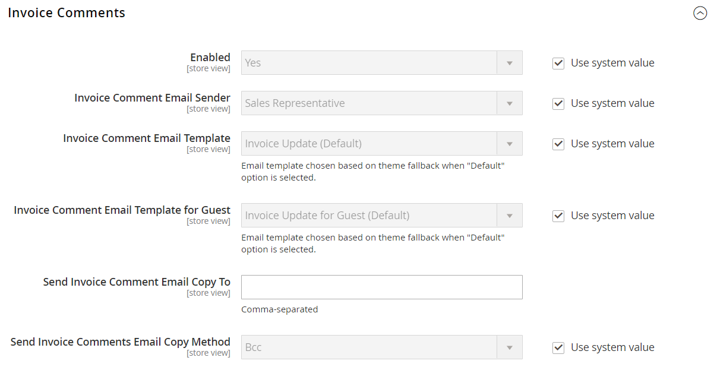
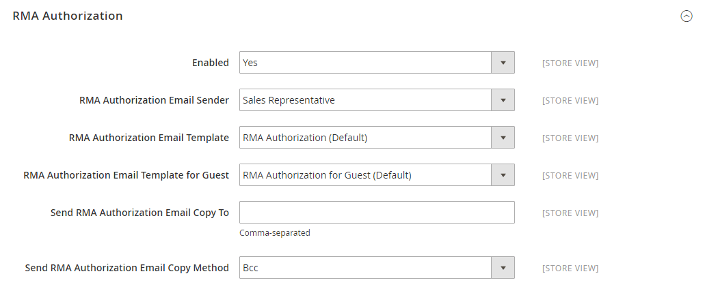

# [!UICONTROL Sales] > [!UICONTROL Sales Emails]

{{config}}

## [!UICONTROL General Settings]

<!-- zoom -->

<!-- [General Settings](https://experienceleague.adobe.com/de/docs/commerce-admin/systems/communications/email-communications) -->

| Feld | [Umfang](../../getting-started/websites-stores-views.md#scope-settings) | Beschreibung |
|--- |--- |--- |
| [!UICONTROL Asynchronous sending] | Global | Bestimmt, ob Verkaufs-E-Mails asynchron gesendet werden. Es wird empfohlen, das asynchrone Senden zu aktivieren. Optionen:  **`Disable`**- (Standard) Verkaufs-E-Mails werden gesendet, wenn sie durch ein Ereignis ausgelöst werden. **`Enable`** - (Empfohlen) Verkaufs-E-Mails werden in vorab festgelegten, regelmäßigen Abständen gesendet. |

{style="table-layout:auto"}

## [!UICONTROL Order]

<!-- zoom -->

<!-- [Order](https://experienceleague.adobe.com/de/docs/commerce-admin/stores-sales/order-management/orders/orders) -->

| Feld | [Umfang](../../getting-started/websites-stores-views.md#scope-settings) | Beschreibung |
|--- |--- |--- |
| [!UICONTROL Enabled] | Shop-Ansicht | Wenn diese Option aktiviert ist, sendet für jede aufgegebene Bestellung eine Transaktions-E-Mail. Optionen: `Yes` / `No` |
| [!UICONTROL New Order Confirmation Email Sender] | Shop-Ansicht | Identifiziert den Store-Kontakt, der als Absender der Nachricht angezeigt wird. Standardabsender: `Sales Representative` |
| [!UICONTROL New Order Confirmation Template] | Shop-Ansicht | Identifiziert die Vorlage, die zur Bestätigung neuer Bestellungen von Kunden gesendet wird. Standardvorlage: `New Order` |
| [!UICONTROL New Order Confirmation Template for Guest] | Shop-Ansicht | Identifiziert die Vorlage, die zur Bestätigung neuer Bestellungen von Gästen gesendet wird. Standardvorlage: `New Order for Guest` |
| [!UICONTROL Send Order Email Copy To] | Shop-Ansicht | Gibt die E-Mail-Adresse eines jeden an, der eine Kopie einer E-Mail zur Bestellung erhalten soll. Trennen Sie mehrere Adressen durch ein Komma. |
| [!UICONTROL Send Order Email Copy Method] | Shop-Ansicht | Gibt die E-Mail-Methode an, die zum Senden der Kopie verwendet wird. Zu den Optionen gehören:  **`Bcc`**- Sendet eine Blindkopie, indem der Empfänger in die Kopfzeile derselben E-Mail eingefügt wird, die an den Kunden gesendet wird. Der BCC-Empfänger ist für den Kunden nicht sichtbar. **`Separate Email`** - Sendet die Kopie als separate E-Mail. |

{style="table-layout:auto"}

## [!UICONTROL Order Comments]

<!-- zoom -->

<!-- [Order Comments](https://experienceleague.adobe.com/de/docs/commerce-admin/stores-sales/order-management/orders/order-processing#process-an-order) -->

| Feld | [Umfang](../../getting-started/websites-stores-views.md#scope-settings) | Beschreibung |
|--- |--- |--- |
| [!UICONTROL Enabled] | Shop-Ansicht | Wenn diese Option aktiviert ist, sendet für jeden Bestellkommentar eine Transaktions-E-Mail. Optionen: `Yes` / `No` |
| [!UICONTROL Order Comment Email Sender] | Shop-Ansicht | Identifiziert den Store-Kontakt, der als Absender der Nachricht angezeigt wird. Standardabsender: `Sales Representative` |
| [!UICONTROL Order Comment Email Template] | Shop-Ansicht | Identifiziert die Vorlage, die gesendet wird, wenn ein Kommentar zu einer Kundenbestellung hinzugefügt wird. Standardvorlage: `Order Update` |
| [!UICONTROL New Order Confirmation Template for Guest] | Shop-Ansicht | Identifiziert die Vorlage, die gesendet wird, wenn ein Kommentar zu einer Gastbestellung hinzugefügt wird. Standardvorlage: `Order Update for Guest` |
| [!UICONTROL Send Order Email Copy To|Store View] | Stellt die E-Mail-Adresse eines jeden bereit, der eine Kopie einer E-Mail mit einem Bestellkommentar erhält. Trennen Sie mehrere Adressen durch ein Komma. |
| [!UICONTROL Send Order Email Copy Method] | Shop-Ansicht | Gibt die Methode an, die zum Senden der Kopie verwendet wird. Zu den Optionen gehören:  **`Bcc`**- Sendet eine Blindkopie, indem der Empfänger in die Kopfzeile derselben E-Mail eingefügt wird, die an den Kunden gesendet wird. Der BCC-Empfänger ist für den Kunden nicht sichtbar. **`Separate Email`** - Sendet die Kopie als separate E-Mail. |

{style="table-layout:auto"}

## [!UICONTROL Invoice]

<!-- zoom -->

<!-- [Invoice](https://experienceleague.adobe.com/de/docs/commerce-admin/stores-sales/order-management/invoices) -->

| Feld | [Umfang](../../getting-started/websites-stores-views.md#scope-settings) | Beschreibung |
|--- |--- |--- |
| [!UICONTROL Enabled] | Shop-Ansicht | Wenn diese Option aktiviert ist, sendet für jede generierte Rechnung eine Transaktions-E-Mail. Optionen: `Yes` / `No` |
| [!UICONTROL Invoice Email Sender] | Shop-Ansicht | Identifiziert den Store-Kontakt, der als Absender der Nachricht angezeigt wird. Standardabsender: `Sales Representative` |
| [!UICONTROL Invoice Email Template] | Shop-Ansicht | Identifiziert die Vorlage, die gesendet wird, wenn eine Rechnung für einen Kunden generiert wird. Standardvorlage: `New Invoice` |
| [!UICONTROL Invoice Email Template for Guest] | Shop-Ansicht | Identifiziert die Vorlage, die gesendet wird, wenn eine Rechnung für einen Gast generiert wird. Standardvorlage: `New Invoice for Guest` |
| [!UICONTROL Send Invoice Email Copy To] | Shop-Ansicht | Gibt die E-Mail-Adresse eines jeden an, der eine Kopie einer Rechnungs-E-Mail erhalten soll. Trennen Sie mehrere Adressen durch ein Komma. |
| [!UICONTROL Send Invoice Email Copy Method] | Shop-Ansicht | Gibt die Methode an, die zum Senden der Kopie verwendet wird. Zu den Optionen gehören:  **`Bcc`**- Sendet eine Blindkopie, indem der Empfänger in die Kopfzeile derselben E-Mail eingefügt wird, die an den Kunden gesendet wird. Der BCC-Empfänger ist für den Kunden nicht sichtbar. **`Separate Email`** - Sendet die Kopie als separate E-Mail. |

{style="table-layout:auto"}

## [!UICONTROL Invoice Comments]

<!-- zoom -->

<!-- [Invoice Comments](https://experienceleague.adobe.com/de/docs/commerce-admin/stores-sales/order-management/invoices#create-an-invoice) -->

| Feld | [Umfang](../../getting-started/websites-stores-views.md#scope-settings) | Beschreibung |
|--- |--- |--- |
| [!UICONTROL Enabled] | Shop-Ansicht | Wenn diese Option aktiviert ist, sendet für jeden Rechnungskommentar eine Transaktions-E-Mail. Optionen: `Yes` / `No` |
| [!UICONTROL Invoice Comment Email Sender] | Shop-Ansicht | Identifiziert den Store-Kontakt, der als Absender der Nachricht angezeigt wird. Standardabsender: `Sales Representative` |
| [!UICONTROL Invoice Comment Email Template] | Shop-Ansicht | Identifiziert die Vorlage, die gesendet wird, wenn ein Kommentar zu einer Kundenrechnung hinzugefügt wird. Standardvorlage: `Invoice Update` |
| [!UICONTROL Invoice Comment Email Template for Guest] | Shop-Ansicht | Identifiziert die Vorlage, die gesendet wird, wenn ein Kommentar zu einer Gastrechnung hinzugefügt wird. Standardvorlage: `Invoice Update for Guest` |
| [!UICONTROL Send Invoice Comment Email Copy To] | Shop-Ansicht | Gibt die E-Mail-Adresse eines jeden an, der eine Kopie einer E-Mail mit einem Rechnungskommentar erhalten soll. Trennen Sie mehrere Adressen durch ein Komma. |
| [!UICONTROL Send Invoice Comments Email Copy Method] | Shop-Ansicht | Gibt die E-Mail-Methode an, die zum Senden der Kopie verwendet wird. Zu den Optionen gehören:  **`Bcc`**- Sendet eine Blindkopie, indem der Empfänger in die Kopfzeile derselben E-Mail eingefügt wird, die an den Kunden gesendet wird. Der BCC-Empfänger ist für den Kunden nicht sichtbar. **`Separate Email`** - Sendet die Kopie als separate E-Mail. |

{style="table-layout:auto"}

## [!UICONTROL Shipment]

<!-- zoom -->

<!-- [Shipment](https://experienceleague.adobe.com/de/docs/commerce-admin/stores-sales/order-management/shipments) -->

| Feld | [Umfang](../../getting-started/websites-stores-views.md#scope-settings) | Beschreibung |
|--- |--- |--- |
| [!UICONTROL Enabled] | Shop-Ansicht | Wenn diese Option aktiviert ist, sendet für jede erzeugte Sendung eine Transaktions-E-Mail. Optionen: `Yes` / `No` |
| [!UICONTROL Shipment Email Sender] | Shop-Ansicht | Identifiziert den Store-Kontakt, der als Absender der Nachricht angezeigt wird. Standardabsender: `Sales Representative` |
| [!UICONTROL Shipment Email Template] | Shop-Ansicht | Identifiziert die Vorlage, die gesendet wird, wenn eine Sendung für einen Kunden generiert wird. Standardvorlage: `New Shipment` |
| [!UICONTROL Shipment Email Template for Guest] | Shop-Ansicht | Identifiziert die Vorlage, die gesendet wird, wenn eine Sendung für einen Gast generiert wird. Standardvorlage: `New Shipment for Guest` |
| [!UICONTROL Send Shipment Email Copy To] | Shop-Ansicht | Stellt die E-Mail-Adresse einer Person bereit, die eine Kopie einer Versand-E-Mail erhalten soll. Trennen Sie mehrere Adressen durch ein Komma. |
| [!UICONTROL Send Shipment Email Copy Method] | Shop-Ansicht | Gibt die Methode an, die zum Senden der Kopie verwendet wird. Zu den Optionen gehören:  **`Bcc`**- Sendet eine Blindkopie, indem der Empfänger in die Kopfzeile derselben E-Mail eingefügt wird, die an den Kunden gesendet wird. Der BCC-Empfänger ist für den Kunden nicht sichtbar. **`Separate Email`** - Sendet die Kopie als separate E-Mail. |

{style="table-layout:auto"}

## [!UICONTROL Shipment Comments]

<!-- zoom -->

<!-- [Shipment Comments](https://experienceleague.adobe.com/de/docs/commerce-admin/stores-sales/order-management/shipments) -->

| Feld | [Umfang](../../getting-started/websites-stores-views.md#scope-settings) | Beschreibung |
|--- |--- |--- |
| [!UICONTROL Enabled] | Shop-Ansicht | Wenn diese Option aktiviert ist, sendet für jeden Versandkommentar eine Transaktions-E-Mail. Optionen: `Yes` / `No` |
| [!UICONTROL Shipment Comment Email Sender] | Shop-Ansicht | Identifiziert den Store-Kontakt, der als Absender der Nachricht angezeigt wird. Standardabsender: `Sales Representative` |
| [!UICONTROL Shipment Comment Email Template] | Shop-Ansicht | Identifiziert die Vorlage, die gesendet wird, wenn ein Kommentar zu einer Kundenlieferung hinzugefügt wird. Standardvorlage: `Shipment Update` |
| [!UICONTROL Shipment Comment Email Template for Guest] | Shop-Ansicht | Identifiziert die Vorlage, die gesendet wird, wenn ein Kommentar zu einer Gastsendung hinzugefügt wird. Standardvorlage: `Shipment Update for Guest` |
| [!UICONTROL Send Shipment Comment Email Copy To] | Shop-Ansicht | Stellt die E-Mail-Adresse eines jeden bereit, der eine Kopie einer E-Mail mit einem Versandkommentar erhält. Trennen Sie mehrere Adressen durch ein Komma. |
| [!UICONTROL Send Shipment Comments Email Copy Method] | Shop-Ansicht | Gibt die E-Mail-Methode an, die zum Senden der Kopie verwendet wird. Zu den Optionen gehören:  **`Bcc`**- Sendet eine Blindkopie, indem der Empfänger in die Kopfzeile derselben E-Mail eingefügt wird, die an den Kunden gesendet wird. Der BCC-Empfänger ist für den Kunden nicht sichtbar. **`Separate Email`** - Sendet die Kopie als separate E-Mail. |

{style="table-layout:auto"}

## [!UICONTROL Credit Memo]

<!-- zoom -->

<!-- [Credit Memo](https://experienceleague.adobe.com/de/docs/commerce-admin/stores-sales/order-management/credit-memos/credit-memos) -->

| Feld | [Umfang](../../getting-started/websites-stores-views.md#scope-settings) | Beschreibung |
|--- |--- |--- |
| [!UICONTROL Enabled] | Shop-Ansicht | Aktiviert die Transaktions-E-Mail für jede generierte Gutschrift. Optionen: `Yes` / `No` |
| [!UICONTROL Credit Memo Email Sender] | Shop-Ansicht | Identifiziert den Store-Kontakt, der als Absender der Nachricht angezeigt wird. Standardabsender: `Sales Representative` |
| [!UICONTROL Credit Memo Email Template] | Shop-Ansicht | Gibt die Vorlage an, die gesendet wird, wenn eine Gutschrift für einen Kunden generiert wird. Standardvorlage: `New Credit Memo` |
| [!UICONTROL Credit Memo Email Template for Guest] | Shop-Ansicht | Identifiziert die Vorlage, die gesendet wird, wenn eine Gutschrift für einen Gast generiert wird. Standardvorlage: `New Credit Memo for Guest` |
| [!UICONTROL Send Credit Memo Email Copy To] | Shop-Ansicht | Bietet die E-Mail-Adresse von allen Benutzern, die eine Kopie einer Gutschriftsnachricht-E-Mail erhalten sollen. Trennen Sie mehrere Adressen durch ein Komma. |
| [!UICONTROL Send Credit Memo Email Copy Method] | Shop-Ansicht | Gibt die Methode an, die zum Senden der Kopie verwendet wird. Zu den Optionen gehören:  **`Bcc`**- Sendet eine Blindkopie, indem der Empfänger in die Kopfzeile derselben E-Mail eingefügt wird, die an den Kunden gesendet wird. Der BCC-Empfänger ist für den Kunden nicht sichtbar. **`Separate Email`** - Sendet die Kopie als separate E-Mail. |

{style="table-layout:auto"}

## [!UICONTROL Credit Memo Comments]

<!-- zoom -->

<!-- [Credit Memo Comments](https://experienceleague.adobe.com/de/docs/commerce-admin/stores-sales/order-management/credit-memos/credit-memo-create) -->

| Feld | [Umfang](../../getting-started/websites-stores-views.md#scope-settings) | Beschreibung |
|--- |--- |--- |
| [!UICONTROL Enabled] | Shop-Ansicht | Wenn diese Option aktiviert ist, sendet für jeden Kommentar einer Gutschrift eine Transaktions-E-Mail. Optionen: `Yes` / `No` |
| [!UICONTROL Credit Memo Comment Email Sender] | Shop-Ansicht | Identifiziert den Store-Kontakt, der als Absender der Nachricht angezeigt wird. Standardabsender: `Sales Representative` |
| [!UICONTROL Credit Memo Comment Email Template] | Shop-Ansicht | Identifiziert die Vorlage, die gesendet wird, wenn ein Kommentar zu einer Gutschrift eines Kunden hinzugefügt wird. Standardvorlage: `Credit Memo Update` |
| [!UICONTROL Credit Memo Comment Email Template for Guest] | Shop-Ansicht | Identifiziert die Vorlage, die gesendet wird, wenn ein Kommentar zu einer Gastgutschrift hinzugefügt wird. Standardvorlage: `Credit Memo Update for Guest` |
| [!UICONTROL Send Credit Memo Comment Email Copy To] | Shop-Ansicht | Gibt die E-Mail-Adresse eines jeden an, der eine Kopie einer E-Mail mit einem Gutschriftskommentar erhalten soll. Trennen Sie mehrere Adressen durch ein Komma. |
| [!UICONTROL Send Credit Memo Comments Email Copy Method] | Shop-Ansicht | Gibt die E-Mail-Methode an, die zum Senden der Kopie verwendet wird. Zu den Optionen gehören:  **`Bcc`**- Sendet eine Blindkopie, indem der Empfänger in die Kopfzeile derselben E-Mail eingefügt wird, die an den Kunden gesendet wird. Der BCC-Empfänger ist für den Kunden nicht sichtbar. **`Separate Email`** - Sendet die Kopie als separate E-Mail. |

{style="table-layout:auto"}

## [!UICONTROL Order Ready For Pickup in Store]

Für diese Option muss [Inventory management](../../inventory-management/guide-overview.md) aktiviert sein.

<!-- zoom -->

<!-- [Order Ready For Pickup in Store](https://experienceleague.adobe.com/de/docs/commerce-admin/stores-sales/delivery/basic-methods/shipping-in-store-delivery) -->

| Feld | [Umfang](../../getting-started/websites-stores-views.md#scope-settings) | Beschreibung |
|--- |--- |--- |
| [!UICONTROL Enabled] | Shop-Ansicht | Wenn diese Option aktiviert ist, sendet eine Transaktions-E-Mail, wenn eine Bestellung für die Abholung im Geschäft bereit ist. Optionen: `Yes` / `No` |
| [!UICONTROL Order Ready For Pickup Email Sender] | Shop-Ansicht | Identifiziert den Store-Kontakt, der als Absender der Nachricht angezeigt wird. Standardabsender: `General Contact` |
| [!UICONTROL Order Ready For Pickup Email Template] | Shop-Ansicht | Identifiziert die Vorlage, die für die Transaktions-E-Mail für jede Bestellung verwendet wird, die für einen registrierten Kunden zur Abholung bereit ist. Standardvorlage: `Order is Ready for Pickup` |
| [!UICONTROL Order Ready For Pickup Email Template for Guest] | Shop-Ansicht | Identifiziert die Vorlage, die für die Transaktions-E-Mail für jede Bestellung verwendet wird, die für einen Gast zur Abholung bereit ist. Standardvorlage: `Order is Ready for Pickup for Guest` |
| Bestellung bereit für Abholung per E-Mail senden an | Shop-Ansicht | Gibt die E-Mail-Adresse eines Empfängers an, der eine Kopie einer E _Mail mit dem Status „Bestellung bereit für Abholung_ erhalten möchte. Trennen Sie mehrere Adressen durch ein Komma. |
| [!UICONTROL Send Order Ready For Pickup Email Copy Method] | Shop-Ansicht | Gibt die E-Mail-Methode an, die zum Senden der Kopie verwendet wird. Optionen:  **`Bcc`**- Sendet eine Blindkopie, indem der Empfänger in die Kopfzeile derselben E-Mail eingefügt wird, die an den Kunden gesendet wird. Der BCC-Empfänger ist für den Kunden nicht sichtbar. **`Separate Email`** - Sendet die Kopie als separate E-Mail. |

{style="table-layout:auto"}

## [!UICONTROL Purchase Order Approval]

{{b2b-feature}}

<!-- zoom -->

| Feld | [Umfang](../../getting-started/websites-stores-views.md#scope-settings) | Beschreibung |
|--- |--- |--- |
| [!UICONTROL Enabled] | Shop-Ansicht | Wenn diese Option aktiviert ist, sendet während des Bestellvorgangs E-Mails. Optionen: `Yes` / `No` |
| [!UICONTROL Created and requires Approval Purchase Order (to Buyer)] | Shop-Ansicht | Sendet eine E-Mail-Bestätigung an den Ersteller der Bestellung. |
| [!UICONTROL Created and Automatically approved Purchase Order (to Buyer)] | Shop-Ansicht | Sendet eine E-Mail-Bestätigung an den Ersteller der Bestellung. |
| [!UICONTROL Approved Purchase Order (to Buyer)] | Shop-Ansicht | Sendet bei Bestellgenehmigung eine E-Mail an die erstellende Person. |
| [!UICONTROL Rejected Purchase Order (to Buyer)] | Shop-Ansicht | Sendet eine E-Mail an die erstellende Person, wenn die Bestellung abgelehnt wurde. |
| [!UICONTROL Comment added to Purchase Order] | Shop-Ansicht | Sendet eine E-Mail an die erstellende Person, wenn ein Kommentar zur Bestellung hinzugefügt wurde. |
| [!UICONTROL Error creating Order from Purchase Order (to Buyer)] | Shop-Ansicht | Benachrichtigt den Ersteller, dass bei der Konvertierung einer Bestellung in eine Bestellung ein Fehler aufgetreten ist. |
| [!UICONTROL Purchase Order required Approval (to Approver)] | Shop-Ansicht | Sendet eine E-Mail, um die genehmigende Person darüber zu informieren, dass die Bestellung ihre Genehmigung erfordert. |

{style="table-layout:auto"}

## [!UICONTROL Quote]

{{b2b-feature}}

<!-- zoom -->

<!-- [Quotes](https://experienceleague.adobe.com/de/docs/commerce-admin/b2b/quotes/account-dashboard-my-quotes) -->

| Feld | [Umfang](../../getting-started/websites-stores-views.md#scope-settings) | Beschreibung |
|--- |--- |--- |
| [!UICONTROL Enabled] | Shop-Ansicht | Ermöglicht den Versand von E-Mail-Nachrichten zu Angeboten über die aktuelle Store-Ansicht. Optionen: `Yes` / `No` |
| [!UICONTROL Updated Quote Template (to Buyer)] | Shop-Ansicht | Bestimmt die E-Mail-Vorlage, die für die Benachrichtigung verwendet wird, die an den Käufer gesendet wird, wenn ein aktualisiertes Angebot verfügbar ist. Standardvorlage: `Updated Quote` |
| [!UICONTROL Declined Quote Template (to Buyer)] | Shop-Ansicht | Bestimmt die E-Mail-Vorlage, die für die Benachrichtigung verwendet wird, die an den Käufer gesendet wird, wenn ein Angebot abgelehnt wird. Standardvorlage: `Declined Quote` |
| [!UICONTROL New Quote Template (to Seller)] | Shop-Ansicht | Bestimmt die E-Mail-Vorlage, die für die Benachrichtigung verwendet wird, die an den Verkäufer gesendet wird, wenn eine Anforderung für ein neues Angebot empfangen wird. Standardvorlage: `New Quote` |
| [!UICONTROL Updated Quote Template (to Seller)] | Shop-Ansicht | Bestimmt die E-Mail-Vorlage, die für die Benachrichtigung verwendet wird, die an den Verkäufer gesendet wird, wenn ein aktualisiertes Angebot empfangen wird. Standardvorlage: `Updated Quote` |
| [!UICONTROL Quote Expiration (in 48 hrs)] | Shop-Ansicht | Gibt die E-Mail-Vorlage an, die für den 48 Stunden vor Ablauf des Angebots gesendeten Ablaufhinweis verwendet wird. Standardvorlage: `Expiration Warning` |
| [!UICONTROL Quote Expiration (in 24 hrs)] | Shop-Ansicht | Gibt die E-Mail-Vorlage an, die für den 24 Stunden vor Ablauf des Angebots gesendeten Ablaufhinweis verwendet wird. Standardvorlage: `Expiration Warning 1` |
| [!UICONTROL Expiration Date Reset] | Shop-Ansicht | Gibt die E-Mail-Vorlage an, die für die Benachrichtigung verwendet wird, die gesendet wird, wenn sich das Ablaufdatum ändert. Standardvorlage: `Expiration Date Reset` |
| [!UICONTROL Send Quote Email Copy To] | Shop-Ansicht | Gibt die E-Mail-Adresse jeder Person an, die eine Kopie der Angebots-E-Mail erhalten soll. Trennen Sie mehrere Adressen durch ein Komma. |
| [!UICONTROL Send Quote Email Copy Method] | Shop-Ansicht | Gibt die E-Mail-Methode an, die zum Senden der Kopie verwendet wird. Zu den Optionen gehören:  **`Bcc`**- Sendet eine Blindkopie, indem der Empfänger in die Kopfzeile derselben E-Mail eingefügt wird, die an den Kunden gesendet wird. Der BCC-Empfänger ist für den Kunden nicht sichtbar. **`Separate Email`** - Sendet die Kopie als separate E-Mail. |

{style="table-layout:auto"}

## [!UICONTROL RMA]

{{ee-feature}}

<!-- zoom -->

<!-- [RMA](https://experienceleague.adobe.com/de/docs/commerce-admin/stores-sales/order-management/returns/returns) -->

| Feld | [Umfang](../../getting-started/websites-stores-views.md#scope-settings) | Beschreibung |
|--- |--- |--- |
| [!UICONTROL Enabled] | Shop-Ansicht | Aktiviert die E-Mail-Benachrichtigung für jede generierte RMA. Optionen: `Yes` / `No` |
| [!UICONTROL RMA Email Sender] | Shop-Ansicht | Identifiziert den [Store-Kontakt](../../getting-started/store-details.md#store-email-addresses) der als Absender der Nachricht angezeigt wird. Standardwert: `Sales Representative` |
| [!UICONTROL RMA Email Template] | Shop-Ansicht | Bestimmt die [E-Mail-](../../systems/email-templates.md)), die für die Benachrichtigung verwendet wird, die gesendet wird, wenn eine RMA für einen Kunden generiert wird. Standardvorlage: `New RMA` |
| [!UICONTROL RMA Email Template for Guest] | Shop-Ansicht | Bestimmt die Vorlage, die gesendet wird, wenn eine RMA für einen Gast generiert wird. Standardvorlage: `New RMA for Guest` |
| [!UICONTROL Send RMA Email Copy To] | Shop-Ansicht | Stellt die E-Mail-Adresse eines jeden bereit, der eine Kopie einer RMA-E-Mail erhalten soll. Trennen Sie mehrere Adressen durch ein Komma. |
| [!UICONTROL Send RMA  Email Copy Method] | Shop-Ansicht | Gibt die E-Mail-Methode an, die zum Senden der Kopie verwendet wird. Zu den Optionen gehören:  **`Bcc`**- Sendet eine Blindkopie, indem der Empfänger in die Kopfzeile derselben E-Mail eingefügt wird, die an den Kunden gesendet wird. Der BCC-Empfänger ist für den Kunden nicht sichtbar. **`Separate Email`** - Sendet die Kopie als separate E-Mail. |

{style="table-layout:auto"}

## [!UICONTROL RMA Authorization]

{{ee-feature}}

<!-- zoom -->

<!-- [RMA Authorization](https://experienceleague.adobe.com/de/docs/commerce-admin/stores-sales/order-management/returns/rma-configure) -->

| Feld | [Umfang](../../getting-started/websites-stores-views.md#scope-settings) | Beschreibung |
|--- |--- |--- |
| [!UICONTROL Enabled] | Shop-Ansicht | Wenn diese Option aktiviert ist, sendet für jede RMA-Autorisierung eine E-Mail-Benachrichtigung. Optionen: `Yes` / `No` |
| [!UICONTROL RMA Authorization Email Sender] | Shop-Ansicht | Identifiziert den [Store-Kontakt](../../getting-started/store-details.md#store-email-addresses) der als Absender der Nachricht angezeigt wird. Standardwert: `Sales Representative` |
| [!UICONTROL RMA Authorization Email Template] | Shop-Ansicht | Bestimmt die [E-Mail-](../../systems/email-templates.md)), die beim Versand einer RMA-Autorisierungsbenachrichtigung verwendet wird. Standardvorlage: `RMA Authorization` |
| [!UICONTROL RMA Authorization Email Template for Guest] | Shop-Ansicht | Bestimmt die Vorlage, die verwendet wird, wenn eine RMA-Autorisierungsbenachrichtigung an einen Gast gesendet wird. Standardvorlage: `RMA Authorization for Guest` |
| [!UICONTROL Send RMA Authorization Email Copy To] | Shop-Ansicht | Stellt die E-Mail-Adresse eines jeden für den Erhalt einer Kopie einer RMA-Autorisierungs-E-Mail bereit. Trennen Sie mehrere Adressen durch ein Komma. |
| [!UICONTROL Send RMA Authorization Email Copy Method] | Shop-Ansicht | Gibt die E-Mail-Methode an, die zum Senden der Kopie verwendet wird. Zu den Optionen gehören:  **`Bcc`**- Sendet eine Blindkopie, indem der Empfänger in die Kopfzeile derselben E-Mail eingefügt wird, die an den Kunden gesendet wird. Der BCC-Empfänger ist für den Kunden nicht sichtbar. **`Separate Email`** - Sendet die Kopie als separate E-Mail. |

{style="table-layout:auto"}

## [!UICONTROL RMA Admin Comments]

{{ee-feature}}

<!-- zoom -->

| Feld | [Umfang](../../getting-started/websites-stores-views.md#scope-settings) | Beschreibung |
|--- |--- |--- |
| [!UICONTROL Enabled] | Shop-Ansicht | Wenn diese Option aktiviert ist, sendet für jeden RMA-Admin-Kommentar eine E-Mail-Benachrichtigung. Optionen: `Yes` / `No` |
| [!UICONTROL RMA Comment Email Sender] | Shop-Ansicht | Identifiziert den [Store-Kontakt](../../getting-started/store-details.md#store-email-addresses) der als Absender der Nachricht angezeigt wird. Standardwert: `Sales Representative` |
| [!UICONTROL RMA Comment Email Template] | Shop-Ansicht | Bestimmt die [E-Mail-](../../systems/email-templates.md)), die verwendet wird, wenn ein Administrator einen Kommentar zu einer RMA für einen Kunden hinzufügt. Standardvorlage: `RMA Admin Comments` |
| [!UICONTROL RMA Comment Email Template for Guest] | Shop-Ansicht | Bestimmt die Vorlage, die verwendet wird, wenn ein Administrator einen Kommentar zu einer RMA für einen Gast hinzufügt. Standardvorlage: `RMA Admin Comments for Guest` |
| [!UICONTROL Send RMA Comment Email Copy To] | Shop-Ansicht | Gibt die E-Mail-Adresse eines jeden an, der eine Kopie der Benachrichtigung erhalten soll. Trennen Sie mehrere Adressen durch ein Komma. |
| [!UICONTROL Send RMA Comments Email Copy Method] | Shop-Ansicht | Gibt die E-Mail-Methode an, die zum Senden der Kopie verwendet wird. Zu den Optionen gehören:  **`Bcc`**- Sendet eine Blindkopie, indem der Empfänger in die Kopfzeile derselben E-Mail eingefügt wird, die an den Kunden gesendet wird. Der BCC-Empfänger ist für den Kunden nicht sichtbar. **`Separate Email`** - Sendet die Kopie als separate E-Mail. |

{style="table-layout:auto"}

## [!UICONTROL RMA Customer Comments]

{{ee-feature}}

<!-- zoom -->

<!-- [RMA Customer Comments](https://experienceleague.adobe.com/de/docs/commerce-admin/stores-sales/order-management/returns/returns) -->

| Feld | [Umfang](../../getting-started/websites-stores-views.md#scope-settings) | Beschreibung |
|--- |--- |--- |
| [!UICONTROL Enabled] | Shop-Ansicht | Wenn diese Option aktiviert ist, sendet eine E-Mail-Benachrichtigung für jeden RMA-Kundenkommentar. Optionen: `Yes` / `No` |
| [!UICONTROL RMA Comment Email Sender] | Shop-Ansicht | Identifiziert den [Store-Kontakt](../../getting-started/store-details.md#store-email-addresses) der als Absender der Nachricht angezeigt wird. Standardwert: `Customer Support` |
| [!UICONTROL RMA Comment Email Recipient] | Shop-Ansicht | Identifiziert den Store-Kontakt, der der Empfänger der E-Mail mit dem Kundenkommentar ist. Standardwert: `Sales Representative` |
| [!UICONTROL RMA Comment Email Template] | Shop-Ansicht | Bestimmt die [E-Mail-](../../systems/email-templates.md)), die verwendet wird, wenn ein Kunde einen Kommentar zu einer RMA hinzufügt. Standardvorlage: `RMA Admin Comments` |
| [!UICONTROL Send RMA Comment Email Copy To] | Shop-Ansicht | Gibt die E-Mail-Adresse eines jeden an, der eine Kopie der Benachrichtigung erhalten soll. Trennen Sie mehrere Adressen durch ein Komma. |
| [!UICONTROL Send RMA Comments Email Copy Method] | Shop-Ansicht | Gibt die E-Mail-Methode an, die zum Senden der Kopie verwendet wird. Zu den Optionen gehören:  **`Bcc`**- Sendet eine Blindkopie, indem der Empfänger in die Kopfzeile derselben E-Mail eingefügt wird, die an den Kunden gesendet wird. Der BCC-Empfänger ist für den Kunden nicht sichtbar. **`Separate Email`** - Sendet die Kopie als separate E-Mail. |

{style="table-layout:auto"}
