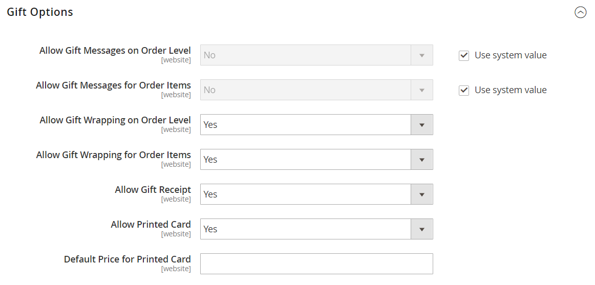

# [!UICONTROL Sales] > [!UICONTROL Sales]

{{config}}

{{beta-updates}}

## [!UICONTROL General]

<!-- zoom -->

<!-- [General](https://docs.magento.com/user-guide/marketing/sales-documents-ref-id.html) -->

| Feld | [Anwendungsbereich](../../getting-started/websites-stores-views.md#scope-settings) | Beschreibung |
|--- |--- |--- |
| [!UICONTROL Hide Customer IP] | Store-Ansicht | Bestimmt, ob die IP-Adresse des Kunden auf Bestellungen, Rechnungen, Sendungen und Kreditkarten angezeigt wird. Optionen: `Yes` / `No` |

{:style=&quot;table-layout:auto&quot;}

## [!UICONTROL Checkout Totals Sort Order]

<!-- zoom -->

<!-- [Checkout Totals Sort Order](https://docs.magento.com/user-guide/sales/checkout-totals-sort-order.html) -->

| Feld | [Anwendungsbereich](../../getting-started/websites-stores-views.md#scope-settings) | Beschreibung |
|--- |--- |--- |
| [!UICONTROL Subtotal] | Webseite | Eine Zahl, die bestimmt, wann die Zwischensumme in Bezug auf andere Checkout-Summen berechnet wird. Standardwert: `10` |
| [!UICONTROL Discount] | Webseite | Eine Zahl, die bestimmt, wann der Rabatt im Vergleich zu anderen Checkout-Summen berechnet wird. Standardwert: `20` |
| [!UICONTROL Shipping] | Webseite | Eine Zahl, die bestimmt, wann der Versand im Verhältnis zu anderen Checkout-Summen berechnet wird. Standardwert: `30` |
| [!UICONTROL Tax] | Webseite | Eine Zahl, die bestimmt, wann die Steuer im Verhältnis zu anderen Checkout-Summen berechnet wird. Standardwert: `40` |
| [!UICONTROL Fixed Product Tax] | Webseite | Eine Zahl, die bestimmt, wann die feste Produktsteuer in Bezug auf andere Checkout-Summen berechnet wird. Standardwert: `50` |
| [!UICONTROL Grand Total] | Webseite | Eine Zahl, die bestimmt, wann die Gesamtsumme in Bezug auf andere Checkout-Summen berechnet wird. Standardwert: `100` |

{:style=&quot;table-layout:auto&quot;}

## [!UICONTROL Reorder]

<!-- zoom -->

<!-- [Reorder](https://docs.magento.com/user-guide/sales/reorders-allow.html) -->

| Feld | [Anwendungsbereich](../../getting-started/websites-stores-views.md#scope-settings) | Beschreibung |
|--- |--- |--- |
| [!UICONTROL Allow Reorder] | Store-Ansicht | Stellt fest, ob die Kunden ihre Konten neu anordnen können. Optionen: `Yes` / `No` |

{:style=&quot;table-layout:auto&quot;}

## [!UICONTROL Allow Zero Grand Total]

| Feld | [Anwendungsbereich](../../getting-started/websites-stores-views.md#scope-settings) | Beschreibung |
|--- |--- |--- |
| [!UICONTROL Allow Zero Grand Total for Credit Memo] | Store-Ansicht | Ermittelt die Möglichkeit, ein Credit Memo mit einer Nullsumme zu erstellen. Optionen: `Yes` / `No` |

{:style=&quot;table-layout:auto&quot;}

## [!UICONTROL Invoice and Packing Slip Design]

<!-- zoom -->

<!-- [Invoice and Packing Slip Design](https://docs.magento.com/user-guide/marketing/sales-document-pdf-logo.html) -->

| Feld | [Anwendungsbereich](../../getting-started/websites-stores-views.md#scope-settings) | Beschreibung |
|--- |--- |--- |
| [!UICONTROL Logo for PDF Print-outs] | Store-Ansicht | Identifiziert die Logodatei, die in der Kopfzeile von PDF-Rechnungen und Packungsbeilagen angezeigt wird. Zulässige Dateitypen:  JPG/JPEG  TIF/TIFF  PNG |
| [!UICONTROL Logo for HTML Print View] | Store-Ansicht | Identifiziert die Logodatei, die in der Kopfzeile der HTML-Druckansicht von Rechnungen und Packungsbeilagen angezeigt wird. Zulässige Dateitypen:  JPG /JPEG  GIF  PNG |
| [!UICONTROL Address] | Store-Ansicht | Die Adresse des Lagers, wie sie auf Rechnungen und Packstücken erscheinen soll. |

{:style=&quot;table-layout:auto&quot;}

## [!UICONTROL Minimum Order Amount]

<!-- zoom -->

<!-- [Minimum Order Amount](https://docs.magento.com/user-guide/sales/cart-minimum-order-amount.html) -->

| Feld | [Anwendungsbereich](../../getting-started/websites-stores-views.md#scope-settings) | Beschreibung |
|--- |--- |--- |
| [!UICONTROL Enable] | Webseite | Bestimmt, ob ein Mindestbestellbetrag für die Site festgelegt ist. Optionen: `Yes` / `No` |
| [!UICONTROL Minimum Amount] | Webseite | Gibt die minimale Zwischensumme an, d. h. die Reihenfolge nach Anwendung der Rabatte. |
| [!UICONTROL Include Discount Amount] | Webseite | Bestimmt, ob der Mindestbestellbetrag angewendete Rabatte enthält. Optionen: `Yes` / `No` |
| [!UICONTROL Include Tax to Amount] | Webseite | Bestimmt, ob der Mindestbestellbetrag Steuern enthält. Optionen: `Yes` / `No` |
| [!UICONTROL Description Message] | Store-Ansicht | Bestimmt die Meldung, die oben im Warenkorb angezeigt wird, wenn die Warenkorbsumme kleiner als der Mindestbestellwert ist. Wenn Sie das Feld leer lassen, wird die folgende Standardmeldung angezeigt: `Minimum order amount is $[minimum_amount]` |
| [!UICONTROL Error to Show in Shopping Cart] | Store-Ansicht | Bestimmt die Meldung, die über den Mini-Warenkorb- oder Checkout-Link angezeigt wird, wenn der Bestellbetrag unter dem erforderlichen Mindestbestellbetrag liegt. Wenn Sie das Feld leer lassen, wird eine Standardmeldung angezeigt. |
| [!UICONTROL Validate Each Address Separately in Multi-address Checkout] | Webseite | Stellt bei Bestellungen mit mehreren Artikeln fest, ob die Bestellgegenstände, die an verschiedene Adressen verteilt werden, den Mindestbestellwert erreichen. Optionen: `Yes` / `No` |
| [!UICONTROL Multi-address Description Message] | Store-Ansicht | Bei Bestellungen mit mehreren Adressen bestimmt die Nachricht, die im Warenkorb angezeigt wird, wenn die an eine Adresse gesendeten Artikel kleiner als der Mindestbestellbetrag sind. |
| [!UICONTROL Multi-address Error to Show in Shopping Cart] | Store-Ansicht | Bei Bestellungen mit mehreren Adressen bestimmt die Nachricht, die über den Mini-Warenkorb oder Checkout-Link angezeigt wird, wenn der Bestellbetrag unter dem erforderlichen Mindestbestellbetrag liegt. Wenn Sie das Feld leer lassen, wird eine Standardmeldung angezeigt. |

{:style=&quot;table-layout:auto&quot;}

## [!UICONTROL Dashboard]

<!-- zoom -->

<!-- [Dashboard](https://docs.magento.com/user-guide/stores/admin-dashboard.html) -->

| Feld | [Anwendungsbereich](../../getting-started/websites-stores-views.md#scope-settings) | Beschreibung |
|--- |--- |--- |
| [!UICONTROL Use Aggregated Data] | Global | Bestimmt, ob aggregierte Verkaufsdaten in Echtzeit verwendet werden, um Dashboard-Momentaufnahmen-Berichte zu erstellen. Wenn Sie eine große Menge an zu verarbeitenden Daten haben, kann die Leistung verbessert werden, indem die Anzeige von Echtzeitdaten deaktiviert wird. Optionen: `Yes` / `No` |

{:style=&quot;table-layout:auto&quot;}

## [!UICONTROL Orders Cron Settings]

<!-- zoom -->

<!-- [Orders Cron Settings](https://docs.magento.com/user-guide/system/cron.html) -->

| Feld | [Anwendungsbereich](../../getting-started/websites-stores-views.md#scope-settings) | Beschreibung |
|--- |--- |--- |
| [!UICONTROL Pending Payment Order Lifetime] | Webseite | Bestimmt die Lebensdauer ausstehender Bestellungen in Minuten. Standardeinstellung: `480` Minuten (8 Stunden) |

{:style=&quot;table-layout:auto&quot;}

## [!UICONTROL Gift Options]

<!-- zoom -->

<!-- [Gift Options](https://docs.magento.com/user-guide/sales/gift-options.html) -->

| Feld | [Anwendungsbereich](../../getting-started/websites-stores-views.md#scope-settings) | Beschreibung |
|--- |--- |--- |
| [!UICONTROL Allow Gift Messages on Order Level] | Webseite | Geben Sie an, ob eine Geschenknachricht für die gesamte Bestellung hinzugefügt werden kann. |
| [!UICONTROL Allow Gift Messages on Order Items] | Webseite | Geben Sie an, ob eine Geschenknachricht für einen einzelnen Bestellartikel hinzugefügt werden kann. |
| [!UICONTROL Allow Gift Wrapping on Order Level] | Webseite |  (Nur Adobe Commerce) Geben Sie an, ob eine Geschenkverpackung für die gesamte Bestellung hinzugefügt werden kann. |
| [!UICONTROL Allow Gift Wrapping for Order Items] | Webseite |  (Nur Adobe Commerce) Geben Sie an, ob eine Geschenkverpackung für den einzelnen Bestellartikel hinzugefügt werden kann. |
| [!UICONTROL Allow Gift Receipt] | Webseite |  (Nur Adobe Commerce) Geben Sie an, ob der Bestellung ein Geschenkgutschein hinzugefügt werden kann. |
| [!UICONTROL Allow Printed Card] | Webseite |  (Nur Adobe Commerce) Geben Sie an, ob eine gedruckte Karte für die Bestellung hinzugefügt werden kann. |
| [!UICONTROL Default Price for Printed Card] | Webseite |  (Nur Adobe Commerce) Geben Sie den Standardpreis für die gedruckte Karte an. |

{:style=&quot;table-layout:auto&quot;}

## [!UICONTROL Minimum Advertised Price]

<!-- zoom -->

<!-- [Minimum Advertised Price](https://docs.magento.com/user-guide/catalog/product-price-minimum-advertised.html) -->

| Feld | [Anwendungsbereich](../../getting-started/websites-stores-views.md#scope-settings) | Beschreibung |
|--- |--- |--- |
| [!UICONTROL Enable MAP] | Webseite | Aktiviert den Mindestpreis für Werbung für Ihren Store. Optionen: `Yes` / `No` |
| [!UICONTROL Display Actual Price] | Webseite | Bestimmt, wo der tatsächliche Preis eines Produkts für den Kunden sichtbar ist. Optionen:  **`In Cart`**- Zeigt den tatsächlichen Produktpreis im Warenkorb an. **`Before Order Confirmation`** - Zeigt den tatsächlichen Produktpreis am Ende des Checkout-Prozesses an, kurz bevor die Bestellung bestätigt wird.  **`On Gesture`**- Zeigt den tatsächlichen Produktpreis in einem Popup an, wenn der Kunde auf &quot;Zum Preis klicken&quot;oder &quot;Was ist das?&quot; klickt. -Link. |
| [!UICONTROL Default Popup Text Message] | Store-Ansicht | Die Textnachricht, die angezeigt wird, wenn der Kunde auf einer Kategorienliste oder Produktansichtsseite den Link &quot;Zum Preis klicken&quot;auswählt. |
| [!UICONTROL Default "What's This" Text Message] | Store-Ansicht | Die Textnachricht, die angezeigt wird, wenn der Kunde auf &quot;Was ist das?&quot; klickt auf der Produktansichtsseite. |
| [!UICONTROL Manufacturer's Suggested Retail Price] | Global | Der vom Hersteller vorgeschlagene Einzelhandelspreis (MSRP). |

{:style=&quot;table-layout:auto&quot;}

## [!UICONTROL Order by SKU Settings]

{{ee-feature}}

<!-- zoom -->

<!-- [Order by SKU Settings](https://docs.magento.com/user-guide/customers/account-dashboard-order-by-sku.html) -->

<!-- zoom -->

| Feld | [Anwendungsbereich](../../getting-started/websites-stores-views.md#scope-settings) | Beschreibung |
|--- |--- |--- |
| [!UICONTROL Enable Order by SKU on My Account in Storefront] | Webseite | Bestimmt, ob die Option Bestellung nach SKU im Dashboard des Kundenkontos verfügbar ist. Optionen:  **`Yes, for Everyone`**- Die Registerkarte Bestellung nach SKU wird im Konto-Dashboard aller Kunden angezeigt. **`Yes, for Specified Customer Groups`** - Die Registerkarte Bestellung nach SKU wird im Konto-Dashboard für Mitglieder bestimmter Gruppen oder eines freigegebenen Katalogs angezeigt.  **`No`**- Die Registerkarte Bestellung nach SKU ist im Kundenkonto nicht verfügbar. |
| [!UICONTROL Customer Groups] | Webseite | Bestimmt die Kundengruppen. Optionen: `General` / `Retailer` / `Wholesale` |

{:style=&quot;table-layout:auto&quot;}

## [!UICONTROL Instant Purchase]

<!-- zoom -->

<!-- [Instant Purchase](https://docs.magento.com/user-guide/sales/checkout-instant-purchase.html) -->

| Feld | [Anwendungsbereich](../../getting-started/websites-stores-views.md#scope-settings) | Beschreibung |
|--- |--- |--- |
| [!UICONTROL Enabled] | Store-Ansicht | Aktiviert &quot;Instant Purchase&quot;für die Store-Ansicht, wenn die Zahlungsmethode (z. B. Braintree) Vault aktiviert hat. Optionen: `Yes` / `No` |
| [!UICONTROL Button Text] | Store-Ansicht | Gibt den Text an, der auf der Schaltfläche Sofortiger Kauf angezeigt wird. Der Standardtext lautet `Instant Purchase`. |

{:style=&quot;table-layout:auto&quot;}

## [!UICONTROL Orders, Invoices, Shipments, Credit Memos Archiving]

{{ee-feature}}

<!-- zoom -->

Weitere Informationen zum Ändern dieser Einstellungen finden Sie unter [Bestellarchiv konfigurieren](../../stores-purchase/order-archive.md#configure-the-order-archive) im _Handbuch für Stores und Einkaufserlebnisse_.

| Feld | [Anwendungsbereich](../../getting-started/websites-stores-views.md#scope-settings) | Beschreibung |
|--- |--- |--- |
| [!UICONTROL Enable Archiving] | Global | Bestimmt, ob die Archivierung aktiviert ist. Optionen: `Yes` / `No` |
| [!UICONTROL Archive Orders Purchased] | Global | Bestimmt die Anzahl der Tage, die vergangen sind, bevor eine abgeschlossene Bestellung archiviert wird. Standardwert: `30` |
| [!UICONTROL Order  Statuses to be Archived] | Global | Bestimmt die [status](../../stores-purchase/order-status.md) der zu archivierenden Bestellungen. Standardmäßig werden Bestellungen mit dem Status &quot;Abgeschlossen&quot;oder &quot;Geschlossen&quot;archiviert. Optionen: `Pending` / `Processing` / `Suspected Fraud` / `Complete` / `Closed` / `Canceled` / `On Hold` |

{:style=&quot;table-layout:auto&quot;}

## [!UICONTROL RMA Settings]

{{ee-feature}}

<!-- zoom -->

Weitere Informationen zum Ändern dieser Einstellungen finden Sie unter [Rückgaben konfigurieren](../../stores-purchase/rma-configure.md) im _Handbuch für Stores und Einkaufserlebnisse_.

| Feld | [Anwendungsbereich](../../getting-started/websites-stores-views.md#scope-settings) | Beschreibung |
|--- |--- |--- |
| [!UICONTROL Enable RMA on Storefront] | Webseite | Ermittelt, ob Kunden RMA-Anforderungen aus der Storefront erstellen und anzeigen können. RMA kann sowohl auf neue als auch auf bestehende Bestellungen angewendet werden. Standardmäßig ist RMA für die Storefront nicht aktiviert. Optionen: `Yes` / `No` |
| [!UICONTROL Enable RMA on Product Level] | Webseite | Legt den Standardwert für das Feld RMA aktivieren in den Produktinformationen fest. |
| [!UICONTROL Use Store Address] | Webseite | Bestimmt den Kontaktnamen und die Adresse, die für Sendungen von zurückgegebenen Waren verwendet werden. Optionen:  **`Yes`**- Verwendet die [Ursprungsort](../../stores-purchase/shipping-settings.md#point-of-origin) Adresse aus den Versandeinstellungen. **`No`** - Öffnet das Adressformular, in das Sie eine andere Adresse eingeben können. |

{:style=&quot;table-layout:auto&quot;}
