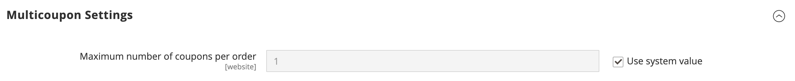

# [!UICONTROL Sales] > [!UICONTROL Sales]

{{config}}

## [!UICONTROL General]

<!-- zoom -->

<!-- [General](https://docs.magento.com/user-guide/marketing/sales-documents-ref-id.html) -->

| Feld | [Scope](../../getting-started/websites-stores-views.md#scope-settings) | Beschreibung |
|--- |--- |--- |
| [!UICONTROL Hide Customer IP] | Shop-Ansicht | Legt fest, ob die Kunden-IP-Adresse in Bestellungen, Rechnungen, Lieferungen und Gutschriften angezeigt wird. Optionen: `Yes` / `No` |

{style="table-layout:auto"}

## [!UICONTROL Checkout Totals Sort Order]

<!-- zoom -->

<!-- [Checkout Totals Sort Order](https://docs.magento.com/user-guide/sales/checkout-totals-sort-order.html) -->

| Feld | [Scope](../../getting-started/websites-stores-views.md#scope-settings) | Beschreibung |
|--- |--- |--- |
| [!UICONTROL Subtotal] | Website | Eine Zahl, die bestimmt, wann die Zwischensumme im Verhältnis zu anderen Checkout-Summen berechnet wird. Standardwert: `10` |
| [!UICONTROL Discount] | Website | Eine Zahl, die bestimmt, wann der Rabatt im Verhältnis zu anderen Checkout-Summen berechnet wird. Standardwert: `20` |
| [!UICONTROL Shipping] | Website | Eine Zahl, die bestimmt, wann der Versand im Verhältnis zu anderen Checkout-Summen berechnet wird. Standardwert: `30` |
| [!UICONTROL Tax] | Website | Eine Zahl, die bestimmt, wann die Steuer im Verhältnis zu anderen Checkout-Summen berechnet wird. Standardwert: `40` |
| [!UICONTROL Fixed Product Tax] | Website | Eine Zahl, die bestimmt, wann die feste Produktsteuer im Verhältnis zu anderen Checkout-Summen berechnet wird. Standardwert: `50` |
| [!UICONTROL Grand Total] | Website | Eine Zahl, die bestimmt, wann die Gesamtsumme in Relation zu anderen Checkout-Summen berechnet wird. Standardwert: `100` |

{style="table-layout:auto"}

## [!UICONTROL Reorder]

<!-- zoom -->

<!-- [Reorder](https://docs.magento.com/user-guide/sales/reorders-allow.html) -->

| Feld | [Scope](../../getting-started/websites-stores-views.md#scope-settings) | Beschreibung |
|--- |--- |--- |
| [!UICONTROL Allow Reorder] | Shop-Ansicht | Legt fest, ob Kunden von ihren Konten neu bestellen können. Optionen: `Yes` / `No` |

{style="table-layout:auto"}

## [!UICONTROL Allow Zero Grand Total]

| Feld | [Scope](../../getting-started/websites-stores-views.md#scope-settings) | Beschreibung |
|--- |--- |--- |
| [!UICONTROL Allow Zero Grand Total for Credit Memo] | Shop-Ansicht | Bestimmt die Möglichkeit, eine Gutschrift mit einem Gesamtwert von Null zu erstellen. Optionen: `Yes` / `No` |

{style="table-layout:auto"}

## [!UICONTROL Invoice and Packing Slip Design]

<!-- zoom -->

<!-- [Invoice and Packing Slip Design](https://docs.magento.com/user-guide/marketing/sales-document-pdf-logo.html) -->

| Feld | [Scope](../../getting-started/websites-stores-views.md#scope-settings) | Beschreibung |
|--- |--- |--- |
| [!UICONTROL Logo for PDF Print-outs] | Shop-Ansicht | Identifiziert die Logodatei, die in der Kopfzeile von PDF-Rechnungen und Lieferscheinen angezeigt wird. Zulässige Dateitypen:  JPG/JPEG  TIF/TIFF  PNG |
| [!UICONTROL Logo for HTML Print View] | Shop-Ansicht | Identifiziert die Logodatei, die in der Kopfzeile der HTML-Druckansicht von Rechnungen und Lieferscheinen angezeigt wird. Zulässige Dateitypen:  JPG/JPEG  GIF  PNG |
| [!UICONTROL Address] | Shop-Ansicht | Die Store-Adresse, wie sie auf Rechnungen und Lieferscheinen erscheinen soll. |

{style="table-layout:auto"}

## [!UICONTROL Minimum Order Amount]

<!-- zoom -->

<!-- [Minimum Order Amount](https://docs.magento.com/user-guide/sales/cart-minimum-order-amount.html) -->

| Feld | [Scope](../../getting-started/websites-stores-views.md#scope-settings) | Beschreibung |
|--- |--- |--- |
| [!UICONTROL Enable] | Website | Legt fest, ob ein Mindestbestellbetrag für die Website festgelegt ist. Optionen: `Yes` / `No` |
| [!UICONTROL Minimum Amount] | Website | Gibt die minimale Zwischensumme für die Bestellung nach der Anwendung von Rabatten an. |
| [!UICONTROL Include Discount Amount] | Website | Legt fest, ob der Mindestbestellbetrag angewendete Rabatte enthält. Optionen: `Yes` / `No` |
| [!UICONTROL Include Tax to Amount] | Website | Legt fest, ob der Mindestbestellbetrag die Steuer enthält. Optionen: `Yes` / `No` |
| [!UICONTROL Description Message] | Shop-Ansicht | Bestimmt die Nachricht, die oben im Warenkorb angezeigt wird, wenn die Summe des Warenkorbs kleiner als der Mindestbestellbetrag ist. Wenn Sie das Feld leer lassen, wird die folgende Standardmeldung angezeigt: `Minimum order amount is $[minimum_amount]` |
| [!UICONTROL Error to Show in Shopping Cart] | Shop-Ansicht | Bestimmt die Nachricht, die über den Mini-Warenkorb- oder Checkout-Link angezeigt wird, wenn der Bestellbetrag kleiner als der erforderliche Mindestbestellbetrag ist. Wenn Sie das Feld leer lassen, wird eine Standardmeldung angezeigt. |
| [!UICONTROL Validate Each Address Separately in Multi-address Checkout] | Website | Bei Bestellungen mit mehreren Artikeln bestimmt , ob die an unterschiedliche Adressen zu liefernden Bestellungen den Mindestbestellbetrag erreichen. Optionen: `Yes` / `No` |
| [!UICONTROL Multi-address Description Message] | Shop-Ansicht | Bei Bestellungen mit mehreren Adressen bestimmt die Nachricht, die im Warenkorb angezeigt wird, wenn die an eine Adresse gesendeten Artikel kleiner als der Mindestbestellbetrag sind. |
| [!UICONTROL Multi-address Error to Show in Shopping Cart] | Shop-Ansicht | Bei Bestellungen mit mehreren Adressen bestimmt die Nachricht, die über den Mini-Warenkorb- oder Checkout-Link angezeigt wird, wenn der Bestellbetrag kleiner als der erforderliche Mindestbestellbetrag ist. Wenn Sie das Feld leer lassen, wird eine Standardmeldung angezeigt. |

{style="table-layout:auto"}

## [!UICONTROL Dashboard]

<!-- zoom -->

<!-- [Dashboard](https://docs.magento.com/user-guide/stores/admin-dashboard.html) -->

| Feld | [Scope](../../getting-started/websites-stores-views.md#scope-settings) | Beschreibung |
|--- |--- |--- |
| [!UICONTROL Use Aggregated Data] | Global | Legt fest, ob aggregierte Verkaufsdaten in Echtzeit für die Erstellung von Dashboard-Momentaufnahmen-Berichten verwendet werden. Wenn Sie eine große Datenmenge verarbeiten müssen, kann die Leistung verbessert werden, indem die Anzeige von Echtzeitdaten deaktiviert wird. Optionen: `Yes` / `No` |

{style="table-layout:auto"}

## [!UICONTROL Orders Cron Settings]

<!-- zoom -->

<!-- [Orders Cron Settings](https://docs.magento.com/user-guide/system/cron.html) -->

| Feld | [Scope](../../getting-started/websites-stores-views.md#scope-settings) | Beschreibung |
|--- |--- |--- |
| [!UICONTROL Pending Payment Order Lifetime] | Website | Bestimmt die Lebensdauer ausstehender Bestellungen in Minuten. Standardeinstellung: `480` Minuten (8 Stunden) |

{style="table-layout:auto"}

## [!UICONTROL Gift Options]

<!-- zoom -->

<!-- [Gift Options](https://docs.magento.com/user-guide/sales/gift-options.html) -->

| Feld | [Scope](../../getting-started/websites-stores-views.md#scope-settings) | Beschreibung |
|--- |--- |--- |
| [!UICONTROL Allow Gift Messages on Order Level] | Website | Geben Sie an, ob eine Geschenknachricht für die gesamte Bestellung hinzugefügt werden kann. |
| [!UICONTROL Allow Gift Messages on Order Items] | Website | Geben Sie an, ob eine Geschenknachricht für einen einzelnen Bestellartikel hinzugefügt werden kann. |
| [!UICONTROL Allow Gift Wrapping on Order Level] | Website |  (Nur Adobe Commerce) Geben Sie an, ob Geschenkverpackungen für die gesamte Bestellung hinzugefügt werden können. |
| [!UICONTROL Allow Gift Wrapping for Order Items] | Website |  (Nur Adobe Commerce) Geben Sie an, ob Geschenkverpackungen für den jeweiligen Bestellartikel hinzugefügt werden können. |
| [!UICONTROL Allow Gift Receipt] | Website |  (Nur Adobe Commerce) Geben Sie an, ob für die Bestellung eine Geschenkquittung hinzugefügt werden kann. |
| [!UICONTROL Allow Printed Card] | Website |  (Nur Adobe Commerce) Geben Sie an, ob für die Bestellung eine gedruckte Karte hinzugefügt werden kann. |
| [!UICONTROL Default Price for Printed Card] | Website |  (Nur Adobe Commerce) Geben Sie den Standardpreis für die gedruckte Karte an. |

{style="table-layout:auto"}

## [!UICONTROL Minimum Advertised Price]

<!-- zoom -->

<!-- [Minimum Advertised Price](https://docs.magento.com/user-guide/catalog/product-price-minimum-advertised.html) -->

| Feld | [Scope](../../getting-started/websites-stores-views.md#scope-settings) | Beschreibung |
|--- |--- |--- |
| [!UICONTROL Enable MAP] | Website | Aktiviert den Mindestpreis für Werbung in Ihrem Geschäft. Optionen: `Yes` / `No` |
| [!UICONTROL Display Actual Price] | Website | Bestimmt, wo der tatsächliche Preis eines Produkts für den Kunden sichtbar ist. Optionen:  **`In Cart`**- Zeigt den tatsächlichen Produktpreis im Warenkorb an. **`Before Order Confirmation`** - Zeigt den tatsächlichen Produktpreis am Ende des Checkout-Prozesses an, kurz bevor die Bestellung bestätigt wird.  **`On Gesture`**- Zeigt den tatsächlichen Produktpreis in einem Popup an, wenn der Kunde auf „Klick für Preis“ oder „Was ist das?“ klickt. -Link. |
| [!UICONTROL Default Popup Text Message] | Shop-Ansicht | Die Textmeldung, die angezeigt wird, wenn der Kunde den Link „Click for Price“ aus einer Kategorieliste oder Produktansichtsseite auswählt. |
| [!UICONTROL Default "What's This" Text Message] | Shop-Ansicht | Die Textmeldung, die angezeigt wird, wenn der Kunde auf „Was ist das?“ klickt. -Link von der Produktansichtsseite aus. |
| [!UICONTROL Manufacturer's Suggested Retail Price] | Global | Der vom Hersteller vorgeschlagene Einzelhandelspreis (MSRP). |

{style="table-layout:auto"}

## [!UICONTROL Multicoupon Settings]

{{ee-feature}}

<!-- zoom -->

| Feld | [Scope](../../getting-started/websites-stores-views.md#scope-settings) | Beschreibung |
|--- |--- |--- |
| [!UICONTROL Maximum number of coupons per order] | Website | Bestimmt die maximal zulässige Anzahl von Coupons pro Bestellung |

{style="table-layout:auto"}

## [!UICONTROL Order by SKU Settings]

{{ee-feature}}

<!-- zoom -->

<!-- [Order by SKU Settings](https://docs.magento.com/user-guide/customers/account-dashboard-order-by-sku.html) -->

<!-- zoom -->

| Feld | [Scope](../../getting-started/websites-stores-views.md#scope-settings) | Beschreibung |
|--- |--- |--- |
| [!UICONTROL Enable Order by SKU on My Account in Storefront] | Website | Legt fest, ob Order by SKU im Kundenkonto-Dashboard verfügbar ist. Optionen:  **`Yes, for Everyone`**- Die Registerkarte „Bestellung nach SKU“ wird im Konto-Dashboard aller Kunden angezeigt. **`Yes, for Specified Customer Groups`** - Die Registerkarte Order By SKU wird im Konto-Dashboard für Mitglieder bestimmter Gruppen oder eines freigegebenen Katalogs angezeigt.  **`No`**- Die Registerkarte „Bestellung nach SKU“ ist im Kundenkonto nicht verfügbar. |
| [!UICONTROL Customer Groups] | Website | Bestimmt die Kundengruppen. Optionen: `General` / `Retailer` / `Wholesale` |

{style="table-layout:auto"}

## [!UICONTROL Instant Purchase]

<!-- zoom -->

<!-- [Instant Purchase](https://docs.magento.com/user-guide/sales/checkout-instant-purchase.html) -->

| Feld | [Scope](../../getting-started/websites-stores-views.md#scope-settings) | Beschreibung |
|--- |--- |--- |
| [!UICONTROL Enabled] | Shop-Ansicht | Aktiviert den Sofortkauf für die Store-Ansicht, wenn für die Zahlungsmethode, z. B. Braintree, der Tresor aktiviert ist. Optionen: `Yes` / `No` |
| [!UICONTROL Button Text] | Shop-Ansicht | Gibt den Text an, der auf der Schaltfläche Sofortkauf angezeigt wird. Der Standardtext ist `Instant Purchase`. |

{style="table-layout:auto"}

## [!UICONTROL Rate Limiting]

<!-- zoom -->

| Feld | [Scope](../../getting-started/websites-stores-views.md#scope-settings) | Beschreibung |
|--------------------------------------------------------|--- |------------------------------------------------------------------------------------------------------------------------------------------------------------------------------------|
| [!UICONTROL Enable rate limiting for placing orders] | Shop-Ansicht | Legt fest, ob die Ratenbegrenzung für die Platzierung von Bestellungen in der Store-Ansicht verwendet wird (Standard ist `No`). Optionen: `Yes` / `No`. |
| [!UICONTROL Requests limit per authenticated customer] | Shop-Ansicht | Die Anzahl der Kaufanfragen, die ein authentifizierter Kunde während des Zeitraums stellen kann. Die Standardbegrenzung ist `10`. |
| [!UICONTROL Requests limit per guest] | Shop-Ansicht | Die Anzahl der Kaufanfragen, die ein nicht authentifizierter Kunde während des angegebenen Zeitraums tätigen kann. Der Standardwert lautet `50`. |
| [!UICONTROL Counter resets in a ...] | Shop-Ansicht | Der Zeitraum, in dem ein authentifizierter/nicht authentifizierter Kunde eine bestimmte Anzahl von Kaufanfragen stellen kann (Standard: `Minute`). Optionen: `Minute` / `Hour` /`Day` |

{style="table-layout:auto"}

## [!UICONTROL Orders, Invoices, Shipments, Credit Memos Archiving]

{{ee-feature}}

<!-- zoom -->

Weitere Informationen zum Ändern dieser Einstellungen finden Sie unter [Konfigurieren des Auftragsarchivs](../../stores-purchase/order-archive.md#configure-the-order-archive) in der _Handbuch zu Stores und Kauferlebnissen_.

| Feld | [Scope](../../getting-started/websites-stores-views.md#scope-settings) | Beschreibung |
|--- |--- |--- |
| [!UICONTROL Enable Archiving] | Global | Legt fest, ob die Archivierung aktiviert ist. Optionen: `Yes` / `No` |
| [!UICONTROL Archive Orders Purchased] | Global | Bestimmt die Anzahl der Tage, die vergehen, bevor eine abgeschlossene Bestellung archiviert wird. Standardwert: `30` |
| [!UICONTROL Order  Statuses to be Archived] | Global | Bestimmt die [Status](../../stores-purchase/order-status.md) der zu archivierenden Bestellungen. Standardmäßig werden Bestellungen mit dem Status Abgeschlossen oder Geschlossen archiviert. Optionen: `Pending` / `Processing` / `Suspected Fraud` / `Complete` / `Closed` / `Canceled` / `On Hold` |

{style="table-layout:auto"}

## [!UICONTROL RMA Settings]

{{ee-feature}}

<!-- zoom -->

Weitere Informationen zum Ändern dieser Einstellungen finden Sie unter [Konfigurieren von Rücksendungen](../../stores-purchase/rma-configure.md) in der _Handbuch zu Stores und Kauferlebnissen_.

| Feld | [Scope](../../getting-started/websites-stores-views.md#scope-settings) | Beschreibung |
|--- |--- |--- |
| [!UICONTROL Enable RMA on Storefront] | Website | Legt fest, ob Kunden RMA-Anfragen in der Storefront erstellen und anzeigen können. RMA kann sowohl auf neue als auch auf bestehende Bestellungen angewendet werden. RMA ist für die Storefront standardmäßig nicht aktiviert. Optionen: `Yes` / `No` |
| [!UICONTROL Enable RMA on Product Level] | Website | Bestimmt den Standardwert für das Feld RMA aktivieren in den Produktinformationen. |
| [!UICONTROL Use Store Address] | Website | Bestimmt den Kontaktnamen und die Adresse, die für Sendungen von zurückgegebenen Waren verwendet werden. Optionen:  **`Yes`**- Verwendet den [Ausgangspunkt](../../stores-purchase/shipping-settings.md#point-of-origin) Adresse aus den Versandeinstellungen. **`No`** - Öffnet das Adressformular, in das Sie eine alternative Adresse eingeben können. |

{style="table-layout:auto"}
