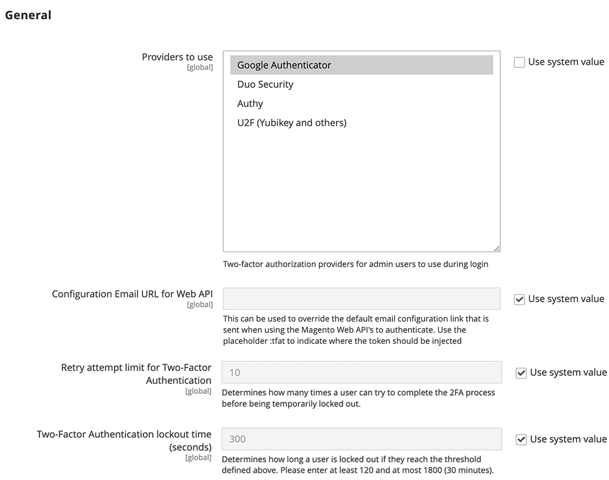
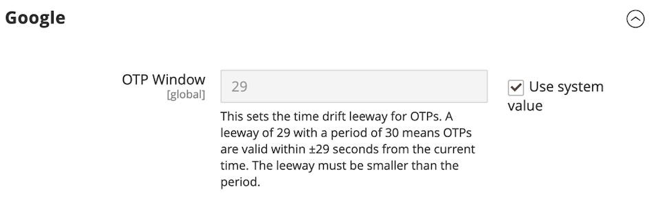
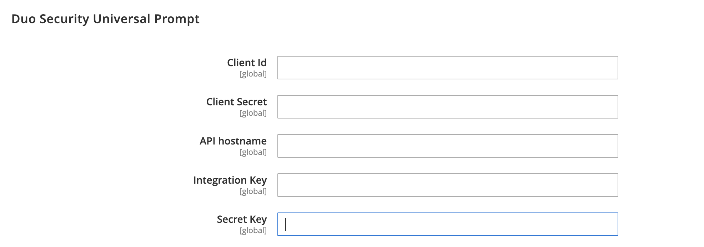
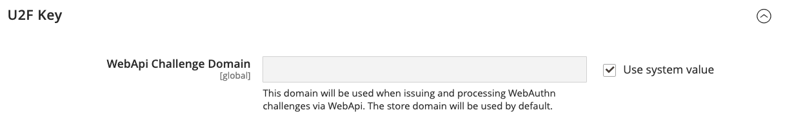

# [!UICONTROL Security] > [!UICONTROL 2FA]

>[!NOTE]
>
>Bei Stores mit aktivierter Adobe Identity Management Services (IMS)-Authentifizierung sind die native Adobe Commerce- und Magento Open Source-Zwei-Faktor-Authentifizierung (2FA) deaktiviert. Admin-Benutzende, die mit ihren Adobe-Anmeldeinformationen bei ihrer Adobe Commerce-Instanz angemeldet sind, müssen sich für viele Admin-Aufgaben nicht erneut authentifizieren. Die Authentifizierung wird von Adobe IMS durchgeführt, wenn sich der Administrator bei seiner aktuellen Sitzung anmeldet. Siehe [Integrieren von Adobe Commerce mit Adobe IMS - Übersicht](https://experienceleague.adobe.com/docs/commerce-admin/start/admin/ims/adobe-ims-integration-overview.html).

{{config}}

Weitere Informationen zum Ändern dieser Einstellungen finden Sie unter [Zwei-Faktor-Authentifizierung (2FA](../../systems/security-two-factor-authentication.md) im _Admin-System-Handbuch_.

## [!UICONTROL General]

<!-- zoom -->

| Feld | [Umfang](../../getting-started/websites-stores-views.md#scope-settings) | Beschreibung |
|--- |--- |--- |
| [!UICONTROL Providers to use] | Global | Gibt die erforderlichen Zwei-Faktor-Authentifizierungsmethoden an. Wenn Sie mehr als einen Anbieter auswählen, muss jeder Benutzer jede 2FA-Methode bei der nächsten Anmeldung konfigurieren. |
| [!UICONTROL Configuration Email URL for Web API] | Global | Bei benutzerdefinierten Implementierungen die URL für einen alternativen E-Mail-Konfigurationslink, der bei der ersten Anmeldung an _Admin_-Benutzer gesendet wird. Verwenden Sie in der E-Mail-Vorlage den `:tfat` Platzhalter , um anzugeben, wo das Token eingefügt werden soll. |
| [!UICONTROL Retry attempt limit for Two-Factor Authentication] | Global | Legt fest, wie oft ein Administrator eine [!DNL one-time password (OTP)] eingeben kann, bevor sein Konto vorübergehend deaktiviert wird. Standard: `10` |
| [!UICONTROL Two-Factor Authentication lockout time (seconds)] | Global | Bestimmt, wie lange (in Sekunden) ein Administrator warten kann, bis er eine [!DNL one-time password (OTP)] eingibt, bevor sein Konto vorübergehend deaktiviert wird. Standard: `300` |

{style="table-layout:auto"}

## [!UICONTROL Google]

<!-- zoom -->

| Feld | [Umfang](../../getting-started/websites-stores-views.md#scope-settings) | Beschreibung |
|--- |--- |--- |
| [!UICONTROL OTP Window] | Global | Bestimmt, wie lange (in Sekunden) das System die [!DNL one-time-password (OTP)] eines Administrators akzeptiert, nachdem sie abgelaufen ist. Darf nicht länger sein als die Lebensdauer eines einzelnen OTP (normalerweise 30 Sekunden). Standard: `29` |

{style="table-layout:auto"}

## [!UICONTROL Duo Security]

<!-- zoom -->

| Feld | [Umfang](../../getting-started/websites-stores-views.md#scope-settings) | Beschreibung |
|--- |--- |--- |
| [!UICONTROL Client Id] | Global | Die Client-ID aus Ihrem [!DNL Duo Security]. |
| [!UICONTROL Client Secret] | Global | Das Client-Geheimnis aus Ihrem [!DNL Duo Security]. |
| [!UICONTROL Integration Key] | Global | Der Integrationsschlüssel aus Ihrem [!DNL Duo Security]-API-Konto. |
| [!UICONTROL Secret Key] | Global | Der geheime Schlüssel aus Ihrem [!DNL Duo Security]-API-Konto. |
| [!UICONTROL API Hostname] | Global | Der API-Hostname aus Ihrem [!DNL Duo Security]. |

{style="table-layout:auto"}

## [!UICONTROL Authy]

<!-- zoom -->

| Feld | [Umfang](../../getting-started/websites-stores-views.md#scope-settings) | Beschreibung |
|--- |--- |--- |
| [!UICONTROL API Key] | Global | Der API-Schlüssel aus Ihrem [!DNL Authy]. |
| [!UICONTROL OneTouch Message] | Global | Die Meldung, die bei der Anmeldung im [!DNL Authy]-Authentifikator angezeigt wird. Standard: `Login request to your Magento Admin` |

{style="table-layout:auto"}

## [!UICONTROL U2F Key]

<!-- zoom -->

| Feld | [Umfang](../../getting-started/websites-stores-views.md#scope-settings) | Beschreibung |
|--- |--- |--- |
| [!UICONTROL WebApi Challenge Domain] | Global | Die Domain, die zum Ausstellen und Verarbeiten [!DNL WebAuthn] Herausforderungen für benutzerdefinierte Web-API-Implementierungen verwendet wird. |

{style="table-layout:auto"}
