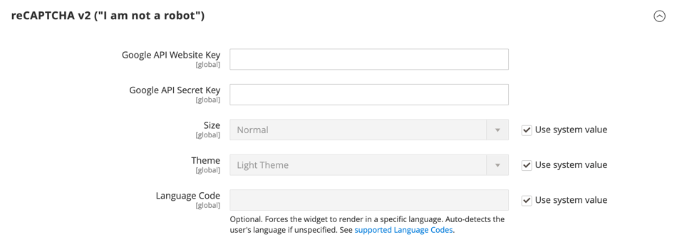
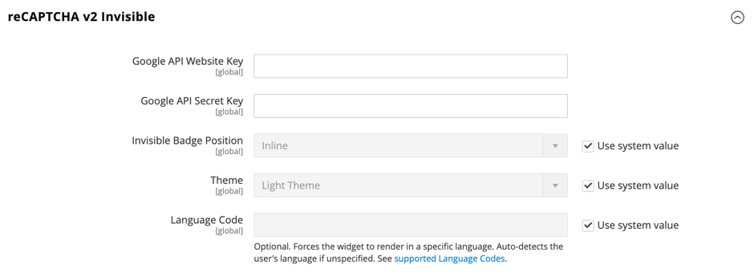
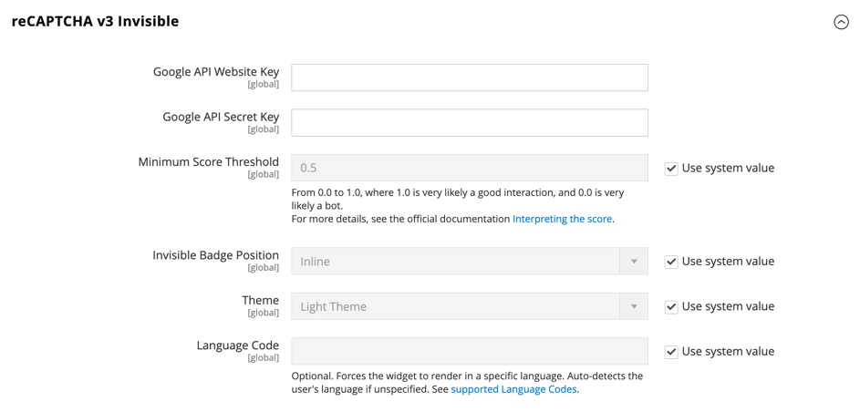
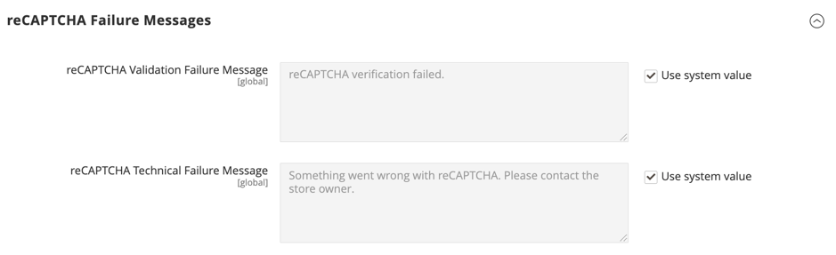
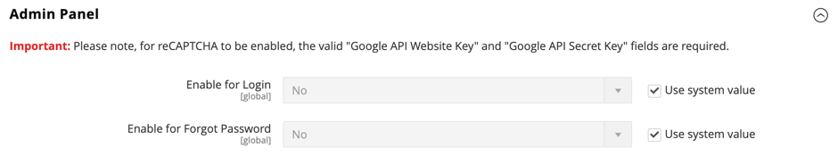

# [!UICONTROL Security] > [!UICONTROL Google reCAPTCHA Admin Panel]

>[!IMPORTANT]
>
>Bevor Google reCAPTCHA konfiguriert werden kann, müssen Sie sicherstellen, dass Ihre `PHP.ini` die folgende Einstellung enthält: `allow_url_fopen = 1`. Dies erfordert möglicherweise die Unterstützung eines Entwicklers. Siehe [Erforderliche PHP](https://experienceleague.adobe.com/docs/commerce-operations/installation-guide/prerequisites/php-settings.html)Einstellungen im _Installationshandbuch_.

{{config}}

Weitere Informationen zum Ändern dieser Einstellungen finden Sie unter [Google reCAPTCHA](../../systems/security-google-recaptcha.md) im _Admin-_.

## [!UICONTROL reCAPTCHA v2 ("I am not a robot")]

<!-- zoom -->

| Feld | [Umfang](../../getting-started/websites-stores-views.md#scope-settings) | Beschreibung |
|--|--|--|
| [!UICONTROL Google API Website Key] | Global | Der Website-Schlüssel, der bei der Registrierung Ihres Google reCAPTCHA-Kontos erstellt wird. |
| [!UICONTROL Google API Secret Key] | Global | Der geheime Schlüssel, der Ihrem Google reCAPTCHA-Konto zugeordnet ist. |
| [!UICONTROL Size] | Global | Die Größe des Google reCAPTCHA-Felds, das während der Anmeldung angezeigt wird. Optionen: `Normal` (Standard) / `Compact` |
| [!UICONTROL Theme] | Global | Bestimmt den Stil des Google reCAPTCHA-Felds. Optionen: `Light Theme` (Standard) / `Dark Theme` |
| [!UICONTROL Language Code] | Global | Ein [Code mit zwei Zeichen](https://developers.google.com/recaptcha/docs/language) der die Sprache angibt, die für Google reCAPTCHA-Text und -Messaging verwendet wird. |

{style="table-layout:auto"}

## [!UICONTROL reCAPTCHA v2 Invisible]

<!-- zoom -->

| Feld | [Umfang](../../getting-started/websites-stores-views.md#scope-settings) | Beschreibung |
|--|--|--|
| [!UICONTROL Google API Website Key] | Global | Der Website-Schlüssel, der bei der Registrierung Ihres Google reCAPTCHA-Kontos erstellt wird. |
| [!UICONTROL Google API Secret Key] | Global | Der geheime Schlüssel, der Ihrem Google reCAPTCHA-Konto zugeordnet ist. |
| [!UICONTROL Invisible Badge Position] | Global | Die Position des unsichtbaren reCAPTCHA-Badges auf jeder Seite. Optionen: `Inline` / `Bottom Right` / `Bottom Left` |
| [!UICONTROL Theme] | Global | Bestimmt den Stil des Google reCAPTCHA-Felds. Optionen: `Light Theme` (Standard) / `Dark Theme` |
| [!UICONTROL Language Code] | Global | Ein [Code mit zwei Zeichen](https://developers.google.com/recaptcha/docs/language) der die Sprache angibt, die für Google reCAPTCHA-Text und -Messaging verwendet wird. |

{style="table-layout:auto"}

## [!UICONTROL reCAPTCHA v3 Invisible]

<!-- zoom -->

| Feld | [Umfang](../../getting-started/websites-stores-views.md#scope-settings) | Beschreibung |
|--|--|--|
| [!UICONTROL Google API Website Key] | Global | Der Website-Schlüssel, der bei der Registrierung Ihres Google reCAPTCHA-Kontos erstellt wird. |
| [!UICONTROL Google API Secret Key] | Global | Der geheime Schlüssel, der Ihrem Google reCAPTCHA-Konto zugeordnet ist. |
| [!UICONTROL Minimum Score Threshold] | Global | Der Mindestwert, der eine Benutzerinteraktion als potenzielles Risiko identifiziert, wobei 1,0 eine typische Benutzerinteraktion und 0,0 wahrscheinlich ein Bot ist. Standard: `0.5` |
| [!UICONTROL Invisible Badge Position] | Global | Die Position des unsichtbaren reCAPTCHA-Badges auf jeder Seite. Optionen: `Inline` / `Bottom Right` / `Bottom Left` |
| [!UICONTROL Theme] | Global | Bestimmt den Stil des Google reCAPTCHA-Felds. Optionen: `Light Theme` (Standard) / `Dark Theme` |
| [!UICONTROL Language Code] | Global | Ein [Code mit zwei Zeichen](https://developers.google.com/recaptcha/docs/language) der die Sprache angibt, die für Google reCAPTCHA-Text und -Messaging verwendet wird. |

{style="table-layout:auto"}

## [!UICONTROL reCAPTCHA Failure Messages]

<!-- zoom -->

| Feld | [Umfang](../../getting-started/websites-stores-views.md#scope-settings) | Beschreibung |
|--|--|--|
| [!UICONTROL reCAPTCHA Validation Failure Message] | Global | Die Meldung, die im Administrator angezeigt wird, wenn die Verifizierung fehlschlägt. Standardtext: `reCAPTCHA verification failed.` |
| [!UICONTROL reCAPTCHA Technical Failure Message] | Global | Die Meldung, die in Admin angezeigt wird, wenn reCAPTCHA kein Überprüfungsergebnis zurückgibt. Standardtext: `Something went wrong with reCAPTCHA. Please contact the store owner.` |

{style="table-layout:auto"}

## [!UICONTROL Admin Panel]

<!-- zoom -->

>[!NOTE]
>
>Der ausgewählte reCAPTCHA-Typ muss mit dem Typ übereinstimmen, der mit dem API-Schlüssel aus Ihrem Google reCAPTCHA-Konto verknüpft ist.

>[!WARNING]
>
>Bei Verwendung von reCAPTCHA Version 3 kann ein echter Benutzer mit niedrigem Score nicht fortfahren. Bei Version 2 erhält ein echter Benutzer mit einem niedrigen Punktestand eine Herausforderung. Überlegen Sie sorgfältig, ob echte Benutzer mit einem niedrigen Score die Möglichkeit haben sollten, eine Herausforderung zu lösen (Version 2) oder blockiert zu werden (Version 3).

| Feld | [Umfang](../../getting-started/websites-stores-views.md#scope-settings) | Beschreibung |
|--|--|--|
| [!UICONTROL Enable for Login] | Global | Bestimmt den Typ von reCAPTCHA, das für die [Admin-Anmeldung“ aktiviert &#x200B;](https://experienceleague.adobe.com/docs/commerce-admin/start/admin/admin-signin.html). Optionen:  **`No`**- (Standard) Validiert nicht die Admin-Anmeldung. **`reCAPTCHA v2 ("I am not a robot")`** - Erfordert, dass der Benutzer das Kontrollkästchen _Ich bin kein Roboter_ aktiviert. **`Invisible reCAPTCHA v2`**- Validiert das Benutzerverhalten im Hintergrund, ohne dass Interaktionen auf der Grundlage der Punktzahl erforderlich sind. **`Invisible reCAPTCHA v3`** - (Empfohlen) Validiert das Benutzerverhalten im Hintergrund basierend auf dem Interaktionswert. |
| [!UICONTROL Enable for Forgot Password] | Global | Bestimmt den Typ von reCAPTCHA, der aktiviert ist, um ein Zurücksetzen des [Admin-Kennworts) &#x200B;](https://experienceleague.adobe.com/docs/commerce-admin/start/admin/admin-signin.html#reset-your-password). Optionen:  **`No`**- (Standard) Validiert nicht die Anforderung zum Zurücksetzen des Kennworts. **`reCAPTCHA v2 ("I am not a robot")`** - Erfordert, dass der Benutzer das Kontrollkästchen _Ich bin kein Roboter_ aktiviert. **`Invisible reCAPTCHA v2`**- Validiert das Benutzerverhalten im Hintergrund, ohne dass Interaktionen auf der Grundlage der Punktzahl erforderlich sind. **`Invisible reCaptcha v3`** - (Empfohlen) Validiert das Benutzerverhalten im Hintergrund basierend auf dem Interaktionswert. |

{style="table-layout:auto"}
