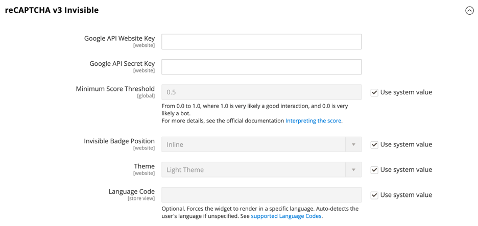

# [!UICONTROL Security] > [!UICONTROL Google reCAPTCHA Storefront]

>[!IMPORTANT]
>
>Bevor Google reCAPTCHA konfiguriert werden kann, müssen Sie sicherstellen, dass Ihre `PHP.ini` die folgende Einstellung enthält: `allow_url_fopen = 1`. Dies erfordert möglicherweise die Unterstützung eines Entwicklers. Siehe [PHP Settings](https://experienceleague.adobe.com/docs/commerce-operations/installation-guide/prerequisites/php-settings.html?lang=de) im _Installationshandbuch_.

{{config}}

Weitere Informationen zur Verwendung von Google reCAPTCHA zum Schützen Ihres Stores finden Sie unter Google [reCAPTCHA](../../systems/security-google-recaptcha.md) im _Admin Systems Guide_.

## [!UICONTROL reCAPTCHA v2 ("I am not a robot")]

<!-- zoom -->

| Feld | [Umfang](../../getting-started/websites-stores-views.md#scope-settings) | Beschreibung |
|--|--|--|
| [!UICONTROL Google API Website Key] | Website | Der Website-Schlüssel, der bei der Registrierung Ihres Google reCAPTCHA-Kontos erstellt wird. |
| [!UICONTROL Google API Secret Key] | Website | Der geheime Schlüssel, der Ihrem Google reCAPTCHA-Konto zugeordnet ist. |
| [!UICONTROL Size] | Website | Die Größe des Google reCAPTCHA-Felds, das angezeigt wird, wenn sich eine Kundin oder ein Kunde bei ihrem Konto anmeldet. Optionen: `Normal` (Standard) / `Compact` |
| [!UICONTROL Theme] | Website | Bestimmt den Stil des Google reCAPTCHA-Felds. Optionen: `Light Theme` (Standard) / `Dark Theme` |
| [!UICONTROL Language Code] | Shop-Ansicht | Der [Code mit zwei Zeichen](https://developers.google.com/recaptcha/docs/language) der die Sprache angibt, die für Google reCAPTCHA-Text und -Messaging verwendet wird. |

{style="table-layout:auto"}

## [!UICONTROL reCAPTCHA v2 Invisible]

<!-- zoom -->

| Feld | [Umfang](../../getting-started/websites-stores-views.md#scope-settings) | Beschreibung |
|--|--|--|
| [!UICONTROL Google API Website Key] | Website | Der Website-Schlüssel, der bei der Registrierung Ihres Google reCAPTCHA-Kontos erstellt wird. |
| [!UICONTROL Google API Secret Key] | Website | Der geheime Schlüssel, der Ihrem Google reCAPTCHA-Konto zugeordnet ist. |
| [!UICONTROL Invisible Badge Position] | Website | Die Position des unsichtbaren reCAPTCHA-Badges auf jeder Seite. Optionen: `Inline` / `Bottom Right` / `Bottom Left` |
| [!UICONTROL Theme] | Global | Bestimmt den Stil des Google reCAPTCHA-Felds. Optionen: `Light Theme` (Standard) / `Dark Theme` |
| [!UICONTROL Language Code] | Shop-Ansicht | Ein [Code mit zwei Zeichen](https://developers.google.com/recaptcha/docs/language) der die Sprache angibt, die für Google reCAPTCHA-Text und -Messaging verwendet wird. |

{style="table-layout:auto"}

## [!UICONTROL reCAPTCHA v3 Invisible]

<!-- zoom -->

| Feld | [Umfang](../../getting-started/websites-stores-views.md#scope-settings) | Beschreibung |
|--|--|--|
| [!UICONTROL Google API Website Key] | Website | Der Website-Schlüssel, der bei der Registrierung Ihres Google reCAPTCHA-Kontos erstellt wird. |
| [!UICONTROL Google API Secret Key] | Website | Der geheime Schlüssel, der Ihrem Google reCAPTCHA-Konto zugeordnet ist. |
| [!UICONTROL Minimum Score Threshold] | Global | Der Mindestwert, der eine Benutzerinteraktion als potenzielles Risiko identifiziert, wobei 1,0 eine typische Benutzerinteraktion und 0,0 wahrscheinlich ein Bot ist. Standard: `0.5` |
| [!UICONTROL Invisible Badge Position] | Website | Die Position des unsichtbaren reCAPTCHA-Badges auf jeder Seite. Optionen: `Inline` / `Bottom Right` / `Bottom Left` |
| [!UICONTROL Theme] | Website | Bestimmt den Stil des Google reCAPTCHA-Felds. Optionen: `Light Theme` (Standard) / `Dark Theme` |
| [!UICONTROL Language Code] | Shop-Ansicht | Ein [Code mit zwei Zeichen](https://developers.google.com/recaptcha/docs/language) der die Sprache angibt, die für Google reCAPTCHA-Text und -Messaging verwendet wird. |

{style="table-layout:auto"}

## [!UICONTROL reCAPTCHA Enterprise]

[!BADGE nur SaaS]{type=Positive url="https://experienceleague.adobe.com/de/docs/commerce/user-guides/product-solutions" tooltip="Gilt nur für Adobe Commerce as a Cloud Service-Projekte (von Adobe verwaltete SaaS-Infrastruktur)."}

[!BADGE Sandbox]{type=Caution tooltip="Die aufgelisteten Elemente sind derzeit nur in Sandbox-Umgebungen verfügbar. Adobe stellt neue Versionen zunächst in Sandbox-Umgebungen bereit, um Zeit zum Testen bevorstehender Änderungen zu haben, bevor die Version in Produktionsumgebungen verfügbar ist."}

<!-- zoom -->

| Feld | [Umfang](../../getting-started/websites-stores-views.md#scope-settings) | Beschreibung |
|--|--|--|
| [!UICONTROL Site Key] | Website | Der Site-Schlüssel, der bei der Registrierung Ihres Google reCAPTCHA Enterprise-Kontos erstellt wird. |
| [!UICONTROL Google Cloud Project ID] | Website | Die Projekt-ID wird im **Projektinfo** im Dashboard des Projekts angezeigt. |
| [!UICONTROL Service Account JSON] | Website | Laden Sie den Service-Kontoschlüssel von der Google Cloud-Konsole herunter und fügen Sie seinen Inhalt in dieses Feld ein. |
| [!UICONTROL Minimum Score Threshold] | Website | Der Mindestwert, der eine Benutzerinteraktion als potenzielles Risiko identifiziert, wobei 1,0 eine typische Benutzerinteraktion und 0,0 wahrscheinlich ein Bot ist. Standard: `0.5` |
| [!UICONTROL Badge Position] | Website | Die Position des unsichtbaren reCAPTCHA-Badges auf jeder Seite. Optionen: `Inline` / `Bottom Right` / `Bottom Left` |
| [!UICONTROL Theme] | Website | Bestimmt den Stil des Google reCAPTCHA-Felds. Optionen: `Light Theme` (Standard) / `Dark Theme` |
| [!UICONTROL Language Code] | Shop-Ansicht | Ein [Code mit zwei Zeichen](https://developers.google.com/recaptcha/docs/language) der die Sprache angibt, die für Google reCAPTCHA-Text und -Messaging verwendet wird. Lassen Sie das Feld leer, um die Standardsprache des Browsers des Benutzers zu verwenden. |
| [!UICONTROL Validation Failure Message] | Shop-Ansicht | Eine Meldung, die angezeigt wird, wenn die Validierung fehlschlägt. |

{style="table-layout:auto"}

## [!UICONTROL reCAPTCHA Failure Messages]

<!-- zoom -->

| Feld | [Umfang](../../getting-started/websites-stores-views.md#scope-settings) | Beschreibung |
|--|--|--|
| [!UICONTROL reCAPTCHA Validation Failure Message] | Shop-Ansicht | Die Nachricht, die im Schaufenster angezeigt wird, wenn die Verifizierung fehlschlägt. Standardtext: `reCAPTCHA verification failed.` |
| [!UICONTROL reCAPTCHA Technical Failure Message] | Shop-Ansicht | Die Meldung, die in der Storefront angezeigt wird, wenn reCAPTCHA kein Verifizierungsergebnis zurückgibt. Standardtext: `Something went wrong with reCAPTCHA. Please contact the store owner.` |

{style="table-layout:auto"}

## [!UICONTROL Storefront]

<!-- zoom -->

>[!NOTE]
>
>Der ausgewählte reCAPTCHA-Typ muss mit dem Typ übereinstimmen, der mit dem API-Schlüssel aus Ihrem Google reCAPTCHA-Konto verknüpft ist.

>[!WARNING]
>
>Bei Verwendung von reCAPTCHA Version 3 kann ein echter Benutzer mit niedrigem Score nicht fortfahren. Bei Version 2 erhält ein echter Benutzer mit einem niedrigen Punktestand eine Herausforderung. Überlegen Sie sorgfältig, ob echte Benutzer mit einem niedrigen Score die Möglichkeit haben sollten, eine Herausforderung zu lösen (Version 2) oder blockiert zu werden (Version 3).

| Feld | [Umfang](../../getting-started/websites-stores-views.md#scope-settings) | Beschreibung |
|--|--|--|
| [!UICONTROL Enable for Customer Login] | Website | Gibt den reCAPTCHA-Typ an, der verwendet wird, wenn sich Kundinnen [&#x200B; Kunden bei &#x200B;](../../customers/customer-sign-in.md) Konten anmelden. Optionen:  **`No`**- (Standard) Validiert die Anmeldeanfrage nicht. **`reCAPTCHA v2 ("I am not a robot")`** - Erfordert, dass der Benutzer das Kontrollkästchen _Ich bin kein Roboter_ aktiviert. **`Invisible reCAPTCHA v2`**- Validiert das Benutzerverhalten im Hintergrund, ohne dass Interaktionen auf der Grundlage der Punktzahl erforderlich sind. **`Invisible reCAPTCHA v3`** - (Empfohlen) Validiert das Benutzerverhalten im Hintergrund basierend auf dem Interaktionswert. |
| [!UICONTROL Enable for Forgot Password] | Website | Gibt den reCAPTCHA-Typ an, der verwendet wird, wenn Kundinnen und Kunden ein [Zurücksetzen des Kennworts“ &#x200B;](../../customers/password-reset.md). Optionen:  **`No`**- (Standard) Validiert nicht die Anforderung zum Zurücksetzen des Kennworts. **`reCAPTCHA v2 ("I am not a robot")`** - Erfordert, dass der Benutzer das Kontrollkästchen _Ich bin kein Roboter_ aktiviert. **`Invisible reCAPTCHA v2`**- Validiert das Benutzerverhalten im Hintergrund, ohne dass Interaktionen auf der Grundlage der Punktzahl erforderlich sind. **`Invisible reCAPTCHA v3`** - (Empfohlen) Validiert das Benutzerverhalten im Hintergrund basierend auf dem Interaktionswert. |
| [!UICONTROL Enable for Create New Customer Account] | Website | Gibt den reCAPTCHA-Typ an, der verwendet wird, wenn sich ein Kunde für ein [neues Konto“ &#x200B;](../../customers/account-create.md). Optionen:  **`No`**- (Standard) Validiert die Kontoanfrage nicht. **`reCAPTCHA v2 ("I am not a robot")`** - Erfordert, dass der Benutzer das Kontrollkästchen _Ich bin kein Roboter_ aktiviert. **`Invisible reCAPTCHA v2`**- Validiert das Benutzerverhalten im Hintergrund, ohne dass Interaktionen auf der Grundlage der Punktzahl erforderlich sind. **`Invisible reCAPTCHA v3`** - (Empfohlen) Validiert das Benutzerverhalten im Hintergrund basierend auf dem Interaktionswert. |
| [!UICONTROL Enable for Edit Customer Account] | Website | Gibt den reCAPTCHA-Typ an, der verwendet wird, wenn der Kunde seine [Kontoinformationen](../../customers/account-dashboard-account-information.md) ändert. Optionen:  **`No`**- (Standard) Validiert die Kontoanfrage nicht. **`reCAPTCHA v2 ("I am not a robot")`** - Erfordert, dass der Benutzer das Kontrollkästchen _Ich bin kein Roboter_ aktiviert. **`Invisible reCAPTCHA v2`**- Validiert das Benutzerverhalten im Hintergrund, ohne dass Interaktionen auf der Grundlage der Punktzahl erforderlich sind. **`Invisible reCAPTCHA v3`** - (Empfohlen) Validiert das Benutzerverhalten im Hintergrund basierend auf dem Interaktionswert. |
| [!UICONTROL Enable for Create New Company Account] | Website |  (nur für Adobe Commerce B2B verfügbar) Gibt den reCAPTCHA-Typ an, der verwendet wird, wenn ein neues [Unternehmenskonto](../../b2b/account-company-create.md) erstellt wird. Optionen:  **`No`**- (Standard) Validiert die Kontoanfrage nicht. **`reCAPTCHA v2 ("I am not a robot")`** - Erfordert, dass der Benutzer das Kontrollkästchen _Ich bin kein Roboter_ aktiviert. **`Invisible reCAPTCHA v2`**- Validiert das Benutzerverhalten im Hintergrund, ohne dass Interaktionen auf der Grundlage der Punktzahl erforderlich sind. **`Invisible reCAPTCHA v3`** - (Empfohlen) Validiert das Benutzerverhalten im Hintergrund basierend auf dem Interaktionswert. |
| [!UICONTROL Enable for Contact Us] | Website | Gibt den reCAPTCHA-Typ an, der zum Senden einer Nachricht von der Seite [Kontakt](../../getting-started/store-details.md#contact-us-form) Ihres Stores verwendet wird. Optionen:  **`No`**- (Standard) Validiert die Nachrichtenanfrage nicht. **`reCAPTCHA v2 ("I am not a robot")`** - Erfordert, dass der Benutzer das Kontrollkästchen _Ich bin kein Roboter_ aktiviert. **`Invisible reCAPTCHA v2`**- Validiert das Benutzerverhalten im Hintergrund, ohne dass Interaktionen auf der Grundlage der Punktzahl erforderlich sind. **`Invisible reCAPTCHA v3`** - (Empfohlen) Validiert das Benutzerverhalten im Hintergrund basierend auf dem Interaktionswert. |
| [!UICONTROL Enable for Product Review] | Website | Gibt den reCAPTCHA-Typ an, der verwendet wird, wenn Kundinnen und Kunden eine [Produktüberprüfung) &#x200B;](../../merchandising-promotions/product-reviews.md). Optionen:  **`No`**- (Standard) Validiert die Anfrage zur Produktüberprüfung nicht. **`reCAPTCHA v2 ("I am not a robot")`** - Erfordert, dass der Benutzer das Kontrollkästchen _Ich bin kein Roboter_ aktiviert. **`Invisible reCAPTCHA v2`**- Validiert das Benutzerverhalten im Hintergrund, ohne dass Interaktionen auf der Grundlage der Punktzahl erforderlich sind. **`Invisible reCAPTCHA v3`** - (Empfohlen) Validiert das Benutzerverhalten im Hintergrund basierend auf dem Interaktionswert. |
| [!UICONTROL Enable for Newsletter Subscription] | Website | Gibt den Typ des unsichtbaren reCAPTCHA an, der verwendet wird, wenn sich Kundinnen und Kunden für ein [Newsletter-Abonnement“ &#x200B;](../../merchandising-promotions/newsletter-subscribers.md). Optionen:  **`No`**- (Standard) Validiert die Newsletter-Abonnementanfrage nicht. **`reCAPTCHA v2 ("I am not a robot")`** - Erfordert, dass der Benutzer das Kontrollkästchen _Ich bin kein Roboter_ aktiviert. **`Invisible reCAPTCHA v2`**- Validiert das Benutzerverhalten im Hintergrund, ohne dass Interaktionen auf der Grundlage der Punktzahl erforderlich sind. **`Invisible reCAPTCHA v3`** - (Empfohlen) Validiert das Benutzerverhalten im Hintergrund basierend auf dem Interaktionswert. |
| [!UICONTROL Enable for Gift Card] | Website |  (nur Adobe Commerce) Gibt den reCAPTCHA-Typ an, der verwendet wird, wenn Kundinnen und Kunden einen [Geschenkkartencode](../../catalog/product-gift-card-create.md) eingeben. Optionen:  **`No`**- (Standard) Validiert nicht die Übermittlung des Geschenkkartencodes. **`reCAPTCHA v2 ("I am not a robot")`** - Erfordert, dass der Benutzer das Kontrollkästchen _Ich bin kein Roboter_ aktiviert. **`Invisible reCAPTCHA v2`**- Validiert das Benutzerverhalten im Hintergrund, ohne dass Interaktionen basierend auf der Bewertung erforderlich sind. **`Invisible reCAPTCHA v3`** - (Empfohlen) Validiert das Benutzerverhalten im Hintergrund basierend auf dem Interaktionswert. |
| [!UICONTROL Enable for Invitation Create Account] | Website | Gibt den reCAPTCHA-Typ an, der verwendet wird, wenn Kunden einen Code zur Kontoerstellung ([) &#x200B;](../../merchandising-promotions/invitations.md). Optionen:  **`No`**- (Standard) Validiert nicht die Übermittlung der Einladungs-E-Mail. **`reCAPTCHA v2 ("I am not a robot")`** - Erfordert, dass der Benutzer das Kontrollkästchen _Ich bin kein Roboter_ aktiviert. **`Invisible reCAPTCHA v2`**- Validiert das Benutzerverhalten im Hintergrund, ohne dass Interaktionen basierend auf der Bewertung erforderlich sind. **`Invisible reCAPTCHA v3`** - (Empfohlen) Validiert das Benutzerverhalten im Hintergrund basierend auf dem Interaktionswert. |
| [!UICONTROL Enable for Send to Friend] | Website | Gibt den reCAPTCHA-Typ an, der verwendet wird, wenn Kunden [ein Produkt freigeben](../../stores-purchase/email-a-friend.md) mit einem Freund teilen. Optionen:  **`No`**- (Standard) Validiert die E-Mail-Übermittlung nicht. **`reCAPTCHA v2 ("I am not a robot")`** - Erfordert, dass der Benutzer das Kontrollkästchen _Ich bin kein Roboter_ aktiviert. **`Invisible reCAPTCHA v2`**- Validiert das Benutzerverhalten im Hintergrund, ohne dass Interaktionen auf der Grundlage der Punktzahl erforderlich sind. **`Invisible reCAPTCHA v3`** - (Empfohlen) Validiert das Benutzerverhalten im Hintergrund basierend auf dem Interaktionswert. |
| [!UICONTROL Enable for Wishlist Sharing] | Website | Gibt den reCAPTCHA-Typ an, der verwendet wird, wenn Kunden [eine Wunschliste freigeben](../../stores-purchase/wishlist-storefront.md#share-the-wish-list). Optionen:  **`No`**- (Standard) Validiert die Nachricht und die E-Mail-Übermittlung nicht. **`reCAPTCHA v2 ("I am not a robot")`** - Erfordert, dass der Benutzer das Kontrollkästchen _Ich bin kein Roboter_ aktiviert. **`Invisible reCAPTCHA v2`**- Validiert das Benutzerverhalten im Hintergrund, ohne dass Interaktionen basierend auf der Bewertung erforderlich sind. **`Invisible reCAPTCHA v3`** - (Empfohlen) Validiert das Benutzerverhalten im Hintergrund basierend auf dem Interaktionswert. |
| [!UICONTROL Enable for Coupon Codes] | Website | Gibt den reCAPTCHA-Typ an, der verwendet wird, wenn Kundinnen und Kunden einen [Couponcode“ &#x200B;](../../merchandising-promotions/price-rules-cart-coupon.md). Optionen:  **`No`**- (Standard) Validiert nicht die Übermittlung des Couponcodes. **`reCAPTCHA v2 ("I am not a robot")`** - Erfordert, dass der Benutzer das Kontrollkästchen _Ich bin kein Roboter_ aktiviert. **`Invisible reCAPTCHA v2`**- Validiert das Benutzerverhalten im Hintergrund, ohne dass Interaktionen basierend auf der Bewertung erforderlich sind. **`Invisible reCAPTCHA v3`** - (Empfohlen) Validiert das Benutzerverhalten im Hintergrund basierend auf dem Interaktionswert. |
| [!UICONTROL Enable for PayPal Payflow Pro payment form] | Website | Gibt den reCAPTCHA-Typ an, der verwendet wird, wenn Kundinnen und Kunden für einen Kauf mit [PayPal Payflow Pro](../../stores-purchase/paypal-payflow-pro.md) zahlen. Optionen:  **`No`**- (Standard) Validiert nicht die Anforderung zum Zurücksetzen des Kennworts. **`reCAPTCHA v2 ("I am not a robot")`** - Erfordert, dass der Benutzer das Kontrollkästchen _Ich bin kein Roboter_ aktiviert. **`Invisible reCAPTCHA v2`**- Validiert das Benutzerverhalten im Hintergrund, ohne dass Interaktionen auf der Grundlage der Punktzahl erforderlich sind. **`Invisible reCAPTCHA v3`** - (Empfohlen) Validiert das Benutzerverhalten im Hintergrund basierend auf dem Interaktionswert. |

{style="table-layout:auto"}
