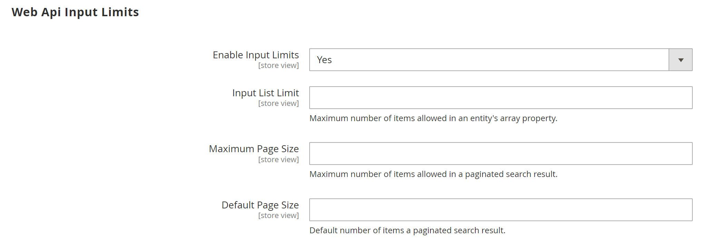

# [!UICONTROL Services] > [!UICONTROL Magento Web API]

{{config}}

<!-- [X-ref](../systems/integrations.md) -->

## [!UICONTROL SOAP Settings]

<!-- zoom -->

| Feld | [Umfang](../../getting-started/websites-stores-views.md#scope-settings) | Beschreibung |
|--- |--- |--- |
| [!UICONTROL Default Response Charset] | Shop-Ansicht | Bestimmt den Standardzeichensatz. Wenn leer, wird UTF-8 verwendet. |

{style="table-layout:auto"}

## [!UICONTROL GraphQl Input Limits]

<!-- zoom -->

| Feld | [Umfang](../../getting-started/websites-stores-views.md#scope-settings) | Beschreibung |
|--- |--- |--- |
| [!UICONTROL Enable Input Limits] | Shop-Ansicht | Legt fest, ob Eingabebeschränkungen für GraphQL-Aufrufe aktiviert sind. Standardwert: `No`. |
| [!UICONTROL Maximum Page Size] | Shop-Ansicht | Legt die maximale Anzahl von Elementen fest, die in einem paginierten Suchergebnis in der GraphQL-Antwort zulässig ist. Diese Option ist nicht verfügbar, wenn _Eingabegrenzwerte aktivieren_ = `No`. |

{style="table-layout:auto"}

## [!UICONTROL Web Api Input Limits]

<!-- zoom -->

| Feld | [Umfang](../../getting-started/websites-stores-views.md#scope-settings) | Beschreibung |
|--- |--- |--- |
| [!UICONTROL Enable Input Limits] | Shop-Ansicht | Bestimmt, ob Eingabebeschränkungen für Web-API-Aufrufe aktiviert sind. Standardwert: `No`. |
| Maximale Anzahl von Eingabelisten | Shop-Ansicht | Legt die maximale Anzahl von Elementen fest, die in einer Entitäts-Array-Eigenschaft in der Web-API-Anfrage zulässig ist. Diese Option ist nicht verfügbar, wenn _Eingabegrenzwerte aktivieren_ = `No`. |
| [!UICONTROL Maximum Page Size] | Shop-Ansicht | Legt die maximale Anzahl von Elementen fest, die in einem paginierten Suchergebnis in der Web-API-Antwort zulässig ist. Diese Option ist nicht verfügbar, wenn _Eingabegrenzwerte aktivieren_ = `No`. |
| [!UICONTROL Default Page Size] | Shop-Ansicht | Legt die Standardanzahl von Elementen in einem paginierten Suchergebnis in der Web-API-Antwort fest. |

{style="table-layout:auto"}

## [!UICONTROL Web API Security]

<!-- zoom -->

| Feld | [Umfang](../../getting-started/websites-stores-views.md#scope-settings) | Beschreibung |
|--- |--- |--- |
| [!UICONTROL Allow Anonymous Guest Access] | Global | Legt fest, ob Gäste anonym auf CMS zugreifen, Ressourcen aus SOAP und REST-APIs katalogisieren und speichern können. Standardmäßig ist der anonyme Gastzugriff nicht zulässig. Optionen: `Yes` / `No` |

{style="table-layout:auto"}

## [!UICONTROL JWT Authentication]

<!-- zoom -->

| Feld | [Umfang](../../getting-started/websites-stores-views.md#scope-settings) | Beschreibung |
|--- |--- |--- |
| [!UICONTROL Algorithm to sign/encrypt JWTs used for authentication] | Global | Gibt den Typ des JWS- oder JWE-Algorithmus an, der für die JWT-Verschlüsselung (JSON Web Token) verwendet wird |
| [!UICONTROL Content encryption algorithm for JWEs] | Global | Gibt den Typ des Inhaltsverschlüsselungsalgorithmus an, der für die JWT-Verschlüsselung verwendet wird, wenn der JWT-Algorithmus ausgewählt ist. Diese Option wird bei JWS-Algorithmen ignoriert. |
| [!UICONTROL Customer JWT Expires In] | Global | Legt die Dauer (in Minuten) fest, nach der ein Kunden-JWT-Bearer-Token abläuft. Das Kunden-JWT-Bearer-Token läuft in 30 Minuten ab, wenn dieses Feld leer ist oder einen negativen Wert hat. Standardwert: `60` |
| [!UICONTROL Admin User JWT Expires In] | Global | Legt die Zeit (in Minuten) fest, nach der das Admin-JWT-Bearer-Token abläuft. Das Admin-JWT-Bearer-Token läuft in 30 Minuten ab, wenn dieses Feld leer ist oder einen negativen Wert aufweist. Standardwert: `60` |

{style="table-layout:auto"}
