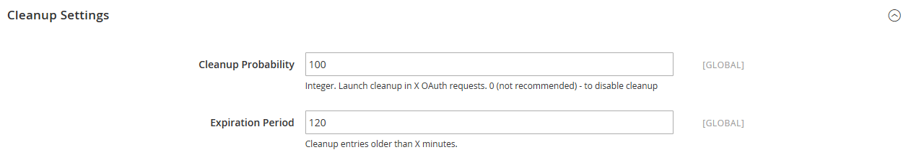

# [!UICONTROL Services] > [!UICONTROL OAuth]

{{config}}

## [!UICONTROL Access Token Expiration]

<!-- zoom -->

| Feld | [Anwendungsbereich](../../getting-started/websites-stores-views.md#scope-settings) | Beschreibung |
|--- |--- |--- |
| [!UICONTROL Customer Token Lifetime (hours]) | Global | Bestimmt die Dauer in Stunden, bevor ein Kunden-API-Token abläuft. Das Kunden-Token läuft nie ab, wenn das Feld leer ist. Standardwert: `1` |
| [!UICONTROL Admin Token Lifetime (hours)] | Global | Bestimmt die Dauer in Stunden, bevor ein Admin-API-Token abläuft. Das Admin-Token läuft nie ab, wenn das Feld leer ist. Standardwert: `4` |

{style="table-layout:auto"}

>[!NOTE]
>
>Träger-Kunden- und Admin-API-Token Lebensdauer- und Verschlüsselungsalgorithmen werden von der [JWT-Authentifizierung](magento-web-api.md#jwt-authentication) Konfigurationseinstellungen.

## [!UICONTROL Cleanup Settings]

<!-- zoom -->

| Feld | [Anwendungsbereich](../../getting-started/websites-stores-views.md#scope-settings) | Beschreibung |
|--- |--- |--- |
| [!UICONTROL Cleanup Probability] | Global | Gibt die Anzahl der OAuth-Anfragen an, bevor die Bereinigung gestartet wird. Geben Sie `0` , um die Bereinigung zu deaktivieren. |
| [!UICONTROL Enable WSDL Cache] | Global | Bestimmt das Alter der Einträge in Minuten, bevor sie bereinigt werden. |

{style="table-layout:auto"}

## [!UICONTROL Consumer Settings]

<!-- zoom -->

| Feld | [Anwendungsbereich](../../getting-started/websites-stores-views.md#scope-settings) | Beschreibung |
|--- |--- |--- |
| [!UICONTROL OAuth consumer credentials HTTP Post timeout] | Global | Gibt die Anzahl der Sekunden an, die ein Timeout des Systems beim Posten der Anmeldedaten durch Kunden erforderlich ist. |
| [!UICONTROL OAuth consumer credentials HTTP Post maxredirects] | Global | Gibt die maximale Anzahl von Weiterleitungen an, die sich auf eine Veröffentlichung von Kundenanmeldeinformationen beziehen. |
| [!UICONTROL Expiration Period] | Global | Bestimmt die Anzahl der Sekunden, bevor ein nicht verwendeter Schlüssel/Geheimnis nach Beginn des OAuth-Token-Austauschs abläuft. |

{style="table-layout:auto"}

## [!UICONTROL Authentication Locks]

<!-- zoom -->

| Feld | [Anwendungsbereich](../../getting-started/websites-stores-views.md#scope-settings) | Beschreibung |
|--- |--- |--- |
| [!UICONTROL Maximum Login Failures to Lock Out Account] | Global | Gibt die maximale Anzahl von Authentifizierungsfehlern an, für die das Konto gesperrt werden soll. |
| [!UICONTROL Lockout Time (seconds)] | Global | Gibt den Zeitraum in Sekunden an, nach dem das Konto entsperrt wird. |

{style="table-layout:auto"}
