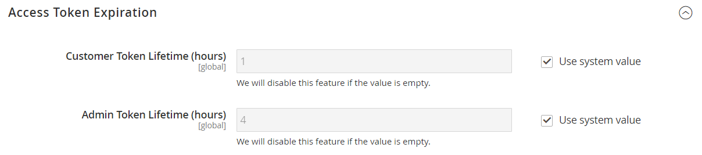

# [!UICONTROL Services] > [!UICONTROL OAuth]

{{config}}

## [!UICONTROL Access Token Expiration]

<!-- zoom -->

| Feld | [Umfang](../../getting-started/websites-stores-views.md#scope-settings) | Beschreibung |
|--- |--- |--- |
| [!UICONTROL Customer Token Lifetime (hours]) | Global | Bestimmt den Zeitraum in Stunden, nach dem ein Kunden-API-Token abläuft. Das Kunden-Token läuft nie ab, wenn das Feld leer ist. Standardwert: `1` |
| [!UICONTROL Admin Token Lifetime (hours)] | Global | Bestimmt, wie lange ein Admin-API-Token in Stunden abläuft. Das Admin-Token läuft nie ab, wenn das Feld leer ist. Standardwert: `4` |

{style="table-layout:auto"}

>[!NOTE]
>
>Lebensdauer- und Verschlüsselungsalgorithmen der Bearer-Kunden- und Admin-API-Token werden von den Konfigurationseinstellungen [JWT-Authentifizierung](magento-web-api.md#jwt-authentication) gesteuert.

## [!UICONTROL Cleanup Settings]

<!-- zoom -->

| Feld | [Umfang](../../getting-started/websites-stores-views.md#scope-settings) | Beschreibung |
|--- |--- |--- |
| [!UICONTROL Cleanup Probability] | Global | Gibt die Anzahl der OAuth-Anfragen an, bevor die Bereinigung gestartet wird. Geben Sie keine `0` ein, um die Bereinigung zu deaktivieren. |
| [!UICONTROL Enable WSDL Cache] | Global | Bestimmt das Alter der Einträge in Minuten, bevor sie bereinigt werden. |

{style="table-layout:auto"}

## [!UICONTROL Consumer Settings]

<!-- zoom -->

| Feld | [Umfang](../../getting-started/websites-stores-views.md#scope-settings) | Beschreibung |
|--- |--- |--- |
| [!UICONTROL OAuth consumer credentials HTTP Post timeout] | Global | Gibt an, wie lange das System nach einer Zeitüberschreitung braucht, wenn Kunden ihre Anmeldeinformationen veröffentlichen. |
| [!UICONTROL OAuth consumer credentials HTTP Post maxredirects] | Global | Gibt die maximale Anzahl von Weiterleitungen an, die mit einer Veröffentlichung von Verbraucheranmeldeinformationen verbunden sind. |
| [!UICONTROL Expiration Period] | Global | Bestimmt die Anzahl der Sekunden, bevor ein nicht verwendeter Schlüssel/Geheimnis abläuft, nachdem der OAuth-Token-Austausch begonnen hat. |

{style="table-layout:auto"}

## [!UICONTROL Authentication Locks]

<!-- zoom -->

| Feld | [Umfang](../../getting-started/websites-stores-views.md#scope-settings) | Beschreibung |
|--- |--- |--- |
| [!UICONTROL Maximum Login Failures to Lock Out Account] | Global | Gibt die maximale Anzahl von Authentifizierungsfehlern für das Sperren eines Kontos an. |
| [!UICONTROL Lockout Time (seconds)] | Global | Gibt den Zeitraum in Sekunden an, nach dem das Konto entsperrt wird. |

{style="table-layout:auto"}
