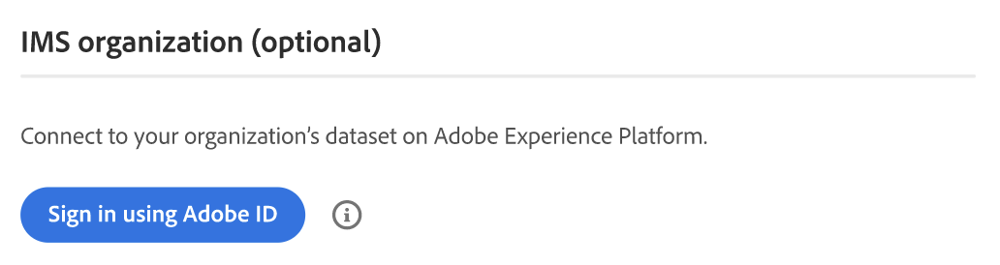

# [!UICONTROL Services] > [!UICONTROL Commerce Services Connector]

Informationen zum Verbinden Ihres Stores mit Adobe Commerce-Services finden Sie unter [Commerce-Services](https://experienceleague.adobe.com/docs/commerce/user-guides/integration-services/saas.html?lang=de).

{{config}}

## [!UICONTROL Sandbox API Keys]

<!-- zoom -->

| Feld | [Umfang](../../getting-started/websites-stores-views.md#scope-settings) | Beschreibung |
|--- |--- |--- |
| [!UICONTROL Sandbox public API key] | Global | API-Schlüssel, der den Autor und gegebenenfalls seine Berechtigungen identifiziert. |
| [!UICONTROL Sandbox private API key] | Global | Ein mit dem API-Schlüssel verknüpfter privater Schlüssel. |

{style="table-layout:auto"}

## [!UICONTROL Production Keys]

<!-- zoom -->

| Feld | [Umfang](../../getting-started/websites-stores-views.md#scope-settings) | Beschreibung |
|--- |--- |--- |
| [!UICONTROL Production public API key] | Global | API-Schlüssel, der den Autor und gegebenenfalls seine Berechtigungen identifiziert. |
| [!UICONTROL Production private API key] | Global | Ein mit dem API-Schlüssel verknüpfter privater Schlüssel. |

{style="table-layout:auto"}

## [!UICONTROL SaaS Identifier]

<!-- zoom -->

| Feld | [Umfang](../../getting-started/websites-stores-views.md#scope-settings) | Beschreibung |
|--- |--- |--- |
| [!UICONTROL Project] | Global | Name des SaaS-Projekts, das alle Ihre SaaS-Datenräume gruppiert. Wenn _SaaS-Projekte nicht vorhanden sind, wird die Schaltfläche_ Projekt erstellen“ angezeigt. |
| [!UICONTROL Data Space] | Global | Listet die SaaS-Datenräume im angegebenen SaaS-Projekt auf. Die Anzahl der SaaS-Datenräume hängt von Ihrer [Commerce-Lizenz ab](https://experienceleague.adobe.com/docs/commerce/user-guides/integration-services/saas.html?lang=de) Adobe Commerce: ein Produktionsdatenraum; zwei Testdatenräume; Magento Open Source: ein Produktionsdatenraum; keine Testdatenräume |

{style="table-layout:auto"}

## [!UICONTROL IMS Organization]

<!-- zoom -->

| Feld | Beschreibung |
|--- |--- |
| [!UICONTROL Sign in using Adobe ID] | Ihre Adobe ID ist in der Regel die E-Mail-Adresse, die Sie zum ersten Mal verwendet haben, als Sie Ihre Mitgliedschaft begonnen oder eine Anwendung oder einen Service für Adobe erworben haben. Ihre Adobe ID ist der Schlüssel, den Sie für den Zugriff auf Ihr Adobe-Konto benötigen. |

{style="table-layout:auto"}
