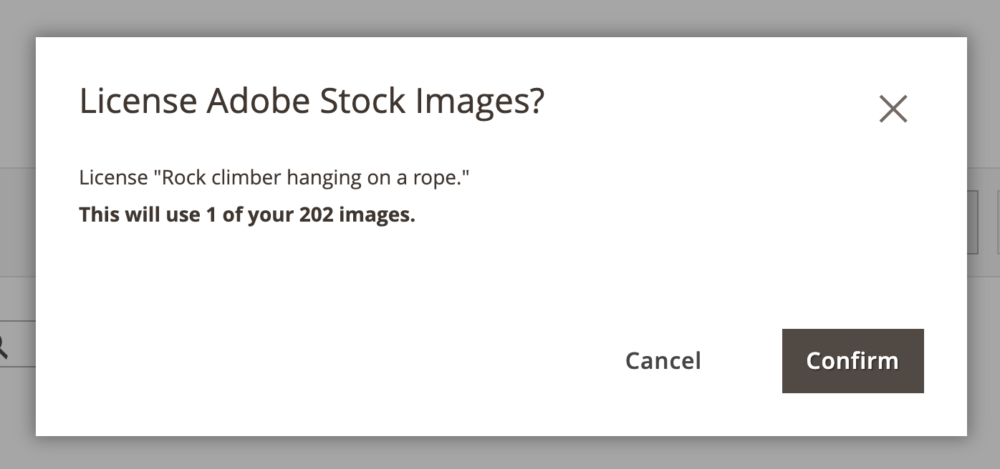

# Lizenzieren eines Adobe Stock-Images

Adobe Stock-Assets, die Sie für Ihre Adobe Commerce- und Magento Open Source-Produktions-Stores verwenden möchten, sollten lizenziert werden. Diese Lizenzierung stellt sicher, dass Sie rechtlichen Zugriff auf das Bild haben und das Adobe Stock-Wasserzeichen, das in allen [Bildvorschauen“ vorhanden ist, &#x200B;](./adobe-stock-save-preview.md). Um Bilder zu lizenzieren oder bereits lizenzierte Bilder zu speichern, müssen Sie bei Ihrem Adobe-Konto angemeldet sein.

Das neue [[!DNL Media Gallery]](media-gallery.md) bietet eine direkte Integration mit Adobe Stock, sodass Sie Ihre Bilder direkt von der Galerieseite aus lizenzieren können.

>[!BEGINSHADEBOX]

**Voraussetzungen**

Die Adobe Stock-Lizenzierungsfunktion ist nur verfügbar, wenn die [Adobe Stock-Integration](./adobe-stock.md) installiert und konfiguriert ist. Die Lizenzierung von [Adobe Stock][adobe-stock]-Bildern erfordert einen gebührenpflichtigen Adobe Stock-Plan und ein [Adobe-Konto][adobe-signin].

>[!ENDSHADEBOX]

## Lizenzieren eines Bildes aus dem neuen [!DNL Media Gallery]

1. Navigieren Sie in _Admin_-Seitenleiste zu **[!UICONTROL Content]** > _[!UICONTROL Media]_>**[!UICONTROL Media Gallery]**.

1. Führen Sie die Schritte unter [Verwenden von Adobe Stock](./adobe-stock-manage.md) aus, um sich anzumelden und Vorschaubilder im [Medienspeicher“ zu &#x200B;](./media-storage.md).

   {width="600" zoomable="yes"}

1. Klicken Sie auf die drei Punkte unter dem Bild {width="10" zoomable="no"} und dann auf **[!UICONTROL License]**.

   {width="600" zoomable="yes"}

   >[!NOTE]
   >
   >Wenn Sie nicht angemeldet sind, wird das Anmeldeformular angezeigt. Weitere Informationen zur Anmeldung finden Sie unter [Verwenden von Adobe Stock-Bildern](./adobe-stock-manage.md).

1. Klicken Sie im Bestätigungsdialog der Lizenzierung auf **[!UICONTROL Confirm]** , um die Lizenz für das Bild zu erteilen.

   {width="350" zoomable="yes"}

   >[!NOTE]
   >
   >Sie müssen über [Adobe Stock-Guthaben][stock-credits] in Ihrem Konto verfügen, um das Bild zu lizenzieren.

## Lizenzieren eines Bildes aus dem Standard-Medienspeicher

1. [Zugriff auf das Adobe Stock-][adobe-stock-manage.md].

1. Um [Bilddetails anzuzeigen][adobe-stock-manage.md#view-image-details] klicken Sie auf ein Bild in dem Suchraster in der richtigen Reihenfolge.

1. Führen Sie je nach aktuellem Lizenzstatus des Bildes einen der folgenden Schritte aus:

   - Wenn das Bild bereits lizenziert ist, klicken Sie auf **[!UICONTROL Save]**.

   - Wenn das Bild nicht _ist_ klicken Sie auf **[!UICONTROL License and Save]**.

     >[!NOTE]
     >
     >Sie müssen über [Adobe Stock-Guthaben][stock-credits] in Ihrem Konto verfügen, um das Bild zu lizenzieren.

   In dieser Aktion werden Sie aufgefordert, einen Dateinamen anzugeben, mit dem das Bild im [Medienspeicher“ gespeichert &#x200B;](./media-storage.md). Es wird ein standardmäßiger Dateiname bereitgestellt, Sie können den Namen jedoch an Ihre Anforderungen anpassen.

   {width="550" zoomable="yes"}

1. Klicken Sie auf **[!UICONTROL Confirm]**.

   Die Seite wird zum Medienspeicher weitergeleitet, und Ihre gespeicherte Vorschau wird angezeigt.

[access-search]: adobe-stock-manage.md#access-the-adobe-stock-search-grid
[view-details]: adobe-stock-manage.md#view-image-details
[stock-credits]: https://helpx.adobe.com/stock/help/credit-packs.html
[adobe-stock]: https://stock.adobe.com
[adobe-signin]: https://helpx.adobe.com/manage-account/using/access-adobe-id-account.html
