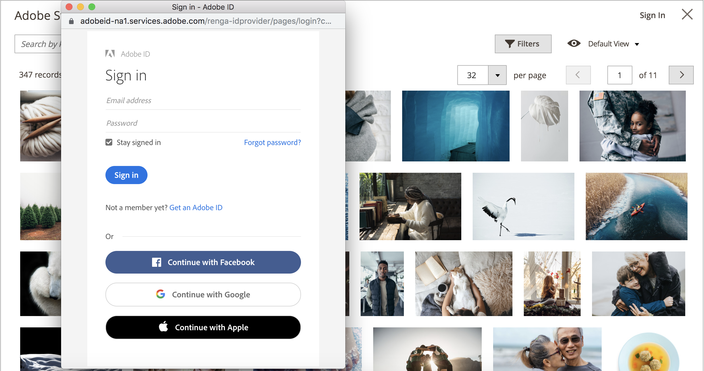

# Verwenden von Adobe Stock-Bildern

[Adobe Stock](https://stock.adobe.com)-Bilder können anstelle des Hochladens eigener Bildinhalte verwendet werden. Ein gängiger Anwendungsfall besteht darin, beim Erstellen einer Seite Bildinhalte hochzuladen und zu platzieren.

Die [[!DNL Media Gallery]](media-gallery.md) bietet eine direkte Integration mit Adobe Stock, sodass Sie Ihre Bilder direkt von der Galerieseite aus lizenzieren können.

## Zugriff auf das Adobe Stock-Suchraster

Der Adobe Stock-Suchbereich ist verfügbar, wenn Sie [eine Seite hinzufügen oder bearbeiten](page-add.md), wenn Sie [eine Kategorie erstellen oder bearbeiten](../catalog/category-create.md) oder wenn Sie [Bilder über den Inhaltseditor einfügen](editor-insert-image.md).

**_So suchen Sie Adobe Stock-Assets und fügen ein Stock-Bild zu einer Seite hinzu:_**

1. Navigieren Sie in _Admin_-Seitenleiste zu **[!UICONTROL Content]** > _[!UICONTROL Elements]_>**[!UICONTROL Pages]**.

1. Klicken Sie auf **[!UICONTROL Add a New Page]**.

   Wenn Sie eine vorhandene Seite bearbeiten möchten, können Sie in der Spalte _[!UICONTROL Action]_&#x200B;auf **[!UICONTROL Select]**&#x200B;klicken und **[!UICONTROL Edit]**&#x200B;auswählen.

1. Erweitern Sie  den Abschnitt **[!UICONTROL Content]** und führen Sie folgende Schritte aus:

   - Wenn Sie den [WYSIWYG-Editor aktiviert haben](editor.md) klicken Sie auf **[!UICONTROL Show/Hide Editor]** und dann auf **[!UICONTROL Insert Image]**.

   - Wenn [Page Builder aktiviert](../page-builder/setup.md) erweitern Sie das **[!UICONTROL Media]** Bedienfeld und ziehen Sie einen **[!UICONTROL Image]** Platzhalter in den Ziel-Container. Klicken Sie dann auf **[!UICONTROL Select from Gallery]**.

     {width="600" zoomable="yes"}

1. Klicken Sie auf **[!UICONTROL Search Adobe Stock]**.

**_So suchen Sie Adobe Stock-Assets und fügen ein Stock-Bild zu einer Kategorie hinzu:_**

1. Navigieren Sie in der _Admin_-Seitenleiste zu **[!UICONTROL Catalog]** > **[!UICONTROL Categories]**.

1. Klicken Sie auf **[!UICONTROL Add Root Category]** oder **[!UICONTROL Add Subcategory]**.

   Wenn Sie das Bild zu einer vorhandenen Kategorie hinzufügen möchten, klicken Sie auf den Kategorienamen in der Liste auf der linken Seite.

1. Erweitern Sie den Abschnitt **[!UICONTROL Content]** und klicken Sie unter _[!UICONTROL Category Image]_&#x200B;auf **[!UICONTROL Select from Gallery]**.

1. Klicken Sie auf **[!UICONTROL Search Adobe Stock]**.

So suchen Sie nach Adobe Stock-Assets und fügen ein Stock-Bild aus dem WYSIWYG-Editor hinzu:

1. Klicken Sie auf **[!UICONTROL Show/Hide Editor]**.

1. Klicken Sie auf **[!UICONTROL Insert Image]**.

1. Klicken Sie auf **[!UICONTROL Search Adobe Stock]**.

   {width="600" zoomable="yes"}

## Filtern und Suchen nach Adobe Stock-Assets

Das [Adobe Stock-Suchraster](#access-the-adobe-stock-search-grid) bietet Abfrage- und Filterfunktionen, mit denen Sie das perfekte Bild für Ihre [!DNL Commerce] finden können.

Standardmäßig werden die Suchergebnisse aus einer von Adobe Stock kuratierten Galerie mit einigen hundert Ergebnissen angezeigt. Wenn Sie Ihre eigene Keyword-Suche anwenden, durchsuchen Sie die Millionen von Assets, die über Adobe Stock verfügbar sind.

### Nach Adobe Stock-Assets anhand von Keywords suchen

1. [Zugriff auf das Adobe Stock-](#access-the-adobe-stock-search-grid).

1. Geben Sie Ihre Keyword-Suche in das **[!UICONTROL Search by keyword]** Eingabefeld oben links ein und klicken Sie auf die Lupe oder drücken Sie **Eingabe**.

   {width="600" zoomable="yes"}

### Filtern von Adobe Stock-Assets

1. [Führen Sie eine Keyword-Suche nach Adobe Stock-Assets ](#search-for-adobe-stock-assets-by-keywords).

1. Klicken Sie auf **[!UICONTROL Filters]**.

   Es stehen verschiedene Filter zur Verfügung, um Ihre Suchergebnisse zu verfeinern:

   | Filter | Beschreibung |
   |---|---|
   | [!UICONTROL Subcategory] | Nach Bildern filtern, die **Fotos** oder **Illustrationen** |
   | [!UICONTROL Orientation] | Nach Größe, Form und Seitenverhältnis filtern |
   | [!UICONTROL Color] | Verwenden einer Farbpalette zum Filtern von Bildern nach Farbe |
   | [!UICONTROL Price] | Nach Bildern auf Grundlage ihrer Kosten filtern |
   | [!UICONTROL Safe search] | Sichere Suche aktivieren oder deaktivieren |
   | [!UICONTROL Isolated Assets] | Anzeige auf &quot;_Assets“ beschränken_ bei denen Motive allein auf einem einfarbigen Hintergrund angezeigt werden |

   {style="table-layout:auto"}

   {width="600" zoomable="yes"}

1. Klicken Sie auf **[!UICONTROL Apply Filters]**.

   Das Suchergebnisraster wird mit Ihrer verfeinerten Suche aktualisiert.

## Anzeigen von Bilddetails

Jedes Bild verfügt über Details, die angezeigt werden können. Über diese Detailansicht sind zusätzliche bildspezifische Aktionen verfügbar[ z. B](adobe-stock-save-preview.md) Speichern von Bildvorschauen oder [Speichern (und optional Lizenzieren](adobe-stock-license-image.md) von Bildern).

1. [Zugriff auf das Adobe Stock-Suchraster](#access-the-adobe-stock-search-grid).

1. Klicken Sie in den Suchergebnissen auf ein Bild.

   Es werden weitere Bilddetails angezeigt, z. B.:

   - Eine größere Version des Bildes
   - Bildmetadaten, z. B. _[!UICONTROL Dimensions]_,_[!UICONTROL File type]_, _[!UICONTROL Category]_,_[!UICONTROL File]_ und _Schlüsselwörter_
   - Verwandte Bilder, z. B. Bilder aus derselben _Serie_ oder _Modell_
   - Aktionsschaltflächen wie [[!UICONTROL Save Preview]](adobe-stock-save-preview.md) und [[!UICONTROL Save (and optionally license) Image]](adobe-stock-license-image.md)

     {width="600" zoomable="yes"}

## Beim Adobe-Konto anmelden

Um vollständigen Zugriff auf ein Bild zu erhalten und das Adobe Stock-Wasserzeichen zu entfernen, müssen Sie [mit einem Adobe-Konto anmelden](https://helpx.adobe.com/de/manage-account/using/access-adobe-id-account.html) und Credits für die Lizenzrechte zur Verwendung eines Bildes erwerben.

1. [Zugriff auf das Adobe Stock-](#access-the-adobe-stock-search-grid).

1. Klicken Sie oben rechts auf **[!UICONTROL Sign In]** .

   Ein neues Browser-Fenster führt Sie durch den [Adobe-Anmeldeprozess](https://helpx.adobe.com/de/manage-account/using/access-adobe-id-account.html).

   Nach Abschluss des Anmeldevorgangs wird der lizenzierte Status von Bildern in den Suchergebnissen als Kennzeichnung angezeigt.

   {width="600" zoomable="yes"}

### Lizenzierten Status der Suchergebnisse anzeigen

[Beim Adobe-Konto anmelden](#log-in-to-your-adobe-account).

Auf allen lizenzierten Bildern, die mit Ihrem Adobe-Account verbunden sind, wird ein Label angezeigt, das deutlich macht, welche Bilder Sie lizenziert haben.

{width="600" zoomable="yes"}

### Speichern von Bildern im Medienspeicher

Bilder, die mit der Adobe Stock-Integration gesucht werden, können im [!DNL Commerce][Medienspeicher](media-storage.md) gespeichert werden, damit sie im gesamten [!DNL Commerce] wiederverwendet werden können.

Sie können zwei Arten von Bildern speichern: [Bildvorschau](adobe-stock-save-preview.md) oder ein [lizenziertes Bild](adobe-stock-license-image.md).

#### Speichern einer Bildvorschau

Eine Bildvorschau ist eine Version eines Adobe Stock-Assets mit Wasserzeichen. Bildvorschauen sind kostenlos und eine gute Möglichkeit, mit verschiedenen Bildern zu experimentieren, bevor Sie sich entscheiden, eine Lizenz für bestimmte Bilder zu erwerben und sie in Ihren Produktionsspeichern zu verwenden.

1. [Zugriff auf das Adobe Stock-Suchraster](#access-the-adobe-stock-search-grid).

1. Um [Bilddetails anzuzeigen](#view-image-details) klicken Sie auf ein Bild im Suchraster.

1. Klicken Sie auf **[!UICONTROL Save Preview]**.

   Diese Aktion zeigt eine Aufforderung an, einen Dateinamen anzugeben, mit dem das Bild im Medienspeicher gespeichert wird. Es wird ein standardmäßiger Dateiname bereitgestellt, Sie können den Namen jedoch an Ihre Anforderungen anpassen.

   {width="500" zoomable="yes"}

1. Klicken Sie auf **[!UICONTROL Confirm]**.

   Die Seite wird zum Medienspeicher weitergeleitet, und Ihre gespeicherte Vorschau wird angezeigt.

#### Speichern eines lizenzierten Bildes

Adobe Stock-Assets, die Sie für Ihre Produktions-[!DNL Commerce] verwenden möchten, sollten lizenziert werden. Durch die Lizenzierung wird sichergestellt, dass Sie rechtlichen Zugriff auf das Bild haben und das Adobe Stock-Wasserzeichen, das in allen [Bildvorschauen“ vorhanden ist, entfernt ](adobe-stock-save-preview.md). Um Bilder zu lizenzieren oder bereits lizenzierte Bilder zu speichern, müssen Sie bei Ihrem Adobe-Konto angemeldet sein.

1. [Beim Adobe-Konto anmelden](#log-in-to-your-adobe-account).

1. Um [Bilddetails anzuzeigen](#view-image-details) klicken Sie auf ein Bild im Suchraster.

1. Führen Sie je nach aktuellem Lizenzstatus des Bildes einen der folgenden Schritte aus:

   - Wenn das Bild bereits lizenziert ist, klicken Sie auf **[!UICONTROL Save]**.

   - Wenn das Bild nicht _ist_ klicken Sie auf **[!UICONTROL License and Save]**.

     >[!NOTE]
     >
     >Sie müssen über [Adobe Stock-Guthaben](https://helpx.adobe.com/de/stock/help/credit-packs.html) in Ihrem Konto verfügen, um das Bild zu lizenzieren.

   In dieser Aktion werden Sie aufgefordert, einen Dateinamen anzugeben, mit dem das Bild im [Medienspeicher“ gespeichert ](media-storage.md). Es wird ein standardmäßiger Dateiname bereitgestellt, Sie können den Namen jedoch an Ihre Anforderungen anpassen.

1. Klicken Sie auf **[!UICONTROL Confirm]**.

   Die Seite wird zum Medienspeicher weitergeleitet, und Ihre gespeicherte Vorschau wird angezeigt.
