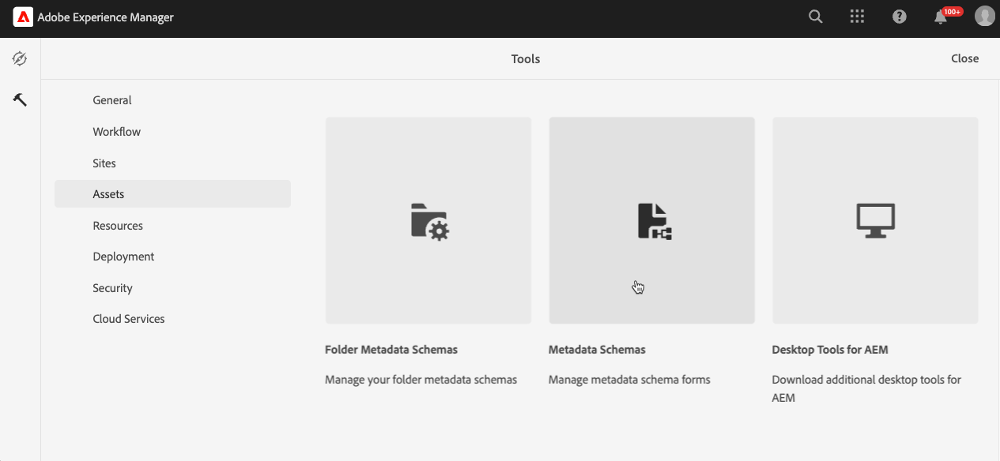

# Konfigurieren von Experience Manager Assets

{{$include /help/_includes/aem-assets-integration-beta-note.md}}

Um Medien-Assets für Ihren Store mithilfe der AEM Assets-Integration für Commerce zu verwalten, muss Ihr AEM Assets-Projekt bestimmte Metadaten hinzufügen, damit Sie mühelos Commerce-Assets suchen und verwalten können. Diese Metadaten erleichtern auch die Synchronisierung von Assets zwischen Adobe Commerce und Experience Manager Assets. Nachdem Sie die Metadatenfelder definiert haben, erfolgt die anfängliche Zuordnung dieser Felder automatisch, wenn ein Commerce-Asset für Experience Manager Assets freigegeben wird.

Für die Integration konfigurieren Sie zwei Metadatentypen:

- Mit dem **[Metadatenprofil](https://experienceleague.adobe.com/en/docs/experience-manager-cloud-service/content/assets/manage/metadata-profiles)** können Sie Standardmetadaten auf Assets in einem Ordner anwenden. Alle Assets im Ordner übernehmen die im Profil konfigurierten Standardmetadaten.

- **[Metadatenschema](https://experienceleague.adobe.com/en/docs/experience-manager-cloud-service/content/assets/manage/metadata-schemas)** definiert das Layout der Eigenschaftenseite und den Satz von Feldern, die als Metadateneigenschaften für ein AEM Asset verwendet werden können.

## Konfigurieren von Metadaten

Fügen Sie beim ersten Onboarding die folgenden Commerce-Metadaten sowohl einem AEM Assets-Metadatenprofil als auch einem Metadatenschema hinzu.

| Feldtyp | Titel | Eigenschaft | Standardwert |
|------ | ------- | ---------- | ------------- |
| Text | **Existiert er in Adobe Commerce?** | `./jcr:content/metadata/commerce:isCommerce` | yes |
| Mehrwerttext | **SKUs** | `./jcr:content/metadata/commerce:skus` | Keine |
| Mehrwerttext | **Positionen** | `./jcr:content/metadata/commerce:positions` | Keine |
| Mehrwerttext | **Rollen** | `./jcr:content/metadata/commerce:roles` | Keine |

### Hinzufügen von Commerce-Feldern zu einem Metadatenprofil

1. Wechseln Sie im Adobe Experience Manager-Arbeitsbereich zum Arbeitsbereich &quot;Inhaltsverwaltung für AEM Assets erstellen&quot;, indem Sie auf das Adobe Experience Manager-Symbol klicken.

   {width="600" zoomable="yes"}

1. Öffnen Sie die Administrator-Tools durch Auswahl des Hammersymbols.

   {width="600" zoomable="yes"}

1. Öffnen Sie die Profilkonfigurationsseite durch Klicken auf **[!UICONTROL Metadata Profiles]**.

1. **[!UICONTROL Create]** ein Metadatenprofil für die Commerce-Integration.

   {width="600" zoomable="yes"}

1. Hinzufügen einer Registerkarte für Commerce-Metadaten.

   1. Klicken Sie links auf **[!UICONTROL Settings]**.

   1. Klicken Sie im Registerkartenabschnitt auf **[!UICONTROL +]** und geben Sie dann die **[!UICONTROL Tab Name]**, `Commerce` an.

1. Fügen Sie dem Formular die [Metadatenfelder](#configure-metadata) hinzu.

   {width="600" zoomable="yes"}

1. Speichern Sie die Aktualisierung.

1. Wenden Sie das Metadatenprofil &quot;`Commerce integration`&quot;auf den Ordner an, in dem Commerce-Assets gespeichert sind.

   1. Wählen Sie auf der Seite [!UICONTROL  Metadata Profiles] das Commerce-Integrationsprofil aus.

   1. Wählen Sie im Aktionsmenü **[!UICONTROL Apply Metadata Profiles to Folder(s)]** aus.

   1. Wählen Sie den Ordner mit Commerce-Assets aus.

      Erstellen Sie einen Commerce-Ordner, falls er nicht vorhanden ist.

   1. Klicken Sie auf **[!UICONTROL Apply]**.

### Hinzufügen von Commerce-Feldern zu einem Metadatenschema-Formular

1. Öffnen Sie im Verwaltungsbereich für den AEM-Autoreninhalt für Assets **[!UICONTROL Metadata Schemas]** ([!UICONTROL Manage metadata schema forms]).

   {width="600" zoomable="yes"}

1. **[!UICONTROL Create]** ein Metadatenschema für Commerce.

   {width="600" zoomable="yes"}

1. Erstellen Sie auf dem [!UICONTROL Metadata Schema Form] die Felder `Does Commerce exist?` und `Commerce mappings` und ordnen Sie die Eigenschaften zu.

1. Klicken Sie auf **[!UICONTROL Save]**.

## Publish eines Assets

Nachdem Sie die AEM Metadaten und das Schemaprofil für Commerce-Assets konfiguriert haben, erstellen Sie das erste Commerce-Asset, das die Commerce-Metadatenfelder zuordnet.

1. Wechseln Sie vom Experience Manager zu &quot;[!UICONTROL Assets > Files]&quot;, wählen Sie den Ordner &quot;**Commerce**&quot;aus.

1. Laden Sie ein Bild für ein Commerce-Projekt hoch, indem Sie die Datei in den Ordner ziehen oder auf **[!UICONTROL Add Assets]** klicken.

1. Überprüfen Sie die Metadatenkonfiguration: **isCommerce** ist auf `true` festgelegt, und stellen Sie sicher, dass die Eigenschaft `commerce:skus` für das mit dem Bild verknüpfte Commerce-Produkt auf die SKU festgelegt ist.

1. Genehmigen Sie das Asset.

## Hinzufügen eines Assets zum Ordner &quot;Commerce&quot;

Erstellen Sie mindestens ein Asset im Ordner AEM Assets Commerce , dem die Commerce-Metadatenattribute zugewiesen sind.

Dieses Asset ist erforderlich, um eine Synchronisierung zwischen Ihrer Commerce-Instanz und AEM Assets einzurichten.

## Zuordnen von Metadaten für Assets

Metadaten werden zugeordnet, wenn ein Commerce-Asset zum ersten Mal veröffentlicht wird.  erstmalig aus Commerce. Medien-Assets mit integrierten oder benutzerdefinierten Feldern werden automatisch den angegebenen Feldern zugeordnet, wenn ein Asset zum ersten Mal an Experience Manager Assets gesendet wird.

Führen Sie die folgenden Aufgaben aus, bevor Sie mit der Asset-Zuordnung beginnen können:

- [Installieren und Konfigurieren der AEM Assets-Integration für Commerce](aem-assets-configure-commerce.md)
- [Richten Sie Synchronisierungsdienste ein, um Assets zwischen Ihrer Adobe Commerce-Projektumgebung und der AEM Assets-Projektumgebung zu übertragen.](aem-assets-setup-synchronization.md)
