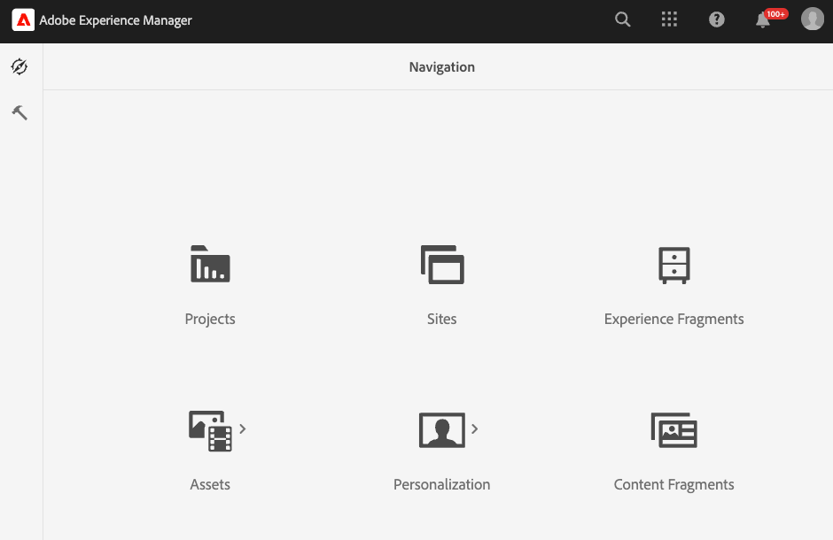

# Installieren das AEM Assets Paket

Adobe Systems stellt ein Projekt Vorlage, `commerce-assets`zum Hinzufügen von Commerce-Namespace und Metadaten Schema Ressourcen zum Experience Manager Assets als Cloud Service Umgebung Konfiguration bereit. Stellen Sie diese Vorlage als Maven-Paket auf Ihrem Umgebung bereit. Konfigurieren Sie dann die Commerce-Metadaten im AEM Assets Authoring-Umgebung, um die Einrichtung abzuschließen.

Die Vorlage fügt die folgenden Ressourcen zur Authoring-Umgebung von AEM Assets hinzu.

- Ein [benutzerdefinierter Namespace](https://github.com/ankumalh/assets-commerce/blob/main/ui.config/jcr_root/apps/commerce/config/org.apache.sling.jcr.repoinit.RepositoryInitializer~commerce-namespaces.cfg.json), der zur Identifizierung von Commerce-bezogenen Eigenschaften `Commerce`.

- Ein benutzerdefinierter Metadatentyp `commerce:isCommerce` mit der Bezeichnung `Eligible for Commerce`, um mit einem Adobe Commerce-Projekt verknüpfte Commerce-Assets zu taggen.

- Ein benutzerdefinierter Metadatentyp `commerce:productmetadata` und eine entsprechende UI-Komponente, um eine *[!UICONTROL Product Data]* Eigenschaft hinzuzufügen. Produkt Daten enthält die Metadaten Eigenschaften, um eine Commerce-Medienelement mit Produkt-SKUs zu verknüpfen und Bilder und `position` Attribute für die Medienelement anzugeben`role`.

  {width="600" zoomable="yes"}

- Ein Metadaten Schema-Formular mit einem Commerce-Tab, das die `Does it exist in Adobe Commerce?` Felder und `Product Data` für Tagging Commerce-Assets enthält. Das Formular bietet auch Optionen zum Anzeigen oder verstecken der `roles` `order` Felder (Position) im AEM Assets UI.

  Registerkarte {width="600" zoomable="yes"}

- Ein [Beispiel für getaggte und genehmigte Commerce](https://github.com/ankumalh/assets-commerce/blob/main/ui.content/src/main/content/jcr_root/content/dam/wknd/en/activities/hiking/equipment_6.jpg/.content.xml)Assets`equipment_6.jpg` zur Unterstützung der anfänglichen Asset-Synchronisierung. Nur genehmigte Commerce-Assets können von AEM Assets mit Adobe Commerce synchronisiert werden.

>[!NOTE]
>Weitere Informationen zur `commerce-assets` AEM-Projektvorlage finden Sie in der [Readme](https://github.com/ankumalh/assets-commerce).

Sie benötigen die folgenden Ressourcen und Berechtigungen, um dieses AEM-Projekt zum Aktualisieren der Umgebungskonfiguration verwenden zu können:

- [Zugriff auf das AEM Assets Cloud Manager-Programm und Umgebungen](https://experienceleague.adobe.com/en/docs/experience-manager-cloud-service/content/onboarding/journey/cloud-manager#access-sysadmin-bo) mit den Rollen „Programm“ und „Bereitstellungs-Manager“

- eine [lokale AEM-Entwicklungsumgebung](https://experienceleague.adobe.com/en/docs/experience-manager-learn/cloud-service/local-development-environment-set-up/overview) und die Vertrautheit mit dem lokalen AEM-Entwicklungsprozess.

- Machen Sie sich mit der [AEM](https://experienceleague.adobe.com/de/docs/experience-manager-cloud-service/content/implementing/developing/aem-project-content-package-structure)Projektstruktur und der Bereitstellung benutzerdefinierter Inhaltspakete mit Cloud Manager vertraut.

## Installieren des `commerce-assets`

1. Erstellen Sie aus der Cloud Manager bei Bedarf Produktions- und Staging-Umgebungen für Ihr AEM Assets-Projekt.

1. Konfigurieren Sie bei Bedarf eine Bereitstellungs-Pipeline.

1. Laden Sie von GitHub den Textbausteincode aus dem [Commerce-Assets AEM-Projekt](https://github.com/ankumalh/assets-commerce) herunter.

1. Installieren Sie den benutzerdefinierten Code in Ihrer [lokalen AEM-Entwicklungs Umgebung](https://experienceleague.adobe.com/en/docs/experience-manager-learn/cloud-service/local-development-environment-set-up/overview) in Ihrer AEM Assets Umgebung-Konfiguration als Maven-Paket oder kopieren Sie den Code manuell in die vorhandene Projektkonfiguration.

1. Führen Sie ein Commit für die Änderungen aus und übertragen Sie Ihre lokalen Entwicklungs-Verzweigung auf die Git-Repository von Cloud Manager.

1. Stellen Sie in Cloud Manager [Code bereit, um die AEM-Umgebung zu aktualisieren](https://experienceleague.adobe.com/en/docs/experience-manager-cloud-service/content/implementing/using-cloud-manager/deploy-code#deploying-code-with-cloud-manager).

## Konfigurieren eines Metadatenprofils

Legen Sie in der AEM Assets-Autorenumgebung Standardwerte für Commerce-Asset-Metadaten fest, indem Sie ein Metadatenprofil erstellen. Wenden Sie dann das neue Profil auf AEM Asset-Ordner an, um diese Standardwerte automatisch zu verwenden. Diese Konfiguration optimiert die Asset-Verarbeitung durch Reduzierung manueller Schritte.

1. Melden Sie sich bei der Adobe Experience Manager Autoren-Umgebung an.

1. Wechseln Sie in der Adobe Experience Manager Arbeitsbereich zum Arbeitsbereich Autor Content Administration, um AEM Assets zu erhalten, indem Sie auf das Symbol Adobe Experience Manager klicken.

   {width="600" zoomable="yes"}

1. Öffnen Sie die Administratortools, indem Sie auf das Hammersymbol klicken.

   {width="600" zoomable="yes"}

1. Öffnen Sie die Seite Profilkonfiguration , indem Sie auf **[!UICONTROL Metadata Profiles]** klicken.

1. **[!UICONTROL Create]** eines Metadatenprofils für die Commerce-Integration.

   {width="600" zoomable="yes"}

1. Fügen Sie eine Registerkarte für Commerce-Metadaten hinzu.

   1. Klicken Sie links auf **[!UICONTROL Settings]**.

   1. Klicken Sie im Abschnitt Registerkarte auf **[!UICONTROL +]** und geben Sie dann die **[!UICONTROL Tab Name]** an, `Commerce`.

1. hinzufügen das `Does it exist in Commerce?` Feld in das Formular ein und legen Sie den Standardwert auf `yes`fest.

   {width="600" zoomable="yes"}

1. Speichern die Aktualisierung.

1. Übernehmen die `Commerce integration` Metadaten Profil in den Ordner, in dem Commerce-Assets gespeichert sind.

   1. Wählen Sie auf [!UICONTROL  Metadata Profiles] Seite das Integrationsprofil Commerce aus.

   1. Wählen Sie im Menü Aktion die Option **[!UICONTROL Apply Metadata Profiles to Folders]** aus.

   1. Wählen Sie den Ordner aus, der Commerce-Assets enthält.

      Erstellen einen Commerce-Ordner, falls dieser nicht vorhanden ist.

   1. Klicken Sie auf **[!UICONTROL Apply]**.

>[!TIP]
>
>Sie können Commerce-Assets beim Hochladen in die AEM Assets Umgebung automatisch synchronisieren, indem Sie die Metadaten Profil aktualisieren, um den Standardwert für das _[!UICONTROL Review Status]_Feld auf `Approved`festzulegen. Der Eigenschaft Typ für das `Review Status` Feld ist `./jcr:content/metadata/dam:status`.

## Nächster Schritt

[Installieren von Adobe Commerce-Paketen](aem-assets-configure-commerce.md)
