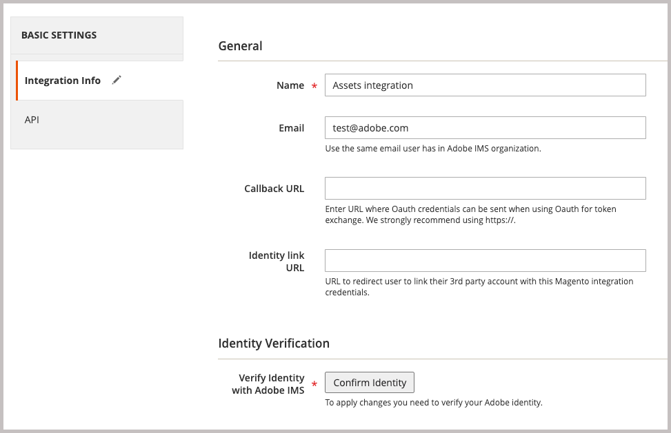
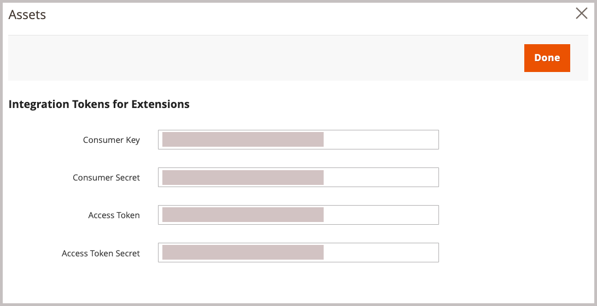

# Installieren und Konfigurieren der AEM Assets-Integration für Commerce

{{$include /help/_includes/aem-assets-integration-beta-note.md}}

Installieren und konfigurieren Sie die AEM Assets-Integration für Commerce, indem Sie die Erweiterung zur Commerce-Anwendung hinzufügen, eine Verbindung zu Commerce SaaS-Diensten herstellen, den Adobe I/O Events-Dienst einrichten und eine Verbindung zum Commerce SaaS herstellen.

## Systemanforderungen

**Softwareanforderungen**

- Adobe Commerce 2.4.5+
- PHP 8.1, 8.2, 8.3
- Verfasser: 2.x

## Voraussetzungen

- Adobe Commerce muss für die Verwendung der [Adobe IMS-Authentifizierung](/help/getting-started/adobe-ims-config.md) konfiguriert sein.
- Kontobereitstellung und -berechtigungen - Administratoren müssen Zugriff auf die folgenden Ressourcen haben, um die Experience Manager Assets-Integration zu konfigurieren:
   - Commerce-Anwendungsadministrator - Installieren Sie die erforderlichen Erweiterungen und konfigurieren Sie den Commerce-Anwendungsserver über den Administrator oder die Befehlszeile
   - [Commerce Admin](https://experienceleague.adobe.com/en/docs/commerce-admin/start/guide-overview) - Aktualisieren der Speicherkonfiguration und Verwalten von Commerce-Benutzerkonten
   - [Experience Manager Assets](https://experienceleague.adobe.com/en/docs/experience-manager-assets-essentials/help/introduction): Adobe IMS-Anwendungsadministrator oder -Benutzerkonto. Konto muss über die Berechtigungen zum Erstellen und Verwalten von Ordnern und Erstellen öffentlicher Sammlungen, zum Hochladen von Assets, zum Einrichten von Berechtigungen und zum Einrichten von Metadaten verfügen.

## Konfigurationsübersicht

Aktivieren Sie die Integration, indem Sie die folgenden Aufgaben ausführen:

1. [Installieren Sie die AEM Assets-Integrationserweiterung (`aem-assets-integration`)](#install-the-aem-assets-integration-extension).
1. [Konfigurieren Sie den Commerce Service Connector](#configure-the-commerce-services-connector), um Ihre Adobe Commerce-Instanz mit den Diensten zu verbinden, die die Übertragung von Daten zwischen Adobe Commerce und AEM Assets ermöglichen.
1. [Adobe I/O-Ereignisse für Commerce konfigurieren](#configure-adobe-io-events-for-commerce)
1. [Abrufen von Authentifizierungsberechtigungen für den API-Zugriff](#get-authentication-credentials-for-api-access)

## Installieren der AEM Assets Integration-Erweiterung

>[!BEGINSHADEBOX]

**Voraussetzung**

- Rufen Sie [repo.magento.com](https://repo.magento.com/admin/dashboard) auf, um die Erweiterung zu installieren. Informationen zur Schlüsselgenerierung und zum Abrufen der erforderlichen Berechtigungen finden Sie unter [Abrufen Ihrer Authentifizierungsschlüssel](https://experienceleague.adobe.com/en/docs/commerce-operations/installation-guide/prerequisites/authentication-keys). Informationen zu Cloud-Installationen finden Sie im [Commerce on Cloud Infrastructure Guide](https://experienceleague.adobe.com/en/docs/commerce-cloud-service/user-guide/develop/authentication-keys)

- Zugriff auf die Befehlszeile des Adobe Commerce-Anwendungsservers.

>[!ENDSHADEBOX]

Installieren Sie die neueste Version der AEM Assets Integration-Erweiterung (`aem-assets-integration`) auf einem Adobe Commerce, auf dem Adobe Commerce 2.4.4 oder höher ausgeführt wird. Die AEM Asset-Integration wird als Composer-Metapaket vom Repository [repo.magento.com](https://repo.magento.com/admin/dashboard) bereitgestellt.

>[!BEGINTABS]

>[!TAB Cloud-Infrastruktur]

Verwenden Sie diese Methode, um die [!DNL AEM Assets Integration] -Erweiterung für eine Commerce Cloud-Instanz zu installieren.

1. Wechseln Sie auf Ihrer lokalen Workstation zum Projektverzeichnis für Ihr Adobe Commerce-Projekt in der Cloud-Infrastruktur-Projekt.

   >[!NOTE]
   >
   >Informationen zum lokalen Verwalten von Commerce-Projektumgebungen finden Sie unter [Verwalten von Verzweigungen mit der CLI](https://experienceleague.adobe.com/en/docs/commerce-cloud-service/user-guide/develop/cli-branches) im _Benutzerhandbuch zu Adobe Commerce on Cloud Infrastructure_.

1. Sehen Sie sich die Umgebungsverzweigung an, die mit der Adobe Commerce Cloud-CLI aktualisiert werden soll.

   ```shell
   magento-cloud environment:checkout <environment-id>
   ```

1. Fügen Sie die AEM Assets Integration for Commerce -Erweiterung hinzu.

   ```shell
   composer require "magento/aem-assets-integration" "<version-tbd>" --no-update
   ```

1. Aktualisieren Sie Package-Abhängigkeiten.

   ```shell
   composer update "magento/aem-assets-integration"
   ```

1. Übernehmen und pushen Sie Code-Änderungen für die Dateien `composer.json` und `composer.lock`.

1. Fügen Sie die Codeänderungen für die Dateien `composer.json` und `composer.lock` hinzu, übertragen Sie sie und übertragen Sie sie in die Cloud-Umgebung.

   ```shell
   git add -A
   git commit -m "Install AEM Assets Integration extension for Adobe Commerce"
   git push origin <branch-name>
   ```

   Durch das Übermitteln der Aktualisierungen wird der [Commerce-Cloud-Bereitstellungsprozess](https://experienceleague.adobe.com/en/docs/commerce-cloud-service/user-guide/develop/deploy/process) initiiert, um die Änderungen anzuwenden. Überprüfen Sie den Bereitstellungsstatus im [Bereitstellungsprotokoll](https://experienceleague.adobe.com/en/docs/commerce-cloud-service/user-guide/develop/test/log-locations#deploy-log).

>[!TAB On-premise]

Verwenden Sie diese Methode, um die Erweiterung [!DNL AEM Assets Integration] für eine lokale Instanz zu installieren.

1. Verwenden Sie Composer, um Ihrem Projekt die AEM Assets Integration für Commerce-Erweiterung hinzuzufügen:

   ```shell
   composer require "magento/aem-assets-integration" --no-update
   ```

1. Aktualisieren Sie die Abhängigkeiten und installieren Sie die Erweiterung:

   ```shell
   composer update  "magento/aem-assets-integration"
   ```

1. Upgrade von Adobe Commerce:

   ```shell
   bin/magento setup:upgrade
   ```

1. Löschen Sie den Cache:

   ```shell
   bin/magento cache:clean
   ```

   >[!TIP]
   >
   >In einigen Fällen, insbesondere bei der Bereitstellung in der Produktionsumgebung, sollten Sie das Löschen von kompiliertem Code vermeiden, da dies einige Zeit in Anspruch nehmen kann. Stellen Sie sicher, dass Sie Ihr System sichern, bevor Sie Änderungen vornehmen.

>[!ENDTABS]

## Konfigurieren von Commerce Services Connector

Der Commerce Services Connector ermöglicht die Datensynchronisation und Kommunikation zwischen der Commerce-Instanz, dem Asset Rule Engine-Dienst und anderen unterstützenden Diensten.

>[!NOTE]
>
>Die Einrichtung des Commerce Services Connector ist ein einmaliger Prozess, der für die Verwendung von [Adobe Commerce SaaS-Diensten](https://experienceleague.adobe.com/en/docs/commerce-merchant-services/user-guides/integration-services/saas#availableservices) erforderlich ist. Wenn Sie den Connector bereits für einen anderen Dienst konfiguriert haben, können Sie die vorhandene Konfiguration über den Commerce-Administrator anzeigen, indem Sie **[!UICONTROL Systems]** > [!UICONTROL Services] > **[!UICONTROL Commerce Services Connector]** auswählen.

Um Daten zwischen Ihrer Adobe Commerce-Instanz und den Diensten zu übertragen, die die AEM Assets-Integration aktivieren, konfigurieren Sie den Commerce Services Connector wie folgt:

- Konfigurieren Sie Ihre Commerce-Instanz mit Produktions- und Sandbox-API-Schlüsseln für die Authentifizierung.
- Geben Sie einen Datenraum (SaaS-Kennung) für sicheren Cloud-Speicher an.
- Melden Sie sich bei derselben IMS-Organisation an, mit der Sie auf AEM Assets zugreifen, um die Verbindung zwischen Ihrem Datensatz und der Adobe Experience Platform herzustellen.

Detaillierte Anweisungen finden Sie unter [Commerce Services Connector](https://experienceleague.adobe.com/en/docs/commerce-merchant-services/user-guides/integration-services/saas#organizationid).

Wenn Sie den Commerce Services Connector konfigurieren, generiert das System die SaaS-Projekt- und Datenbank-IDs. Sie benötigen diese IDs während des Mandanten-Onboarding-Prozesses.

{width="600" zoomable="yes"}

## Adobe I/O-Ereignisse für Commerce konfigurieren

Die AEM Assets-Integration verwendet den Adobe I/O Events-Dienst, um benutzerdefinierte Ereignisdaten zwischen der Commerce-Instanz und der Experience Cloud zu senden. Die Ereignisdaten werden zur Koordinierung der Workflows für die AEM Assets-Integration verwendet.

>[!BEGINSHADEBOX]

**Voraussetzung**

- Stellen Sie sicher, dass RabbitMQ aktiviert ist und auf Ereignisse wartet.
   - [RabbitMQ-Einrichtung für Adobe Commerce in lokalen Betrieben](https://experienceleague.adobe.com/en/docs/commerce-cloud-service/user-guide/configure/service/rabbitmq)
   - [RabbitMQ-Einrichtung für Adobe Commerce in der Cloud-Infrastruktur](https://experienceleague.adobe.com/en/docs/commerce-cloud-service/user-guide/configure/service/rabbitmq)

>[!ENDSHADEBOX]

>[!NOTE]
>
>Detaillierte Informationen zum Adobe I/O von-Ereignissen für Commerce finden Sie in der Dokumentation [Adobe I/O-Ereignisse für Commerce](https://developer.adobe.com/commerce/extensibility/events/) auf der Adobe Developer-Site.

Für die Einrichtung sind die folgenden Schritte erforderlich.

1. Aktivieren Sie das Commerce Eventing-Framework, indem Sie Adobe I/O-Ereignisse auf dem Anwendungsserver und im Admin konfigurieren.
1. Aktivieren Sie die Datensynchronisation zwischen Adobe Commerce und AEM Assets, indem Sie die Assets Rules Engine Service-API zum Konfigurieren der Verbindung verwenden.
1. Aktivieren Sie die AEM Assets-Integration in der Admin-Konsole.

### Aktivieren des Commerce Eventframework

Aktivieren Sie das Commerce Eventing-Framework mithilfe der Anweisungen für die Umgebung, in der Ihr Commerce-Projekt bereitgestellt wird.

>[!BEGINTABS]

>[!TAB Cloud-Infrastruktur]

1. Aktivieren Sie den Adobe I/O Events-Dienst im Menü [!DNL Store Settings Configuration] .

   1. Navigieren Sie vom Administrator zu **[!UICONTROL Stores]** > [!UICONTROL Settings] > **[!UICONTROL Configuration]** > **[!UICONTROL Adobe Services]** > **Adobe I/O Events**.

   1. Erweitern Sie **[!UICONTROL Commerce events]**.

   1. Setzen Sie **[!UICONTROL Enabled]** auf `Yes`.

      {width="600" zoomable="yes"}

      >[!NOTE]
      >
      >[Aktivieren Sie cron](https://developer.adobe.com/commerce/extensibility/events/configure-commerce/#check-cron-and-message-queue-configuration) , damit Commerce Ereignisse an die API-Endpunkte senden kann, um die Kommunikation und Workflows für die Integration zu verwalten.

1. Aktualisieren Sie die Cloud-Projektkonfiguration.

   1. Fügen Sie die Datei `app/etc/config.php` zu Ihrem funktionierenden Repository hinzu:

   ```shell
   git add app/etc/config.php
   ```

   1. Führen Sie den Befehl `composer info magento/ece-tools` aus, um Ihre Version der ece-tools zu bestimmen. Wenn die Version kleiner ist als `2002.1.13`, aktualisiert [auf die neueste Version](https://experienceleague.adobe.com/en/docs/commerce-cloud-service/user-guide/dev-tools/ece-tools/update-package).

   1. Aktivieren Sie Eventing in der Datei `.magento.env.yaml` :

      ```yaml
      stage:
         global:
            ENABLE_EVENTING: true
      ```

   1. Übernehmen und pushen Sie aktualisierte Dateien in die Cloud-Umgebung.

>[!TAB On-premise]

1. Aktivieren Sie den Adobe I/O Events-Dienst im Menü [!DNL Store Settings Configuration] .

   1. Navigieren Sie vom Administrator zu **[!UICONTROL Stores]** > [!UICONTROL Settings] > **[!UICONTROL Configuration]** > **[!UICONTROL Adobe Services]** > **Adobe I/O Events**.

   1. Erweitern Sie **[!UICONTROL Commerce events]**.

   1. Setzen Sie **[!UICONTROL Enabled]** auf `Yes`.

      {width="600" zoomable="yes"}

      >[!NOTE]
      >
      >[Aktivieren Sie Cron-Aufträge](https://developer.adobe.com/commerce/extensibility/events/configure-commerce/#check-cron-and-message-queue-configuration) , damit Commerce Ereignisse senden kann, um die Kommunikation und Workflows zwischen AEM Assets und Commerce zu verwalten.

>[!ENDTABS]

## Abrufen von Authentifizierungsberechtigungen für den API-Zugriff

Für die AEM Assets-Integration für Commerce sind OAuth-Authentifizierungsberechtigungen erforderlich, um API-Zugriff auf die Commerce-Instanz zu ermöglichen. Sie benötigen diese Anmeldeinformationen, um das Commerce-Projekt beim Assets Rule Engine-Dienst beim Onboarding von Mandanten zu registrieren und API-Anfragen zum Verwalten von Assets zwischen Adobe Commerce und AEM Assets zu senden.

Sie generieren die Anmeldeinformationen, indem Sie die Integration zur Commerce-Instanz hinzufügen und sie aktivieren.

### Integration zur Commerce-Umgebung hinzufügen

1. Wechseln Sie vom Administrator zu **System** > Erweiterungen > **Integrationen** und klicken Sie dann auf **Neue Integration hinzufügen**.

1. Geben Sie Informationen zur Integration ein.

   Geben Sie im Abschnitt **Allgemein** nur die Integration **Name** und **E-Mail** an. Verwenden Sie die E-Mail für ein Adobe IMS-Konto mit Zugriff auf die Organisation, in der Commerce und Experience Manager Assets bereitgestellt werden.

   {width="600" zoomable="yes"}

1. Überprüfen Sie Ihre Identität, indem Sie auf **Identität bestätigen** klicken.

   Das System überprüft Ihre Identität, indem es sich bei der Experience Cloud mit Ihrer Adobe-ID authentifiziert.

1. API-Ressourcen konfigurieren

   1. Klicken Sie im linken Bereich auf **[!UICONTROL API]**.
E
   1. Wählen Sie die externe Medienressource **[!UICONTROL Catalog > Inventory > Products > External Media]** aus.

   {width="600" zoomable="yes"}

1. Klicken Sie auf **[!UICONTROL Save]**.

### Anmeldeinformationen generieren

Generieren Sie auf der Seite Integrationen die OAuth-Authentifizierungsberechtigungen, indem Sie für die Assets-Integration auf **Aktivieren** klicken. Sie benötigen diese Anmeldeinformationen, um das Commerce-Projekt beim Assets Rule Engine-Dienst zu registrieren und API-Anfragen zum Verwalten von Assets zwischen Adobe Commerce und AEM Assets zu senden.

1. Generieren Sie auf der Seite Integrationen die Anmeldeinformationen durch Klicken auf **[!UICONTROL Activate]**.

   {width="600" zoomable="yes"}

1. Speichern Sie die Anmeldeinformationen für den Consumer-Schlüssel und das Zugriffstoken für die spätere Verwendung.

{width="600" zoomable="yes"}

1. Klicken Sie auf **[!UICONTROL Done]**.

>[!NOTE]
>
>Sie können auch Authentifizierungsberechtigungen mithilfe der Adobe Commerce-APIs generieren. Weitere Informationen zu diesem Vorgang und weitere Informationen zur OAuth-basierten Authentifizierung für Adobe Commerce finden Sie unter [OAuth-basierte Authentifizierung](https://developer.adobe.com/commerce/webapi/get-started/authentication/gs-authentication-oauth/) in der Adobe Developer-Dokumentation.
