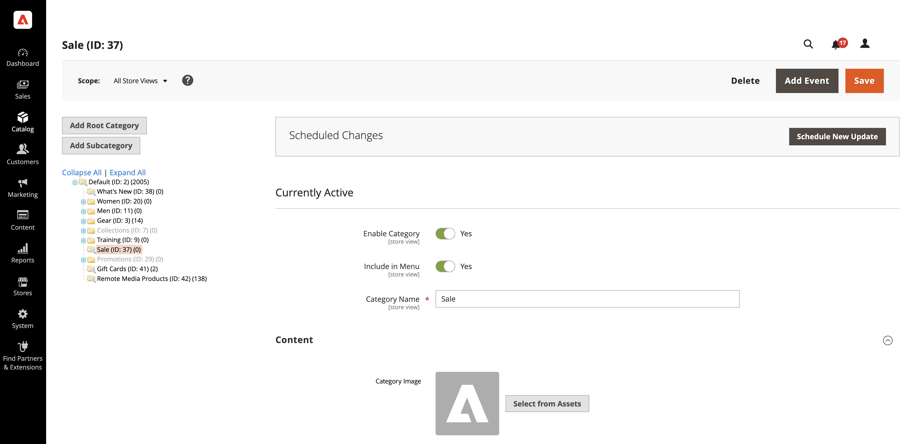

# Verwenden von AEM Assets

<!--In ACAP-844, this topic was linked to from the Commerce Admin products images and videos when the Assets integration is enabled. If the URL to the topic changes, be sure to add a redirect.-->

## Aktualisieren von Assets

Nachdem Sie ein Asset in AEM Assets bearbeitet haben, senden Sie die Aktualisierungen an Commerce, indem Sie das Asset genehmigen und erneut verarbeiten. Nur genehmigte Assets werden an Ihre Commerce-Instanz gesendet. Durch die Neuverarbeitung des Assets wird sichergestellt, dass alle endgültigen Änderungen oder Metadatenaktualisierungen erfasst werden, bevor das Asset an Adobe Commerce gesendet wird.

Weitere Informationen finden Sie in der folgenden Dokumentation zu AEM Assets.

- [Erneute Verarbeitung digitaler Assets](https://experienceleague.adobe.com/de/docs/experience-manager-cloud-service/content/assets/manage/reprocessing)

- [Genehmigen eines Assets](https://experienceleague.adobe.com/de/docs/experience-manager-cloud-service/content/assets/dynamicmedia/dynamic-media-open-apis/approve-assets)

## Hinzufügen von Assets zu Inhaltskategorien

Sie können Assets zu Ihren Inhaltskategorien hinzufügen, sobald Sie die AEM Assets-Integration aktiviert und konfiguriert haben:

1. Navigieren Sie in _Admin_-Seitenleiste zu **[!UICONTROL Catalog]** > **[!UICONTROL Categories]**.

1. Erweitern Sie die  im Abschnitt **[!UICONTROL Content]**.

   {width="600" zoomable="yes"}

1. Um ein **[!UICONTROL Category Image]** oben auf der Seite anzuzeigen, klicken Sie auf **[!UICONTROL Select from Assets]** , um ein Bild aus Ihrem AEM Assets-Ordner zu verwenden.

1. Klicken Sie auf **[!UICONTROL Save]** und fahren Sie fort.

   Weitere Informationen zum Erstellen einer Kategorie finden Sie unter [Kategorieinhalt &#x200B;](../catalog/category-create.md#step-3-complete-the-category-content).
