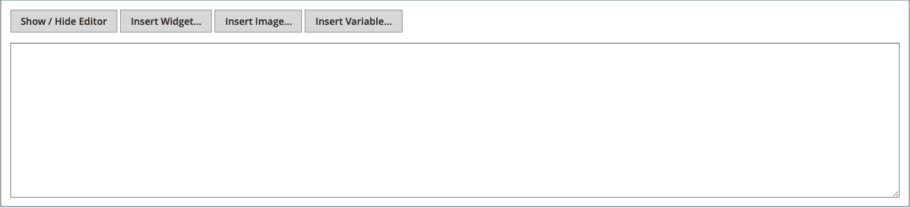

# Inhaltsbausteine hinzufügen

Benutzerdefinierte Inhaltsblöcke können erstellt und dann zu jeder Seite, Gruppe von Seiten oder sogar zu einem anderen Block hinzugefügt werden. Sie können beispielsweise einen Bildregler in einem Block platzieren und den Block dann auf der Startseite platzieren. Der Arbeitsbereich Blöcke verwendet dieselben [grundlegenden Steuerelemente](pages-workspace.md) wie der Arbeitsbereich _Seiten_, um verfügbare Blöcke zu finden und Routinewartungsaufgaben durchzuführen. Wenn der Block fertig ist, können Sie das Tool [Widget](widget-static-block.md) verwenden, um ihn auf bestimmten Seiten in Ihrem Store zu platzieren.

{width="700" zoomable="yes"}

## Erstellen eines Bausteins

1. Navigieren Sie in _Admin_-Seitenleiste zu **[!UICONTROL Content]** > _[!UICONTROL Elements]_>**[!UICONTROL Blocks]**.

1. Klicken Sie oben rechts auf **Neuen Block hinzufügen**.

   {width="500" zoomable="yes"}

1. Wenn Sie den standardmäßig aktivierten Status des neuen Blocks ändern möchten, setzen Sie **Block aktivieren** auf `No`.

1. Weisen Sie einen **Blocktitel** als interne Referenz zu.

1. Weisen Sie dem Block eine eindeutige **Kennung** zu.

   Verwenden Sie alle Kleinbuchstaben mit Unterstrichen anstelle von Leerzeichen.

1. Wählen Sie die **[!UICONTROL Store View]** aus, in denen der Block verfügbar sein soll.

1. Fügen Sie den Inhalt für den Block mit dem angezeigten Content-Tool-Set hinzu:

   - Wenn [Page Builder](../page-builder/introduction.md) aktiviert ist, wählen Sie **[!UICONTROL Edit with Page Builder]** aus, um die Page Builder-Tools im Inhalt ([) ](../page-builder/workspace.md).

     {width="500" zoomable="yes"}

     >[!NOTE]
     >
     >Informationen zum Hinzufügen von Blöcken mit Page Builder finden Sie unter [Tutorial 2: Blöcke](../page-builder/2-blocks.md).

   - Verwenden Sie den [Editor](editor.md), um Text zu formatieren, Links zu erstellen und Tabellen, Bilder, Video und Audio hinzuzufügen.

     Wenn Sie lieber mit HTML-Code arbeiten möchten, klicken Sie auf **Editor ein-/ausblenden**.

     {width="500" zoomable="yes"}

1. Klicken Sie abschließend auf den **[!UICONTROL Save]** und wählen Sie **[!UICONTROL Save & Close]** aus.

   Der neue Block wird unten in der Liste im Blockraster angezeigt.

1. Verwenden Sie das [Widget](widget-static-block.md)-Tool, um den fertigen Block auf einer bestimmten Seite in Ihrem Store zu platzieren.

## Löschen eines Blocks

Es gibt zwei Möglichkeiten, einen benutzerdefinierten Block zu entfernen. Sie können ihn aus dem Raster _Blöcke_ oder von der Seite „Block bearbeiten“ entfernen.

### Methode 1: Entfernen eines Blocks aus dem Blockraster

1. Navigieren Sie in _Admin_-Seitenleiste zu **[!UICONTROL Content]** > _[!UICONTROL Elements]_>**[!UICONTROL Blocks]**.
1. Suchen Sie die Blöcke mithilfe von Filtern über dem Raster und aktivieren Sie das Kontrollkästchen für einen oder mehrere zu löschende Blöcke.
1. Setzen Sie oben links in der Liste **[!UICONTROL Actions]** auf `Delete`.
1. Um die Aktion zu bestätigen, klicken Sie auf **[!UICONTROL OK]**.

### Methode 2: Entfernen eines Blocks von der Bearbeitungsseite

1. Navigieren Sie in _Admin_-Seitenleiste zu **[!UICONTROL Content]** > _[!UICONTROL Elements]_>**[!UICONTROL Blocks]**.
1. Suchen Sie den zu löschenden Block.
1. Klicken Sie in _Spalte_ Aktionen“ für den Block auf **[!UICONTROL Select]** und wählen Sie **[!UICONTROL Edit]** aus.
1. Klicken Sie in der Menüleiste auf **[!UICONTROL Delete Block]**.
1. Um die Aktion zu bestätigen, klicken Sie auf **[!UICONTROL OK]**.

## Menü speichern

| Befehl | Beschreibung |
|----------|----------- |
| [!UICONTROL Save] | Den aktuellen Block speichern und weiterarbeiten. |
| [!UICONTROL Save & Duplicate] | Speichern und schließen Sie den aktuellen Block und öffnen Sie eine neue Duplikatkopie. |
| [!UICONTROL Save & Close] | Speichern und schließen Sie den aktuellen Block und kehren Sie zum Blockraster zurück. |

{style="table-layout:auto"}

## Hinzufügen einer Lightbox oder eines Schiebereglers

- Es ist einfach, mit [[!DNL Page Builder]](../page-builder/introduction.md) einen [Schieberegler](../page-builder/slider.md) zu Ihrem Geschäft hinzuzufügen. Der Schieberegler kann auf automatische Wiedergabe eingestellt oder manuell mit Navigationstasten gesteuert werden.

  {width="600" zoomable="yes"}

  Es gibt auch eine große Auswahl an jQuery-basierten Bild-Lightboxes auf [[!DNL Commerce Marketplace]][1], und einige sind kostenlos.

- Sie können auch eine Erweiterung von [!DNL Commerce Marketplace] herunterladen. Weitere Hilfe finden Sie in der vom Entwickler der Erweiterung bereitgestellten Dokumentation.

[1]: https://marketplace.magento.com/extensions.html?q=lightbox
