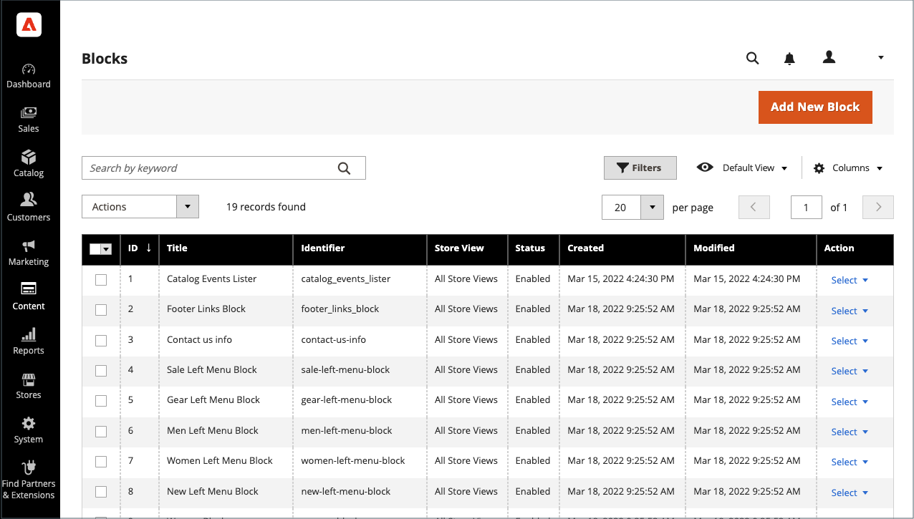

# Inhaltsbausteine hinzufügen

Benutzerdefinierte Inhaltsbausteine können erstellt und dann zu jeder Seite, Seitengruppe oder sogar zu einem anderen Baustein hinzugefügt werden. Sie können beispielsweise einen Bildschieberegler in einen Block platzieren und dann den Block auf die Startseite setzen. Der Arbeitsbereich &quot;Blöcke&quot;verwendet dasselbe [grundlegende Kontrollen](pages-workspace.md) als _Seiten_ Arbeitsbereich, der Ihnen dabei hilft, verfügbare Bausteine zu finden und routinemäßige Wartungsarbeiten durchzuführen. Wenn der Block abgeschlossen ist, können Sie die [Widget](widget-static-block.md) -Tool, um es auf bestimmten Seiten in Ihrem Store zu platzieren.

{width="700" zoomable="yes"}

## Baustein erstellen

1. Im _Admin_ Seitenleiste, navigieren Sie zu **[!UICONTROL Content]** > _[!UICONTROL Elements]_>**[!UICONTROL Blocks]**.

1. Klicken Sie oben rechts auf **Neuen Block hinzufügen**.

   {width="500" zoomable="yes"}

1. Wenn Sie den standardmäßig aktivierten Status des neuen Blocks ändern möchten, legen Sie **Block aktivieren** nach `No`.

1. Zuweisen einer **Block Title** für interne Referenzzwecke.

1. Zuweisen einer eindeutigen **Kennung** für den Block.

   Verwenden Sie alle Kleinbuchstaben mit Unterstrichen anstelle von Leerzeichen.

1. Jede Auswahl **[!UICONTROL Store View]** wo der Block verfügbar sein soll.

1. Fügen Sie den Inhalt für den Baustein mithilfe des angezeigten Inhalts-Tool-Sets hinzu:

   - Wenn [Page Builder](../page-builder/introduction.md) aktiviert ist, wählen Sie **[!UICONTROL Edit with Page Builder]** , um die Seitenaufbau-Tools im Inhalt zu verwenden [Arbeitsbereich](../page-builder/workspace.md).

     {width="500" zoomable="yes"}

     >[!NOTE]
     >
     >Informationen zum Hinzufügen von Bausteinen mit Page Builder finden Sie unter [Tutorial 2: Blöcke](../page-builder/2-blocks.md).

   - Verwenden Sie die [editor](editor.md) um Text zu formatieren, Links zu erstellen und Tabellen, Bilder, Videos und Audio hinzuzufügen.

     Wenn Sie lieber mit HTML-Code arbeiten möchten, klicken Sie auf **Editor einblenden/ausblenden**.

     {width="500" zoomable="yes"}

1. Klicken Sie nach Abschluss des Vorgangs auf die **[!UICONTROL Save]** Pfeil und Auswahl **[!UICONTROL Save & Close]**.

   Der neue Block wird unten in der Liste im Raster Blöcke angezeigt.

1. Verwenden Sie die [Widget](widget-static-block.md) -Tool, um den abgeschlossenen Block auf einer bestimmten Seite in Ihrem Store zu platzieren.

## Baustein löschen

Es gibt zwei Möglichkeiten, einen benutzerdefinierten Block zu entfernen. Sie können sie aus dem _Blöcke_ oder auf der Seite mit den Bearbeitungsblöcken.

### Methode 1: Entfernen eines Blocks aus dem Blockraster

1. Im _Admin_ Seitenleiste, navigieren Sie zu **[!UICONTROL Content]** > _[!UICONTROL Elements]_>**[!UICONTROL Blocks]**.
1. Suchen Sie die Blöcke mithilfe von Filtern über dem Raster und aktivieren Sie das Kontrollkästchen für einen oder mehrere zu löschende Blöcke.
1. Legen Sie in der linken oberen Ecke der Liste **[!UICONTROL Actions]** nach `Delete`.
1. Klicken Sie zur Bestätigung der Aktion auf **[!UICONTROL OK]**.

### Methode 2: Entfernen eines Bausteins von der Bearbeitungsseite

1. Im _Admin_ Seitenleiste, navigieren Sie zu **[!UICONTROL Content]** > _[!UICONTROL Elements]_>**[!UICONTROL Blocks]**.
1. Suchen Sie den zu löschenden Block.
1. Im _Aktionen_ Spalte für den Block, klicken Sie auf **[!UICONTROL Select]** und wählen **[!UICONTROL Edit]**.
1. Klicken Sie in der Menüleiste auf **[!UICONTROL Delete Block]**.
1. Klicken Sie zur Bestätigung der Aktion auf **[!UICONTROL OK]**.

## Menü &quot;Speichern&quot;

| Befehl | Beschreibung |
|----------|----------- |
| [!UICONTROL Save] | Speichern Sie den aktuellen Block und fahren Sie mit der Arbeit fort. |
| [!UICONTROL Save & Duplicate] | Speichern und schließen Sie den aktuellen Block und öffnen Sie eine neue Kopie. |
| [!UICONTROL Save & Close] | Speichern und schließen Sie den aktuellen Block und kehren Sie zum Raster Blöcke zurück. |

{style="table-layout:auto"}

## Hinzufügen einer Lightbox oder eines Reglers

- Es ist einfach, einen [Regler](../page-builder/slider.md) zu Ihrem Geschäft mit [[!DNL Page Builder]](../page-builder/introduction.md). Der Regler kann so eingestellt werden, dass er automatisch abgespielt wird, oder manuell mit Navigationsschaltflächen gesteuert werden.

  {width="600" zoomable="yes"}

  Es gibt auch eine große Auswahl an jQuery-basierten Bild-Lightboxes, die unter [[!DNL Commerce Marketplace]][1]und einige sind kostenlos.

- Sie können eine Erweiterung auch von [!DNL Commerce Marketplace]. Weitere Hilfe finden Sie in der Dokumentation des Entwicklers.

[1]: https://marketplace.magento.com/extensions.html?q=lightbox
