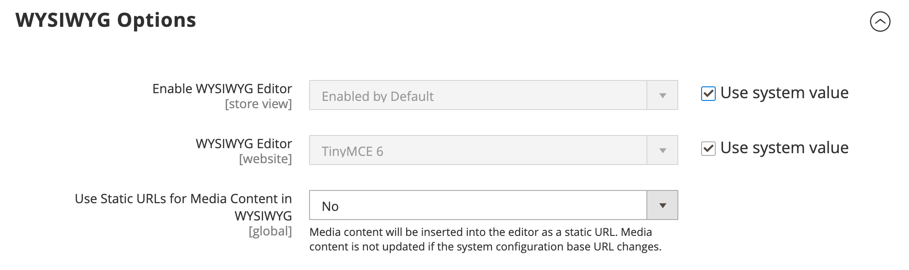

# Dynamic Media-URLs

Eine Dynamic Media-URL ist ein relativer Verweis auf ein Bild oder ein anderes Medien-Asset. Wenn diese Option aktiviert ist, können Dynamic Media-URLs verwendet werden, um eine direkte Verbindung zu Assets auf Ihrem Server oder zu Dateien herzustellen, die in einem [Content Delivery Network“ gespeichert &#x200B;](media-storage-content-delivery-network.md). Die Verwendung von Dynamic Media-URLs kann sich auf die Katalogleistung auswirken, und der [Editor](editor.md#configure-the-editor) kann so konfiguriert werden, dass entweder statische oder Dynamic Media-URLs verwendet werden.

Wie bei allen [Markup-Tags](../systems/markup-tags.md) ist die Direktive in doppelte geschweifte Klammern eingeschlossen. Das Format einer Dynamic Media-URL sieht wie folgt aus:

`\{\{media url="path/to/image.jpg"}}`

Dynamische URL-Anweisungen werden aus gespeicherten HTML-Inhalten verarbeitet, wenn die Seite in der Storefront gerendert wird. Jedes Mal, wenn die Seite gerendert wird, wird der Inhalt auf `\{\{media url="..."}}` überprüft und jede Anweisung wird durch die entsprechende Medien-URL ersetzt.

{{$include /help/_includes/directives-caution.md}}

## Konfigurieren von statischen Medien-URLs

Standardmäßig verfügen die aus dem WYSIWYG-Editor in den Katalog eingefügten Bilder über relative, dynamische URLs. Wenn Sie eine statische URL bevorzugen, können Sie die Konfigurationseinstellung ändern.

1. Navigieren Sie in _Admin_-Seitenleiste zu **[!UICONTROL Stores]** > _[!UICONTROL Settings]_>**[!UICONTROL Configuration]**.

1. Wählen Sie im linken Bedienfeld unter _[!UICONTROL General]_&#x200B;die Option **[!UICONTROL Content Management]**&#x200B;aus.

1. Erweitern Sie  den Abschnitt **[!UICONTROL WYSIWYG Options]** .

   {width="600" zoomable="yes"}

>[!NOTE]
>
>TinyMCE wurde in Magento 2.4.6 und höheren Versionen durch Hugerte als standardmäßigen WYSIWYG-Editor ersetzt.

1. Legen Sie **[!UICONTROL Use Static URLs for Media Content in WYSIWYG]** auf eine der folgenden Einstellungen fest:

   - `Yes` - Verwendet statische URLs für Medieninhalte, die mit dem WYSIWYG-Editor eingefügt werden. Statische URLs sind absolut und werden ungültig, wenn sich die [Basis-URL](../stores-purchase/store-urls.md) des Stores ändert.

   - `No` - (Standard) Verwendet dynamische URLs für Medieninhalte, die mit dem WYSIWYG-Editor eingefügt werden, basierend auf der `\{\{media url="..."}}`. Dynamische URLs sind relativ und funktionieren nicht beschädigt, wenn sich die Basis-URL des Stores ändert.

1. Klicken Sie abschließend auf **[!UICONTROL Save Config]**.

<!-- Last updated from includes: 2022-08-30 15:36:09 -->
